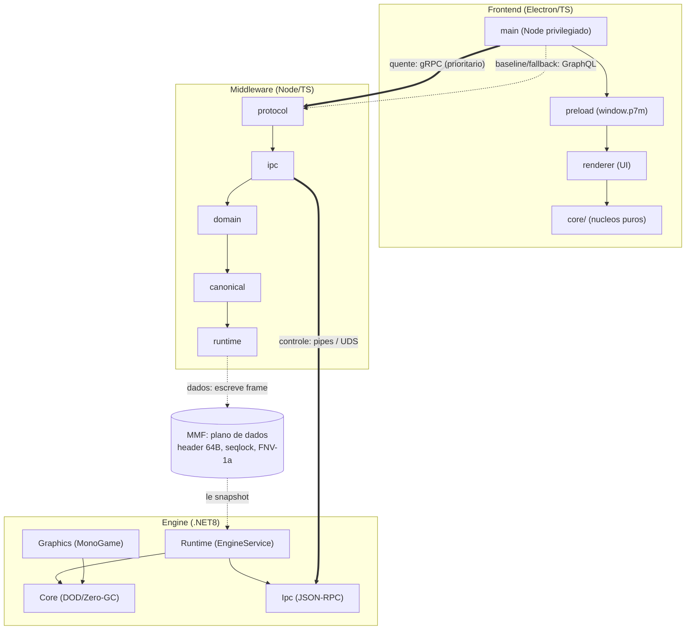
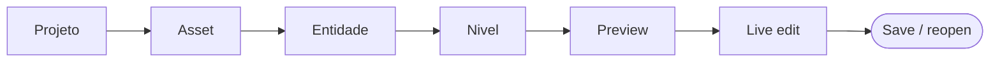
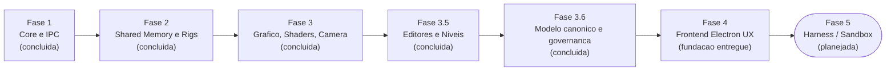

# P7M — Ecossistema EaaS (Engine-as-a-Service) para Plataforma 2D

Ecossistema de desenvolvimento de jogos 2D baseado no conceito de **Engine-as-a-Service**,
composto por três macrocamadas independentes e altamente desacopladas:

| Camada | Diretório | Stack | Papel |
|---|---|---|---|
| **Frontend** | [`frontend/`](frontend/) | Electron + TypeScript | Ambiente visual WYSIWYG: blueprints, grafos de estado, rigs/bones, pipelines de iluminação e gestão taxonômica de assets |
| **Middleware** | [`middleware/`](middleware/) | Node.js + TypeScript (MCP Server) | Orquestração do estado declarativo (AST), interface com IA generativa, ganchos via MCP e JSON-RPC 2.0 |
| **Backend** | [`engine/`](engine/) | C# / .NET 8 + MonoGame | Motor determinístico de baixo nível, Data-Oriented Design, alocação Zero-GC, consumo via IPC e Shared Memory |
| **Contratos** | [`contracts/`](contracts/) | JSON Schema + GraphQL SDL + Protobuf | Fonte única de verdade dos contratos JSON-RPC, GraphQL e gRPC trafegados entre as camadas |



*Mostra as três camadas locais e os dois planos: app ↔ middleware via gRPC prioritário medido (caminho quente) com GraphQL como baseline/fallback (ADR-016/017/019); middleware ↔ engine via JSON-RPC 2.0 sobre pipes/UDS; dados em massa via MMF com seqlock. Regra de assembly da engine: Graphics referencia só Core; Runtime referencia Core + Ipc, nunca Graphics.*

## Princípios arquiteturais

O P7M é uma ferramenta visual **fortemente orientada a domínio**: o usuário
edita um **modelo canônico próprio** (comandos → eventos, hooks/filters,
pipelines e artefatos versionáveis), que não depende de runtime. **Adapters**
projetam o modelo em runtimes concretos (MonoGame hoje), e a experiência
visual é **governada por perfis versionados de capacidades** por
família+versão de runtime — a ferramenta consulta o perfil e o manifesto vivo
da engine, nunca assume suporte. Desenho completo em
[`docs/CANONICAL-MODEL.md`](docs/CANONICAL-MODEL.md).

- **CQRS no editor (Electron):** leituras (projeções da árvore de nós) separadas de escritas
  (Commands imutáveis aplicados ao Blueprint centralizado).
- **Data-Oriented Design (MonoGame):** arrays contíguos de structs (SoA) nos hot loops;
  nenhuma alocação, boxing ou virtual dispatch dentro de `Update`/`Draw`.
- **Zero-GC:** toda a memória de entidades, partículas e vértices é pré-alocada na
  inicialização do serviço.
- **Transporte binário-seguro:** frames JSON-RPC com prefixo de tamanho (uint32 LE) sobre
  Named Pipes (Windows) ou Unix Domain Sockets (Linux/macOS); dados de malha em massa via
  Memory-Mapped Files com `LayoutKind.Sequential`.
- **Sessão de projeto transacional:** `ProjectSessionManager` prepara parse, migração,
  validação, replay e projeção fora da sessão publicada; só então faz a troca atômica.
  `EditorSurface`, JSON-RPC, GraphQL, gRPC e MCP resolvem a mesma sessão ativa. O
  documento Blueprint v3 persiste `projectId`, metadata e unidades espaciais explícitas;
  create/open/close usam `expectedProjectSessionId` + `expectedCommandSequence`
  como compare-and-swap para rejeitar sessão ou revisão atrasadas.
- **Lifecycle de arquivo durável:** New materializa um template real, Save publica por
  temporário + flush + rename e Close só prossegue depois de Save confirmado. Recovery,
  exemplo editável e Recentes passam pelo mesmo controller tipado e testável
  ([ADR-021](docs/adr/ADR-021-ciclo-de-vida-duravel-do-projeto.md)).

## Rumo atual: Alpha 0.1 — First Playable Workflow

> **Expansão horizontal congelada.** O foco único é a milestone
> [`docs/ALPHA-0.1.md`](docs/ALPHA-0.1.md): converter a plataforma em um
> fluxo vertical utilizável sem terminal —
> `Projeto → Asset → Entidade → Nível → Preview → Live edit → Save/reopen`.
> A matriz honesta plataforma × produto está em
> [`docs/REQUIREMENTS.md`](docs/REQUIREMENTS.md).



*Mostra a jornada do corte vertical do Alpha-0.1: um único fluxo utilizável sem terminal, do novo projeto ao salvar e reabrir sem perdas — cada etapa exercita as 5 dimensões (Core, Gateway, Projeção runtime, UI, e2e) que juntas definem PRODUTO.*

## Roteiro de fases (histórico da plataforma)



*Mostra a linha do tempo das fases da plataforma: 1 a 3.6 concluídas, Fase 4 (Frontend UX) com fundação entregue e em andamento, Fase 5 (Harness) ainda planejada — resultado emitido como estádio.*

- [x] **Fase 1 — Infraestrutura Core e IPC:** servidor MCP local em Node.js, canais de
  Named Pipes estáveis e fluxo JSON-RPC 2.0 bidirecional validado com o serviço de engine.
- [x] **Fase 2 — Alocação de Memória e Rigs (Shared Memory):** memory-mapped file
  escrito pelo Node.js e lido pela struct C# (`LayoutKind.Sequential`), com seqlock,
  checksum FNV-1a verificado entre os runtimes e **descoberta de capacidades**
  (`engine/describe`): a engine publica limites e layouts binários por reflexão e o
  middleware os projeta como conceitos de edição visual para o editor.
- [x] **Fase 3 — Motor Gráfico, Shaders e Câmera:** vertex shader HLSL de Linear Blend
  Skinning, pipeline de Deferred Shading 2D (MRT: G-Buffer albedo+normal, Light Pass
  aditivo, composição com Color LUT), câmera massa-mola-amortecedor de segunda ordem
  com antecipação preditiva e screen shake procedural. Cada shader tem uma **referência
  de CPU espelhada e testada** (`Lighting2D`, `ColorLut`, `LinearBlendSkinning`), e as
  equações são verificadas entre runtimes via `lighting/evaluate` e `camera/simulate`.
- [x] **Fase 3.5 — Pesquisa de editores e subsistema de níveis:** investigação de
  FlatRedBall, LDtk, Tiled, Gum, Ogmo 3 e Aseprite
  ([docs/RESEARCH-EDITOR-LANDSCAPE.md](docs/RESEARCH-EDITOR-LANDSCAPE.md)) e absorção
  dos melhores conceitos: **AutoTiler** determinístico (IntGrid + regras com wildcards,
  chance e variantes por seed), **definições de entidade com campos tipados** no
  Blueprint (int/float/bool/string/enum/point/color com faixas e defaults),
  **importador Aseprite** (frameTags → clipes com pingpong expandido, slices →
  pivô/9-slice) e **TilemapStore** DOD na engine com consolidação em buffer estático
  único (`tilemap/define`/`tilemap/inspect`, checksum determinístico entre runtimes).
- [x] **Fase 3.6 — Modelo canônico e governança de runtimes:** orquestração por
  comandos/eventos com **hooks e filters** extensíveis (`HookBus`), **pipelines** cujos
  estágios são cadeias de filters, **artefatos versionáveis** (revisões append-only,
  hash de conteúdo estável, dedup, proveniência obrigatória), **adapter MonoGame**
  projetando eventos canônicos no runtime (skipped/deferred com razão), **perfis
  versionados** por família+versão (`monogame@3.8.0`/`3.8.2`) e **ExperienceGovernor**
  cruzando perfil estático + manifesto vivo em uma matriz de decisões auto-explicativa.
  Ferramentas MCP: `blueprint_command`, `runtime_experience`, `runtime_profiles`,
  `artifact_get`, `hooks_list`.
- [~] **Fase 4 — Frontend Electron UX** *(fundação entregue)*: **EditorGateway** no
  middleware (`<pipe>-editor`: handshake, `blueprint/dispatch` canônico,
  `blueprint/query`, `experience/resolve` e broadcast `blueprint/event` multi-cliente),
  shell Electron com contextIsolation conectada ao gateway, e os núcleos de domínio do
  editor testados: **FABRIK 2D**, **easing Bézier cúbico** (Newton + bisseção),
  **máquina de estados com semântica Gum** (interpolação interrupt-safe com easing) e
  **ExperienceGate** (painéis governados com razão visível). Parte 2: **unificação
  canônica** (toda mutação via orquestrador; a porta `RuntimeAdapter` exige
  `resetSession` e `rehydrateFrom`, implementados pelo `MonoGameAdapter`; `EngineBridge`
  restrito a diagnósticos), **sessões de projeto substituíveis** (create/open/close/status
  paritários nas quatro bordas, replay privado e rollback atômico), **nível como comando
  canônico** (`level/define` com IntGrid + regras; o adapter resolve o auto-tiling na
  projeção e a engine ganha `tilemap/remove`) e **IntGridDocument** no editor (pincéis
  paint/rect/flood com undo/redo célula a célula → payload de `level/define`). Parte 3:
  **pipeline de assets** (`AssetPipelineService`: watcher do catálogo taxonômico →
  export CLI Aseprite → artefato canônico com tags por diretório → compile MGCB para
  `.xnb`, com `ToolRunner` injetável e erros tipados; flag `--assets <dir>` no
  middleware e ferramentas MCP `asset_ingest`/`asset_catalog`), **world map canônico**
  (`world/place`/`world/unplace` com rejeição de sobreposição e vizinhança por borda,
  consultável via `blueprint/query world`) e **TimelineCurve** no editor (keyframes com
  easing Bézier por segmento, busca binária, sample para canvas). Restam: editores de
  canvas em workers e live edit generalizado.
- [ ] **Fase 5 — Automação de Testes e Sandbox (Harness):** ambiente headless no MonoGame
  para simulações em *physics slices* com asserções lógicas.

## Desenvolvimento

### Middleware (Node.js ≥ 22)

```bash
cd middleware
npm install
npm run build
npm test          # unitários + integração loopback
npm start         # inicia o pipe server + servidor MCP (stdio)
```

### Engine (.NET 8)

```bash
cd engine
dotnet build
dotnet test
dotnet run --project src/P7m.Engine.Runtime -- --pipe p7m-engine
```

### Frontend (Electron)

O frontend depende do middleware por `file:../middleware` — **compile o middleware
antes** (`cd middleware && npm run build`). Para a supervisão local (padrão), a engine
também precisa estar compilada (`cd engine && dotnet build`).

```bash
cd frontend
npm install        # instala deps (Electron; no CI use ELECTRON_SKIP_BINARY_DOWNLOAD=1)
npm run build      # tsc + copy-static (index.html, css, AutoTiler vendorizado)
npm test           # núcleos puros + integração do EditorClient (node:test via tsx)
npm run typecheck  # tsc --noEmit
```

Benchmark reproduzível dos três caminhos locais existentes (não cria novo
transport), com p50/p95/p99 e fluxo de 1.000 eventos:

```bash
npm run benchmark:transports
```

O Electron é o **supervisor do ecossistema**: por padrão o processo `main` sobe o
middleware (via `ELECTRON_RUN_AS_NODE`) e a engine (`dotnet <dll>`). O app fala com o
middleware por **gRPC no caminho quente** (fallback automático para **GraphQL** —
contratos em `contracts/grpc/` e `contracts/graphql/`; política em
[`docs/adr/`](docs/adr/)). Verbosidade: `P7M_VERBOSITY=silent|error|warn|info|debug|trace`.

```bash
# supervisão local (padrão): o main spawna middleware e engine e reidrata a sessão
npm run app

# serviços externos (dev): suba middleware e engine à parte e conecte por --pipe
npm run app -- --external-services --pipe p7m-engine
```

### Validação ponta-a-ponta

```bash
./scripts/verify-phase1.sh   # plano de controle: handshake + JSON-RPC bidirecional
./scripts/verify-phase2.sh   # plano de dados: MMF + seqlock + checksum entre runtimes
./scripts/verify-phase3.sh   # câmera (física + determinismo) e equação de luz do shader
./scripts/verify-phase4.sh   # fundação do editor: gateway + dispatch canônico + projeção + broadcast
./scripts/verify-transports.sh  # transports do app: gRPC quente + fallback GraphQL (2 fases, engine real)
```

`verify-phase1` sobe o pipe server do middleware, conecta o host headless da engine e
valida o handshake e o tráfego JSON-RPC nas duas direções. `verify-phase2` inverte os
papéis: o driver Node.js escreve vértices no memory-mapped file usando o layout binário
**publicado pela própria engine** (`engine/describe`) e a engine devolve checksum e
amostras via `mesh/inspect` — compatibilidade byte a byte comprovada entre os runtimes.

`verify-phase4` sobe o **middleware real** (canal da engine + gateway do editor), conecta
a **engine .NET real** e um **cliente de edição**, e prova o caminho completo da
ferramenta visual: cria primeiro uma sessão por **`project/create`**, faz **dispatch pelo
caminho canônico** (`blueprint/dispatch`), confirma a **projeção no runtime** na engine,
recebe de volta o **broadcast de eventos** (`blueprint/event`) e a **experiência
governada** por perfil de runtime (`experience/resolve`,
habilitação/desabilitação com razão).

As operações de aplicação `project/create`, `project/openDocument`, `project/close` e
`project/status` existem com a mesma semântica em JSON-RPC, GraphQL, gRPC e MCP. O
status técnico distingue runtime `synchronized`, `deferred` e `failed`. A continuidade
de eventos usa o cursor `(middlewareInstanceId, projectSessionId, seq)`; troca de
processo, troca de projeto ou gap do journal exige snapshot e ressincronização explícita.

## Documentação

| Documento | Conteúdo |
|---|---|
| [`docs/PRODUCT.md`](docs/PRODUCT.md) | Visão de produto, personas, capacidades entregues e princípios invioláveis |
| [`docs/REQUIREMENTS.md`](docs/REQUIREMENTS.md) | Requisitos funcionais, não funcionais e técnicos com status e verificação |
| [`docs/ALPHA-0.1.md`](docs/ALPHA-0.1.md) | Milestone Alpha 0.1, jornada de aceite e backlog P0 (status por evidência) |
| [`docs/COMPATIBILITY.md`](docs/COMPATIBILITY.md) | Matriz de versionamento e compatibilidade (protocolo, documentos, artefatos, perfis, shared memory) |
| [`docs/GOVERNANCE.md`](docs/GOVERNANCE.md) | Governança arquitetural (23 regras executáveis), Definition of Done, quality gates e fontes de verdade |
| [`docs/adr/`](docs/adr/) | Architecture Decision Records (ADR-016..021: transports, sessão transacional e lifecycle durável do projeto) |
| [`docs/ARCHITECTURE-SPEC.md`](docs/ARCHITECTURE-SPEC.md) | **Especificação técnica normativa (constituição de engenharia):** princípios invioláveis, regras de dependência, paradigmas, padrões, contratos, RFCs/ISO, versionamento, erros, testes e plano de evolução — construída a partir do código com evidência classificada |
| [`docs/ARCHITECTURE.md`](docs/ARCHITECTURE.md) | Camadas, protocolo de framing e ciclo de vida da conexão |
| [`docs/CANONICAL-MODEL.md`](docs/CANONICAL-MODEL.md) | Modelo canônico (comandos/eventos/hooks/pipelines/artefatos), adapters e perfis de runtime |
| [`docs/RESEARCH-EDITOR-LANDSCAPE.md`](docs/RESEARCH-EDITOR-LANDSCAPE.md) | Pesquisa LDtk/Tiled/Ogmo/Aseprite/FlatRedBall/Gum e decisões absorvidas |
| [`docs/OPPORTUNITIES.md`](docs/OPPORTUNITIES.md) | Backlog qualificado de oportunidades (impacto × esforço × alicerce) |
| [`contracts/`](contracts/) | Esquemas JSON Schema dos métodos JSON-RPC e contratos binários |
