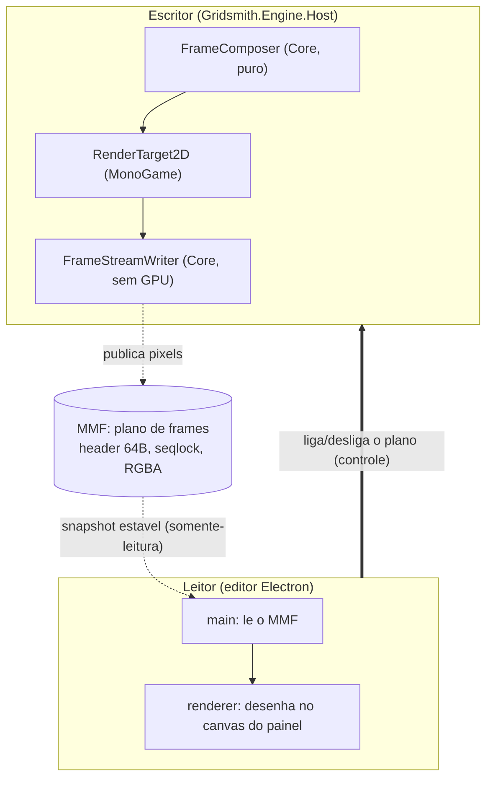

# Plano de frames: layout binário do preview embutido

Contrato binário entre o escritor (engine .NET, `Gridsmith.Engine.Host`) e o
leitor (editor Electron). Todo o conteúdo é **little-endian**. A decisão que o
cria está na [ADR-024](../docs/adr/ADR-024-preview-embutido-por-streaming-de-frames.md).

É o [plano de dados](shared-memory-layout.md) **no sentido contrário**: lá o
Node escreve vértices e a engine lê; aqui a engine escreve pixels e o editor lê.
O protocolo é deliberadamente o mesmo — header de 64 bytes e seqlock —, porque
um canal novo traria de volta perguntas já respondidas e as responderia de outro
jeito.

*Mostra o plano de frames: o host compõe, rasteriza e publica pixels no MMF; o editor tira snapshots estáveis e desenha no painel, e controla por outro canal quando o plano fica ligado.*

## Resolução do endpoint físico

Idêntica à do plano de dados — mesma função, mesma tabela:

| Plataforma | Caminho |
|---|---|
| Linux/macOS | `$XDG_RUNTIME_DIR/<nome>.mmap` (fallback: tmpdir) |
| Windows | `%TEMP%\<nome>.mmap` |

O nome lógico do plano de frames de uma sessão é `gridsmith-frame-<sessionId>`.

O arquivo é criado pelo **escritor** com o tamanho final
(`64 + width * height * 4`) antes de publicar o primeiro frame; o editor mapeia
com acesso somente-leitura.

> **Coerência (invertida em relação ao plano de dados):** lá a ressalva era
> sobre o `WriteFile` do Node não ser coerente com views mapeadas no Windows.
> Aqui quem escreve por view mapeada é a engine e quem lê é o Node, então a
> ressalva vale para a **leitura**. O protocolo não muda; muda só onde um
> binding nativo de mmap pode vir a ser necessário.

## Header (64 bytes)

| Offset | Tipo | Campo | Semântica |
|---|---|---|---|
| 0 | `uint32` | `magic` | `0x4246_5347` (bytes ASCII `GSFB`) |
| 4 | `uint32` | `layoutVersion` | Versão deste layout. Atual: `1` |
| 8 | `uint32` | `width` | Largura do frame em pixels |
| 12 | `uint32` | `height` | Altura do frame em pixels |
| 16 | `uint32` | `sequence` | Seqlock (ver abaixo) |
| 20 | `uint32` | `frameIndex` | Geração do último publish (monotônico) |
| 24 | `uint32` | `pixelFormat` | `1` = RGBA8 não pré-multiplicado |
| 28 | — | reservado | Zeros até o offset 64 |
| 64 | — | pixels | `width * height * 4` bytes, linha-maior, da linha de cima para a de baixo |

`magic` e `layoutVersion` ocupam os mesmos offsets do plano de dados de
propósito: um leitor que abrir o arquivo errado descobre pelo magic, no
primeiro campo, em vez de interpretar pixels como vértices.

## Seqlock

O mesmo protocolo do plano de dados:

1. O escritor incrementa `sequence` para um valor **ímpar** (rajada aberta).
2. Escreve `width`, `height`, `pixelFormat` e os pixels.
3. Incrementa `sequence` para o próximo valor **par** (publicado) e incrementa
   `frameIndex`.

O leitor:

1. Lê `sequence`; se for ímpar, há rajada em andamento — tenta de novo.
2. Copia header e pixels.
3. Relê `sequence`; se mudou, o frame foi rasgado — descarta e tenta de novo.

**Perder frame é normal; ler frame rasgado não é.** O plano de frames é sinal
contínuo, como a telemetria da [ADR-023](../docs/adr/ADR-023-telemetria-de-frame-no-diario-de-eventos.md):
o leitor que não conseguir um snapshot estável mostra o frame anterior. O que o
protocolo proíbe é compor metade de um frame com metade de outro.

## Redimensionamento

`width` e `height` podem mudar entre publicações (o painel foi
redimensionado). O escritor:

1. Fecha a rajada corrente, se houver.
2. Recria o arquivo com o novo tamanho.
3. Publica o primeiro frame novo com `sequence` **continuando** de onde estava.

O leitor valida `64 + width * height * 4` contra o tamanho do arquivo a cada
snapshot: um header que descreve mais pixels do que o arquivo tem é recusado, e
não truncado para caber. É a mesma disciplina do resto do repositório — dado
inconsistente é recusa com razão, nunca conserto por adivinhação.

## Ciclo de vida

O plano só existe enquanto o painel de preview está visível. O editor liga e
desliga explicitamente pelo canal de controle; sem isso o host publicaria 60
frames por segundo que ninguém lê.

Ao desligar, o escritor apaga o arquivo. Um `frameIndex` que para de avançar com
o plano ligado significa host parado — e é o mesmo sinal que a telemetria da
ADR-023 já reporta, por outro caminho.
