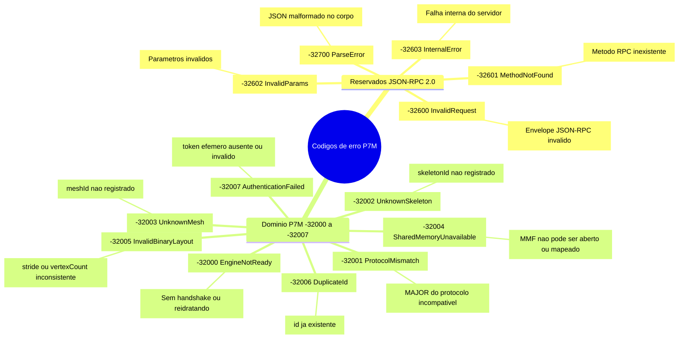
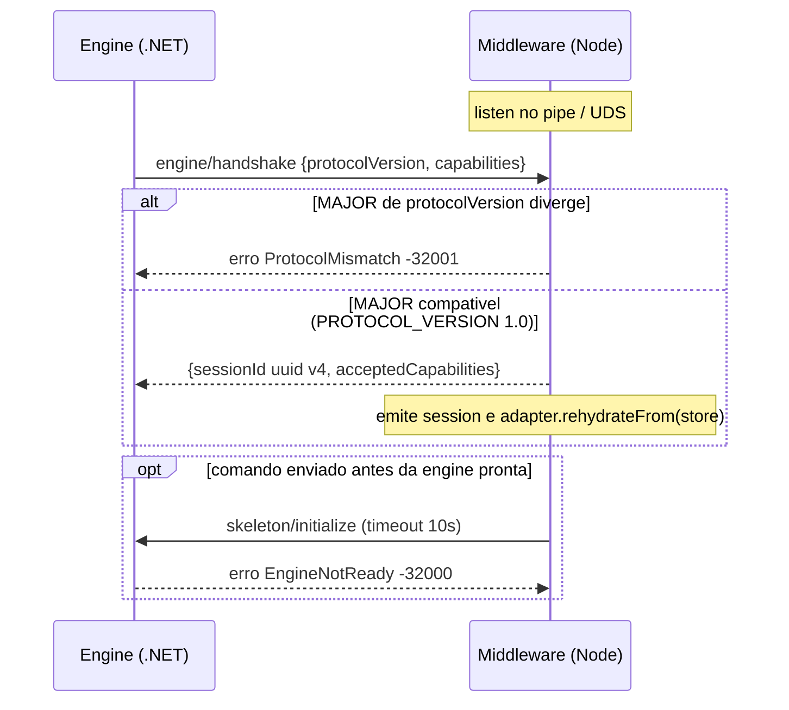

# Códigos de erro de domínio (`-32000..-32099`)

| Código | Nome | Significado |
|---|---|---|
| `-32000` | `ENGINE_NOT_READY` | A engine ainda não completou o handshake ou está reidratando |
| `-32001` | `PROTOCOL_MISMATCH` | Versão MAJOR do protocolo incompatível no handshake |
| `-32002` | `UNKNOWN_SKELETON` | `skeletonId` não registrado via `skeleton/initialize` |
| `-32003` | `UNKNOWN_MESH` | `meshId` não registrado |
| `-32004` | `SHARED_MEMORY_UNAVAILABLE` | Memory-mapped file não pôde ser aberto/mapeado |
| `-32005` | `INVALID_BINARY_LAYOUT` | `strideInBytes`/`vertexCount` inconsistentes com o mapa |
| `-32006` | `DUPLICATE_ID` | Tentativa de registrar um id já existente |
| `-32007` | `AUTHENTICATION_FAILED` | Token efêmero do editor ausente ou inválido no gateway legado |

Os códigos padrão do JSON-RPC 2.0 (`-32700`, `-32600`, `-32601`, `-32602`, `-32603`)
mantêm a semântica da especificação.

## Taxonomia dos códigos de erro

*Mostra a taxonomia dos códigos de erro separando os reservados do JSON-RPC 2.0 (`-327xx`/`-326xx`) dos de domínio P7M (`-32000..-32007`). Os códigos compartilhados com a engine permanecem idênticos em TypeScript e C#; `AuthenticationFailed` pertence ao gateway do editor no middleware.*

## Origem dos erros de sessão (`-32000` / `-32001`)

*Mostra onde nascem os dois erros do ciclo de vida da conexão: `ProtocolMismatch -32001` na validação do MAJOR durante o handshake e `EngineNotReady -32000` quando um comando chega antes de a engine concluir handshake/reidratação.*
