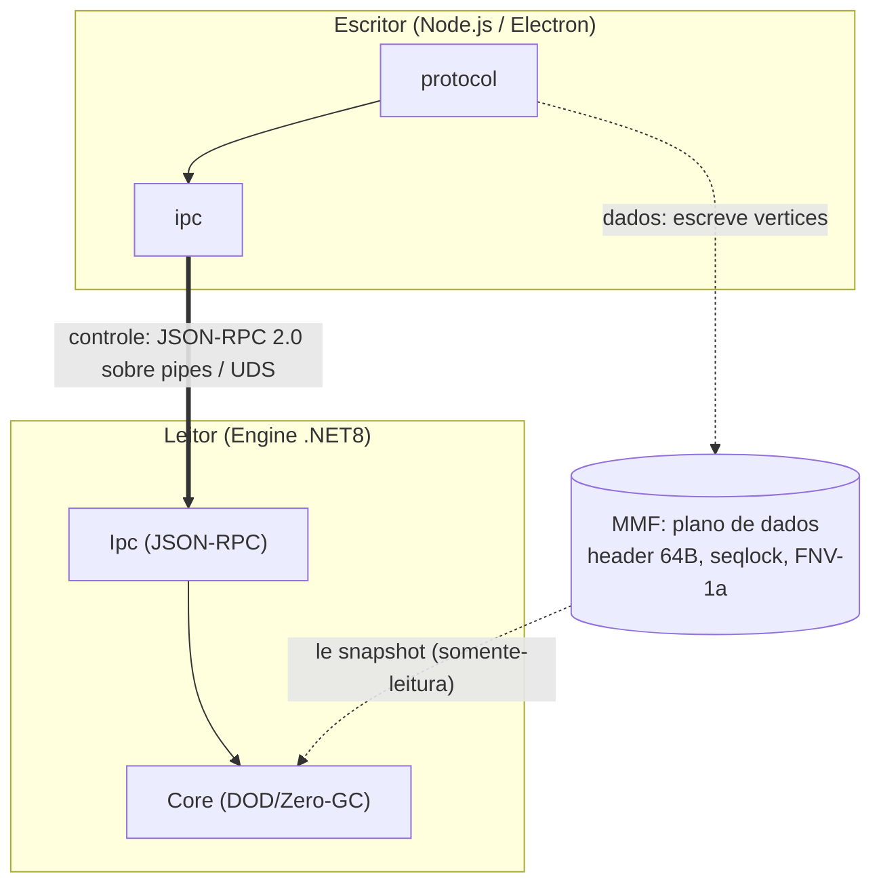
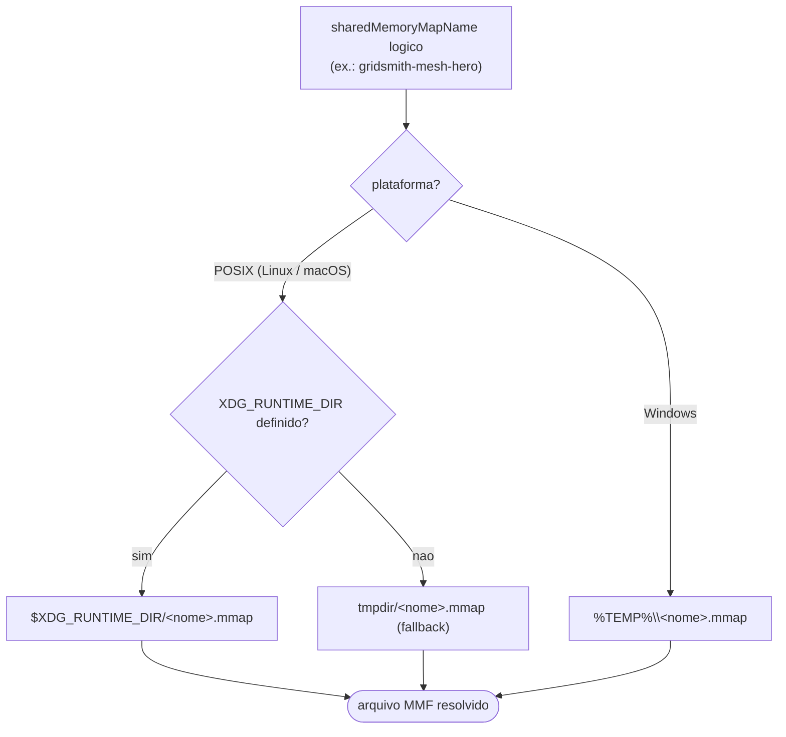
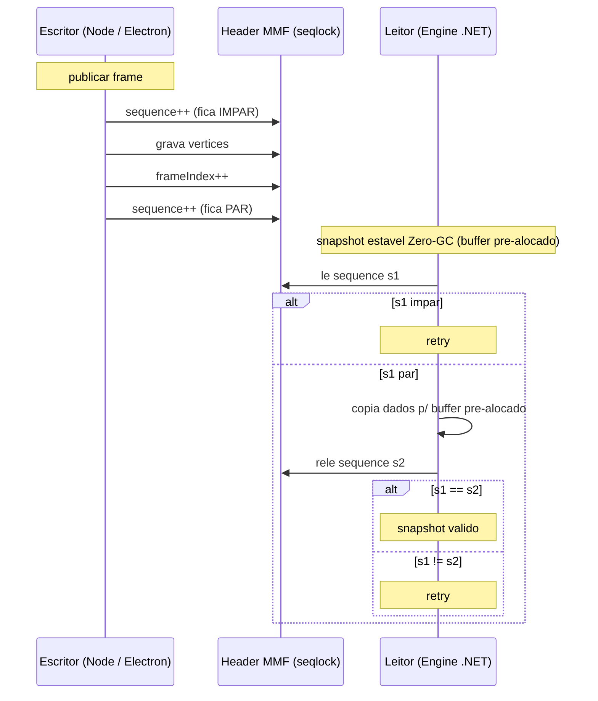

# Plano de dados: layout binário do Memory-Mapped File

Contrato binário entre o escritor (Node.js/Electron) e o leitor (engine .NET).
Todo o conteúdo é **little-endian**. A fonte de verdade dos offsets é a struct C#
(`LayoutKind.Sequential`) — a engine publica o layout via `engine/describe`, e o
escritor **deve** usar os offsets publicados, nunca valores hardcoded.

Este arquivo especifica o **plano de dados** do Gridsmith — o Memory-Mapped File (MMF)
compartilhado entre escritor e leitor. Para situá-lo no ecossistema, os dois planos
que ligam as três camadas locais:



*Mostra os dois planos: controle (JSON-RPC sobre pipes/UDS, aresta grossa) e dados (MMF com seqlock, aresta pontilhada) — aqui o escritor é o Node.js/Electron e o leitor é a engine .NET, conforme este contrato.*

## Resolução do endpoint físico

O `sharedMemoryMapName` lógico (ex.: `gridsmith-mesh-hero`) resolve para um arquivo:

| Plataforma | Caminho |
|---|---|
| Linux/macOS | `$XDG_RUNTIME_DIR/<nome>.mmap` (fallback: tmpdir) |
| Windows | `%TEMP%\<nome>.mmap` |

A resolução do caminho físico a partir do nome lógico é uma decisão por plataforma:



*Mostra a resolução do endpoint físico a partir do nome lógico: ramo POSIX (XDG_RUNTIME_DIR com fallback tmpdir) versus ramo Windows (%TEMP%).*

O arquivo é criado pelo escritor com o tamanho final (`64 + vertexCount * stride`)
**antes** do `mesh/bind_shared_memory`; a engine mapeia com acesso somente-leitura.

> **Coerência:** no Linux o page cache é unificado — `write(2)` do Node é visível
> imediatamente nas views mapeadas da engine. No Windows a coerência entre
> `WriteFile` e views mapeadas não é garantida pelo SO; quando o Electron for o
> escritor em produção (Fase 4), a escrita no Windows deve usar um binding nativo
> de mmap. O protocolo (header + seqlock) não muda.

## Header (64 bytes)

| Offset | Tipo | Campo | Semântica |
|---|---|---|---|
| 0 | `uint32` | `magic` | `0x4D4D5347` (bytes ASCII `GSMM`) |
| 4 | `uint32` | `layoutVersion` | Versão do layout de vértice. Atual: `1` |
| 8 | `uint32` | `vertexCount` | Número de vértices no buffer |
| 12 | `uint32` | `strideInBytes` | Stride de cada vértice |
| 16 | `uint32` | `sequence` | Seqlock (ver abaixo) |
| 20 | `uint32` | `frameIndex` | Geração do último publish (monotônico) |
| 24 | — | reservado | Zeros até o offset 64 |
| 64 | — | dados | `vertexCount * strideInBytes` bytes |

## Sincronização: seqlock

O escritor nunca bloqueia o leitor e o leitor nunca bloqueia o escritor:

1. **Escritor** (publish): `sequence++` (fica **ímpar**) → grava os vértices →
   `frameIndex++` → `sequence++` (fica **par**).
2. **Leitor** (snapshot estável): lê `sequence` (s1); se ímpar, tenta de novo.
   Copia os dados para o buffer pré-alocado, relê `sequence` (s2).
   Snapshot válido sse `s1 == s2 && s1 % 2 == 0`; caso contrário, retry.



*Mostra o protocolo seqlock: escritor com sequence ímpar->par durante a escrita e leitor aceitando o snapshot só quando s1 == s2 e s1 par, senão retry sobre buffer pré-alocado (Zero-GC).*

O leitor da engine copia para memória pré-alocada na inicialização — o retry do
seqlock não aloca (política Zero-GC).

## Layout de vértice `SkinnedVertex2D` (layoutVersion 1, stride 36)

| Offset | Tipo | Campo | Semântica de edição |
|---|---|---|---|
| 0 | `float2` | `position` | Posição no espaço do modelo |
| 8 | `float2` | `uv` | Coordenada de textura |
| 16 | `byte4` | `boneIndices` | Índices dos 4 ossos de influência |
| 20 | `float4` | `boneWeights` | Pesos de influência (soma ≈ 1.0) |

Estes offsets são derivados de `Marshal.OffsetOf<SkinnedVertex2D>` na engine e
publicados no manifesto de capacidades — um teste na engine garante que o
manifesto e a struct nunca divergem.

## Checksum de verificação

Para asserções ponta-a-ponta, ambos os lados implementam **FNV-1a 32-bit**
sobre os bytes crus da região de vértices (offset 64 em diante):

```
hash = 2166136261
para cada byte b: hash = (hash XOR b) * 16777619  (mod 2^32)
```
