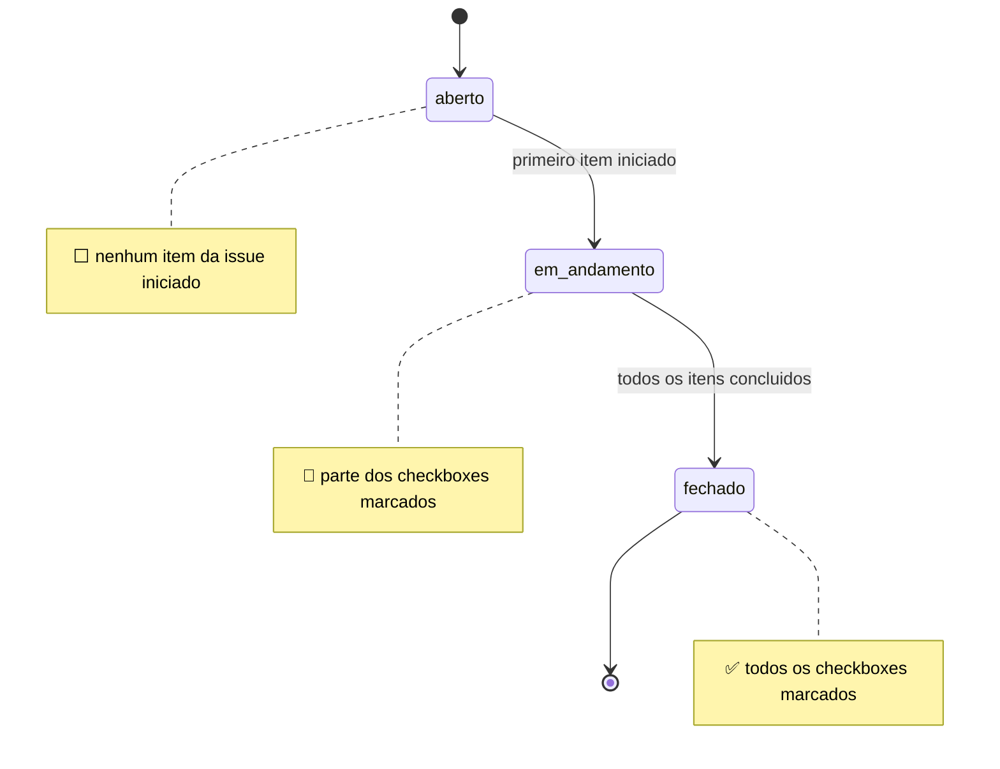
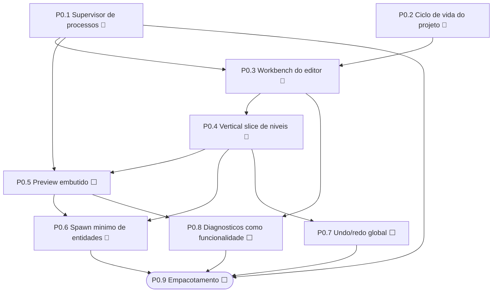
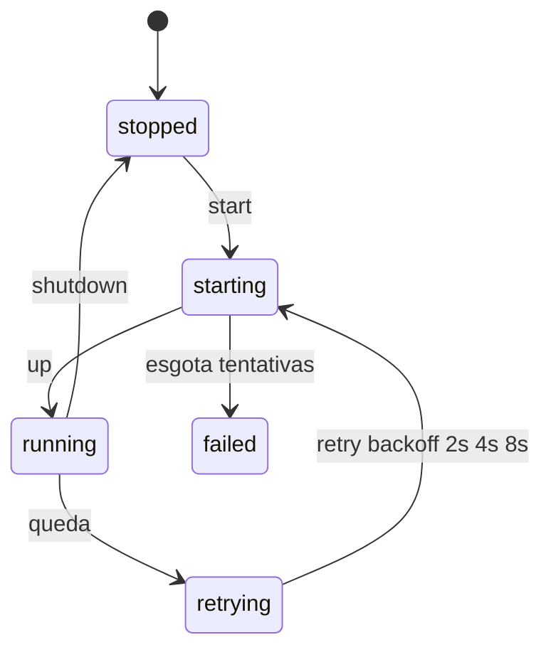
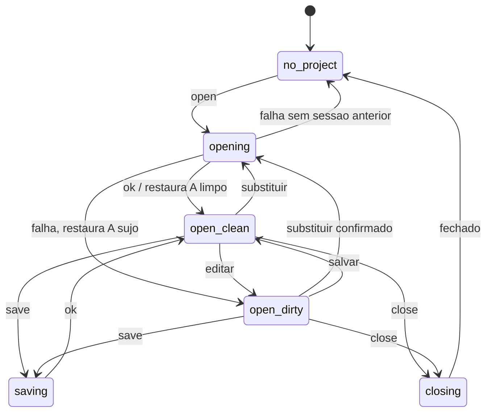

# Milestone: Alpha 0.1 — First Playable Workflow

> **Decisão de rumo (2026-07): expansão horizontal CONGELADA.** Nenhum
> subsistema novo entra até este corte vertical funcionar sem terminal:
> `Projeto → Asset → Entidade → Nível → Preview → Live edit → Save/reopen`.

## Definição do produto

**P7M Alpha 0.1** — Um editor visual desktop para criar um pequeno jogo 2D em
MonoGame usando níveis IntGrid, assets Aseprite, entidades tipadas, iluminação
e câmera, com preview embutido e projeto versionável.

## Jornada de aceite (o teste que define "pronto")

Um usuário novo, sem conhecer a arquitetura interna, consegue:

1. instalar e abrir;
2. escolher "Novo projeto de plataforma 2D";
3. importar `player.aseprite`;
4. criar a entidade Player;
5. pintar chão e paredes;
6. posicionar o Player;
7. configurar a câmera;
8. adicionar uma luz;
9. executar o preview;
10. modificar algo com o jogo pausado;
11. salvar;
12. fechar;
13. reabrir sem perdas.

```mermaid
graph LR
  s1["1 instalar e abrir"] --> s2["2 novo projeto plataforma 2D"]
  s2 --> s3["3 importar player.aseprite"]
  s3 --> s4["4 criar entidade Player"]
  s4 --> s5["5 pintar chao e paredes"]
  s5 --> s6["6 posicionar Player"]
  s6 --> s7["7 configurar camera"]
  s7 --> s8["8 adicionar luz"]
  s8 --> s9["9 executar preview"]
  s9 --> s10["10 modificar com jogo pausado"]
  s10 --> s11["11 salvar"]
  s11 --> s12["12 fechar"]
  s12 --> s13(["13 reabrir sem perdas"])
```

*Mostra os 13 passos sequenciais da jornada de aceite Alpha-0.1, do instalar ao reabrir sem perdas — o resultado final e um estadio observavel (reabrir sem perdas).*

### Metas objetivas

| Meta | Alvo |
|---|---|
| Tempo até o primeiro preview | < 10 minutos |
| Etapas que exigem terminal | 0 |
| Etapas que exigem editar JSON | 0 |
| Save/reopen sem perdas | 100% |
| Operações visuais no undo/redo | todas |
| Falha externa sem causa+ação corretiva na UI | 0 |
| Projeto de exemplo incluído na instalação | 1 |
| Editor continua editável com a engine caída | sim |
| Reiniciar a engine preserva o projeto | sim |

## Backlog P0 (issues da milestone)

Status: ⬜ aberto · 🔶 em andamento · ✅ fechado. Issues registradas:
[#1](https://github.com/flaviotinococoutinho/p7m-design/issues/1) P0.1 ·
[#2](https://github.com/flaviotinococoutinho/p7m-design/issues/2) P0.2 ·
[#3](https://github.com/flaviotinococoutinho/p7m-design/issues/3) P0.3 ·
[#4](https://github.com/flaviotinococoutinho/p7m-design/issues/4) P0.4 ·
[#5](https://github.com/flaviotinococoutinho/p7m-design/issues/5) P0.5 ·
[#6](https://github.com/flaviotinococoutinho/p7m-design/issues/6) P0.6 ·
[#7](https://github.com/flaviotinococoutinho/p7m-design/issues/7) P0.7 ·
[#8](https://github.com/flaviotinococoutinho/p7m-design/issues/8) P0.8 ·
[#9](https://github.com/flaviotinococoutinho/p7m-design/issues/9) P0.9

*Mostra os estados de cada issue da milestone (⬜ aberto, 🔶 em andamento, ✅ fechado) conforme o avanco dos checkboxes.*

O backlog nao e uma lista plana: as issues tem uma ordem de dependencia
implicita — fundacoes (supervisor e ciclo de projeto) habilitam o workbench,
que habilita a vertical slice, e o empacotamento fecha por ultimo.

*Mostra o grafo de dependencia do backlog P0.1-P0.9: fundacoes (P0.1/P0.2) habilitam o workbench (P0.3) e a vertical slice (P0.4), e o empacotamento (P0.9) fecha a milestone.*

### P0.1 — Supervisor de processos 🔶
O Electron é o supervisor do ecossistema: um único executável.
- [x] Máquina de estados de supervisão (spawn/descoberta, health, retry com backoff, encerramento coordenado, modo sem engine) — `frontend/src/main/ProcessSupervisor.ts`, testada com launcher injetável
- [x] Wire real no `main.ts`: por padrão o main spawna o middleware
  (ELECTRON_RUN_AS_NODE) e a engine (`dotnet <dll>`); `--external-services`
  preserva o modo dev; prontidão por probe do gateway + manifesto vivo na
  experiência; conexão idempotente; shutdown coordenado no fechamento;
  smoke com serviços reais (subida → restart isolado da engine → shutdown)
- [x] Estados compreensíveis na UI: chips por serviço na status bar
  ("Iniciando…", "Em execução", "Falhou") com razão/backoff no tooltip e
  botão "Reiniciar <serviço>" por serviço falho (engine nova = reidratação
  automática; o projeto é preservado)
- [x] Captura de stdout/stderr por serviço (ring buffer das últimas 50
  linhas; as 5 últimas viajam no status para diagnóstico na UI — ex.:
  "runtime não compilado; execute dotnet build")
- [x] Detecção de versão incompatível de protocolo com mensagem orientada à
  solução (ProtocolMismatch do gateway → "Atualize a instalação inteira…")
- [ ] Caminhos empacotados (Electron Builder) — fecha junto com P0.9

*Mostra a maquina de estados de supervisao (ServiceState) do ProcessSupervisor: o laco de retry com backoff e o ramo failed ao esgotar as tentativas.*

### P0.2 — Ciclo de vida do projeto 🔶
O editor começa pelo projeto, não pela conexão a um pipe.
- [x] Máquina de estados do documento (sem projeto → aberto → modificado → salvando → fechado), dirty tracking por eventos, política de autosave, lista de recentes — `frontend/src/core/projectLifecycle.ts`, testada
- [x] `EditorClient.saveDocument()/loadDocument()` expostos (gap apontado no diagnóstico) + preload com `saveProject/openProject`
- [x] Diálogos nativos e escrita em disco no `main`: Abrir/Salvar/Salvar como via
  `dialog.showOpenDialog/showSaveDialog/showMessageBox`, leitura/escrita `.p7m.json`
  (`fs`) e autosave `.autosave` — `frontend/src/main/main.ts`. **Caveat:** `main.ts`
  é cola Electron **sem cobertura de teste automatizado nem e2e** (issue #2 marca este
  critério; a prova de produto virá com o e2e da jornada — P0.9)
- [x] Migração de `schemaVersion`: `migrateBlueprintDocument` + registro `MIGRATIONS`
  encadeado (0→1→2) com rejeição de versão futura; v2 torna `projectId`
  obrigatório e documentos v1 recebem identidade legada determinística —
  `middleware/src/canonical/BlueprintSerializer.ts`, testada em
  `middleware/test/blueprint-migration.test.ts`
- [x] Sessão explícita e substituição transacional: `ProjectSessionManager`
  prepara parse/migração/validação/replay fora da sessão ativa, limpa e
  reidrata o runtime e só então publica o commit. Falha preserva sessão, dirty
  state e journal; `project/create`, `project/openDocument`, `project/close` e
  `project/status` têm paridade JSON-RPC/GraphQL/gRPC/MCP e CAS por
  `expectedProjectSessionId` — ADR-020 e testes de sessão/transports
- [x] Template canônico "Plataforma 2D" (`platformer-2d`) no middleware/gateway/cliente:
  `ProjectTemplates.ts`, gateway `project/new` / `project/templates`,
  `EditorClient.newProjectFromTemplate` / `listProjectTemplates` — testado
  (`middleware/test/project-templates.test.ts`, `editor-gateway.test.ts`,
  `frontend/test/editor-client.integration.test.ts`)
- [x] **Template conectado ao botão "Novo projeto" da UI**: `projectCommand("new")`
  lista os templates do middleware e abre a escolha ("Plataforma 2D" · "Projeto em
  branco" · "Cancelar") antes de criar; a DECISÃO é núcleo puro e testado
  (`frontend/src/core/newProjectChoice.ts` + `frontend/test/new-project-choice.test.ts`),
  o `main` só traduz para `showMessageBox`. Cancelar não toca na sessão ativa;
  sem templates anunciados o fluxo cai no projeto em branco (fail-safe).
  `payload.templateId` pula o diálogo (automação/e2e do passo 2)
- [x] Escrita durável do projeto (etapa E1): temporário → `write` → `flush` →
  `close` → `rename` atômico, cópia `.bak` do estado anterior e criação
  exclusiva (sem clobber) no "Novo" — nos três pontos de escrita (salvar,
  salvar como, autosave). `frontend/src/main/project/ProjectFileService.ts` +
  `NodeProjectFileSystem.ts`
- [x] Recovery pós-crash (etapa E2): `detectRecovery` compara o mtime do
  sidecar com o do save e oferece quatro saídas — restaurar / abrir cópia /
  descartar / cancelar. A DECISÃO é núcleo puro e testado
  (`frontend/src/core/recoveryPlan.ts`); o `main` só traduz para o diálogo
  nativo. **Invariante:** o `.autosave` só desaparece por save confirmado ou
  descarte explícito
- [x] Segunda instância e abertura por argumento (etapa E3):
  `app.requestSingleInstanceLock` em `frontend/src/main/appConfig.ts` mata a
  segunda instância e roteia o `argv` para a janela viva
  (`ProjectLaunchRouting.projectPathFromArgs` + `focusExistingProjectWindow`)
- [ ] Menu "Recentes" nativo — os recentes são rastreados e renderizados na
  tela inicial, mas não há submenu nativo em Arquivo

*Mostra a maquina de estados do documento (ProjectLifecycle): open-clean <-> open-dirty por dirty tracking, retorno por openFailed e o caminho de save/close.*

### P0.3 — Workbench do editor 🔶
Layout com navegação real, vocabulário humano, painel inferior e status bar.
- [x] Workbench: toolbar de projeto (Novo/Abrir/Salvar/Fechar), rail de
  navegação com botões reais (aria-pressed, disabled, tooltip com a razão da
  governança), área de trabalho por painel, inspector, painel inferior com
  abas Problemas|Saída|Histórico + filtro, status bar (aria-live)
- [x] Vocabulário humano pt-BR — `core/vocabulary.ts` com teste de cobertura
  total (IDs internos nunca aparecem); rótulos para painéis, eventos, status
  de projeção, estados de projeto e de serviços
- [x] Log estruturado — `core/eventLog.ts`: rótulo, objeto afetado, status da
  projeção com razão, filtro por texto/status, contador de problemas
- [x] View-model de navegação — `core/workbenchModel.ts`: foco automático no
  primeiro painel habilitado, realocação quando a governança muda, fail-safe
- [x] Falha de conexão com ação corretiva (botão "Tentar reconectar")
- [x] Menu nativo (Arquivo/Editar/Exibir) com atalhos: Ctrl+N/O/S/Shift+S/W
  no main; Ctrl+Z/Shift+Z roteados ao editor ativo via `p7m:menu-action`
- [ ] Painéis redimensionáveis e layouts salvos
- [ ] Razões da governança traduzidas. **Atenção:** os perfis JÁ estão em
  pt-BR (`middleware/src/runtime/profiles/monogame.ts`); o inglês que resta
  vem das razões GERADAS pelo governor (`ExperienceGovernor.ts` — "capability
  … absent from …", "no engine connected … (fail-safe: disabled)"), exibidas
  em tooltip. O fecho é F4: razão como código estável + tradução por par
  código+parâmetros no `vocabulary.ts`

### P0.4 — Vertical slice do editor de níveis 🔶
- [x] Viewport do canvas — `core/canvasViewport.ts`: pan em pixels de tela,
  zoom centrado no cursor com clamps, fit centralizado, tela↔mundo↔célula
  inversíveis e culling de células visíveis (coberto por testes)
- [x] Vista do editor no workbench: canvas com pincel/borracha/balde
  (arrasto), paleta de significados (nome+cor+valor ativo), pan (botão do
  meio), zoom (roda), enquadrar, desfazer/refazer, coordenadas do cursor e
  "Publicar nível" via caminho canônico (`level/define`)
- [x] Preview de auto-tiling em tempo real ("Ver arte", debounce de 80 ms):
  o AutoTiler é VENDORIZADO como módulo único (a regra R5 garante zero
  dependências) — o preview usa o MESMO resolvedor da projeção, com regras
  default validadas contra o contrato do middleware (`core/levelPresets.ts`
  + teste "preview ≡ publicação")
- [x] Atalhos do editor: dígitos selecionam o significado; Ctrl+Z/Shift+Z/Y
- [x] Retângulo (arrasto com ghost), linha (Bresenham, ghost) e conta-gotas
  (pega o significado e volta ao pincel; célula vazia vira borracha)
- [ ] Edição da paleta de tipos
- [x] Placement de entidade com handle: ferramenta "Jogador" — clique
  posiciona (snap ao centro da célula), arraste move (`entity/move` canônico
  → `entity/move` na engine, sem respawn), Delete remove; marcadores
  hidratados do Blueprint ao reabrir
- [ ] Placement de câmera/luz com handles
- [ ] Render/edição fora da main thread (o loader vendorizado já isola a
  mudança para o worker)
- [x] Integração com save do projeto (nível editado ⇄ blueprint): "Publicar
  nível" grava no Blueprint (`level/define` na primeira vez, `level/update`
  nas seguintes, reprojetado na engine), o documento salvo carrega o nível e
  o canvas hidrata do Blueprint ao reabrir; regras de publicação = regras do
  preview

### P0.5 — Preview embutido ⬜
Run/pause/stop/restart, live edit de câmera e iluminação, overlays (colisão/
luzes/câmera), seleção cruzada editor↔runtime, erros de projeção visíveis.
(Promovido de OPP-02: é requisito, não oportunidade.)

### P0.6 — Spawn mínimo de entidades 🔶
(Promovido de OPP-11.)
- [x] Spawn table canônica: `EntityDefinition.archetypeId` liga a definição
  ao archetype do runtime; o evento `entityPlaced` sai enriquecido com o
  archetype (a projeção não consulta o store)
- [x] Placement incremental projetado: `entity/place` → `entity/spawn` na
  engine (`ActorStore` SoA pré-alocado, Zero-GC), `entity/remove` →
  `entity/despawn`; reidratação projeta entidades após níveis
- [x] Referência estável editor↔runtime: o `entityId` canônico identifica o
  ator nos dois lados (`entity/inspect` na engine; contrato em
  `contracts/schemas/actors.methods.schema.json`)
- [x] Diagnóstico de entidade não projetada: sem `archetypeId` a projeção é
  `skipped` com razão acionável ("defina archetypeId…")
- [x] Live edit de posição: `entity/move` canônico (evento `entityMoved`
  enriquecido com archetype) → `entity/move` na engine (`ActorStore.MoveTo`,
  zero alocações); sessão que perdeu o spawn trata move como upsert
- [x] Placement visual no canvas (ferramenta "Jogador": posicionar, arrastar,
  remover, seleção com anel)
- [ ] Transform/sprite/animação/colisão no archetype (hoje: posição)

### P0.7 — Undo/redo global ⬜
Histórico no nível do comando canônico com inversos explícitos, agrupamento
por gesto, coalescing de drag, histórico legível ("Moveu Player de (10,4)
para (12,4)"), proveniência humano/agente. (Promovido de OPP-05.)

### P0.8 — Diagnósticos como funcionalidade 🔶
Problems panel consolidando erros/warnings/compatibilidade/pipeline com as
7 perguntas respondidas (o quê, objeto, por quê, impacto, correção, navegação,
fix automático) — materializa a explicabilidade que já existe na camada
canônica (reasons de skipped/deferred, AssetToolError, matriz do governor).

O núcleo saiu com a frente F5: o resultado da projeção viaja no envelope do
evento até o renderer, o painel mostra `problem-card` por item `skipped`/
`deferred` com badge honesto, e o `core/errorCatalog.ts` traduz código
JSON-RPC em causa+ação em pt-BR. **Falta:** navegação ao objeto, fix
automático e a consolidação de compatibilidade/pipeline no mesmo painel.

### P0.9 — Empacotamento ⬜
Electron Builder/Forge: executável por plataforma, bundling coordenado de
middleware+runtime, detecção de Aseprite/MGCB, smoke test do artefato
instalado, release alpha.

## P1 (depois do P0 — profundidade)

Asset browser com thumbnails e reimport · world map visual · inspector
schema-driven + modelo de seleção transversal · editor de rigs · timeline ·
graph editor de estados · live edit genérico (contrato `TunableDescriptor`) ·
templates · atalhos + command palette · layouts persistidos · acessibilidade
(teclado, ARIA, daltonismo no IntGrid, i18n).

## P2 (expansão — deliberadamente adiado)

Segundo runtime (OPP-07) · geração por IA (OPP-13) · colaboração (OPP-17) ·
plugins (OPP-18) · registro de perfis (OPP-19) · shader editor completo ·
mapas infinitos. **Razão:** validam a arquitetura, não o produto; a tese
multi-runtime já está representada nos contratos.

## Pirâmide de testes exigida pela milestone

1. **Unidade** — manter os núcleos puros (já coberto).
2. **Componentes** — inspector, toolbar, paleta, canvas (a introduzir com a UI).
3. **Integração da aplicação** — renderer↔preload↔main↔gateway, save/load,
   supervisão de processos (parcialmente coberto com fakes injetáveis).
4. **E2E visual** — Playwright + Electron dirigindo a jornada de aceite.
5. **Usabilidade** — 3–5 usuários, tempo-até-primeira-cena, taxa de conclusão.
