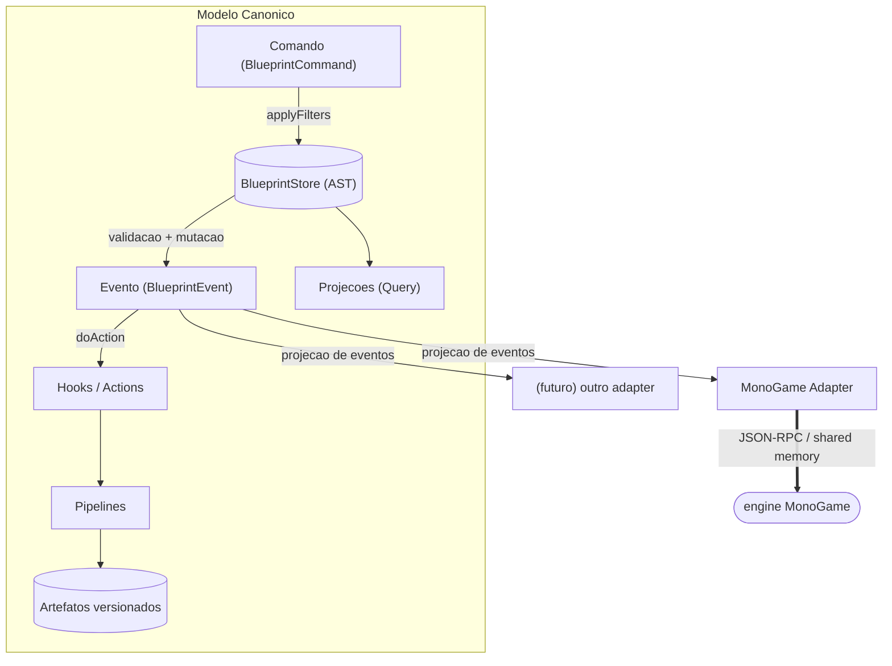
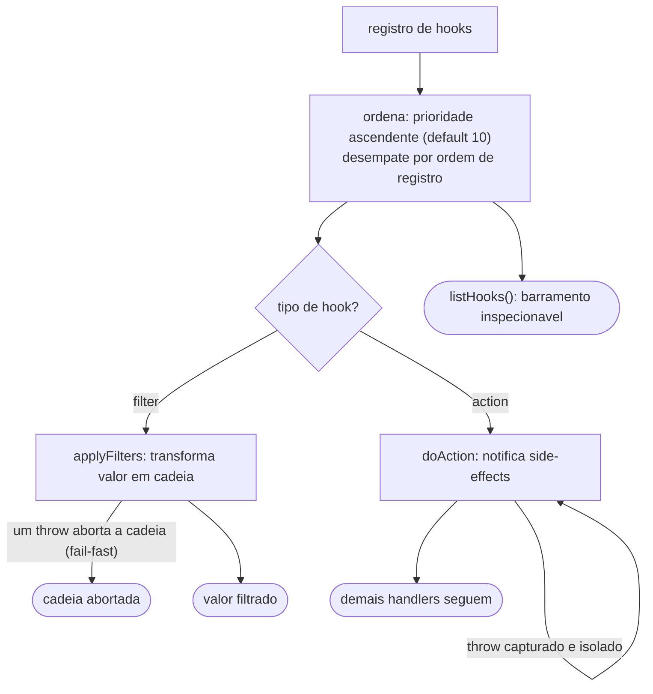
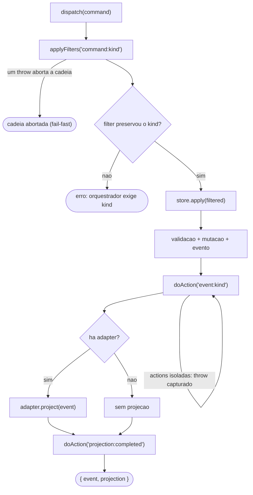
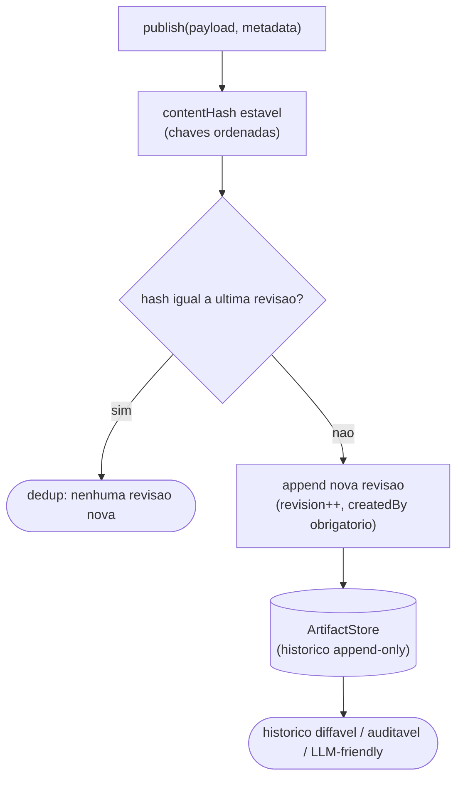
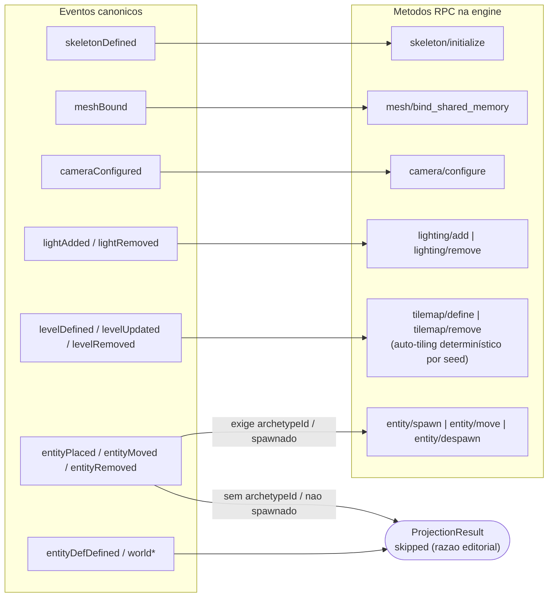
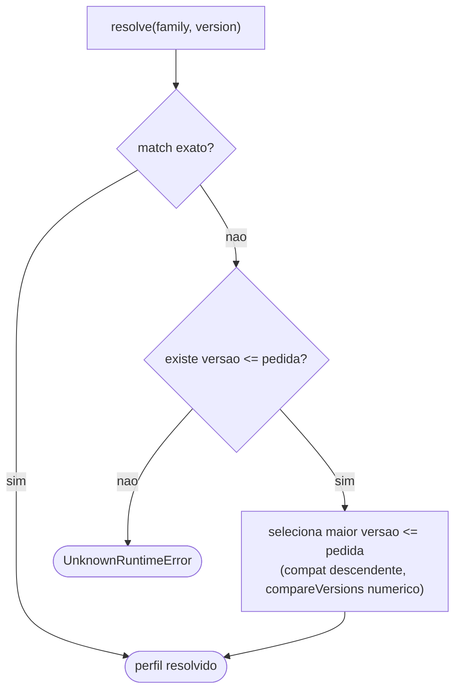
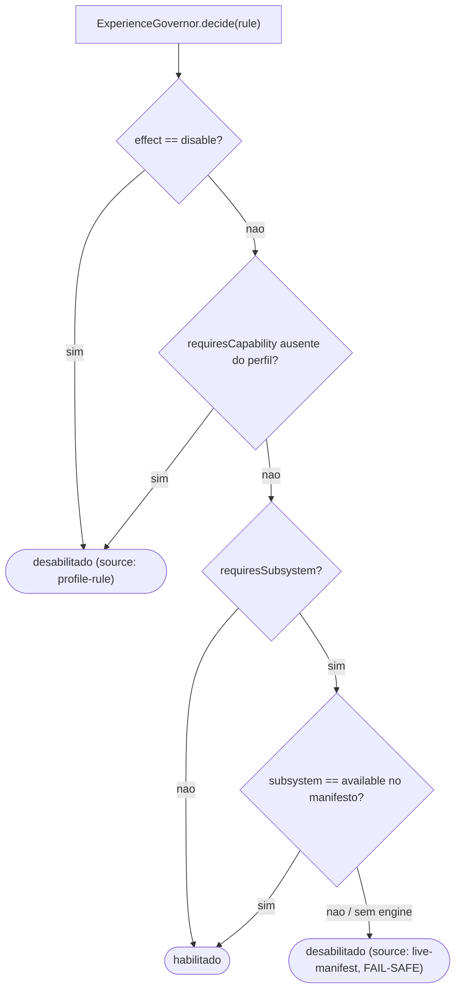
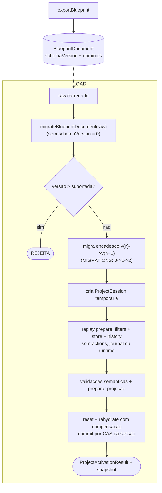

# Modelo Canônico e Governança de Runtimes

O Gridsmith é uma ferramenta visual de desenvolvimento de jogos **fortemente
orientada a domínio**: o que o usuário edita é um modelo canônico próprio,
independente de runtime. Runtimes concretos (MonoGame hoje; outros no futuro)
recebem **projeções** desse modelo através de adapters, e a experiência visual
é **governada** por perfis versionados de capacidades.



*Mostra o modelo canonico como unica fonte de mutacao (comando -> store -> evento -> hooks/pipelines/artefatos) e o fan-out do evento para adapters de runtime, sendo o MonoGame o unico ligado hoje a engine por JSON-RPC e memoria compartilhada.*

## 1. O modelo canônico

### Comandos → Eventos (já existente, formalizado)

Toda mutação entra como um **Comando** imutável (`BlueprintCommand`), é
validada e aplicada ao `BlueprintStore` (AST), que emite um **Evento**
(`BlueprintEvent`). Nenhuma camada externa muta estado diretamente.

### Hooks e Filters (`canonical/HookBus.ts`)

Extensibilidade no estilo consolidado do WordPress, adaptado a comandos:

- **Filters** transformam valores em cadeia com prioridade:
  `applyFilters("command:light/add", comando)` permite que plugins/agentes
  ajustem um comando antes da aplicação (ex.: clamping de intensidade,
  injeção de metadados de proveniência).
- **Actions** notificam sem transformar: `doAction("event:lightAdded", evento)`
  aciona side-effects desacoplados (telemetria, watchers, invalidação de
  preview). Erros em um handler são isolados — nunca derrubam o dispatch.
- O barramento é **inspecionável** (`listHooks()`): um agente LLM pode
  descobrir todos os pontos de extensão em runtime.



*Mostra o HookBus: hooks ordenados por prioridade ascendente com desempate por ordem de registro, filters que falham rapido (um throw aborta a cadeia) e actions isoladas (throw capturado nao derruba os demais), tudo inspecionavel por listHooks().*

### Orquestração (`canonical/CanonicalOrchestrator.ts`)

O caminho canônico de qualquer mutação:



*Mostra a cadeia unica de mutacao dispatch -> filters -> store.apply -> actions -> projection, com filters em fail-fast (um throw aborta a cadeia e o kind deve ser preservado) e actions isoladas (throw capturado nao derruba os demais).*

A projeção retorna uma união discriminada: `projected` pode carregar `detail`,
enquanto `skipped` e `deferred` **exigem** `reason` e não carregam `detail`.
Eventos que o runtime não suporta são, portanto, pulados com razão registrada,
nunca erros silenciosos.

### Pipelines e Artefatos (`canonical/ArtifactStore.ts`, `canonical/Pipeline.ts`)

- **Artefato** é um envelope versionável e endereçável:
  `{ artifactId, kind, schemaVersion, revision, contentHash, payload, metadata }`.
  Revisões são append-only; payloads idênticos (hash estável com chaves
  ordenadas) não geram revisão nova (dedup). O histórico completo é
  consultável — diffável, auditável, LLM-friendly.
- **Pipeline** é uma sequência nomeada de estágios; cada estágio é uma cadeia
  de filters no HookBus (`pipeline:<id>:<estágio>`). O resultado é publicado
  como artefato com `createdBy` e as actions `pipeline:completed` notificam o
  ecossistema. Ex.: `aseprite-import` (parse → normalize → publish
  `sprite-document`).



*Mostra o ciclo de revisao do ArtifactStore: o payload gera um contentHash estavel por chaves ordenadas; hash igual ao da ultima revisao faz dedup (sem revisao nova), hash diferente faz append de uma revisao com proveniencia createdBy, formando um historico append-only.*

Contratos: [`contracts/schemas/artifact.envelope.schema.json`](../contracts/schemas/artifact.envelope.schema.json).

## 2. Adapters de runtime

Um **adapter** projeta eventos canônicos nas APIs de um runtime concreto
(`runtime/RuntimeAdapter.ts`). O modelo canônico não conhece MonoGame; o
`MonoGameAdapter` conhece os métodos JSON-RPC da engine e traduz:

| Evento canônico | Projeção MonoGame |
|---|---|
| `skeletonDefined` | `skeleton/initialize` |
| `meshBound` | `mesh/bind_shared_memory` |
| `cameraConfigured` | `camera/configure` |
| `lightAdded`/`lightRemoved` | `lighting/add`/`lighting/remove` (com remapeamento de ids) |
| `levelDefined`/`levelUpdated`/`levelRemoved` | **resolve o AutoTiler (IntGrid + regras → tiles, determinístico por seed)** e envia `tilemap/define`/`tilemap/remove`+`define`/`tilemap/remove` |
| `entityPlaced`/`entityMoved`/`entityRemoved` | spawn table (P0.6): com `archetypeId` na definição, `entity/spawn`/`entity/move`/`entity/despawn` — o `entityId` canônico é a referência estável editor↔runtime; move sem spawn prévio vira upsert; sem archetype, `skipped` com razão acionável |
| `entityDefDefined` | `skipped` (definições são editoriais; instâncias com archetype spawnam) |



*Mostra o mapeamento evento canonico -> metodo RPC do MonoGameAdapter, com os casos condicionais (entity precisa de archetypeId/spawn previo; levelUpdated vira remove+define) e os eventos editoriais que terminam em ProjectionResult skipped.*

Adapters declaram `family` (grupo tecnológico) e obtêm a versão concreta do
handshake/describe do runtime vivo. A interface exige `resetSession()` e
`rehydrateFrom(store)`: toda troca limpa primeiro atores, níveis, luzes e os
demais dados do projeto anterior, e só então reprojeta o Blueprint inteiro na
ordem de dependência (esqueletos → malhas → câmera → luzes → níveis →
entidades). Sem engine, o reset/replay retorna `deferred`; uma falha de
ativação/compensação deixa a sessão publicada intacta e o status `failed`
impede novos dispatches até uma reidratação completa. O `EngineBridge` ficou
restrito a diagnósticos (ping, inspeções, simulação de câmera) — toda mutação e
todo ciclo de sessão passam pelo adapter e pelo `ProjectSessionManager`.

## 3. Perfis versionados e governança da experiência

### RuntimeProfile (`runtime/RuntimeProfile.ts`)

Cada **família** de runtime tem perfis **por versão** — dados declarativos e
versionáveis no repositório (`runtime/profiles/`):

```jsonc
{
  "family": "monogame",
  "version": "3.8.2",
  "capabilities": ["content-pipeline.mgcb", "render.spritebatch", ...],
  "editorRules": [
    { "feature": "assets.mgcb-compile", "effect": "enable", "requiresCapability": "content-pipeline.mgcb", ... },
    { "feature": "preview.embedded", "effect": "enable", "requiresSubsystem": "level", ... }
  ],
  "constraints": { "maxTextureSize": 4096 }
}
```

A resolução é `resolve(family, versão)`: match exato, senão o perfil mais alto
`≤` versão pedida (compatibilidade descendente), senão erro tipado.



*Mostra a cascata de resolucao de perfil: match exato, senao a maior versao menor ou igual a pedida (compatibilidade descendente), senao UnknownRuntimeError. Perfis sao imutaveis por versao (re-registro rejeitado).*

Contrato: [`contracts/schemas/runtime.profile.schema.json`](../contracts/schemas/runtime.profile.schema.json).

### ExperienceGovernor (`runtime/ExperienceGovernor.ts`)

A governança cruza **três fontes** para decidir cada recurso da ferramenta
visual:

1. **Perfil estático** (família+versão): o que essa combinação suporta em tese;
2. **Manifesto vivo** (`engine/describe`): o que a instância conectada REALMENTE
   expõe (subsistemas `available` vs `planned`);
3. **Regras** do perfil: exigências (`requiresCapability`,
   `requiresSubsystem`) e desabilitações explícitas.

O resultado é uma matriz de decisões auto-explicativa:

```json
{ "feature": "assets.mgcb-compile", "enabled": true,
  "reason": "capability content-pipeline.mgcb present in monogame 3.8.2" }
```



*Mostra a arvore de decisao do ExperienceGovernor cruzando perfil estatico e manifesto vivo, e a origem (source) de cada FeatureDecision: effect=disable e requiresCapability ausente => profile-rule; requiresSubsystem nao available (ou sem engine) => live-manifest com fail-safe.*

A UI da Fase 4 consome essa matriz para habilitar/desabilitar painéis, gizmos
e ações — **nunca** assume que um recurso existe. Agentes consultam a mesma
matriz via MCP (`runtime_experience`).

## 4. MCP/LLM-friendliness

- **Tudo é schema**: comandos, eventos, artefatos, perfis e manifesto têm
  JSON Schema em `contracts/`.
- **Tudo é inspecionável**: `listHooks()`, histórico de artefatos, matriz de
  decisões com razões, `editorConcepts()`.
- **Tudo é dispatchável**: a ferramenta MCP `blueprint_command` aceita
  qualquer comando canônico — um agente cria entidades, luzes e câmera pelo
  MESMO caminho validado da UI (filters aplicados, eventos emitidos,
  projeção no runtime).
- **Proveniência**: artefatos carregam `metadata.createdBy` — humano, agente
  ou pipeline — para auditoria da geração assistida.

## 4.5 Persistência do projeto

O Blueprint é salvável como **documento declarativo versionado**
(`BlueprintSerializer`): `exportBlueprint` produz um snapshot completo
(`schemaVersion`, `projectId` + todos os domínios). O `ProjectSessionManager`
faz parse, migração, validação e replay em store temporário, sem publicar
actions/eventos nem tocar o runtime. Só depois das validações semânticas ele
reseta/reidrata o runtime e troca a referência ativa. O roundtrip é sem perdas;
não existe pré-condição de Blueprint vazio para substituir A por B.

Cada unidade transacional é explícita:

```ts
interface ProjectSession {
  readonly sessionId: string;
  readonly projectId: string;
  readonly store: BlueprintStore;
  readonly orchestrator: CanonicalOrchestrator;
  readonly history: CommandHistory;
  readonly createdAt: number;
}
```

`EditorSurface` consulta essa sessão pela porta `ProjectSessionPort`; não retém
store/orquestrador próprios. JSON-RPC, GraphQL, gRPC e MCP chamam a mesma
superfície. As operações `project/create`, `project/openDocument`,
`project/close` e `project/status` expõem o ciclo de vida; create/open/close
aceitam `expectedProjectSessionId` para compare-and-swap. O identificador é
verificado no commit, não apenas no início da preparação, evitando que um
candidato atrasado substitua uma sessão mais nova.



*Mostra o ciclo transacional: toda preparação ocorre numa sessão privada;
journal, clientes e referência ativa só mudam após a reidratação bem-sucedida
ou explicitamente adiada. Erro restaura o runtime anterior antes de retornar;
falha também na compensação mantém a referência anterior em estado fail-closed.*

## 5. Migração e regras de evolução

- `EngineBridge` permanece como transporte MonoGame para diagnóstico; reset e
  reidratação pertencem à porta `RuntimeAdapter`, coordenada pelo
  `ProjectSessionManager`. Na Fase 4, as ferramentas MCP
  de domínio migram para `CanonicalOrchestrator.dispatch` (hoje: `blueprint_command`
  já usa o orquestrador).
- Perfis novos entram como arquivos versionados; alterar um perfil publicado
  exige nova versão (imutabilidade por versão, como pacotes).
- Um runtime novo = um adapter + um perfil; o modelo canônico e a UI não mudam.
