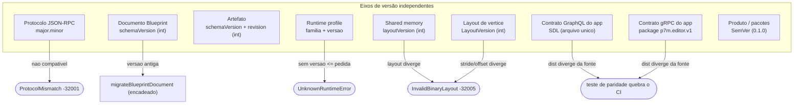

# Compatibilidade e Versionamento

Fonte de verdade única da **compatibilidade** do ecossistema P7M. Cada eixo é
versionado de forma **independente** — **não** existe um número de versão único
para tudo. Este documento consolida o que antes estava disperso entre
[`ARCHITECTURE.md`](ARCHITECTURE.md), [`ARCHITECTURE-SPEC.md`](ARCHITECTURE-SPEC.md)
§19, [`CANONICAL-MODEL.md`](CANONICAL-MODEL.md) e
[`../contracts/shared-memory-layout.md`](../contracts/shared-memory-layout.md).

Cada linha abaixo é validada contra o código/contrato citado em **Fonte de verdade**.

*Mostra os nove eixos de versão independentes do P7M e o comportamento de incompatibilidade de cada um: cada eixo tem sua própria regra, fallback e teste — nunca um único SemVer global.*

## Matriz resumida

| Componente | Formato | Fonte de verdade | Compatibilidade | Fallback |
|---|---|---|---|---|
| Protocolo JSON-RPC | `major.minor` (string) | `middleware/src/protocol/jsonrpc.ts` · `engine/.../Protocol/JsonRpcProtocol.cs` | MAJOR deve coincidir | `ProtocolMismatch` (-32001) |
| Documento Blueprint | inteiro (`schemaVersion`) | `middleware/src/canonical/BlueprintSerializer.ts` | exato ou migrado | rejeita se > suportada |
| Artefato | inteiro (`schemaVersion`) + `revision` | `contracts/schemas/artifact.envelope.schema.json` · `ArtifactStore.ts` | revisões append-only; dedup `(contentHash, schemaVersion)` | — |
| Runtime profile | `família + versão` (`^\d+\.\d+(\.\d+)?$`) | `contracts/schemas/runtime.profile.schema.json` · `runtime/RuntimeProfile.ts` | exato ou maior `≤` pedida; imutável | `UnknownRuntimeError` |
| Adapter de runtime | — (sem constante própria) | `runtime/RuntimeAdapter.ts` · `MonoGameAdapter.ts` | governado pelos perfis (família+versão) | projeção `deferred`/`skipped` com razão; sessão `failed` é fail-closed |
| Shared memory | inteiro (`layoutVersion`) | `contracts/shared-memory-layout.md` · header MMF | binária estrita | `InvalidBinaryLayout` (-32005) |
| Layout de vértice | inteiro (`LayoutVersion`, stride 36) | `engine/.../SharedMemory/SkinnedVertex2D.cs` | offsets publicados por reflexão | `InvalidBinaryLayout` (-32005) |
| Contrato GraphQL do app | SDL (arquivo único) | `contracts/graphql/editor.schema.graphql` | evolução aditiva; cursor composto e snapshot completos | — (baseline e destino do fallback; ADR-016/019) |
| Contrato gRPC do app | package proto (`p7m.editor.v1`) | `contracts/grpc/p7m_editor.proto` | protobuf aditivo; `StreamEventsV2` preserva o legado | GraphQL somente em indisponibilidade (ADR-017/019) |
| Produto / pacotes | SemVer (`0.1.0`) | `*/package.json` · `EngineChannel.ClientVersion` | alpha; sem garantia de compat | — |

> **Não trate todos os componentes como SemVer.** Apenas os pacotes usam SemVer;
> o protocolo usa `major.minor` com checagem só de MAJOR; documento, artefato,
> shared memory e layout de vértice usam **inteiro monotônico**; o perfil de
> runtime usa `família + versão` com resolução descendente; os contratos do app
> usam SDL (aditivo) e package proto (`v1` → `v2` em breaking).

## Detalhamento por componente

### Versão do produto / pacotes

| Campo | Conteúdo |
|---|---|
| Componente | Pacotes `@p7m/middleware`, `frontend`, host da engine |
| Formato da versão | SemVer — hoje `0.1.0` (middleware, frontend) e `ClientVersion = "0.1.0"` (engine) |
| Fonte de verdade | `middleware/package.json`, `frontend/package.json`, `engine/src/P7m.Engine.Ipc/EngineChannel.cs` |
| Regra de compatibilidade | Fase alpha — **não** há garantia de compatibilidade de produto; a interoperabilidade entre runtimes é regida pelo protocolo e pelos perfis, não pela versão de produto |
| Breaking change | n/a (alpha; não versionado como contrato) |
| Migração | n/a |
| Fallback | n/a |
| Teste | — (versões declaradas nos manifests; não há teste de compatibilidade de produto) |

### Protocolo JSON-RPC

| Campo | Conteúdo |
|---|---|
| Componente | Plano de controle (handshake + mensagens JSON-RPC 2.0) |
| Formato da versão | `major.minor` (string) — `PROTOCOL_VERSION = "1.0"` |
| Fonte de verdade | `middleware/src/protocol/jsonrpc.ts` · `engine/src/P7m.Engine.Ipc/Protocol/JsonRpcProtocol.cs` (`ProtocolVersion`) — idênticos nos dois lados |
| Regra de compatibilidade | A versão **MAJOR** deve coincidir no `engine/handshake`; MINOR não bloqueia |
| Breaking change | Bump de MAJOR (mudança incompatível de mensagens/erros) |
| Migração | Nenhuma — renegociação exige atualizar os dois lados do fio |
| Fallback | `ProtocolMismatch` (-32001); a sessão é recusada no handshake |
| Teste | Testes de handshake (mismatch de MAJOR) + regra arquitetural **R9** (constantes de framing casam com o contrato) |

### Documento Blueprint (projeto `.p7m.json`)

| Campo | Conteúdo |
|---|---|
| Componente | Documento declarativo do projeto (`exportBlueprint` / load por replay) |
| Formato da versão | Inteiro — `BLUEPRINT_DOCUMENT_VERSION = 5`; documento sem `schemaVersion` é tratado como versão `0` |
| Fonte de verdade | `middleware/src/canonical/BlueprintSerializer.ts` |
| Regra de compatibilidade | Versão exata é carregada direto; versões anteriores são **migradas em cadeia** `v(n) → v(n+1)` antes do replay |
| Breaking change | Qualquer mudança estrutural do documento exige nova versão **+** entrada correspondente no registro `MIGRATIONS` |
| Migração | `migrateBlueprintDocument(raw)` + `MIGRATIONS` encadeado (`0 → 1 → 2 → 3 → 4 → 5`); v2 introduz `projectId`; v3 introduz metadata e semântica espacial explícita; v4 persiste a paleta semântica de cada nível; v5 admite `spriteRenderer` opcional no archetype sem inventar referências para projetos antigos. A migração `2 → 3` preserva valores genéricos já interpretados como mundo e converte somente a forma completa do factory v2 conhecido por `cellToWorldCenter`. `project/openDocument` prepara e valida antes da troca; identidade + `expectedCommandSequence` protegem o commit contra candidato/revisão obsoletos. Histórico/patches não são persistidos no documento. |
| Fallback | Versão acima da suportada é **rejeitada** com `BlueprintDocumentError` (mensagem clara); versão sem migrador registrado é rejeitada |
| Teste | `middleware/test/blueprint-migration.test.ts` + `project-session-manager.test.ts` + `project-templates.test.ts` (projectId v1 determinístico, semântica v2 preservada em v3, replay isolado, rollback, CAS e conversão canônica célula→mundo) |

`metadata.spatial` da versão 3 fixa a unidade de posição em `world-pixel`, a
origem da célula em `top-left`, o eixo Y em `down` e a âncora de entidades em
`center`. Coordenadas de template são convertidas por
`middleware/src/leveldesign/GridCoordinates.ts`; consumidores não podem
reinterpretar ou recriar posições e IDs no renderer. Arquivos `.autosave` e
`.bak` contêm o mesmo Blueprint versionado — não formam formatos paralelos.
O fingerprint v2 é deliberadamente estrito: derivados do template com mudanças
não espaciais não são reinterpretados automaticamente, evitando falso positivo;
coordenadas históricas remanescentes nesse caso exigem revisão assistida.

### Artefato versionável

| Campo | Conteúdo |
|---|---|
| Componente | Envelope de artefato (ex.: `sprite-document`) no `ArtifactStore` |
| Formato da versão | Inteiro `schemaVersion` (`≥ 1`) + `revision` (inteiro monotônico a partir de 1) |
| Fonte de verdade | `contracts/schemas/artifact.envelope.schema.json` · `middleware/src/canonical/ArtifactStore.ts` |
| Regra de compatibilidade | Revisões são **append-only**; dedup por `(contentHash, schemaVersion)`; histórico preservado e legível |
| Breaking change | Bump de `schemaVersion` na mudança de forma do payload |
| Migração | Não há migrador formal — as revisões históricas continuam legíveis pela sua própria `schemaVersion` |
| Fallback | — |
| Teste | `middleware/test/canonical-core.test.ts` (revisão, hash estável, proveniência obrigatória, dedup) |

### Perfil de runtime

| Campo | Conteúdo |
|---|---|
| Componente | Perfil versionado de capacidades por família de runtime (`runtime/profiles/`) |
| Formato da versão | `família + versão`, versão em `major.minor[.patch]` (regex `^\d+\.\d+(\.\d+)?$`) |
| Fonte de verdade | `contracts/schemas/runtime.profile.schema.json` · `middleware/src/runtime/RuntimeProfile.ts` · `runtime/profiles/monogame.ts` |
| Regra de compatibilidade | `resolve(family, version)` = match exato; senão o **maior perfil `≤` versão pedida** (compatibilidade descendente); perfis publicados são **imutáveis** |
| Breaking change | Publicar qualquer mudança em um perfil = **nova versão** (nunca mutar um perfil publicado) |
| Migração | n/a — cada versão é um dado declarativo próprio |
| Fallback | `UnknownRuntimeError` (família desconhecida, ou nenhuma versão `≤` a pedida) |
| Teste | `middleware/test/runtime-governance.test.ts` (resolução exata/descendente, imutabilidade do registro) |

### Adapter de runtime

| Campo | Conteúdo |
|---|---|
| Componente | Tradutor de eventos canônicos → métodos do runtime (ex.: `MonoGameAdapter`) |
| Formato da versão | — (o adapter **não** carrega constante de versão própria) |
| Fonte de verdade | `middleware/src/runtime/RuntimeAdapter.ts` (contrato) · `middleware/src/runtime/MonoGameAdapter.ts` |
| Regra de compatibilidade | O adapter declara `family` e obtém a `version` do runtime vivo via `identify()` (handshake/manifesto); a compatibilidade efetiva é governada pelos **perfis** (família+versão) |
| Breaking change | n/a — o adapter acompanha os contratos JSON-RPC e os perfis; mudança incompatível recai sobre esses eixos |
| Migração | n/a |
| Fallback | Evento sem suporte no runtime → projeção `deferred`/`skipped` com **razão acionável**; compensação irrecuperável → sessão `failed`, sem aceitar mutações até recovery |
| Teste | `middleware/test/runtime-governance.test.ts` + `scripts/verify-phase4.sh` (projeção real na engine) |

### Layout de shared memory (MMF)

| Campo | Conteúdo |
|---|---|
| Componente | Header e região de dados do Memory-Mapped File (plano de dados) |
| Formato da versão | Inteiro `layoutVersion` (header MMF, offset 4) — atual `1` |
| Fonte de verdade | `contracts/shared-memory-layout.md` · header do MMF · engine |
| Regra de compatibilidade | **Binária estrita** — o `layoutVersion` e o `strideInBytes` do escritor devem coincidir com o que a engine mapeia |
| Breaking change | Qualquer mudança no header ou na struct de vértice bumpa `layoutVersion` |
| Migração | Nenhuma (dado binário; não há migração de layout em runtime) |
| Fallback | `InvalidBinaryLayout` (-32005) ao vincular a shared memory |
| Teste | `scripts/verify-phase2.sh` (checksum FNV-1a cruzado entre runtimes) + teste de reflexão (manifesto ≡ struct) |

### Layout de vértice

| Campo | Conteúdo |
|---|---|
| Componente | Struct `SkinnedVertex2D` publicada por reflexão em `engine/describe` |
| Formato da versão | Inteiro `LayoutVersion` (atual `1`), stride 36 bytes |
| Fonte de verdade | `engine/src/P7m.Engine.Core/SharedMemory/SkinnedVertex2D.cs` (offsets via `Marshal.OffsetOf`) |
| Regra de compatibilidade | O escritor Node usa os **offsets publicados** pela engine, nunca valores hardcoded |
| Breaking change | Mudança de campo/ordem/tipo bumpa `LayoutVersion` |
| Migração | Nenhuma (binário) |
| Fallback | `InvalidBinaryLayout` (-32005) |
| Teste | `scripts/verify-phase2.sh` + teste de reflexão (offsets do manifesto ≡ `Marshal.OffsetOf`) |

### Contrato GraphQL do app (SDL)

| Campo | Conteúdo |
|---|---|
| Componente | Superfície baseline app ↔ middleware: sessão, dispatch, `undo`/`redo`/`historyStatus`, `snapshot` e `eventBatch`; também destino do fallback (ADR-016/017/019/020/022) |
| Formato da versão | Sem constante própria — o SDL é o contrato, versionado como arquivo único no repositório |
| Fonte de verdade | `contracts/graphql/editor.schema.graphql` (o build do middleware copia para `dist/contracts/`; a cópia deve ser **byte-idêntica**) |
| Regra de compatibilidade | Evolução **aditiva** (campo/valor novo não quebra cliente); o enum `CommandKind` deve espelhar `COMMAND_KINDS` (mapeamento `_` ⇄ `/` — GraphQL não aceita `/` em enum) |
| Breaking change | Remover/renomear campo, tipo ou valor de enum — app e middleware são processos locais da mesma instalação e atualizam juntos |
| Migração | n/a (distribuição conjunta) |
| Continuidade | Cursor novo é `(middlewareInstanceId, projectSessionId, seq decimal uint64)`; `firstAvailableSeq`/`lastEventSeq` delimitam a partição ativa; restart, gap ou troca de projeto exigem reconstrução por `snapshot`. APIs sem identidade de sessão falham explicitamente. |
| Concorrência | Operações de sessão validam identidade + `expectedCommandSequence`; undo/redo aceita identidade/cursor esperado e retry idempotente. `commandSequence` ordena eventos, enquanto `documentStateId` identifica o savepoint lógico. |
| Autenticação | Bearer efêmero obrigatório. HTTP 401 é erro terminal e não aciona outro transport. |
| Fallback | — (o GraphQL **é** o baseline completo e o fallback do caminho quente) |
| Teste | Paridade `dist` ⇄ fonte + enum ⇄ `COMMAND_KINDS` em `middleware/test/transport-gateways.test.ts`; e2e `scripts/verify-transports.sh` |

### Contrato gRPC do app (proto)

| Campo | Conteúdo |
|---|---|
| Componente | App ↔ middleware — serviço `EditorHotPath` (`Project*`, `Dispatch`, `Undo`, `Redo`, `HistoryStatus`, `Query`, `Snapshot`, `StreamEventsV2`, `Health`; RPCs legados preservados) |
| Formato da versão | Package proto — `p7m.editor.v1` |
| Fonte de verdade | `contracts/grpc/p7m_editor.proto` (cópia em `dist/contracts/` gerada pelo build; byte-idêntica) |
| Regra de compatibilidade | Protobuf aditivo (campos novos com tags novas); os payloads de comando viajam como `payload_json` e são validados na **mesma fonte única** (`BlueprintStore` + `contracts/schemas/`) — o proto não introduz segunda fonte de validação |
| Breaking change | Mudança incompatível de mensagem/RPC = novo package (`p7m.editor.v2`) |
| Migração | n/a (distribuição conjunta) |
| Continuidade | `Health`/`Snapshot` expõem identidade e limites; `StreamEventsV2` envia um frame de status antes dos eventos. Restart/gap/cursor futuro/troca de sessão resultam em `resync_required` sem cauda parcial. `request_id` torna retry cross-transport idempotente. |
| Concorrência | Requests de create/open/close carregam `expected_project_session_id` + `expected_command_sequence`; o servidor valida identidade e revisão no commit atômico. |
| Autenticação | Metadata `authorization` com Bearer efêmero obrigatória. `UNAUTHENTICATED` nunca aciona fallback. |
| Fallback | **Somente indisponibilidade** do canal → GraphQL; autenticação, domínio e incompatibilidade de contrato não são cobertos por fallback. Default/freeze segue ADR-019. |
| Teste | Paridade `dist` ⇄ fonte em `middleware/test/transport-gateways.test.ts`; fallback ao vivo em `frontend/test/editor-client.integration.test.ts`; e2e `scripts/verify-transports.sh` |

### Freeze do default (não é eixo de versão)

O baseline oficial de 2026-07-19 manteve gRPC como default de
dispatch/eventos: contra GraphQL, o p95 de dispatch foi 35,2% menor no payload
pequeno e 39,3% no médio; `event-flow` foi 30,8% e 16,5% menor,
respectivamente, sem erro, perda ou resync. Isso **não** implica vantagem em
queries: o p95 gRPC regrediu entre 16,6% e 251,8% nos quatro cenários de query.

O default só pode permanecer se dispatch conservar ganho p95 de pelo menos 20%
nos dois payloads, `event-flow` não regredir mais de 10% e os fluxos seguirem
sem erro/perda/resync. Falha rebaixa gRPC à feature flag até o PreviewHost.
GraphQL permanece baseline completo. O gateway JSON-RPC legado teve menor p50
e p95 nas oito combinações payload×operação, mas não em todo p99; permanece
somente compatibilidade enquanto houver dependentes e não participa de
promoção. Números, ambiente e tabela completa:
[ADR-019](adr/ADR-019-freeze-medido-dos-transports.md).
