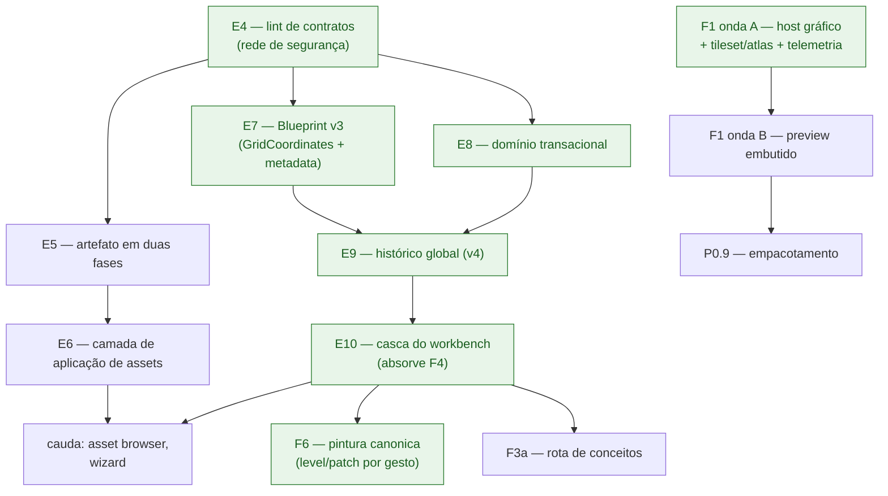

# Plano de desenvolvimento — guia de continuação

> **Para quem é este documento.** Para qualquer pessoa ou IA que abra este
> repositório sem contexto anterior e precise continuar o projeto. Ele diz o
> que o Gridsmith é, o que já está entregue, o que está decidido, o que falta e em
> que ordem — com receitas executáveis para as partes mais complexas. Leia-o
> junto de [`VIABILITY-PLAN.md`](VIABILITY-PLAN.md) (o diagnóstico com
> evidência) e de [`GOVERNANCE.md`](GOVERNANCE.md) (as regras que o CI impõe).
>
> **Regra de leitura:** em conflito entre este documento e o código, o código
> vence — e o documento deve ser corrigido no mesmo PR que expôs o conflito.
> Anti-drift é valor de primeira classe aqui (`npm run docs:verify` bloqueia).

## 1. O que é o Gridsmith, em um parágrafo

Editor visual de jogos 2D como ecossistema local de três processos: um
**frontend** Electron (shell fina; núcleos puros em `frontend/src/core/`), um
**middleware** Node que guarda a verdade do projeto como modelo canônico
(comandos → eventos, replay, artefatos, governança de runtime) e uma **engine**
.NET 8/MonoGame determinística (DOD, Zero-GC) tratada como *projeção
materializada* do modelo — reconectar é reidratar. O usuário "pinta
significado" (IntGrid) e a arte é derivada por regras determinísticas
(AutoTiler por seed). Agentes de IA operam o mesmo caminho canônico via MCP.

## 2. Mapa de leitura para uma IA recém-chegada

Ordem recomendada de leitura antes de tocar em qualquer coisa:

| # | Arquivo | O que dá |
|---|---|---|
| 1 | [`../CLAUDE.md`](../CLAUDE.md) | comandos, regras inegociáveis, mapa mínimo |
| 2 | Este documento | estado, decisões, fila de trabalho, receitas |
| 3 | [`GOVERNANCE.md`](GOVERNANCE.md) | as regras executáveis (fitness functions) e o DoD por tipo de mudança |
| 4 | [`VIABILITY-PLAN.md`](VIABILITY-PLAN.md) | diagnóstico com evidência, catálogo de gaps, fatiamento do ex-PR de lifecycle |
| 5 | [`ARCHITECTURE-SPEC.md`](ARCHITECTURE-SPEC.md) | a constituição (princípios, protocolos, versionamento) |
| 6 | [`adr/`](adr/README.md) | decisões arquiteturais registradas |
| 7 | [`ALPHA-0.1.md`](ALPHA-0.1.md) | a milestone de produto e seus checkboxes |
| 8 | [`PRODUCT-STRATEGY.md`](PRODUCT-STRATEGY.md) | identidade, diferencial, tese de crescimento e o caminho comercial (fases A–C + fila GTM) |

## 3. Invariantes — o que NUNCA pode quebrar

Cada linha abaixo é imposta por teste; violar quebra o CI. Uma IA que "melhore"
algo violando uma destas linhas está errando, não melhorando.

| Invariante | Quem impõe |
|---|---|
| Toda mutação passa pelo caminho canônico único (`dispatch` → filters → store → actions → projeção); as bordas (JSON-RPC, GraphQL, gRPC, MCP) são fachadas finas sobre a `EditorSurface` | P-1, R12, testes de gateway |
| Dependências apontam para DENTRO; libs de borda são exclusivas dos seus diretórios (SDK MCP/`zod` em `mcp/`, `graphql` em `graphql/`, `@grpc/*` em `grpc/`; no frontend, SDKs de transporte só em `main/transport/`, `core/` puro) | R1, R10, R11, F1, F5 (testes de arquitetura das duas suítes) |
| Na engine, `Runtime` NUNCA referencia `Graphics` — o host gráfico acopla por fora | E3/E4 em `engine/tests/Gridsmith.Engine.Ipc.Tests/ArchitectureTests.cs` |
| `BlueprintStore` só importa validadores puros: a guarda estática de células é deliberada, e o limite REAL da engine chega à UI por `constraints`, não por import | R3; a norma é **mover a dependência, não relaxar a regra** |
| Contratos vivem em `contracts/` e as cópias em `dist/` devem ser byte-idênticas (rode `npm run build` no middleware após editar SDL/proto) | teste de paridade em `middleware/test/transport-gateways.test.ts` |
| Posição no mundo é em **pixels** (célula → pixel pelo centro da célula); o middleware repassa cru e a engine consome cru | `contracts/schemas/actors.methods.schema.json` + teste de unidade em `middleware/test/project-templates.test.ts` |
| Zero-GC nos hot loops da engine (0 bytes por frame), medido com tiered compilation **desligada** e pelo estimador melhor-de-N do `AllocationProbe` — nenhuma das duas defesas se reverte sem substituto determinístico | testes `*_is_allocation_free` + nota em [`GOVERNANCE.md`](GOVERNANCE.md) |
| O sidecar `.autosave` só é removido após save confirmado ou descarte explícito do usuário | `frontend/test/recovery-plan.test.ts` |
| Um bump de `BLUEPRINT_DOCUMENT_VERSION` por PR, sempre com migração encadeada e fixtures; documento editado à mão **nunca** é convertido às cegas | [`VIABILITY-PLAN.md`](VIABILITY-PLAN.md) §8.4 + `middleware/test/blueprint-migration.test.ts` |
| Falha de DOMÍNIO nunca troca o transporte; o fallback gRPC→GraphQL é só para falha DE TRANSPORTE, com eventos contínuos por `seq` | `frontend/test/transport-router.test.ts` |
| Governança visível: painel/ferramenta desabilitada sempre carrega a RAZÃO (perfil ou manifesto vivo); a razão da governança tem precedência sobre a de projeto | `ExperienceGovernor`/`experienceGate` + `frontend/test/workbench-core.test.ts` e `workbench-contributions.test.ts` |
| Nenhum id interno aparece na UI; todo texto passa pelo vocabulário/catálogo pt-BR | `frontend/src/core/vocabulary.ts`, `frontend/src/core/errorCatalog.ts` + testes |
| **Um acorde de teclado tem UM dono.** O atalho se CONTRIBUI ao registro de comandos (que recusa o segundo pretendente) — nenhuma vista instala `keydown` global | regra F6 em `frontend/test/architecture.test.ts` + `frontend/test/workbench-contributions.test.ts` |
| Capacidade da UI (painel, comando, ferramenta, seção) resolve pelo `capabilityRegistry`, e a razão do "desabilitado" preserva a ORIGEM (governança ou sessão) | `frontend/test/workbench-contributions.test.ts` |
| Diagramas SEMPRE em Mermaid; commits em pt-BR descritivo; sem contagens de teste fixadas em docs | `npm run docs:verify` |

## 4. Registro de decisões (o que JÁ está decidido — não redecidir)

| Decisão | Conteúdo | Onde está registrada |
|---|---|---|
| Transports do app | GraphQL baseline completo + gRPC prioritário no caminho quente com fallback imediato e histerese de repromoção | ADR-016/017/018 |
| Fatiamento do ex-PR de lifecycle | Dez etapas E1–E10 + cauda, cada uma mergeável sozinha; o branch `codex/project-lifecycle-20260719` foi fechado sem merge e permanece como **referência de leitura** (`git show <commit>:<path>`) | [`VIABILITY-PLAN.md`](VIABILITY-PLAN.md) §8 |
| Proto `EventEnvelope` | Os campos 7/8/9 pertencem à projeção (`has_projection`/`projection_status`/`projection_reason`) e são **imutáveis para sempre**; campos de histórico entram **a partir do 10** — a colisão com o ex-PR é binária, não textual | [`VIABILITY-PLAN.md`](VIABILITY-PLAN.md) §8.1 |
| Cadeia de versões do documento | v3 na E7 → v4 na E9 → **v5 na F1 onda A** (coleção `tilesets` + `tilesetId` por nível — a fatia do atlas chegou antes da cauda e tomou o número) → **v6 na B6** (`sprite` na definição de entidade — o número reservado ao `spriteRenderer` da cauda foi gasto nele, e o D18 registra a troca); **um bump por PR**; a migração 2→3 tem quatro ramos explícitos, e a 4→5 dá `tilesets: []` e a 5→6 definições SEM `sprite` — nenhuma migração inventa arte | [`VIABILITY-PLAN.md`](VIABILITY-PLAN.md) §8.4 + `middleware/test/tileset-canonical.test.ts` |
| Lista de descarte | A UX do ex-PR que a `main` refez por outro desenho NÃO volta (tela inicial inline, wizard no renderer, catálogo por prefixo de mensagem…); reaproveitar apenas o que a tabela lista | [`VIABILITY-PLAN.md`](VIABILITY-PLAN.md) §8.3 |
| Regime de curadoria (avaliação da "cebola") | Adotar como **vocabulário + linha de DoD**, sem reorganizar código e sem o termo "temperatura" (colide com "caminho quente"): todo vocabulário curado novo exige versão + proveniência, `reason` quando nega, e teste de consistência com quem o consome | §10 deste documento (ADR-021 pendente de redação) |
| Medição Zero-GC | Tiered compilation desligada no csproj de teste; a garantia continua intacta | [`GOVERNANCE.md`](GOVERNANCE.md) |
| Nome do produto | **Gridsmith**. O rebrand de P7M já foi aplicado em código, contratos, namespaces .NET, escopo npm, variáveis de ambiente e documentação. O **repositório no GitHub continua `p7m-design`** de propósito: renomeá-lo quebraria as nove URLs de issue do backlog Alpha 0.1. Ficaram preservados também `p7m-151` (testemunha de colisão de hash), `p7m.transport-benchmark/v1` (versão de FORMATO, travada no baseline congelado da ADR-019) e a leitura de `.p7m.json` | [`COMPATIBILITY.md`](COMPATIBILITY.md) §"Rebrand P7M → Gridsmith" |
| Posicionamento e tese de crescimento | **"O editor para engines que não têm editor."** Público: dev code-first 2D (MonoGame hoje; família XNA-like como aposta). Diferencial nº 1: agente-nativo pelo funil único com proveniência. O produto cresce por três eixos — adapters de runtime, contribuições de workbench e comandos canônicos (que viram capacidade de agente de graça). Caminho até vendável em fases A–C com critérios de saída; recomendação comercial (source-available, perpétua, itch→site→Steam) registrada como recomendação, decisão do dono | [`PRODUCT-STRATEGY.md`](PRODUCT-STRATEGY.md) |

## 5. Como trabalhar neste repositório (protocolo operacional)

1. **Branch**: uma etapa por branch e por PR. Nunca empilhe duas etapas no
   mesmo PR — foi exatamente o que transformou o ex-PR de lifecycle em um
   roteiro impossível de revisar.
2. **Antes de codar**: leia a receita da etapa (§9) e os arquivos que ela cita.
   Se a receita mandar `git show <commit>:<path>`, é implementação de
   referência do branch fechado — **adapte ao código de hoje**, não cole às
   cegas (as extrações da Onda 1 acharam premissas de versões futuras
   embutidas).
3. **Validação completa antes de qualquer push** (da raiz):
   ```bash
   cd middleware && npm run build && npm test && cd ..
   cd frontend  && npm run build && npm test && cd ..
   cd engine    && dotnet test && cd ..        # PATH="$HOME/.dotnet:$PATH" se preciso
   ./scripts/verify-phase1.sh && ./scripts/verify-phase2.sh \
     && ./scripts/verify-phase3.sh && ./scripts/verify-phase4.sh
   ./scripts/verify-transports.sh
   ./scripts/verify-visual-parity.sh
   npm run docs:verify
   ```
4. **Commits** em pt-BR descritivo, explicando o PORQUÊ; docs atualizadas no
   mesmo PR que muda comportamento (inclusive marcar entregas no
   [`VIABILITY-PLAN.md`](VIABILITY-PLAN.md) e os checkboxes do
   [`ALPHA-0.1.md`](ALPHA-0.1.md)).
5. **Contratos**: mudou SDL/proto → mude os DOIS lados do fio + `npm run build`
   no middleware (paridade `dist/`) + gateways + cliente.
6. **CI**: não existe mais flake conhecido nas suítes. Se um teste
   `*_is_allocation_free` falhar, leia o número: valor grande e proporcional à
   contagem de iterações é **regressão real**; blip abaixo de alguns KiB seria
   artefato de medição — mas o `AllocationProbe` já o filtra, então a
   recorrência de um blip significa que a defesa quebrou e merece investigação,
   não re-run.
7. **Ordem de confiança quando as fontes divergem**: o código > os blockquotes
   das frentes no `VIABILITY-PLAN` > as tabelas de diagnóstico daquele
   documento. As tabelas são registro histórico e estão explicitamente
   marcadas como tal.
8. **Entregou uma pendência? Feche a linha dela na fila (§7)** no mesmo PR. Se
   a entrada carregava marca de ausência (`ausente:` / `inexistente:`), o
   `docs:verify` vai falhar assim que o código existir — é o lembrete, não um
   obstáculo: risque a linha, descreva o que ficou entregue e o que restou. Uma
   pendência entregue que continua listada como inexistente manda o próximo
   leitor construir de novo o que já está pronto.

## 6. O que já está entregue (snapshot)

Verificado contra a `main` no momento da escrita; a fonte contínua é o CI.

**Plataforma (fases 1–3.6):** IPC JSON-RPC 2.0 com framing binário e handshake
versionado; shared memory com seqlock e checksum FNV-1a cruzado; motor gráfico
com deferred shading 2D, skinning e câmera de segunda ordem (referências de CPU
testadas espelhando os shaders); AutoTiler determinístico por seed; modelo
canônico com hooks/filters, artefatos versionáveis e pipelines; governança de
runtime por perfis versionados imutáveis + manifesto vivo (`engine/describe`).

**Transports do app (ADR-016/017/018):** GraphQL baseline + gRPC quente com
fallback imediato, histerese de repromoção e continuidade de eventos por `seq`
(`EventJournal` particionado por sessão, cursor composto, resync explícito).

**Sessão de projeto transacional:** cada projeto tem store/histórico/
orquestrador próprios; troca atômica com compare-and-swap
(`expectedProjectSessionId`); reidratação serializada na mesma fila.

**Verdade da projeção (F5, núcleo):** o resultado da projeção viaja no envelope
do evento pelas três bordas; `runtimeState` na barra de status; catálogo de
erros pt-BR (código → título/causa/ação); o painel Problemas deixou de afirmar
"tudo aplicado" sem evidência.

**Primeira sessão (F8, parcial):** o botão "Novo projeto" cria do template
canônico com escolha por diálogo; dois templates (plataforma e top-down) em
**pixels do mundo**, com teste que trava a unidade; tela inicial com ações,
cards de template e recentes; gating de painéis por projeto aberto com
precedência da governança; o editor de níveis hidrata QUALQUER projeto
(seletores puros `pickLevel`/`pickEntityDef` — fim dos ids fixos).

**F3a (parcial):** limites reais do manifesto mesclados em `constraints` com
namespace por subsistema (`lighting.maxLights`…), com precedência do perfil;
correlação `lightId`↔slot da engine publicada em `Projection.detail`.

**Onda 1 do fatiamento (E1–E3):** escrita durável (temporário → `flush` →
`rename`, `.bak`, no-clobber no "Novo") nos três pontos de escrita; recovery de
autosave com quatro saídas e ciclo de vida do sidecar; segunda instância e
`argv` roteando `.gridsmith.json` com fila.

**Casca do workbench por contribuições (E10):** painel, comando, ferramenta e
seção de inspector se DECLARAM em registros puros; a casca só materializa. A
seleção saiu do closure da vista e virou serviço observável — sem ela fora de
lá nenhum inspector podia existir. O teclado passou a ter **um ouvinte só**
(regra F6), e um segundo pretendente ao mesmo acorde falha no `register`, não
em produção. Layout redimensionável e persistido, com clamp e fail-safe.

**Host gráfico (F1, onda A — COMPLETA):** existe um processo que desenha.
`Gridsmith.Engine.Host` instancia a janela MonoGame e desenha, por referência,
os mesmos stores DOD que o plano de controle muta — o `Runtime` continua sem
ver MonoGame (E4 intacta, E6 nova). O que compõe o frame saiu do host e virou
`FrameComposer`, puro e Zero-GC: é o que torna "o que é desenhado" verificável
sem GPU e sem shader compilado. O atlas é canônico e atravessa o fio; canvas e
host amostram a MESMA tabela em grade e **degradam juntos** (mesmo hash de cor,
travado por testes espelhados número a número). A paridade visual é **gate no
CI**: as duas descrições de frame são comparadas byte a byte, sem tolerância.
E o fio de volta existe (ADR-023): o host reporta o que desenhou — câmera viva
pós-amortecimento, quads desenhados × pedidos, truncamento — coalescido antes
do diário para não gastar a janela de resync com um sinal descartável.

**Pintura canônica (F6):** a ação mais frequente do editor entrou no funil.
Cada gesto — pincelada, arrasto de retângulo/linha, balde — vira UM comando
canônico com `transactionId`, e é o histórico do documento que o desfaz: o
`Ctrl+Z` deixou de ter dois donos. O `IntGridDocument` perdeu a pilha de undo
própria e virou o espelho local do documento, reidratado quando a mudança vem
de fora (desfazer canônico, agente, outra borda). Pintar passou a sujar o
projeto sem nenhum rastreador paralelo, porque agora emite evento.

**Infra de qualidade:** regras arquiteturais executáveis nas três camadas +
regras semânticas; anti-drift de docs (`npm run docs:verify`); e2e das fases
1–4 + transports; medição Zero-GC determinística.

## 7. Fila viva de pendências

Auditadas contra o código; cada linha tem evidência verificável. **Gravidade**
é o efeito no usuário, não o esforço:

- **bloqueia-jornada** — impede um passo da jornada de aceite do
  [`ALPHA-0.1.md`](ALPHA-0.1.md).
- **degrada-experiência** — a jornada passa, mas com dano visível.
- **dívida-técnica** — invisível ao usuário hoje; encarece tudo depois.

**A evidência de ausência é executável.** "Auditada" era, até aqui, uma
promessa com prazo de validade: quando alguém entregava a pendência, a linha
continuava afirmando que a coisa não existe, e o CI concordava em silêncio —
foi o que aconteceu com o tileset, negado por duas fatias depois de já
atravessar as três camadas. Agora as buscas citadas voltam a ser executadas
pelo `npm run docs:verify`:

```text
`ausente: <literal> @ <caminho>[, <caminho>]`   → a busca literal tem de vir vazia
`inexistente: <caminho>`                        → o caminho não pode ter nascido
```

Quando a marca falha, a fila mentiu: ou a pendência foi entregue, ou a
evidência escolhida parou de sustentá-la — e as duas exigem reauditar a linha.
A marca **não** prova a ausência do comportamento (um `writeFile` some se
alguém trocar por stream); ela trava a evidência que a entrada citou, que é o
que estava apodrecendo sem aviso.

O falso NEGATIVO já aconteceu e vale registrar: a D4 citava
`ausente: level.palette @ frontend/src`, e a entrega leu o campo como
`existing.palette` — a marca não disparou, e a linha foi riscada à mão. A lição
não é abandonar a marca, é escolher o literal com cuidado: uma marca ancorada
num nome que a implementação futura *talvez* use vale menos que uma ancorada em
algo que a entrega necessariamente cria ou destrói.

### 7.1. Bloqueia a jornada

| # | Pendência | Evidência | Onde no plano |
|---|---|---|---|
| ~~B1~~ | ✅ **Entregue (F1 onda A completa).** O host desenha em janela própria (ADR-022), o atlas é canônico e atravessa o fio (`tileset/define`→`tileset/apply`), o canvas e o host amostram a MESMA tabela e degradam juntos, a paridade visual é gate no CI (descrição byte a byte) e o runtime reporta o que desenhou (ADR-023). **Resta**: embutir a janela no painel — é a onda B, não B1 | — | — |
| ~~B2~~ | ✅ **Entregue (F1 onda A, fatias i–ii).** "Pinte significado, derive arte" não termina mais em `tileId` inteiro: `tileset/define`/`tileset/remove` são canônicos com o DoD completo, o documento v5 carrega a coleção, o atlas atravessa o fio (`tileset/apply`) e canvas e host amostram a MESMA tabela em grade — degradando juntos pelo mesmo hash quando ela não cobre | — | — |
| B3 (parte) | **P0.5 — preview EMBUTIDO.** A **ADR-024** decidiu o mecanismo e desfez a suposição herdada: o host publica os PIXELS num MMF com o mesmo seqlock do plano de dados, e o painel os desenha — nenhuma janela nativa é reparentada, então não há addon nativo por plataforma às vésperas do empacotamento. A fatia (i) entregou o contrato (`contracts/frame-stream-layout.md`) com escritor em Core e leitor puro no editor, testados nos dois lados com os mesmos números. **Falta**: o publisher no Host, o fio até o painel, o input sintético e os overlays | o painel ainda é placeholder: `ausente: FrameStreamWriter @ engine/src/Gridsmith.Engine.Host, frontend/src/main`. **Atenção — a evidência anterior desta linha estava errada**: ela dizia que `preview.embedded` seguia desabilitada "por decisão da ADR-022", mas o perfil `3.8.2`, que é o que a engine anuncia, a habilita. O painel abre vazio HOJE (é a MGT-3 viva), e é isso que a onda B fecha | F1, onda B |
| ~~B4~~ | ✅ **Entregue (E9).** O undo/redo é canônico no nível do comando: os inversos são despachados pelo MESMO caminho (a engine vê a reversão como qualquer edição), com CAS por `historyCursor`, coalescing por gesto e a aba Histórico operável — agente e humano compartilham um histórico só. O cabeçalho do `CommandHistory` hoje diz "relógio lógico **E** undo/redo". **Resta**: o acorde `Ctrl+Z` ainda aponta ao rascunho local, de propósito, até a pintura virar `level/patch` (D11) | — | — |
| B5 | **Placement de câmera e luz com handles no canvas** | a vista do editor de níveis não menciona câmera nem luz; `camera/configure`, `light/add` e `light/remove` existem completos no canônico, sem UI | cauda pós-E10 — os registros que faltavam (painel, ferramenta, seleção, inspector) já existem; falta a vista |
| ~~B6~~ (sprite) | ✅ **Entregue (B6, fatias i–iii).** O ator deixou de ser sempre um círculo: `EntityDefinition.sprite` é o par (`tilesetId`, `tileId`) do MESMO atlas dos tilemaps (documento v6), viaja no `entity/spawn` junto da instância, o `ActorStore` o guarda por slot (limpo no despawn e no reset — slot reutilizado não herda arte alheia), o `FrameComposer` leva o tile ao quad e **os dois desenhos amostram o atlas**: o host pelo `Source` do quad (o slot), o canvas pela definição do marcador — degradando JUNTOS na mesma cor lisa quando a tabela não cobre. **Resta**: transform, animação e colisão do archetype (F7); e o TAMANHO do ator segue constante no host (`actorSize: 16f`) em vez de vir do documento — a arte é a mesma, o enquadramento dela ainda não | — | — |
| B7 | **F2 residual (a)**: o store de sessão vive só em memória — reiniciar o middleware apaga o projeto | não há escrita em disco no gerente de sessão: `ausente: writeFile @ middleware/src/canonical/ProjectSessionManager.ts` | F2 residual (gate de milestone) |
| B8 | **F3a residual**: a rota de conceitos (`editorConcepts`) não atravessa nenhuma borda do app | os únicos consumidores são o MCP e dois drivers de teste; o app sobe o middleware com `--no-mcp` (`ausente: editorConcepts @ frontend/src, contracts`) | F3a — **destravada** pela E10 (há registro onde pendurar a rota) |
| ~~B9~~ (parte) | ✅ **Entregue (E10).** Registro de painéis, serviço de seleção e inspector por contribuições (`core/workbench/`), com o rail derivado do registro e a razão da governança preservada em cada seção. **Resta**: o inspector ainda é de LEITURA (escrita = D6) e câmera/luz seguem sem vista (B5) | — | — |
| ~~B10~~ | ✅ **Entregue (F6).** Cada pincelada vira `level/patch` canônico (ou `level/define`, quando o nível ainda não existe) com `transactionId` do gesto: o grid deixou de ser rascunho e o `IntGridDocument` virou só o espelho local, sem histórico próprio. Uma mudança externa reidrata o canvas. **Zoom e pan seguem no closure — e devem seguir**: são estado de VISTA, não de documento | — | — |
| ~~B11~~ | ✅ **Entregue (F6), por construção.** Pintar agora emite evento de Blueprint, e é justamente nesse evento que o `commandApplied` do ciclo de vida já marcava sujeira — a pintura passou a sujar o projeto sem nenhum rastreador paralelo, que era a alternativa ruim | — | — |
| B12 | **F7 inteira**: CRUD assimétrico, sem camadas em `LevelSpec`, campos nunca cruzam o runtime, pipeline de assets sem porta no app | os mesmos kinds do diagnóstico continuam em `commandShape.ts`; `inexistente: middleware/src/application` | F7 → E5/E6/E8/E9 |
| B13 | **P0.9 — empacotamento** (executável por plataforma, bundling, smoke do artefato, release alpha) | `ausente: electron-builder @ package.json, frontend/package.json`; o workflow de CI não tem job de artefato | **órfã** — só existe como P0.9 da milestone |
| B14 | **P0.1 — caminhos empacotados** na supervisão (fecha junto com P0.9) | idem acima | **órfã** (P0.9) |

### 7.2. Degrada a experiência

| # | Pendência | Evidência | Onde no plano |
|---|---|---|---|
| D1 | Menu "Recentes" nativo | o menu nativo tem só Arquivo/Editar/Exibir; os recentes só aparecem na tela inicial | **órfã** |
| ~~D2~~ | ✅ **Entregue (E10).** `workbenchLayout` puro (tamanho + visibilidade por área, clamp por limites, serialização versionada com fail-safe) + alças de arrasto e persistência na casca | — | — |
| D3 | Razões da governança traduzidas — os perfis já estão em pt-BR; o inglês vem das razões GERADAS pelo governor | mensagens geradas em inglês exibidas em tooltip | F4 (razão como código estável + `vocabulary.ts`) |
| D4 (parte) | ✅ **A leitura entregue**: a vista resolve a paleta do DOCUMENTO (`core/levelPalette.ts`), com a constante de build só como fallback — swatches, cores, dígitos e rótulos derivam dela, e o atalho é posicional para que um documento que nomeie os valores 5 e 7 continue alcançável por 1 e 2. **Falta a EDIÇÃO**: mudar nome/cor de um significado ainda não tem UI, e é só despachar o `level/palette` que já existe com inverso | nenhum comando de paleta parte da vista: `ausente: dispatch("level/palette" @ frontend/src` — literal ancorado na chamada que a UI de edição obrigatoriamente cria | F7 (a UI de edição) — o comando e a leitura já estão prontos |
| ~~D5~~ | ✅ **Entregue.** `examples/plataforma-2d` traz um documento na versão corrente e o atlas ao lado, os DOIS gerados por script versionado (`--check` no CI impede edição manual silenciosa) e cobertos por teste que falha se o exemplo deixar de abrir, se a imagem sumir ou se o sprite apontar fora do atlas. "Abrir exemplo" **copia** para `Documentos/Gridsmith/` e abre a cópia pelo mesmo `openPath` de sempre: o `Ctrl+S` do avaliador nunca alcança o exemplo distribuído, e abrir duas vezes dá dois projetos | — | — |
| D6 (parte) | Inspector de entidades: a **leitura** entrou na E10 (seções por tipo de seleção, com governança e razão). **Falta a escrita** — editar um campo tem de virar comando canônico | `entity.identity`/`entity.transform` renderizam; nenhum campo é editável | F7 (campos tipados) |
| D7 | F2 residual (c): trocar de projeto com trabalho sujo descarta sem diálogo | os ramos `new`/`open` não passam por `requestClose()` | F2 residual |
| D8 | F3a residual: nenhuma view consome `constraints` — a UI não antecipa teto de luzes/células/atores | o merge existe no governor; nenhuma vista lê o registro (`ausente: constraints @ frontend/src/renderer`) | F3a (parte "consumo") |
| D9 | F4: a governança é resolvida UMA vez no boot — o rail congela se a engine subir ou cair depois | só há uma chamada de `experience()`, dentro do boot | F4 |
| D10 | F5 residual: status `failed` na projeção, reidratação abortando no primeiro erro sem trilha por item, fila única na fronteira do adapter | registrado no blockquote da frente F5 | F5 residual |
| ~~D11~~ | ✅ **Entregue (F6).** O `Ctrl+Z` é do `document.undo`: o MESMO acorde desfaz a pincelada, o comando do agente e a edição de outra borda, porque os três viraram a mesma coisa. O desfazer continua na granularidade da pincelada — o gesto inteiro é um `transactionId` só, não uma célula nem um traço partido | — | — |
| D12 | E5 pendente: publicação de artefato em duas fases, tombstones e rollback | o `ArtifactStore` só tem `publish` monofásico | E5 (receita §9.2) |
| D13 | E6 pendente: camada de aplicação de assets + superfície fria GraphQL | `inexistente: middleware/src/application` | E6 |
| ~~D14~~ | ✅ **Entregue (E7).** Blueprint v3: `metadata` (nome, resolução de referência, convenção espacial declarada), `GridCoordinates` canônico e migração 2 → 3 com os quatro ramos por impressão digital | — | — |
| D22 | A luz dos templates fica 8 px fora do centro geométrico do nível (`[136, 80]` onde o centro é `[128, 72]`) — a expressão original aplica a fórmula de centro de célula a um índice fracionário | `legacyLevelCenterPx` em `ProjectTemplates.ts`, com o desvio documentado | **órfã** — revelada pela E7 e deixada fora dela de propósito: corrigi-la move a luz de todo projeto novo, o que não pertence a um PR de migração |
| ~~D15~~ | ✅ **Entregue (E8).** Domínio transacional (`planBatch`/`commitBatch`/`fork` com `mutationVersion` como CAS interno, `applyWithInverse`, inverso por kind, barreiras, rejeição de no-op), quatro kinds in-place e proveniência carimbada pela borda | — | — |
| ~~D16~~ | ✅ **Entregue (E9).** Histórico global transacional: pilhas past/future, undo/redo canônico com CAS por `historyCursor`, coalescing por gesto, barreiras, `level/patch`, paleta no documento (v4) e proto renumerado a partir do campo 10 | — | — |
| ~~D17~~ | ✅ **Entregue (E10).** `capabilityRegistry`, `panelRegistry`, `commandRegistry` (com conflito de acorde), `toolRegistry`, `inspectorRegistry`, `selectionService`, `workbenchLayout` e a casca (`workbenchShell`) que os compõe | — | — |
| D18 | Cauda: asset browser com inspector e campos do wizard sobre o núcleo puro da `main`. O `spriteRenderer` saiu daqui: virou o `sprite` da definição de entidade, e a **v6** que estava reservada para ele foi gasta nisso (B6) | o "Novo" hoje só escolhe template por diálogo de botões | cauda pós-E10 |
| D19 | DoD ainda não exige "todo domínio editável expõe create/update/delete" | o modelo segue assimétrico e o DoD não menciona simetria | F7 + E8 |
| D20 | P0.8 parcial: falta navegação ao objeto, fix automático e consolidação de compatibilidade/pipeline no painel | o painel existe e é honesto; as três funções não | F4 + F5 residual |
| ~~D21~~ | ✅ **Entregue (F1 onda A, fatia iv).** `frame/telemetry` fecha o fio de volta: câmera viva (pós-amortecimento e shake, a que o frame usou), quads desenhados × pedidos, truncamento, contagens de cena e se o host ainda desenha. Coalescida antes do diário (ADR-023) e tratada como evento de CONTROLE no editor. **Resta**: o consumo visual (painel/overlay) — pertence à onda B, e o valor hoje para no processo principal, de propósito | — | — |

### 7.3. Dívida técnica

| # | Pendência | Evidência | Onde no plano |
|---|---|---|---|
| ~~T1~~ | ✅ **Entregue (E4).** Lint de contratos no `docs:verify`: sintaxe, `$ref` pendurado e `required` órfão em todo `contracts/schemas/*.json`, mais paridade do conjunto de kinds entre `COMMAND_KINDS`, o enum do SDL e os `$defs` do schema de comandos | — | — |
| ~~T2~~ (parte) | ✅ **Entregue (E4).** Os comandos canônicos ganharam schema em `contracts/schemas/blueprint.commands.schema.json`. **Resta** de F3b: projeções consultáveis ainda viajam como string livre, sem enum | as consultas de projeção não têm enum no SDL nem no proto | F3b |
| ~~T3~~ | ✅ **Entregue (E4).** A contradição fechou pela criação dos schemas, não pela edição do texto | — | — |
| T4 | F2 residual: laço de reescrita do autosave (não existe `lifecycle.autosaved()`) | o tick compara com o instante do último save explícito, que o autosave não atualiza | F2 residual |
| T5 | F8/F2 borda: a reconciliação de status ignora o retorno de `requestClose()` e fecha o projeto em silêncio | chamada bare, descartando a decisão | F2 residual |
| T6 | F4: `featureLabel` exportado e sem consumidor | só a definição aparece na busca: `ausente: featureLabel( @ frontend/src` | F4 |
| T7 | Render/edição fora da main thread (workers) | `ausente: new Worker @ frontend/src`; só comentários prometendo portabilidade | OPP-01 (P1) |
| T8 | E2E visual (Playwright + Electron) da jornada de aceite | `ausente: playwright @ package.json, frontend/package.json, middleware/package.json` | **órfã** — é a prova de produto prometida junto de P0.9 |
| T9 | Riscos técnicos ativos: coerência de MMF no Windows sem binding nativo; shaders sem compilação no CI | o único workflow não tem job de compilação de shader: `ausente: mgcb @ .github/workflows/ci.yml` | OPP-12, OPP-09 |
| T10 | Escala de mapa acima de 64k células por streaming/chunks | nenhuma implementação de chunk no middleware ou na engine | OPP-10 (Fase 5) |
| T11 | Rigging/FABRIK, Timeline, Máquina de estados e World map: núcleos prontos sem vista | os módulos puros existem; nenhuma vista os monta | P1 da milestone |
| T12 | Backlog sem início: harness de física, agente revisor de blueprint, regras de terreno por borda (Wang), fixtures de replay como regressão de conteúdo | o AutoTiler menciona Wang só em comentário; o `HookBus` tem a infra de filters sem nenhum lint de domínio registrado | OPPORTUNITIES (P1/P2) |
| T13 | **Reauditar as tabelas MGT/SEM/INT do `VIABILITY-PLAN.md` §6**: elas são mantidas como estado vivo (há linhas 🟢/🟡), mas várias seguem 🔴 depois de a entrega ter fechado o gap. Só a MGT-5 foi atualizada aqui, porque é a que esta fatia fechou | MGT-1 diz "não existe host MonoGame" e o `Gridsmith.Engine.Host` desenha desde a F1 onda A; MGT-12 diz "o canal engine→editor só transporta ping e log" e a telemetria de frame chega ao diário desde a ADR-023. **A marca de ausência não serve aqui**: o defeito é a PRESENÇA de um 🔴 obsoleto, e o `docs:verify` só reexecuta buscas por ausência | cauda — junto da próxima varredura de docs |
| T14 | **"Salvar como" não leva os assets do projeto junto**: só o documento é gravado no destino, e a referência do atlas é relativa a ELE — salvar um projeto com arte em outro diretório o deixa sem arte, degradando para a cor determinística sem avisar. Ficou alcançável agora: até a D5 nenhum projeto tinha asset ao lado | `writeDocument(filePath, …)` grava um arquivo só; nada copia `TilesetSpec.image` | F2 residual — junto do menu de recentes |

> **Pendências órfãs** (B13, B14, D1, T8) não pertencem a nenhuma frente nem
> etapa. São reais e não têm dono no plano — quem as atacar deve criar a
> entrada correspondente aqui e no [`VIABILITY-PLAN.md`](VIABILITY-PLAN.md)
> antes de codar.

## 8. Ordem recomendada de ataque

Duas trilhas independentes. A trilha de **domínio** é uma cadeia (cada etapa
depende da anterior); a trilha de **runtime visual** (F1) é ortogonal — era a
raiz nunca atacada, e a onda A a atacou: hoje existe um processo que desenha, e
o que ele desenha é verificado no CI.



*Mostra as duas trilhas do plano — a cadeia de domínio E4→E10 com a F6 e a cauda, e a trilha ortogonal do host gráfico F1 que desemboca no empacotamento — com as etapas já entregues em verde.*

**E4 entregue.** A rede está no lugar: cada kind novo agora precisa do schema e
do membro do enum, ou o CI quebra com o nome do kind órfão.

**E7 e E8 entregues.** O documento está em v3, com a unidade espacial declarada
no arquivo em vez de combinada entre camadas, e todo documento v2 do mundo abre
correto. O domínio virou transacional: um lote é validado inteiro num rascunho
e adotado de uma vez, cada comando devolve o próprio inverso, e a proveniência
é carimbada pela borda confiável — as três peças que o histórico global da E9
consome.

**E9 entregue.** Desfazer virou operação canônica: os inversos são despachados
como comandos pelo mesmo caminho, então a engine vê a reversão como qualquer
edição, e agente e humano compartilham o mesmo histórico.

**E10 entregue.** A casca deixou de conhecer os próprios painéis: painel,
comando, ferramenta e seção de inspector se declaram em registros puros. O
Ctrl+Z ganhou dono único e verificável (regra F6), a seleção saiu do closure —
o que fez o inspector poder existir — e o layout virou dado persistido. O
alvo do Ctrl+Z segue no rascunho local **de propósito**: apontá-lo ao documento
antes de a pintura virar `level/patch` tiraria o desfazer da pincelada, e é
essa a última milha da frente F6.

**F1 onda A entregue.** A raiz foi atacada e fechada: existe um processo que
desenha (ADR-022), o atlas é canônico e atravessa o fio, a paridade visual é
**gate no CI** — as duas descrições de frame comparadas byte a byte — e o
runtime reporta o que desenhou (ADR-023). O produto deixou de ser um editor de
JSON.

### 8.1. O que está aberto — e a recomendação

**F6 entregue.** O editor não tem mais nenhuma verdade fora do modelo
canônico: a pincelada é um comando, o `Ctrl+Z` é o do documento, e pintar suja
o projeto porque emite evento. O diferencial nº 1 do produto
([`PRODUCT-STRATEGY.md`](PRODUCT-STRATEGY.md) §3) — humano e agente no mesmo
funil — passou a valer também para a ação mais frequente do editor.

**A cauda da Fase A fechou.** Os três itens corrigiam a mesma classe de
defeito — a interface afirmando o que o projeto não diz. A leitura da paleta
(**D4**) parou de desenhar a paleta de build sobre um documento que declara
outra; o sprite do ator (**B6**) fez o Player aparecer como arte em vez de
círculo, nos DOIS desenhos; e o exemplo versionado (**D5**) deu ao avaliador o
que abrir no primeiro minuto, com atlas e sprite reais — a captura de tela
passou a ser honesta porque é o produto rodando, não uma maquete.

**A próxima escolha é do dono do repositório, não do plano.** As duas frentes
abertas não são comparáveis por tamanho: elas compram coisas diferentes, em
fases diferentes do caminho comercial.

| Frente | O que compra | O que custa |
|---|---|---|
| **F1 onda B** — preview embutido | fecha B3 e é o último passo antes do empacotamento (P0.9). A fatia (i) já saiu: a **ADR-024** tirou a fragilidade de plataforma da frente ao trocar reparenting por streaming de frames em memória compartilhada, e o protocolo está contratado e testado dos dois lados. Faltam o publisher no Host, o fio até o painel, o input sintético e os overlays | o que sobra do risco é banda e latência (medíveis), não portabilidade; e o input do painel virou contrato explícito em vez de herança do sistema de janelas |
| **Fila GTM** ([`PRODUCT-STRATEGY.md`](PRODUCT-STRATEGY.md)) | transforma o que já existe em produto avaliável: a demo agente-nativa gravável, licenciamento, marca e domínio | não move engenharia; e as pendências de marca/licença são do dono, não do código |

A rota de conceitos **F3a** e as etapas **E5**/**E6** seguem liberadas para
quem quiser paralelismo em qualquer um dos cenários.

## 9. Receitas executáveis

Cada receita é auto-contida: pré-requisitos, passos, armadilhas conhecidas e
critério de aceite. As armadilhas não são decoração — várias vieram de erros
reais cometidos durante as extrações da Onda 1.

### 9.1. Receita E4 — lint de contratos no `docs:verify`

> ✅ **Etapa entregue.** A receita fica como registro do que foi feito e do
> porquê. O que mudou em relação ao plano original: os schemas dos comandos
> vivem em **um** arquivo com `$defs` por kind (mais a chave `shared` para os
> fragmentos reutilizados, que o lint de paridade ignora por ser fragmento e
> não kind), e o lint valida `$ref` e `required` em **todos** os schemas de
> `contracts/`, não só nos de comando. As quatro modalidades de falha foram
> verificadas manualmente quebrando o repositório de propósito e restaurando —
> um lint que nunca falhou não é um lint.

**Objetivo.** Que seja impossível acrescentar um comando canônico pela metade:
o CI passa a exigir que `COMMAND_KINDS`, o enum `CommandKind` do SDL e os
schemas JSON dos comandos cubram exatamente o mesmo conjunto.

**Pré-requisitos.** Nenhum. É a etapa mais barata da fila e desbloqueia a
revisão de todas as outras.

**Passos.**

1. Crie o diretório de schemas de comando em `contracts/schemas/` com um
   arquivo por comando canônico (o nome sugerido é `blueprint.commands.json`
   com `$defs` por kind, para não explodir a árvore em arquivos minúsculos).
   Cada `$def` descreve o payload aceito pela borda — o mesmo shape que
   `reshapeCommand` reconstrói. **Não invente campos**: extraia da união
   `BlueprintCommand` em `middleware/src/domain/BlueprintStore.ts` e das
   validações que o store já aplica.
2. Em `scripts/verify-docs.mjs`, acrescente um bloco de verificação que:
   (a) faz `JSON.parse` de todo `contracts/schemas/*.json` e falha com o
   caminho e a mensagem do parser; (b) resolve as `$ref` locais e falha em
   referência pendurada; (c) exige que todo `required` cite propriedade
   declarada em `properties`.
3. No mesmo script, extraia os três conjuntos e compare:
   - `COMMAND_KINDS` de `middleware/src/canonical/commandShape.ts` — leia por
     regex sobre o texto-fonte, **não** importe o módulo (o script roda na raiz
     e não deve depender do build do middleware);
   - os membros do `enum CommandKind` do SDL (a convenção é o kind com `/`
     trocado por `_`);
   - as chaves de `$defs` do schema de comandos.

   Falhe listando a diferença nos dois sentidos, com o nome do kind órfão.
4. Registre a nova regra em [`GOVERNANCE.md`](GOVERNANCE.md), no DoD de comando
   canônico: "o lint de contratos do `docs:verify` quebra se faltar qualquer
   perna".
5. Se a §T3 se confirmar (o `GOVERNANCE.md` já declarava os schemas como fonte
   de verdade), a criação do passo 1 fecha a contradição — anote isso no
   commit.

**Armadilhas.**

- O script de verificação de docs roda a partir da **raiz** e não tem
  `node_modules` do middleware disponível de forma garantida. Leia o TypeScript
  como texto; não tente `import()` do `dist/`.
- A troca de `/` por `_` é convenção, não regra escrita. Extraia a convenção do
  enum existente antes de assumi-la, e falhe com mensagem explícita se um kind
  novo não seguir o padrão — é melhor do que aceitar em silêncio.
- **Não fixe contagens** ("os 14 kinds") em nenhuma doc: o próprio
  `docs:verify` bloqueia contagens de teste, e contagem de kinds envelhece do
  mesmo jeito. Escreva "todos os kinds".
- Rodar `npm run build` no middleware antes de `npm test` continua obrigatório:
  o teste de paridade compara a cópia dos contratos em `dist/` byte a byte.

**Aceite.** `npm run docs:verify` verde na raiz e **vermelho** quando você
remove temporariamente um membro do enum do SDL (teste manual obrigatório: um
lint que nunca falhou não é um lint). Suítes do middleware e do frontend
inalteradas.

### 9.2. Receita E5 — publicação de artefato em duas fases

**Objetivo.** Que publicar artefato deixe de ser uma escrita irreversível: um
candidato preparado, validado contra a baseline, e só então comitado — com
tombstone e rollback.

**Pré-requisitos.** Nenhum, mas fazer depois da E4 dá o lint de contratos de
graça.

**Passos.**

1. Em `middleware/src/canonical/ArtifactStore.ts`, transforme `publish(input)`
   em açúcar sobre `preparePublish(input)`: `preparePublish` devolve
   `{candidate, commit()}`, onde `candidate` é o envelope calculado (hash de
   conteúdo, revisão prevista) e `commit()` revalida que a revisão corrente
   ainda é a baseline que o candidato viu. Se mudou, lance conflito com o
   código de erro de conflito de sessão que **já existe** no protocolo — não
   crie código novo.
2. Acrescente `retire(artifactId)` gravando tombstone, `isRetired(artifactId)`,
   `restore(artifactId)` e `activate(artifactId, revision)` para rollback.
   Tombstone é entrada no histórico, **nunca** remoção: o histórico de
   revisões é append-only e a reidratação depende disso.
3. Publique os eventos correspondentes (`retired`, `restored`, `activated`) no
   mesmo `EventEmitter` que já emite `published`, para o journal os enxergar.
4. Propague pela `EditorSurface` (as bordas são fachadas finas — regra R12) e,
   se a E4 já estiver merged, acrescente os schemas correspondentes e rode o
   lint.
5. Testes: (a) `commit()` de um candidato obsoleto conflita; (b) artefato
   aposentado não é resolvido por consulta padrão mas continua no histórico;
   (c) `activate` de revisão antiga muda o que a consulta padrão devolve sem
   apagar nada; (d) round-trip de reidratação preserva tombstones.

**Armadilhas.**

- Não implemente `retire` como `delete` no `Map` de revisões. O que parece
  simplificação destrói a auditabilidade que é a razão de o artefato ser
  versionado.
- `publish()` continua existindo e com a mesma assinatura: há chamadores hoje.
  Quebrar a assinatura transforma uma etapa média numa etapa grande.

**Aceite.** Suíte do middleware verde com os quatro testes novos; nenhum
chamador existente de `publish()` alterado.

### 9.3. Receita E7 — Blueprint v3

> ✅ **Etapa entregue.** A receita fica como registro. Três ajustes em relação
> ao plano original, todos por confronto com o código real:
>
> 1. **A luz em meia-célula foi resolvida por `[136, 80]`**, não pelo
>    arredondamento da referência (`[136, 72]`). O critério que decidiu: abrir
>    um projeto antigo e criar um projeto novo têm de produzir o mesmo
>    documento. Há um teste que trava exatamente essa igualdade.
> 2. **Os shapes legados ganharam módulo próprio**
>    (`legacyBlueprintShapes.ts`), duplicando de propósito o que os templates
>    fazem: a impressão digital descreve arquivos que já existem em disco e não
>    pode acompanhar a evolução dos templates, senão deixa de reconhecê-los
>    justamente quando é necessária. Um teste prova que os shapes ainda casam
>    com o corpus.
> 3. **A guarda do frontend é condicional à versão** (`>= 3`), porque um
>    `.autosave` gravado por build anterior ainda é v2 — recusá-lo transformaria
>    recuperação de crash em perda de trabalho.

**Objetivo.** Que todo documento v2 já gravado em disco — template
pré-correção em células, template pós-correção em pixels, top-down, ou editado
à mão — abra correto no build v3, que passa a declarar a unidade espacial e a
metadata de produto no próprio arquivo.

**Pré-requisitos.** Suítes verdes. E4 idealmente merged antes. A referência de
leitura é o commit fechado do ex-PR (`git show <commit>:middleware/src/leveldesign/GridCoordinates.ts`
e o `BlueprintSerializer.ts` do mesmo commit).

**Passos.**

1. **GERE O CORPUS DE FIXTURES ANTES DE QUALQUER MUDANÇA DE CÓDIGO**, com a
   `main` ainda emitindo v2. Crie `middleware/test/fixtures/documents/` e gere
   `v2-platformer-main.json` e `v2-topdown-main.json` por replay + export a
   partir dos factories atuais — é a forma REALMENTE gravada em disco, com os
   campos padrão materializados na instância, diferente do factory cru.
2. Gere `v2-platformer-base.json` (pré-correção, posições em CÉLULA) copiando o
   anterior e trocando **apenas** as posições pelas do template histórico
   (confira com `git show <commit-do-template-antigo>:middleware/src/canonical/ProjectTemplates.ts`).
   Escreva `v2-editado-a-mao.json` à mão, com números pequenos que PARECEM
   célula de propósito, garantindo que não case com nenhuma impressão digital e
   que continue válido para replay.
3. Crie `middleware/src/leveldesign/GridCoordinates.ts` com as constantes
   canônicas (unidade de posição, origem da célula, sentido do eixo Y, âncora
   da entidade), `cellToWorldCenter` e `worldToCell`, ambas com asserção de
   célula inteira não negativa e de tamanho de tile inteiro ≥ 1.
4. Em `BlueprintSerializer.ts`: suba a versão do documento para 3; adicione
   `ProjectMetadata` (nome, resolução de referência, bloco espacial), o valor
   padrão e o validador; acrescente `metadata` ao documento; `exportBlueprint`
   ganha o terceiro parâmetro com default, para não quebrar chamadores.
5. Registre a migração 2→3 com **quatro ramos explícitos** por impressão
   digital do documento (o hash estável já exclui o id do projeto, mas
   **inclui** a versão — os shapes precisam do `schemaVersion: 2` embutido, ou
   nada casa e tudo cai no ramo padrão):
   - **(a)** platformer pré-correção → CONVERTE as posições de célula para
     pixel; metadata com o nome do template;
   - **(b)** platformer pós-correção → NÃO converte; só carimba metadata;
   - **(c)** top-down → NÃO converte; metadata com o nome do template. **Este
     fingerprint não existe na referência** (ela é anterior ao segundo
     template): derive-o do factory atual;
   - **(d)** padrão → NUNCA converte nada; metadata genérica.

   São **dois** fingerprints por origem, não um: o documento em disco tem os
   campos padrão materializados, o factory cru não.
6. Em `ProjectTemplates.ts`, **apague** o helper de conversão inline e importe
   `cellToWorldCenter` — não deixe as duas conversões coexistindo. Adicione
   `metadata` aos dois documentos. **Não** traga opções de template, preview,
   defaults ou os inputs GraphQL do wizard: são da cauda.
7. Retenha a metadata na sessão para o save fazer round-trip do nome: a sessão
   ganha o campo, `prepareSession` recebe e clona com validação, e a
   `EditorSurface` passa a metadata da sessão ao exportar.
8. No frontend, `serializeProjectDocument` passa a **exigir** `metadata` quando
   a versão do documento for ≥ 3, mantendo v2 aceito (autosave antigo).
9. Testes: **um teste nomeado por ramo**, cada um lendo sua fixture; mais o
   round-trip estrutural do corpus (para cada arquivo: migrar → converter em
   comandos sem lançar → replay em store novo → exportar → migrar de novo é
   idempotente).
10. Atualize [`COMPATIBILITY.md`](COMPATIBILITY.md): a versão, a cadeia de
    migração e o ponteiro para o corpus de fixtures.

**Armadilhas.**

- **A ordem dos passos é parte da receita.** Depois do bump, os factories
  emitem v3 e a fixture sairia errada. Fixtures são bytes congelados: nunca as
  regenere; o corpus só CRESCE a cada bump.
- **A luz do platformer vive na meia-célula.** `cellToWorldCenter` rejeita
  célula não inteira. A referência usa piso; a `main` corrigida emite o centro
  da meia-célula — os dois divergem em alguns pixels. **Escolha um**, escreva o
  número exato no teste e registre a escolha no commit, para a próxima IA não
  "harmonizar" os dois valores depois.
- **O ramo (d) NUNCA converte.** Não invente heurística do tipo "posição menor
  que o tile ⇒ está em célula": converter às cegas destrói projeto de usuário.
  O aceite do ramo (d) é igualdade bit a bit das posições.
- Não remova o helper de centro de célula do **frontend**: `core/` é puro e não
  pode importar módulo do middleware. O descarte vale para o helper do
  middleware.
- Documento mais novo que o build continua REJEITADO — mantenha o teste de
  versão futura passando com o número novo.

**Aceite.** Suítes do middleware e do frontend verdes, incluindo os quatro
testes nomeados de ramo e o round-trip do corpus; `docs:verify` verde;
verificação pontual de que o helper antigo sumiu do middleware, de que a
migração do documento editado à mão preserva as posições bit a bit e de que a
do platformer pré-correção move o player para o pixel esperado.

### 9.4. Receita E8 + E9 — domínio transacional e histórico global

> ✅ **E8 e E9 entregues.** Ajustes da E9 em relação ao plano original:
>
> 1. **`undo`/`redo` não usam `requestId`** para idempotência no failover: usam
>    o `historyCursor`. É mais forte — um retry manda o mesmo cursor, que já
>    não é o corrente, e é recusado como conflito; e o mesmo mecanismo protege
>    contra dois clientes concorrentes, o que a dedupe por id não faria.
> 2. **`documentStateId` é o id da entrada no topo da pilha**, não um hash de
>    conteúdo. Volta ao valor anterior no undo, que é o que o contrato promete,
>    sem custo de re-hashear o documento a cada comando.
> 3. **A trilha do histórico viaja no ENVELOPE**, como a projeção — não dentro
>    do evento canônico. O domínio não sabe que existe um histórico.
> 4. **`historyStatus` é caminho FRIO** (só GraphQL no cliente): é leitura de
>    UI, e duplicá-la no gRPC só somaria superfície a manter em paridade.
> 5. O Ctrl+Z da UI **não** foi religado ao histórico canônico: a vista ainda
>    guarda estado no closure (F6), e trocar o atalho antes disso faria o
>    desfazer global brigar com o local. A capacidade está exposta e testada.
>
> Ajustes da E8 em relação ao plano original:
>
> 1. **`light/update` e `entitydef/update` substituem INTEGRALMENTE**, como
>    `level/update` já fazia, em vez de aplicarem patch parcial. Um patch
>    parcial não consegue expressar "remover um campo opcional", então o
>    inverso não seria exato; e remover+adicionar mudaria a ordem de inserção
>    do `Map` — logo a ordem do documento exportado.
> 2. **A projeção de `lightUpdated` recria o slot na engine** (remove + add),
>    porque não existe `lighting/update` no contrato do runtime. Fazer isso na
>    borda de projeção, e não no domínio, é o que preserva o inverso exato.
> 3. **`entity/properties` trata `before` divergente como CONFLITO**, não como
>    parâmetro inválido: significa que o cliente editou sobre uma leitura
>    velha. Usa o código de conflito de sessão que já existia.
> 4. **A proveniência foi ligada às bordas no mesmo PR** — MCP fixa `agent`, as
>    bordas do app usam o default `human`. Uma opção sem produtor seria
>    exatamente a dívida que este plano registra em T6.

> **Duas etapas, dois PRs, nesta ordem.** A E8 é mergeável sozinha; a E9 é
> indivisível.

**Objetivo.** Undo/redo canônico multi-borda (UI, MCP, agentes) com lote
atômico, proveniência do comando, identidade lógica do documento e
compatibilidade binária do envelope com clientes antigos.

**Pré-requisitos.** E8 exige E4. E9 exige E7 **e** E8 — a cadeia de versões é
um bump por etapa. Confirme que a versão do documento está em 3 antes de
começar a E9. Referência de leitura: o commit de histórico do branch fechado.

**Passos da E8.**

1. Estenda o modelo de comando: tipos de ator (`human`/`agent`/`pipeline`),
   metadata do comando e contexto (id de transação + metadata) compondo cada
   membro da união; acrescente os kinds in-place (`light/update`,
   `entitydef/update`, `entitydef/remove`, `entity/properties`) e a opção de
   substituição em `camera/configure`. **Não** traga `level/patch` nem paleta —
   são E9.
2. Reescreva o núcleo do store como transacional: `apply` vira fachada de
   `applyWithInverse`, que delega a `planBatch`/`commitBatch`. `planBatch` clona
   o estado num draft privado com versão de mutação e aplica tudo lá;
   `commitBatch` valida que o plano nasceu deste store e que a versão base não
   mudou (compare-and-swap interno) e adota os mapas do draft de forma
   **síncrona**. Cada caso devolve o evento **e** os comandos inversos.
   `skeleton/define` e `mesh/bind` devolvem inverso vazio — viram barreira.
3. Adapte o orquestrador **sem** mexer no histórico ainda, mantendo o bloco
   síncrono sem `await` entre o commit e o registro. Aceite o ator vindo da
   borda confiável, nunca do payload.
4. Cumpra o DoD completo para **cada** kind novo: validação, `COMMAND_KINDS`,
   enum do SDL, schema JSON (o lint da E4 quebra se faltar), projeção no
   adapter, reidratação, serialização. Comandos in-place não mudam o shape do
   documento — o snapshot já captura o estado final.
5. Testes: atomicidade de lote (falha no terceiro comando não aplica os dois
   primeiros); conflito de CAS ao comitar plano velho; round-trip
   apply → inverso por kind; rejeição de no-op.

**Passos da E9.**

6. Substitua o `CommandHistory` inteiro: entradas imutáveis com forward,
   inverse, ator, id de transação e barreira; pilhas de passado e futuro;
   preparar/asserir/comitar tanto o registro quanto o movimento, com CAS por
   cursor; baseline para replay (avança a sequência e **zera** as pilhas);
   identidade lógica do documento distinta do relógio de sequência; labels
   humanas em pt-BR por kind.
7. Complete o domínio: entrada de paleta, campo de paleta no nível, e os kinds
   `level/patch` (com antes/depois por célula, exigindo transação, conflitando
   quando o "antes" não bate) e `level/palette`. Mesmo DoD do passo 4.
8. Reescreva o orquestrador para o commit em três fases (planejar → preparar
   registro → asserir → comitar lote → comitar registro), **zero `await` no
   meio**, com as consequências (projeção) depois. Acrescente undo e redo com
   cursor esperado.
9. O gerenciador de sessão carimba os eventos com transação, ator, entrada de
   histórico, ação e identidade lógica; undo/redo/status entram na **mesma**
   fila serial; o status de projeto ganha o cursor e os flags de pode-desfazer.
10. Bump v4 com a migração que dá paleta padrão a todo nível sem paleta. **No
    mesmo commit**, ajuste a impressão digital da migração 2→3 para ignorar a
    paleta antes de calcular o hash.
11. **Proto com renumeração**: o envelope MANTÉM os campos 1–9 intactos e os
    campos de histórico entram a partir do 10. Nas demais mensagens a
    referência não colide e pode ser copiada.
12. SDL GraphQL com a superfície **completa** (o fallback não pode ser
    parcial): enums, tipos de histórico, campos novos nos eventos e status,
    mutations de undo/redo, query de status, kinds novos no enum.
13. Gateways: serialização do envelope estendida, operações novas delegando à
    `EditorSurface`, MCP expondo undo/redo com ator fixado pela borda.
14. Frontend: propague pelos dois transports com o **mesmo** id de requisição
    no failover (idempotência), mantendo o roteador puro.
15. **Teste de compatibilidade binária do envelope**: congele o texto do
    envelope antigo como fixture inline, carregue os dois descritores,
    serialize com o proto novo e decodifique com o antigo — os campos de
    projeção chegam intactos e os novos são ignorados como desconhecidos; no
    sentido inverso, bytes antigos decodificados pelo proto novo dão campos de
    histórico vazios sem erro. Este teste é o guarda-corpo permanente da
    decisão da Onda 0.
16. Testes de domínio e histórico: round-trip por kind; barreira; coalescing
    por transação; CAS de cursor entre dois clientes; edição após undo descarta
    o ramo futuro; replay não gera entradas desfazíveis; os quatro ramos de
    migração agora até v4.
17. Feche a documentação: entrada em [`COMPATIBILITY.md`](COMPATIBILITY.md) com
    a regra "os campos 7–9 do envelope são imutáveis; histórico vive em 10+".

**Armadilhas.**

- **Nunca copie a numeração do envelope da referência**: lá os campos de
  histórico ocupam exatamente os números que a `main` publicou para a projeção.
  Não é conflito de texto — o proto3 decodificaria um campo como o outro em
  silêncio.
- O strip de paleta na impressão digital entra **junto** com a E9, nunca antes:
  antes, a paleta não existe e o helper é código morto; depois, sem ele, o
  fingerprint do template legado deixa de casar e a conversão de coordenadas
  silenciosamente não dispara — corrompendo posições sem erro visível.
- **A E9 é indivisível.** Undo sem CAS de cursor deixa dois clientes desfazerem
  concorrentemente; envelope novo sem handlers quebra a paridade; o bump v4
  precisa entrar com a paleta, senão o comando edita algo que o documento não
  persiste; identidade lógica só faz sentido se TODAS as replies a carimbarem.
- **Zero `await`** entre planejar/comitar o lote e comitar o registro: um
  `await` no meio deixa o documento à frente do relógio lógico se a projeção
  falhar. A projeção é consequência recuperável, nunca parte do commit.
- A rejeição de no-op **muda o contrato de comandos existentes**. Testes atuais
  que despacham no-ops vão quebrar: conserte o teste, não relaxe a regra — no-op
  no histórico criaria entradas de undo vazias.
- O inverso de remover nível restaura **também** o posicionamento no world map.
- A sequência de comandos continua **monotônica** no undo: desfazer consome
  sequências novas. Quem assumir "undo = sequência volta" quebra o journal.
- O ator vem SEMPRE da borda confiável; e o replay de abertura usa baseline —
  se o replay criar entradas desfazíveis, abrir um documento permite "desfazer"
  o documento inteiro.

**Aceite.** Tudo verde nas três suítes, `./scripts/verify-transports.sh`
cobrindo undo/redo nos dois transports, `npm run docs:verify` com o lint da E4
enxergando os kinds novos, e o teste binário do envelope passando nos dois
sentidos. Manual: abrir projeto antigo migra até v4 com paleta e coordenadas
corretas; desfazer e refazer no app refletem na engine pela projeção.

### 9.5. Receita E10 — casca do workbench por contribuições

> ✅ **Etapa entregue.** Fica como registro do que foi feito, do que foi
> deixado de fora e do porquê. Absorve a frente F4.

**Problema.** A casca conhecia os próprios painéis: o rail era a ordem das
chaves de `PANEL_REQUIREMENTS`, a vista de cada painel era um `if` no renderer,
o inspector era uma `<aside>` sem um único escritor, e cada vista instalava o
próprio `keydown` — dois donos do mesmo Ctrl+Z conviviam em silêncio e vencia
quem tivesse montado por último. A seleção morava numa variável do closure da
vista de níveis, e por isso nada fora dela sabia o que o usuário tinha em mãos.

**O que entrou** (tudo em `frontend/src/core/workbench/`, puro pela regra F1):

| Módulo | Papel |
|---|---|
| `contributions.ts` | Forma comum (`id`, rótulo, `order`, requisito) + registro genérico com conflito de id |
| `capabilityRegistry.ts` | Único lugar que responde "habilitado, e por quê", compondo governança + sessão e PRESERVANDO a origem da razão |
| `panelRegistry.ts` | Painéis como dado; o rail passou a ser derivado |
| `commandRegistry.ts` | Comandos com acorde, governança e handler; conflito de atalho falha no `register` |
| `keybindings.ts` | Acorde normalizado (Ctrl e Cmd são o MESMO modificador) e formatação para a UI |
| `toolRegistry.ts` | Ferramentas contribuídas por painel, com ativa por painel e fallback quando a governança muda |
| `inspectorRegistry.ts` | Seções por tipo de seleção, ordenadas e governadas |
| `selectionService.ts` | Fonte única da seleção, observável |
| `workbenchLayout.ts` | Tamanho/visibilidade por área, clamp e serialização versionada |
| `editorContributions.ts` | As contribuições CONCRETAS do Gridsmith (ferramentas do nível, seções do inspector) |
| `workbenchShell.ts` | Compõe tudo; substituiu o antigo `core/workbenchModel.ts` |

**Armadilhas encontradas** (todas custaram um bug real durante a extração):

- **Remontar a vista a cada notificação.** A casca redesenha rail, vista,
  inspector e rodapé de uma assinatura só; sem guardar qual painel está
  MONTADO, cada clique de ferramenta destruía o canvas. O guarda também
  corrigiu de graça um sintoma do B10: um resync remoto deixou de remontar o
  editor e destruir a pintura não publicada.
- **Notificar no meio de uma operação composta.** Trocar de painel mexe em
  duas coisas (foco e seleção) e cada uma notificava — a casca remontava a
  vista com o painel novo e a seleção velha. Daí o agrupamento (`batch`).
- **Limpar a seleção na desmontagem da vista.** Notificaria a casca de dentro
  do próprio render, com recursão. Quem troca de painel já limpa.
- **Comando de vida curta.** O painel montado contribui os seus comandos e os
  DEVOLVE na limpeza; sem `unregister`, remontar o painel batia no conflito de
  id que o registro impõe de propósito.
- **Contribuição sem requisito nenhum** (esconder o inspector, redefinir o
  layout) precisa habilitar OFFLINE: prendê-la à governança deixaria o usuário
  numa janela que ele não consegue nem reorganizar enquanto a conexão não vem.

**O que ficou de fora, de propósito.** O Ctrl+Z continua desfazendo o rascunho
LOCAL do IntGrid. A pintura só vira canônica quando cada gesto virar
`level/patch` (frente F6, que a E9 já preparou com o coalescing por
`transactionId`); apontar o atalho ao documento antes disso tiraria o desfazer
da pincelada — uma regressão. O que a E10 entregou é o mecanismo: o closure
`activeEditor` morreu, o acorde tem dono único e verificável, `document.undo`/
`document.redo` já existem e operam o histórico canônico pela aba Histórico com
o CAS de `historyCursor`. Trocar o alvo passou a ser uma linha.

**Aceite.** Suíte do frontend verde (incluindo a regra arquitetural F6, nova),
`npm run build` nas duas camadas, as quatro fases e os transports verdes,
`npm run docs:verify` limpo.

### 9.6. Receita F1 — host gráfico MonoGame, tileset/atlas e telemetria

> **Complexidade alta · exige ADR.** É a frente ortogonal: não depende de
> nenhuma etapa da cadeia de domínio, e é a única que faz o produto parecer um
> editor de jogos. Entregue em **duas ondas**.
>
> ✅ **Onda A, primeira fatia entregue** (ADR-022 + host + `FrameComposer` +
> regra E6 + supervisão honesta). O que mudou em relação ao plano original:
> **a paridade visual é verificada na DESCRIÇÃO do frame, não no framebuffer.**
> A comparação de pixels exigiria Xvfb com rasterização por software E os
> `.xnb` compilados (MGCB com Wine), o que a tornaria a única verificação do
> repositório fora do gate — e, com a tolerância que llvmpipe obriga, passaria
> a aceitar justamente as divergências que ela deveria pegar. A ADR-022 registra
> a decisão e as alternativas descartadas.
>
> ✅ **Fatia (i) entregue**: `tileset/define` e `tileset/remove` canônicos com o
> DoD completo (inversos no histórico incluídos), `tilesetId` opcional em
> `LevelSpec`, documento **v5** com migração 4→5 (`tilesets: []` — a migração
> não inventa arte) e fixture v4 congelada. O atlas é uma GRADE de propósito:
> a região de um `tileId` é fórmula sobre (`tileSize`, `columns`), então não
> existe tabela por tile para divergir entre canvas e host. O strip do
> fingerprint v2 foi estendido aos campos da v5 — mesma jogada da paleta na
> v4, pelo mesmo motivo. Projeção honesta: o runtime ainda não consome
> tilesets, então o evento sai `skipped` com razão acionável.
>
> ✅ **Fatia (ii-a) entregue — o atlas atravessa o fio.** Métodos
> `tileset/apply`/`tileset/clear` na engine (upsert; reset de sessão limpa),
> `tilesetId` no `tilemap/define`, projeção do adapter deixou de ser `skipped`
> e virou `projected`, capability `tileset-atlas` no manifesto. O host amostra
> a textura do atlas (`--content-root` resolve referências relativas, cache
> NEGATIVO evita reabrir imagem ausente a cada frame) e cai para a cor
> determinística exatamente quando a tabela não cobre — e o hash dessa cor é
> IDÊNTICO nos dois lados, travado por testes ESPELHADOS número a número
> (`TilesetTableTests.cs` ↔ `tileset-atlas.test.ts`): mudar a fórmula de um
> lado quebra a suíte dele com os valores que o outro continua afirmando.
>
> ✅ **Fatia (ii-b) entregue — o canvas amostra o atlas.** A imagem chega ao
> renderer como data URL por IPC, com a contenção testada: a referência do
> documento é entrada NÃO confiável, e um caminho que resolva FORA do
> diretório do projeto é recusado (path traversal, absolutos, irmão com
> prefixo comum — `atlas-image-path.test.ts`). O CSP ganhou `img-src 'self'
> data:` e nada além. No "Ver arte": nível com `tilesetId` amostra o atlas via
> `tileRegion`; tabela que não cobre cai em `fallbackTileColor` — o MESMO hash
> do host, então os dois lados degradam JUNTOS; nível sem tileset segue em
> `TILE_COLORS`. Cache negativo no renderer espelha o do host.
>
> ✅ **Fatia (iii) entregue — a paridade visual é um gate.**
> `scripts/verify-visual-parity.sh` compõe o MESMO cenário nos dois lados — o
> driver Node resolve o IntGrid pelo AutoTiler real (o papel do adapter) e usa
> o espelho puro `core/frameDescription.ts`; o Runtime headless compõe via
> `FrameComposer` no modo `--describe-frame` (Core puro, sem GPU — E4 intacta)
> — e compara as descrições BYTE a BYTE, sem tolerância. O formato é texto de
> linha com números "0.###" invariante (JSON esbarraria em formatação de
> ponto flutuante entre serializadores) e o cenário só usa frações binárias
> exatas. O cenário fixa as armadilhas da composição: célula parcial da borda,
> tile -1, ator fora do recorte, ator em meia-célula. Roda no job e2e do CI e
> o `docs:verify` exige a invocação.
>
> ✅ **Fatia (iv) entregue — o fio de volta (ADR-023).** `frame/telemetry` é
> notificação engine → middleware emitida pelo **host gráfico** a ~1 Hz; o
> Runtime headless não emite, e isso é estrutural (probe e publisher moram no
> assembly do Host, que o Runtime não pode referenciar — regra E6 amarra a
> localização). O laço de desenho não faz IPC: acumula sem alocar, com tempo
> medido por `Stopwatch` (o `GameTime` com `IsFixedTimeStep` devolveria a
> constante 16,67 ms). **A decisão difícil foi a taxa do diário:** o
> `EventJournal` é um anel de 512 com a promessa de não perder evento na
> janela, e telemetria é sinal contínuo — uma amostra por segundo gastaria a
> janela inteira em nove minutos, expulsando os comandos. A política pura
> resolve com duas propriedades: **silêncio custa zero** (host parado publica
> nada; um batimento periódico esvaziaria o anel em 40 min repetindo "nada
> mudou") e **teto de taxa de 10 s para todas as razões**, valor DERIVADO da
> capacidade do anel e amarrado a ela por teste. No editor, telemetria é evento
> de **controle**: o cursor avança (ignorá-la sem consumir o `seq` viraria
> lacuna e resync a cada amostra) mas ela não chega aos ouvintes de Blueprint —
> entregá-la como mutação faria cada janela de desenho sujar o projeto e
> disparar autosave.
>
> ✅ **ONDA A COMPLETA.** Existe um processo que desenha, o atlas atravessa o
> fio nos dois lados, a paridade visual é gate no CI e o runtime reporta o que
> desenhou. Falta a onda B (preview embutido).

**Objetivo (onda A).** Que exista um processo que desenhe, em janela própria,
os mesmos stores que os handlers JSON-RPC mutam — e que o que o usuário pinta
no canvas do editor e o que a engine desenha venham da MESMA tabela de atlas.

**Pré-requisitos.** Suíte da engine verde. Ler
[`VIABILITY-PLAN.md`](VIABILITY-PLAN.md) §4 (frente F1) e a regra E4 dos testes
de arquitetura da engine.

**Passos.** *(Escritos ANTES da execução e mantidos como registro. A onda A
está entregue, e dois passos não sobreviveram ao contato com a realidade: o
**7** pedia checksum de framebuffer com tolerância — virou comparação byte a
byte da DESCRIÇÃO do frame (ADR-022) — e o **9** descreve como presente a barra
de status chamando de "Runtime MonoGame" um processo headless, que a onda A
corrigiu. Para o que de fato existe, leia os ✅ acima.)*

1. **ADR primeiro.** Escreva o ADR que fixa: o host é **composição, nunca
   domínio**; o `Runtime` continua sem referência a `Graphics`; a capability de
   preview embutido só vira `enable` no perfil quando a onda B existir. Sem
   esse ADR a etapa não começa — é decisão arquitetural, e a regra da casa
   exige registro.
2. Crie `engine/src/Gridsmith.Engine.Host/` como projeto Exe referenciando Core, Ipc
   e Graphics. Ele instancia `Game` + `GraphicsDeviceManager` e constrói o
   renderer deferred com os efeitos que o pipeline de conteúdo já compila.
3. O loop desenha os stores DOD **por referência**: eles já são propriedades
   públicas do serviço de engine, então o loop de desenho e o plano de controle
   compartilham estado sem cópia nova. Respeite o Zero-GC: nada de alocação por
   frame no caminho de desenho.
4. Acrescente a regra **E6** em
   `engine/tests/Gridsmith.Engine.Ipc.Tests/ArchitectureTests.cs`, no mesmo formato
   das existentes: **só** o Host referencia Graphics + Ipc. As regras E1–E5
   permanecem intactas — em particular, E4 continua exigindo que o Runtime NÃO
   veja Graphics.
5. **Contrato de conteúdo.** Acrescente `tileset/define` como comando canônico
   (mapa de `tileId` → região de atlas) e o id de tileset em `LevelSpec`, com o
   DoD completo: validação no store, `COMMAND_KINDS`, enum do SDL, campo no
   proto, schema novo em `contracts/schemas/`, projeção no adapter,
   reidratação, serialização.
6. **A mesma tabela nos dois lados.** Crie `frontend/src/core/tilesetAtlas.ts`
   como núcleo puro (tabela `tileId` → região) e troque o preenchimento de
   retângulo chapado do canvas por desenho de imagem a partir dessa tabela. O
   host consome a tabela equivalente pelo comando canônico.
7. **Paridade verificada, não afirmada.** Crie
   `scripts/verify-visual-parity.sh`: sobe o host, envia definição de tileset +
   nível + entidade, e compara o checksum FNV-1a de uma região amostrada do
   framebuffer com o mesmo trecho renderizado pelo editor a partir da MESMA
   tabela, dentro de tolerância declarada no script. É o mesmo padrão de
   checksum cruzado já usado no plano de dados.
8. **Fio de volta.** Acrescente a notificação de telemetria de frame no
   servidor de pipe da engine (estatísticas de frame, posição viva da câmera
   após o amortecimento, contagem de luzes) e encaminhe ao `EventJournal` pelo
   adapter, para virar evento observável pelos dois transports.
9. Supervisione o processo do host no `main` do Electron com nome de exibição
   honesto — hoje a barra de status chama de "Runtime MonoGame" um servidor
   JSON-RPC que nunca carregou MonoGame.

**Onda B.** Embutir a janela do host no painel do editor e só então habilitar a
capability de preview embutido no perfil. A separação existe porque a onda A já
entrega valor (o jogo roda e desenha) sem depender de composição de janela
nativa, que é a parte frágil por plataforma.

**Armadilhas.**

- **CI não tem GPU.** O teste de paridade precisa rodar o host em modo
  offscreen/headless. Planeje isso no passo 1, não no fim — é o risco que pode
  transformar a etapa inteira em não-mergeável.
- **Não mova o desenho para dentro do Runtime** "porque é mais simples". A
  regra E4 quebra e ela existe por um motivo: o plano de controle precisa
  continuar testável sem GPU.
- Um `tileId` sem entrada no tileset deve virar projeção `skipped` com razão
  acionável, não exceção — a regra de que falha de projeção não derruba o
  documento vale aqui também.
- O canvas do editor e o host devem falhar **juntos** quando a tabela diverge.
  Se você fizer o editor cair para cor chapada em caso de atlas ausente, o
  teste de paridade passa a comparar duas coisas diferentes e vira teatro.
- A telemetria é notificação, não request/response: não a coloque no caminho
  síncrono do dispatch.

**Aceite.** `dotnet test` verde com E1–E5 intactas e E6 nova;
`scripts/verify-visual-parity.sh` verde; a telemetria observável por consulta
de eventos e por stream; e o teste de contrato quebrando se `tileset/define`
existir em `COMMAND_KINDS` sem entrada no SDL, no proto e no schema.

## 10. ADR-021 pendente — regime de curadoria

A ideia avaliada (organizar os domínios por nível de determinismo, das
possibilidades criativas na borda externa às tautologias e regras-base no
centro, com o usuário caminhando entre as camadas para injetar senso crítico ou
evidência observável) foi julgada **útil como vocabulário e como linha de DoD**,
e **rejeitada como reorganização de código** — o repositório já tem uma
estrutura de camadas imposta por teste, e sobrepor uma segunda taxonomia
criaria duas verdades.

O que o ADR deve fixar, quando for escrito:

- **Termo.** Não usar "temperatura": colide com "caminho quente" dos
  transports, que já é vocabulário estabelecido do projeto.
- **A linha de DoD.** Todo vocabulário curado novo (paleta, regras de terreno,
  presets, catálogos de erro, labels de governança) exige: **versão**,
  **proveniência** (quem curou: humano, agente, pipeline), **`reason` quando
  nega** algo ao usuário, e **teste de consistência** com quem o consome.
- **O caminho de ida e volta.** O que hoje já materializa a ideia: a
  proveniência do comando (E8), o `reason` obrigatório da governança e do
  `skipped`/`deferred`, e o preview determinístico do AutoTiler — onde o
  usuário vê a regra aplicada e pode discordar antes de publicar.
- **O que NÃO fazer.** Renomear diretórios, mover módulos ou criar uma camada
  intermediária "de curadoria". A dependência aponta para dentro; a curadoria é
  um atributo dos dados, não um andar da arquitetura.
