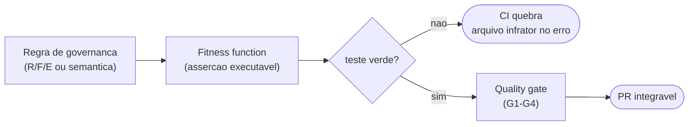
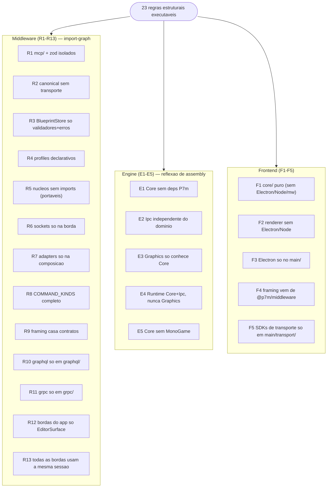
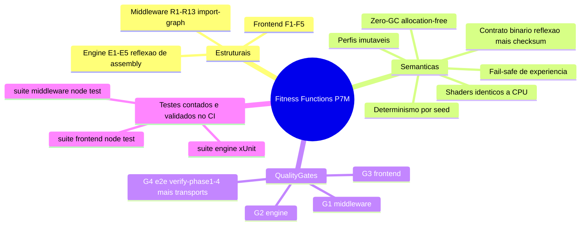
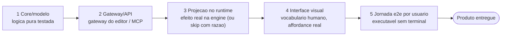
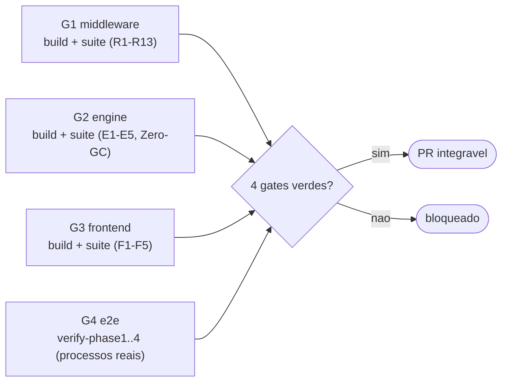

# Governança Arquitetural e Definition of Done

A arquitetura do P7M não depende de disciplina de revisão: **toda regra de
governança é uma asserção executável** (fitness function) que quebra o CI com
o arquivo infrator no erro. Este documento enumera as regras, aponta o teste
que as impõe e define o que "pronto" significa.

> A **especificação técnica normativa** completa (constituição de engenharia:
> princípios invioláveis, paradigmas, padrões, contratos, versionamento, erros,
> testes e plano de evolução, com evidência classificada) está em
> [`ARCHITECTURE-SPEC.md`](ARCHITECTURE-SPEC.md). Este `GOVERNANCE.md` é o
> subconjunto executável (as 23 regras e o DoD).

*Mostra o mecanismo central da governanca: cada regra vira um teste que, ao falhar, quebra o CI apontando o arquivo infrator; passando, o quality gate libera o PR.*

## 1. Regras arquiteturais e sua imposição

### Middleware (`middleware/test/architecture.test.ts`)

| Regra | Enunciado | Imposição |
|---|---|---|
| **R1** | SDK do MCP e `zod` são exclusivos de `mcp/` — fachadas finas, zero lógica de domínio | teste R1 |
| **R2** | O modelo canônico (`canonical/`) não conhece transporte (`ipc/`), MCP, adapters concretos nem planos de dados | teste R2 |
| **R3** | O coração do domínio (`BlueprintStore`) importa apenas validadores puros e o vocabulário de erros | teste R3 |
| **R4** | Perfis de runtime (`runtime/profiles/`) são dados declarativos — só importam o contrato `RuntimeProfile` | teste R4 |
| **R5** | Núcleos algorítmicos (`AutoTiler`, `AsepriteImporter`, `fnv1a`) não importam nada — portáveis a workers | teste R5 |
| **R6** | Sockets (`node:net`) só existem na borda de transporte (`ipc/`, `tools/`, composição) | teste R6 |
| **R7** | Adapters concretos (`MonoGameAdapter`) só são referenciados pela composição — domínio/canônico/gateway conhecem apenas o contrato `RuntimeAdapter` | teste R7 |
| **R8** | Todo `BlueprintCommand` é despachável pelas bordas (`COMMAND_KINDS` completo) | teste R8 |
| **R9** | Constantes de framing e limites casam com os contratos publicados | teste R9 |
| **R10** | A lib `graphql` é exclusiva da borda `graphql/` (fachada fina, zero domínio) | teste R10 |
| **R11** | As libs `@grpc/*` são exclusivas da borda `grpc/` (fachada fina, zero domínio) | teste R11 |
| **R12** | As bordas de transporte do app (`graphql/`, `grpc/`) só importam a `EditorSurface` (+ transport/protocolo/log) — nunca domínio interno | teste R12 |
| **R13** | `EditorSurface`, JSON-RPC, GraphQL, gRPC e MCP resolvem o projeto pela mesma porta substituível de sessão; nenhuma borda retém `BlueprintStore`/`CanonicalOrchestrator` fixos | teste R13 |

### Engine (`engine/tests/.../ArchitectureTests.cs`)

| Regra | Enunciado | Imposição |
|---|---|---|
| **E1** | `Core` (DOD/Zero-GC) não depende de nenhuma outra camada P7m | teste E1 |
| **E2** | `Ipc` é plano de controle independente do domínio | teste E2 |
| **E3** | `Graphics` (MonoGame) só conhece `Core` | teste E3 |
| **E4** | `Runtime` (serviço headless) orquestra `Core`+`Ipc`, nunca `Graphics` — o host gráfico acopla por fora | teste E4 |
| **E5** | `Core` não referencia MonoGame | teste E5 |

### Frontend (`frontend/test/architecture.test.ts`)

| Regra | Enunciado | Imposição |
|---|---|---|
| **F1** | Núcleos do editor (`core/`) são puros: sem Electron, Node ou middleware | teste F1 |
| **F2** | O renderer nunca importa Electron/Node; `main/` só como type (contrato `window.p7m`) | teste F2 |
| **F3** | Electron só existe no processo `main/` | teste F3 |
| **F4** | O frontend nunca reimplementa framing de protocolo — peers vêm de `@p7m/middleware` | teste F4 |
| **F5** | SDKs de transporte (`@grpc/*`, `node:http`) são exclusivos de `main/transport/` — `core/` decide, `main/transport/` fala | teste F5 |

As três camadas concentram 23 regras estruturais, cada uma verificada por
grafo de import (middleware/frontend) ou reflexão de assembly (engine):

*Mostra as 23 regras estruturais mapeadas às três camadas (R1-R13 middleware, E1-E5 engine, F1-F5 frontend) e o método de verificação de cada grupo.*

### Regras semânticas (impostas por testes de comportamento)

| Regra | Imposição |
|---|---|
| **Zero-GC nos hot loops** (nenhuma alocação em `ComputeWorldPoses`, `TryReadStable`, câmera, luzes, skinning, tilemap) | testes `*_is_allocation_free` (`GC.GetAllocatedBytesForCurrentThread`) |
| **Determinismo por seed** (AutoTiler, shake, simulação de câmera) | testes de igualdade bit a bit com mesmo seed |
| **Contratos binários nunca divergem** (struct C# ↔ escritor Node) | offsets por reflexão + checksum FNV-1a cruzado nos e2e |
| **Shaders ≡ referências de CPU** | `Lighting2D`/`ColorLut`/`LinearBlendSkinning`/`BonePacker` testados; e2e valida por reimplementação TS independente |
| **Toda mutação passa pelo orquestrador** (filters → AST → actions → projeção) | R7 + testes do gateway/adapter; `EngineBridge` é diagnóstico |
| **Troca de projeto é atômica e compartilhada por todas as bordas** | R13 + testes de `ProjectSessionManager`, gateways e dois clientes |
| **Perfis publicados são imutáveis** | `RuntimeProfileRegistry.register` rejeita re-registro (testado) |
| **Fail-safe de experiência** (sem prova de suporte → recurso desabilitado com razão) | testes do `ExperienceGovernor`/`ExperienceGate` |

Vista de conjunto: as fitness functions se dividem em estruturais e
semânticas, todas convergindo nos quality gates e na suíte completa (contagem calculada no CI):

*Mostra a taxonomia das fitness functions (estruturais e semânticas), os quality gates G1-G4 e a suíte completa (contagem no CI) que as impõem.*

## 2. Definition of Done

### Status "Produto entregue" (5 dimensões)

Uma FUNCIONALIDADE (diferente de uma mudança de código) só é "Produto
entregue" quando as cinco dimensões aplicáveis estão completas:

1. **Core/modelo** — lógica pura testada;
2. **Gateway/API** — operável via gateway do editor e/ou MCP;
3. **Projeção no runtime** — efeito real na engine (ou skip com razão);
4. **Interface visual** — fluxo utilizável na aplicação, com vocabulário
   humano (nunca IDs internos) e affordance real;
5. **Jornada e2e validada por usuário** — parte de uma jornada de aceite
   executável sem terminal.

As cinco dimensões são sequenciais: uma funcionalidade só é PRODUTO quando
percorre da lógica pura até a jornada validada por usuário sem terminal:

*Mostra as cinco dimensões sequenciais da Definition of Done, do Core/modelo à jornada e2e, culminando no estado "Produto entregue".*

A matriz corrente vive em [`REQUIREMENTS.md`](REQUIREMENTS.md) §1; o plano
para fechar as colunas 4–5 é [`ALPHA-0.1.md`](ALPHA-0.1.md).

### DoD de uma mudança (qualquer camada)

1. **Testes primeiro no nível certo**: unidade para lógica, integração para
   bordas (canal real), e2e para promessas entre runtimes.
2. `npm test` (middleware e frontend) e `dotnet test` (engine) verdes,
   **incluindo os testes arquiteturais**.
3. Os quatro `scripts/verify-phase*.sh` + `scripts/verify-transports.sh` verdes
   (regressão e2e completa, incluindo o fallback gRPC→GraphQL do app).
4. Contratos afetados atualizados em `contracts/` (fonte única de verdade) e
   refletidos nos DOIS lados do fio.
5. Docs afetadas atualizadas (`README` do pacote + docs/ pertinentes).
6. Sem `TODO` silencioso: limitação conhecida vira razão explícita
   (`skipped`/`deferred`/`disable` com `reason`) ou item em
   [`OPPORTUNITIES.md`](OPPORTUNITIES.md).

### DoD específico por tipo de mudança

| Tipo | Exigências adicionais |
|---|---|
| **Método JSON-RPC novo** | Schema em `contracts/schemas/` + handler + teste RPC + linha na tabela do `contracts/README.md` |
| **Operação de sessão de projeto** | Paridade JSON-RPC/GraphQL/gRPC/MCP; identidade + `expectedCommandSequence` em create/open/close para compare-and-swap; status com `runtimeState: synchronized\|deferred\|failed`; testes de rollback e revisão concorrente sem evento perdido |
| **Operação de arquivo de projeto** | Controller único com dialogs/filesystem injetáveis; Save por temporário + flush + rename; cancelamento/falha bloqueiam Close; recovery preservado até Save confirmado; gate `test:project-lifecycle-product` |
| **Comando canônico novo** | Validação no `BlueprintStore` + `COMMAND_KINDS` + projeção no(s) adapter(s) (ou skip com razão) + reidratação + serialização (`BlueprintSerializer`) + broadcast — R8 pega o esquecimento da borda |
| **Subsistema de engine novo** | Manifesto (`engine/describe`) com limites reais + editor hints; perfil de runtime atualizado se governa recurso de UI |
| **Perfil de runtime** | Nova VERSÃO (imutabilidade) + regras com `reason` legível |
| **Shader** | Referência de CPU espelhada + teste; comentário de contrato nos dois arquivos |
| **Hot loop novo** | Teste de zero alocação |

### Estado atual validado contra o DoD (auditoria desta revisão)

| Item | Estado |
|---|---|
| Testes: três suítes (engine/middleware/frontend), contagem calculada e validada pelo CI | ✅ verdes |
| Testes arquiteturais (23 regras) | ✅ ativos (R10-R13/F5 cobrem os transports e a sessão do app) |
| E2e fases 1–4 | ✅ verdes |
| Persistência de projeto (documento v3 com `projectId`, metadata/unidades; open transacional e replay privado) | ✅ (`ProjectSessionManager`, `project/create`, `project/openDocument`, `project/close`, `project/status`) |
| Lifecycle de arquivo (New/Open/Save/Save As/Close/Recovery/Recentes) | ✅ controller/adapters testáveis, escrita durável e gate explícito no CI (ADR-021) |
| Contratos ↔ implementação | ✅ auditados (R8/R9 + tabela contracts) |
| Lacunas conhecidas e aceitas | registradas em [`OPPORTUNITIES.md`](OPPORTUNITIES.md) com impacto/esforço |

## 3. Quality gates (CI)

| Gate | Job | Conteúdo |
|---|---|---|
| G1 | `middleware` | build + suíte middleware (inclui R1–R13) |
| G2 | `engine` | build + suíte engine (inclui E1–E5, Zero-GC) |
| G3 | `frontend` | build + suíte frontend (inclui F1–F5) + gate explícito do lifecycle de projeto |
| G4 | `e2e` | verify-phase1..4 + verify-transports com processos reais |

Os três gates de camada e o gate e2e devem convergir verdes para liberar a
integração:

*Mostra o pipeline dos quality gates G1-G4: os três gates de camada e o gate e2e convergem, e só a aprovação dos quatro libera o PR.*

Um PR só é integrável com os quatro gates verdes. Não há gate manual: o que a
governança exige, um teste impõe.

## 4. Fontes de verdade documentais

Cada tipo de informação tem **uma** fonte de verdade. Documentos derivados
**não devem contradizer** sua fonte; quando divergirem, a fonte prevalece e o
documento derivado é corrigido (nunca o contrário).

| Informação | Fonte de verdade |
|---|---|
| Status das entregas Alpha | GitHub Issues (#1–#9) e seus critérios de aceite |
| Quantidade de testes | execução das suítes / CI (**nunca** fixada em prosa) |
| Regras arquiteturais | testes arquiteturais (`*/test/architecture.test.ts`, `.../ArchitectureTests.cs`) |
| Métodos JSON-RPC | `contracts/schemas/*.json` + handlers (`EngineService`, `EditorGateway`) |
| Comandos canônicos | tipos (`BlueprintCommand`), registry (`commandShape.COMMAND_KINDS`) e schemas |
| Compatibilidade / versionamento | [`COMPATIBILITY.md`](COMPATIBILITY.md) |
| Requisitos (funcionais/não funcionais/técnicos) | [`REQUIREMENTS.md`](REQUIREMENTS.md) |
| Constituição arquitetural (regras normativas) | [`ARCHITECTURE-SPEC.md`](ARCHITECTURE-SPEC.md) |
| Jornada Alpha | o teste e2e da jornada + [`ALPHA-0.1.md`](ALPHA-0.1.md) |

Responsabilidade por documento (sem duplicação de conteúdo — use links):
`README` entrada/execução · `ARCHITECTURE` topologia/funcionamento ·
`ARCHITECTURE-SPEC` regras normativas · `GOVERNANCE` fitness functions/DoD/fontes ·
`REQUIREMENTS` estado funcional e não funcional · `ALPHA-0.1` milestone/jornada ·
`COMPATIBILITY` versionamento/compatibilidade.

A verificação automática (`npm run docs:verify`, script `scripts/verify-docs.mjs`)
impõe parte destas regras: links internos válidos, documentos obrigatórios
presentes, scripts `verify-phase*.sh` referenciados existentes, ausência de
referências transitórias (branches/sessões de geração), comandos `npm run`
documentados que existam nos `package.json`, e ausência de contagens de teste
fixadas manualmente.
