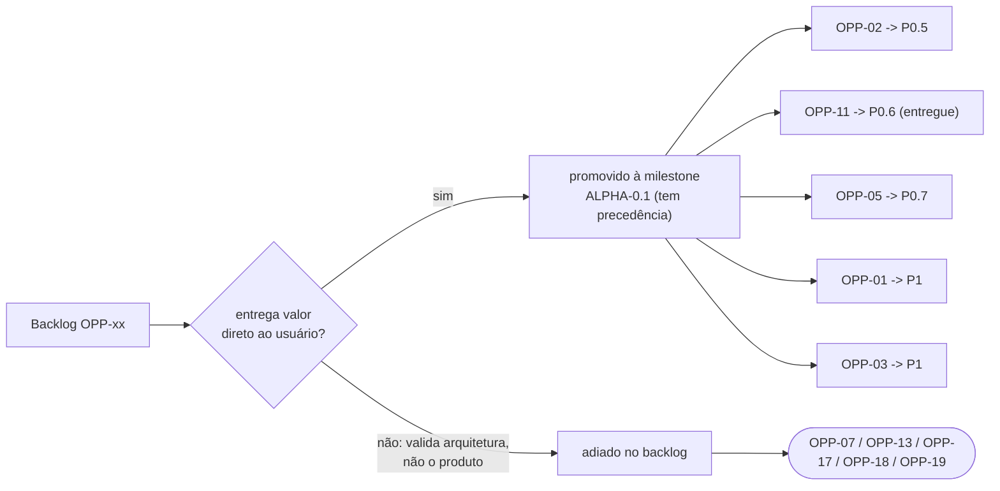
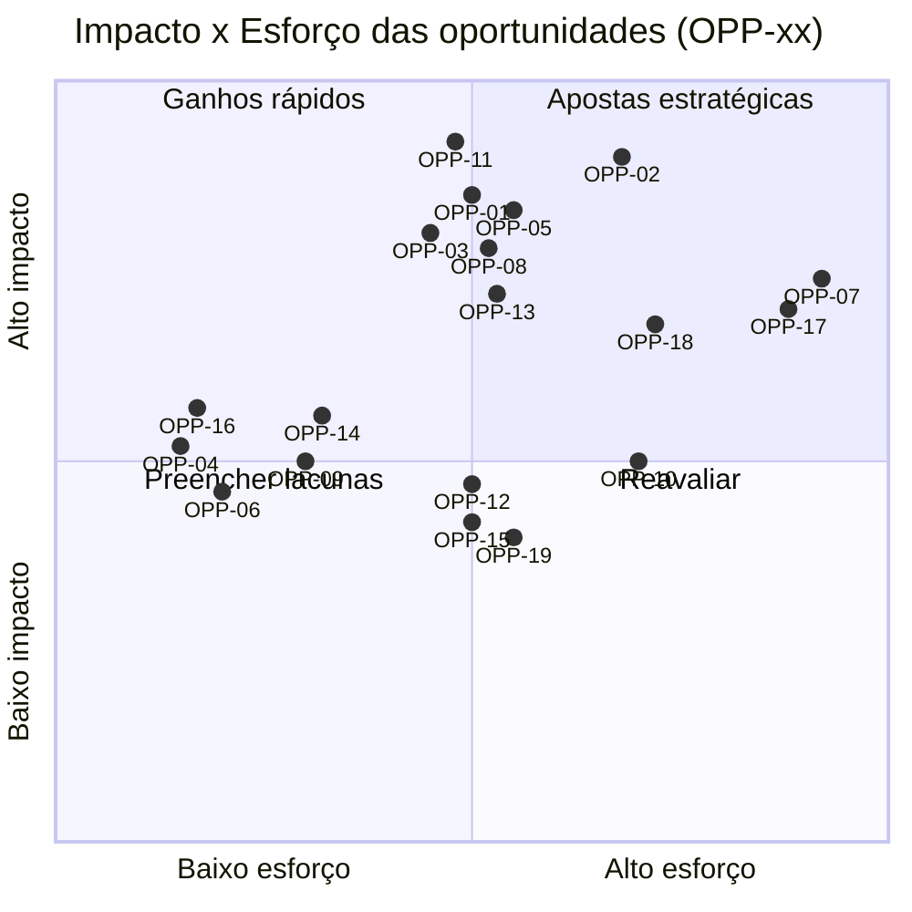
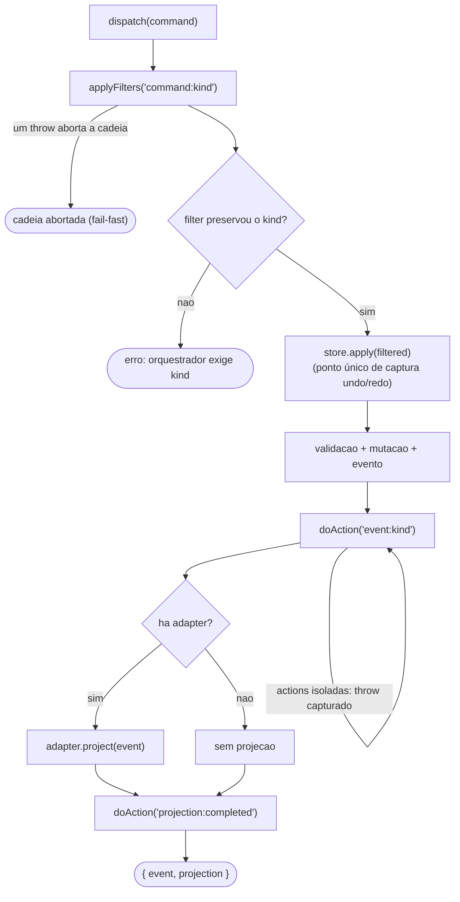

# Oportunidades

> **Revisão pós-diagnóstico de produto (2026-07):** este backlog estava
> orientado por "o que a arquitetura permite" e sub-representava "o que o
> usuário precisa para obter valor". Os itens de valor direto ao usuário
> foram promovidos ao backlog P0/P1 da milestone
> [`ALPHA-0.1.md`](ALPHA-0.1.md) — que tem precedência sobre tudo aqui.
> Promovidos: OPP-01→P1, OPP-02→**P0.5**, OPP-03→P1, OPP-05→**P0.7**,
> OPP-11→**P0.6**. Adiados deliberadamente: OPP-07, OPP-13, OPP-17, OPP-18,
> OPP-19 (validam a arquitetura, não o produto).

*Mostra o fluxo de promoção pós-diagnóstico: uma oportunidade só sobe à milestone ALPHA-0.1 (P0.x/P1) se entrega valor direto ao usuário; as que apenas validam a arquitetura ficam adiadas no backlog.*

## Necessidades de usuário sem representação anterior (agora em ALPHA-0.1)

Gerenciador de projetos · save/save as/autosave/crash recovery · inspector +
modelo de seleção transversal · asset browser · supervisor de processos ·
command palette · empacotamento/instalador · onboarding/tutorial · painel de
problemas · acessibilidade · testes de usabilidade.

---

Backlog qualificado do que a arquitetura atual habilita. Cada item traz
impacto, esforço e o alicerce já existente — oportunidade aqui significa
"o terreno está preparado", não "ideia solta".

*Posiciona as 19 oportunidades por impacto (eixo Y) e esforço (eixo X), derivados das colunas Impacto/Esforço das tabelas abaixo (B/B-M/M/M-A/A); o quadrante superior-esquerdo (ganhos rápidos) prioriza alto impacto e baixo esforço, o superior-direito reúne as apostas estratégicas de alto esforço.*

## Produto / Experiência de criação

| ID | Oportunidade | Impacto | Esforço | Alicerce existente |
|---|---|---|---|---|
| OPP-01 | **Editores de canvas em workers** (curvas, rigs, grafos de estado) | Alto — é a cara da ferramenta | M | `TimelineCurve`, `solveFabrik`, `VisualStateMachine`, `CubicBezierEasing.samplePath` — todos puros e testados (regra F1 garante portabilidade a workers) |
| OPP-02 | **Preview embutido do MonoGame** no painel do editor | Alto — feedback imediato | M/A | perfil 3.8.2 já governa `preview.embedded`; `DeferredRenderer` pronto; falta host de janela acoplado |
| OPP-03 | **Live edit generalizado** (tunables por subsistema, estilo FlatRedBall) | Alto | M | padrão provado em `camera/configure` (merge parcial); manifesto já declara `properties` com tipo/faixa |
| OPP-04 | **Preview de regras de auto-tiling em tempo real** no pincel de IntGrid | Médio | B | `resolveAutoTiles` é puro e rápido; `IntGridDocument` já entrega snapshots |
| OPP-05 | **Undo/redo global do Blueprint** (não só IntGrid) | Alto | M | todo evento carrega dados de inverso em potencial; o orquestrador é o ponto único para capturar |
| OPP-06 | **Templates de projeto** ("plataforma 2D pronto para tocar") | Médio | B | `BlueprintDocument` é o formato de template natural (replay canônico valida tudo) |

O alicerce de **OPP-05** (undo/redo global) é o fluxo canônico de mutação: como toda mutação passa por um único caminho, o `store.apply(filtered)` é o ponto único onde capturar o inverso de cada evento — não há mutação fora dele.

*Reutiliza o fluxo canônico de dispatch para mostrar por que OPP-05 é viável: sendo `store.apply` a única mutação do sistema, capturar ali o inverso de cada evento habilita undo/redo global do Blueprint (não só do IntGrid).*

## Plataforma / Runtimes

| ID | Oportunidade | Impacto | Esforço | Alicerce existente |
|---|---|---|---|---|
| OPP-07 | **Segundo runtime** (ex.: Godot 4 headless ou Love2D) provando a tese multi-runtime | Estratégico | A | custo real = 1 adapter + 1 perfil (contrato `RuntimeAdapter` + governança prontos); R7 impede vazamento |
| OPP-08 | **Harness de performance/física (Fase 5)**: physics slices, budget de frame, asserções de regressão | Alto | M | `camera/simulate`, `lighting/evaluate`, `mesh/inspect`, checksums — o vocabulário de asserção já existe |
| OPP-09 | **Compilação de shaders no CI** (mgcb + Wine em job dedicado) | Médio | B/M | `Content.mgcb` pronto; fecha o risco RT-03 |
| OPP-10 | **Tiles via shared memory** (mapas > 64k células, chunks/infinito estilo Tiled) | Médio | M/A | plano de dados com seqlock provado para malhas; contrato prevê a extensão |
| OPP-11 | ✅ **ENTREGUE como P0.6** — spawn tables no runtime (entidades canônicas → atores vivos) | Alto | M | `archetypeId` na definição projeta `entity/spawn`/`move`/`despawn`; `ActorStore` Zero-GC; resta enriquecer o archetype (sprite/colisão) |
| OPP-12 | **Binding nativo de mmap no Electron** (coerência Windows do plano de dados) | Médio | M | risco documentado no contrato; interface do escritor já isolada |

## Automação / IA

| ID | Oportunidade | Impacto | Esforço | Alicerce existente |
|---|---|---|---|---|
| OPP-13 | **Geração assistida ponta-a-ponta**: prompt → sprite sheet (API externa) → ingestão automática | Alto | M | `AssetPipelineService` com `ToolRunner` injetável é o encaixe do gerador; proveniência `agent:*` já auditável |
| OPP-14 | **Agente revisor de blueprint** (lint de domínio: luz sem alcance, nível órfão, pesos não normalizados) | Médio | B/M | filters no `HookBus` são o ponto de injeção natural; `blueprint/query document` dá a visão total |
| OPP-15 | **Wang/terrain rules** (transições por borda, estilo Tiled) no AutoTiler | Médio | M | `AutoTileRule` extensível; teste de determinismo já cobre o regime |
| OPP-16 | **Fixtures de replay como testes de regressão de conteúdo** (documento + checksums esperados) | Médio | B | `BlueprintSerializer` + FNV-1a: um teste dirige um projeto inteiro pela engine |

## Colaboração / Ecossistema

| ID | Oportunidade | Impacto | Esforço | Alicerce existente |
|---|---|---|---|---|
| OPP-17 | **Sessões de edição colaborativas** (N editores já convivem; falta presença/locks) | Estratégico | A | broadcast multi-cliente do gateway já garante coerência de estado |
| OPP-18 | **Plugins de terceiros** empacotando hooks/filters/pipelines | Estratégico | M/A | `HookBus` com prioridades e inventário; pipelines extensíveis por estágio (provado em teste) |
| OPP-19 | **Registro público de perfis de runtime** (comunidade publica famílias/versões) | Médio | M | contrato `runtime.profile.schema.json` + imutabilidade por versão já definidos |

## Como usar este documento

- Um item promovido a trabalho vira entrada de fase no `README` e ganha DoD
  próprio ([`GOVERNANCE.md`](GOVERNANCE.md) §2).
- Um item descartado não é apagado: ganha uma linha de decisão com a razão.
- Toda limitação nova descoberta em desenvolvimento DEVE entrar aqui (regra
  de DoD nº 6) — este arquivo é o anti-"TODO esquecido" do projeto.
