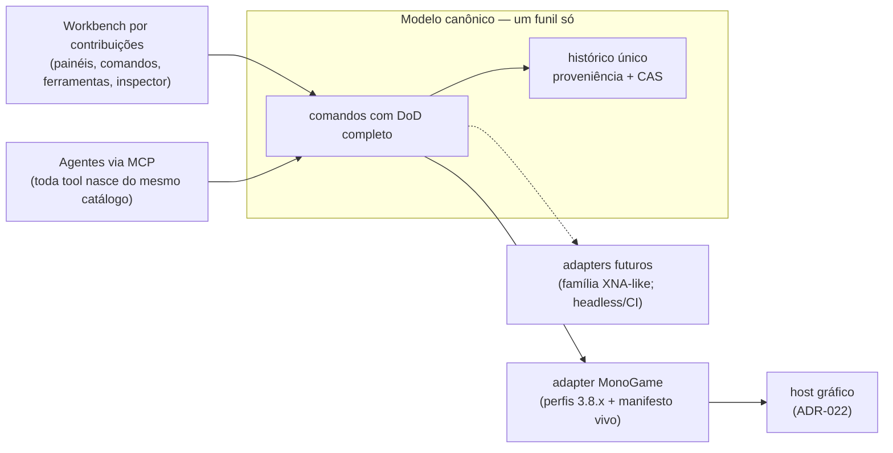
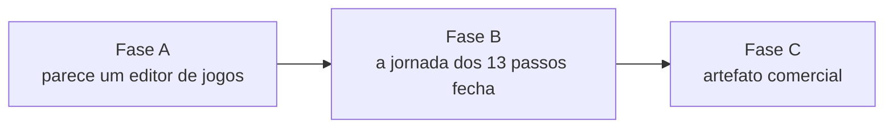

# Gridsmith — Estratégia de produto

> **O que este documento é.** A identidade do produto, o diferencial que
> defendemos, a tese de crescimento e o caminho faseado até um **artefato
> vendável** — com cada fase amarrada a itens que JÁ existem na fila do
> [`DEVELOPMENT-PLAN.md`](DEVELOPMENT-PLAN.md). A ordem de execução continua
> sendo a §8 de lá; a jornada de aceite continua sendo a do
> [`ALPHA-0.1.md`](ALPHA-0.1.md). O que este documento acrescenta é o PORQUÊ
> comercial, o critério de saída de cada fase e a fila das pendências que não
> são de engenharia (marca, licença, canal) — que até aqui não tinham dono nem
> casa.
>
> **O que ele decide** está no registro de decisões do plano (§4) — não
> redecidir. **O que ele recomenda** (licença, preço, canal) está marcado como
> recomendação: a palavra final é do dono do produto.

## 1. Identidade

**O Gridsmith é o editor para engines que não têm editor.**

Quem escolhe uma lib 2D de baixo nível — MonoGame hoje; a família XNA-like como
próxima aposta — escolhe controle: do loop, da memória, do código. O preço
dessa escolha sempre foi perder o ferramental visual que as engines
monolíticas dão de graça. O Gridsmith existe para anular esse preço **sem
cobrar o outro**: o projeto não passa a pertencer à engine.

Três promessas, na ordem em que aparecem para o usuário:

1. **Pinte significado; a arte se resolve.** O designer pinta intenção
   (IntGrid); tiles, colisão e decoração derivam por regra determinística com
   seed — mesmo input, mesmo jogo, sempre.
2. **O projeto é seu, não da engine.** O documento canônico é declarativo,
   versionável e diffável (git de verdade, não binário opaco); adapters o
   projetam em runtimes concretos. Trocar ou atualizar o runtime não reescreve
   o jogo.
3. **Humano e agente editam JUNTOS, com auditoria.** Tudo que a UI faz, um
   agente faz pelo mesmo funil validado — e o histórico único diz quem fez o
   quê, com desfazer que atravessa os dois.

**Nota de vocabulário externo.** "EaaS / Engine-as-a-Service" permanece como
categoria ARQUITETURAL nos documentos técnicos ([`PRODUCT.md`](PRODUCT.md),
[`ARCHITECTURE-SPEC.md`](ARCHITECTURE-SPEC.md)); na comunicação externa a
identidade acima substitui a sigla. Jargão de arquitetura não vende
ferramenta — e "as-a-Service" sugere nuvem, que é o oposto deste produto
(local, offline-first).

## 2. Para quem — e para quem NÃO

| Persona | Situação | O que compra |
|---|---|---|
| **Dev-artesão 2D** (núcleo) | Programa o jogo numa lib de baixo nível por escolha; hoje cola LDtk + Aseprite + pipeline caseiro, ou escreve o próprio editor | O ferramental visual inteiro sem abrir mão do runtime que escolheu |
| **Artista técnico** em time pequeno | Precisa de timing/deformação sob controle da arte sem depender de programador | Frame tags → clipes, rigs FABRIK, easing por segmento, preview com seed |
| **Operador de agentes** | Quer gerar/editar conteúdo por LLM sem quebrar o projeto | O único editor onde o agente entra pelo funil validado, com proveniência e undo compartilhado |

**Anti-personas** (fora de escopo, deliberadamente): jogos 3D; quem quer uma
engine completa com loja de assets (Godot/Unity servem melhor); no-code puro.
Dizer não a eles é o que mantém a identidade nítida — o escopo congelado do
[`ALPHA-0.1.md`](ALPHA-0.1.md) já pratica isso.

## 3. O diferencial, em ordem de defensabilidade

1. **Agente-nativo de verdade — o único em 2026.** Nos concorrentes, IA é
   plugin que edita texto ou gera asset solto. Aqui o agente muta pelo MESMO
   caminho canônico da UI (princípio "um caminho só"), cada gesto entra no
   histórico único com ator (`human`/`agent`), o desfazer atravessa os dois e o
   CAS de cursor impede que um agente atropele uma edição humana. Isso não é
   uma feature acoplável depois: é consequência do modelo canônico, e copiá-lo
   exige reescrever o núcleo do editor concorrente.
2. **O projeto não pertence à engine.** Modelo canônico + adapters governados
   ([`CANONICAL-MODEL.md`](CANONICAL-MODEL.md)); o documento sobrevive à troca
   de runtime e a migração encadeada com fixtures protege todo documento já
   gravado ([`COMPATIBILITY.md`](COMPATIBILITY.md)).
3. **Experiência governada.** Nada desabilitado sem razão: perfis versionados ×
   manifesto vivo da engine. Mata a classe de bug mais irritante de editor — o
   botão morto.
4. **Derivação determinística.** Seed em tudo, artefatos com hash e
   proveniência. Para times e pipelines de CI, reprodutibilidade é dinheiro.
5. **Engenharia verificada como marketing.** O público-alvo LÊ repositório.
   Regras arquiteturais executáveis, Zero-GC medido, contratos lintados e um
   plano que qualquer IA continua ([`GOVERNANCE.md`](GOVERNANCE.md),
   [`DEVELOPMENT-PLAN.md`](DEVELOPMENT-PLAN.md)) são argumento de venda para
   quem escolheu uma lib de baixo nível justamente por rigor.

**A demo que carrega a mensagem** (viável ao fim da Fase A): abrir o projeto de
exemplo, pedir a um agente "cave um lago no canto e reposicione o jogador",
ver o gesto aparecer na aba Histórico rotulado como **Agente**, e desfazê-lo
com Ctrl+Z. Trinta segundos, e nenhum concorrente consegue gravar o mesmo
vídeo.

## 4. Mapa competitivo

| Ferramenta | O que é | O que o Gridsmith tem que ela não tem |
|---|---|---|
| **LDtk** | O padrão-ouro de UX de níveis; exporta JSON | Runtime vivo (live edit), governança de capacidades, histórico com proveniência, agente pelo funil validado |
| **Tiled** | Editor de mapas genérico e maduro | Idem — e derivação determinística com seed como contrato, não conveniência |
| **Ogmo 3** | Projeto-como-schema, minimalista | Manutenção ativa, runtime, agente, governança |
| **Aseprite** | Editor de arte | **Parceiro, não concorrente**: o pipeline importa frame tags/slices como metadado de primeira classe |
| **Unity / Godot** | Engines completas com editor | O projeto NÃO pertence à engine; o dev mantém o runtime code-first que escolheu |
| **FlatRedBall (Glue)** | O vizinho mais próximo: editor para MonoGame | Modelo canônico runtime-agnóstico (não acoplado a uma stack de código gerado), agente-nativo, experiência governada, documento diffável |

A pesquisa que fundamenta esta tabela — e o que absorvemos de cada um — está
em [`RESEARCH-EDITOR-LANDSCAPE.md`](RESEARCH-EDITOR-LANDSCAPE.md).

## 5. Tese de crescimento: o produto cresce por três eixos que se compõem

*Mostra a composição dos três eixos: superfícies novas e agentes entram pelo mesmo funil de comandos; runtimes novos entram por adapter — nenhum eixo exige tocar no núcleo dos outros.*

1. **Eixo runtimes — a superfície de venda cresce por ADAPTER.** O contrato já
   existe e é versionado ([`../contracts/README.md`](../contracts/README.md):
   JSON-RPC + `engine/describe` + perfis de capacidade + shared memory). O
   MonoGame é o primeiro cliente do contrato, não o dono. Cada adapter novo
   multiplica o mercado endereçável sem tocar no modelo canônico — as regras
   R/E/F impostas por teste garantem que a costura não vaza. Aposta pós-1.0
   (sem entrada na fila; registrar em [`OPPORTUNITIES.md`](OPPORTUNITIES.md)
   quando virar trabalho): FNA primeiro, por compartilhar a superfície XNA — o
   custo marginal do adapter é o menor possível e valida a tese com o segundo
   ponto na reta.
2. **Eixo superfícies — o editor cresce por CONTRIBUIÇÃO.** Desde a E10,
   painel, comando, ferramenta e seção de inspector se declaram em registros;
   um domínio novo (timeline, máquina de estados, rigging — núcleos puros já
   prontos, T11) entra como dados + comandos canônicos com DoD, sem tocar na
   casca.
3. **Eixo agentes — cada comando novo vira capacidade de agente DE GRAÇA.** O
   catálogo MCP deriva do mesmo `COMMAND_KINDS` que o lint de contratos impõe.
   Não existe "integrar IA" como projeto separado: a paridade é estrutural, e
   este é o único eixo em que o produto COMPÕE sozinho enquanto os outros
   crescem.

## 6. O caminho até vendável — fases com critério de saída

*Mostra as três fases sequenciais até o produto vendável; cada uma tem critério de saída observável e itens já registrados na fila do plano.*

Cada item abaixo referencia a fila viva do
[`DEVELOPMENT-PLAN.md`](DEVELOPMENT-PLAN.md) §7 — esta seção não cria fila
paralela de engenharia, ordena a existente pelo efeito comercial.

### Fase A — "Parece um editor de jogos" (em curso)

O produto passa a produzir uma captura de tela honesta.

| Item da fila | O que entrega |
|---|---|
| ~~B1~~ ✅ **entregue** (F1 onda A completa) | `tileset/define` canônico, atlas nos DOIS lados (canvas e host), paridade por igualdade de listas de quads verificada no CI, telemetria de frame |
| ~~B6~~ ✅ **entregue** (parte visual) | O archetype carrega sprite: o Player aparece como arte no canvas do editor E na janela do host, degradando junto quando o atlas não cobre |
| ~~F6~~ ✅ **entregue** (B10/B11/D11) | Pintura virou `level/patch` canônico; o Ctrl+Z liga no histórico da E9; pintar suja o projeto porque emite evento |
| D5 | Projeto de exemplo versionado — a primeira coisa que um avaliador abre |

**Resta um item** para a saída da Fase A: D5. Nenhum dos entregues era
estrutural — a F6 fechou o último ponto em que o editor mantinha uma verdade
fora do funil canônico, a leitura da paleta (D4) tirou da interface a última
afirmação que o documento podia contradizer, e a B6 tirou do canvas a última
que a JANELA podia contradizer. A ordem recomendada está em
[`DEVELOPMENT-PLAN.md`](DEVELOPMENT-PLAN.md) §8.1.

**Saída da Fase A:** os passos 2–8 da jornada do ALPHA rodam com a MESMA arte
no canvas do editor e na janela do host, e a demo agente-nativa da §3 é
gravável.

### Fase B — "A jornada dos 13 passos fecha"

| Item da fila | O que entrega |
|---|---|
| B3 / F1 onda B | Preview embutido no painel (a capability `preview.embedded` finalmente vira `enable`) |
| B7 + T4/T5/D7 (F2 residual) | Sessão durável no middleware; autosave sem laço; trocar de projeto sujo pergunta |
| E5 + E6 + parte de D18 | Publicação de artefato em duas fases e a camada de aplicação de assets — importar `player.aseprite` DENTRO do app |
| D3 | Razões da governança 100% pt-BR (código estável + vocabulário) |
| D9 | Governança re-resolvida quando a engine sobe/cai — o rail nunca congela |

**Saída da Fase B:** os 13 passos do [`ALPHA-0.1.md`](ALPHA-0.1.md) sem
terminal, cumprindo as metas objetivas da milestone (tempo até preview,
save/reopen sem perdas, zero etapas de JSON à mão).

### Fase C — "Artefato comercial"

| Item da fila | O que entrega |
|---|---|
| B13/B14 (P0.9) | Empacotamento por plataforma, caminhos empacotados na supervisão |
| T8 | E2e visual (Playwright + Electron) como rede de regressão da jornada |
| GTM-3..GTM-7 (fila comercial abaixo) | Assinatura de código, licença, preço, canal, página |

**Saída da Fase C:** instalador assinado nas três plataformas + página de
compra + política de reembolso + changelog público. É a definição operacional
de "vendável".

**Contínuo, atravessando as fases:** uma demo agente-nativa gravada por fase.
É o conteúdo de marketing que nenhum concorrente consegue replicar, e o custo
é uma tarde por fase.

## 7. Modelo comercial (recomendação — decisão final é do dono)

| Decisão | Recomendação | Por quê | Alternativa descartada |
|---|---|---|---|
| Licença | **Source-available; binário pago** (estilo Aseprite) | O público lê código — a engenharia verificada É o marketing; e o medo de abandono (real em ferramenta indie) se resolve com o fonte visível | Proprietário fechado (joga fora o diferencial nº 5); open-core com editor grátis (mata a única linha de receita antes de existir ecossistema) |
| Cobrança | **Perpétua com 1 ano de updates**, upgrade com desconto | Assinatura é atrito letal no mercado indie; perpétua-com-janela financia manutenção sem trair o comprador | Assinatura pura |
| Preço-âncora | Founder alpha ~US$ 20; 1.0 na faixa US$ 30–40 | Aseprite fixou o teto psicológico do "tool indie de qualidade"; abaixo dele na entrada, acima com a maturidade | Grátis no alpha (treina o mercado a não pagar) |
| Canal | itch.io no alpha → site próprio (merchant of record para IVA/imposto internacional) → Steam no 1.0 com wishlists desde a Fase B | Cada canal no momento em que seu público aparece | Steam primeiro (review bombing de alpha imaturo é irreversível) |

## 8. Fila comercial (GTM) — pendências que não são de engenharia

A fila de engenharia vive no plano; ESTA fila vive aqui, porque nenhum item
dela é código. Gravidade segue a mesma lógica: o que bloqueia a venda primeiro.

| # | Pendência | Dono | Quando |
|---|---|---|---|
| GTM-1 | Confirmar marca e domínio de "Gridsmith" (INPI/USPTO, domínio, org GitHub, contas) | dono | **antes** de qualquer material público |
| GTM-2 | Renomear o repositório no GitHub (hoje `p7m-design`; divergência deliberada registrada em [`COMPATIBILITY.md`](COMPATIBILITY.md)) | dono | junto de GTM-1 |
| GTM-3 | Certificado de assinatura Windows (EV) e Apple Developer + notarização | dono | início da Fase C (lead time de semanas) |
| GTM-4 | Texto da licença source-available (cláusulas de uso do fonte) | dono + revisão jurídica | Fase C |
| GTM-5 | Página do produto com a demo agente-nativa da Fase A | dono (conteúdo sai das demos por fase) | fim da Fase B |
| GTM-6 | Conta em merchant of record (impostos internacionais) | dono | Fase C |
| GTM-7 | Política de reembolso, changelog público e canal de suporte | dono | Fase C, antes da primeira venda |

## 9. Organização para crescer — o que já está no lugar, o que falta

O repositório já é organizado para crescer **por construção**, e isso deve ser
dito com todas as letras porque é raro:

| Já está no lugar | Onde |
|---|---|
| Constituição executável (regras por teste, não por revisão) | [`GOVERNANCE.md`](GOVERNANCE.md) |
| Casca por contribuições (domínio novo entra como dados) | E10, `frontend/src/core/workbench/` |
| DoD mecânico para comando novo (lint quebra se faltar perna) | [`GOVERNANCE.md`](GOVERNANCE.md) + lint de contratos |
| Contratos como fonte única com paridade verificada | [`../contracts/README.md`](../contracts/README.md) |
| Compatibilidade registrada por eixo, com migração encadeada | [`COMPATIBILITY.md`](COMPATIBILITY.md) |
| Plano legível por qualquer IA, com receitas e armadilhas | [`DEVELOPMENT-PLAN.md`](DEVELOPMENT-PLAN.md) |
| Host gráfico como composição, verificável sem GPU | [`adr/ADR-022-host-grafico-como-composicao.md`](adr/ADR-022-host-grafico-como-composicao.md) |

O que falta para a tese de crescimento, e onde está registrado:

- **O contrato do adapter como documento nomeado.** Hoje ele existe espalhado
  (contratos + perfis + manifesto); formalizá-lo como superfície pública é o
  pré-requisito do segundo adapter. Entra na fila quando o segundo adapter
  entrar — antes disso seria documentação de uma API com um único cliente.
- **Empacotamento e e2e visual** (B13/B14, T8) — a Fase C inteira.
- **Exemplo versionado** (D5) — a porta de entrada de qualquer avaliador.

## 10. Riscos assumidos

| Risco | Mitigação |
|---|---|
| O mercado MonoGame é pequeno | A identidade é a CATEGORIA ("engines sem editor"), não uma engine; o adapter XNA-like valida o segundo ponto da reta com custo mínimo |
| O vizinho (FlatRedBall) ou uma engine grande copia o ângulo agente-nativo | O funil único não é acoplável depois — é o núcleo. Mover rápido nas demos por fase transforma a vantagem estrutural em vantagem percebida |
| Manutenção solo | O plano LLM-friendly + a constituição executável são a mitigação: qualquer agente continua o projeto com o CI como revisor |
| Peso do Electron para uma ferramenta "de precisão" | Aceito no alpha; medir e decidir com dados na Fase C, nunca antes |
