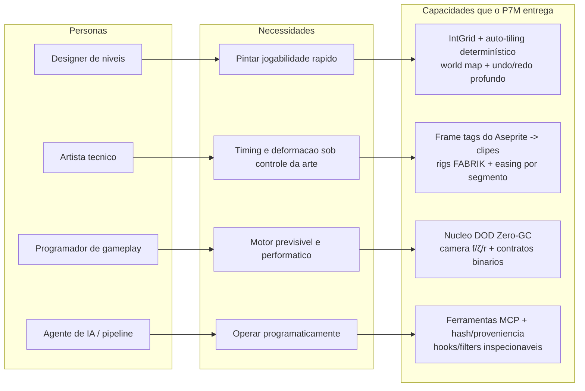
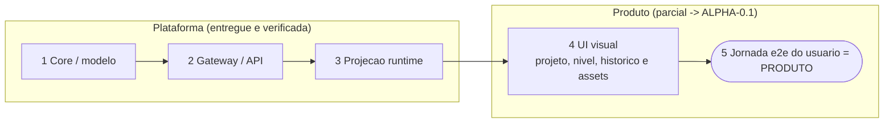
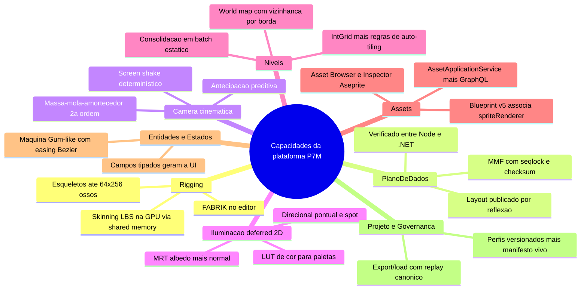
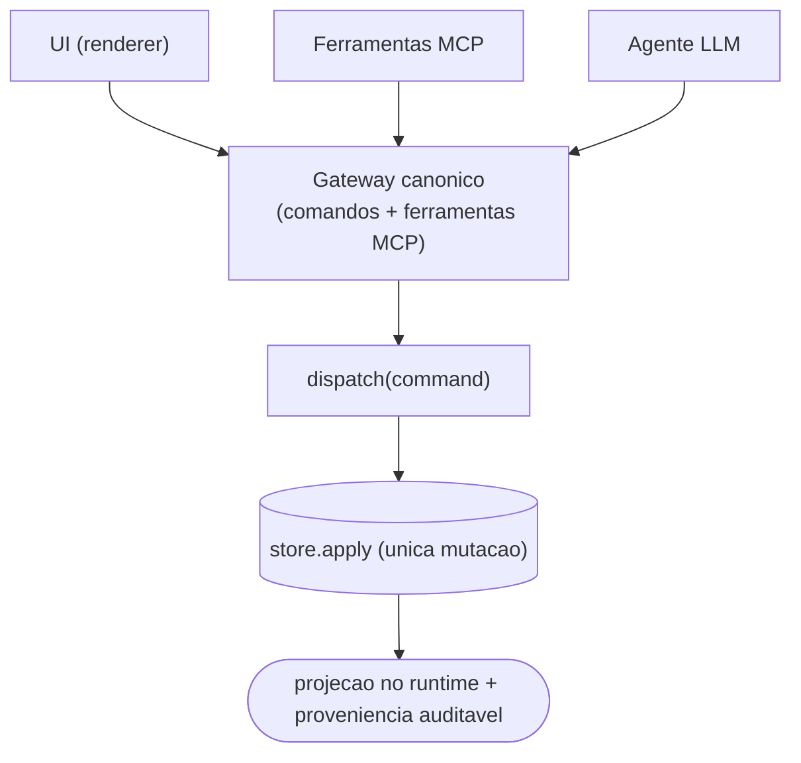

# P7M — Visão de Produto

## O que é

O P7M é uma **ferramenta visual de desenvolvimento de jogos 2D fortemente
orientada a domínio**, construída sobre o conceito de Engine-as-a-Service: o
criador edita um **modelo canônico próprio** (blueprint declarativo,
versionável e diffável) e a ferramenta o **projeta em runtimes reais** —
MonoGame hoje — através de adapters governados por perfis de capacidades.

O que diferencia o P7M de um editor acoplado a uma engine:

1. **O domínio é o produto.** Rigs, níveis, luzes, câmera, entidades e
   estados são conceitos do P7M, não wrappers da engine. Trocar de runtime
   não muda o projeto do usuário.
2. **A experiência é governada, não assumida.** Cada recurso da UI existe
   porque o perfil do runtime + o manifesto vivo da engine o habilitam — e
   quando não existe, o usuário vê a razão real.
3. **Automação é cidadã de primeira classe.** Tudo que a UI faz, um agente
   LLM faz pelo mesmo caminho validado (MCP + gateway) — geração assistida
   com proveniência auditável.

## Personas

| Persona | Necessidade | O que o P7M entrega |
|---|---|---|
| **Designer de níveis** | Pintar jogabilidade rápido, iterar sem programador | IntGrid + auto-tiling determinístico com preview de regras; world map com vizinhança; undo/redo profundo |
| **Artista técnico** | Timing e deformação sob controle da arte | Asset Browser e Inspector Aseprite expõem clips/slices/pivôs; rigs com FABRIK interativo; curvas de easing por segmento |
| **Programador de gameplay** | Motor previsível e performático | Núcleo DOD Zero-GC testado; física de câmera com parametrização f/ζ/r; contratos binários verificados entre runtimes |
| **Agente de IA / pipeline** | Operar a ferramenta programaticamente | Ferramentas MCP para todo comando canônico; artefatos com hash e proveniência; hooks/filters inspecionáveis |

*Mostra o encadeamento persona -> necessidade -> capacidade, a mesma leitura da tabela acima em forma de fluxo.*

## Estado honesto do produto

> **Diagnóstico (2026-07):** o P7M é hoje uma **plataforma técnica de edição
> madura com uma aplicação visual ainda incompleta**. Projeto, edição de nível,
> histórico global, workbench adaptativo e o fluxo visual de assets já possuem
> jornadas verificáveis; outras capacidades da plataforma ainda não estão
> expostas como produto. A conversão continua na milestone
> [`ALPHA-0.1.md`](ALPHA-0.1.md), com a matriz funcional honesta em
> [`REQUIREMENTS.md`](REQUIREMENTS.md). O pipeline visual de assets não deve ser
> interpretado como PreviewHost ou gameplay.

*Mostra a maturidade em cinco dimensões sequenciais: as três primeiras estão
prontas na plataforma; a UI já cobre jornadas editoriais específicas, mas a
jornada e2e completa continua sendo a lacuna da ALPHA-0.1.*

## Capacidades da plataforma (entregues e verificadas)

- **Rigging**: esqueletos hierárquicos (até 64×256 ossos), skinning LBS na
  GPU alimentado por shared memory sem repack, FABRIK no editor.
- **Plano de dados**: memory-mapped files com seqlock e checksum verificado
  entre Node e .NET, layout publicado por reflexão.
- **Câmera cinemática**: massa-mola-amortecedor de 2ª ordem, antecipação
  preditiva, screen shake harmônico determinístico, simulação para preview.
- **Iluminação deferred 2D**: MRT (albedo+normal), luzes direcionais/
  pontuais/spot, LUT de cor para paletas dinâmicas — shaders com referência
  de CPU testada.
- **Níveis**: IntGrid + regras de auto-tiling (wildcards, negação, chance,
  variantes por seed), consolidação em batch estático, world map com
  vizinhança por borda.
- **Assets**: `AssetApplicationService` centraliza watcher, catálogo, import,
  reimport, cancelamento, ferramentas e diagnósticos sobre o pipeline Aseprite →
  artefato canônico → MGCB. O baseline GraphQL alimenta Asset Browser, DnD,
  miniaturas, fila, Inspector Aseprite e Problems; o Blueprint v5 persiste apenas
  `EntityDefinition.spriteRenderer { assetId, defaultClip? }` pelo comando
  `entitydef/update`, sem sujar histórico/dirty com progresso operacional.
- **Entidades**: definições com campos tipados (schema gera a UI) e
  instâncias validadas com defaults.
- **Estados visuais**: máquina Gum-like com interpolação interrupt-safe e
  easing Bézier.
- **Projeto**: wizard de template real, export/load por replay canônico, escrita
  durável/recuperável com backup, recovery de autosave, exemplo editável e Recentes
  (persistência sem perdas, documento diffável).
- **Governança de runtime**: perfis versionados (monogame@3.8.0/3.8.2) ×
  manifesto vivo → matriz de decisões com razões.

*Mostra o mapa de valor da plataforma: as nove famílias de capacidade já entregues, cada uma com seus recursos verificados.*

## Princípios de produto (invioláveis)

1. **Pinte significado, derive arte** — o usuário edita intenção; derivações
   são determinísticas e reproduzíveis (seed).
2. **A arte manda no timing** — metadados de animação viajam com o asset.
3. **Nada desabilitado sem razão** — a governança explica cada recurso
   ausente com a causa real.
4. **Offline-first** — editar sem engine conectada sempre funciona; a
   reconexão reidrata tudo.
5. **Um caminho só** — UI, MCP e agentes mutam pelo mesmo funil validado.

*Mostra o princípio "um caminho só": UI, MCP e agentes convergem no mesmo gateway e mutam o modelo pela única mutação (store.apply), tornando a automação cidadã de primeira classe.*

## Fora de escopo (por ora)

Jogos 3D; edição colaborativa em tempo real; hospedagem/distribuição de
builds; marketplace. Ver [`OPPORTUNITIES.md`](OPPORTUNITIES.md) para o que
está no radar.
