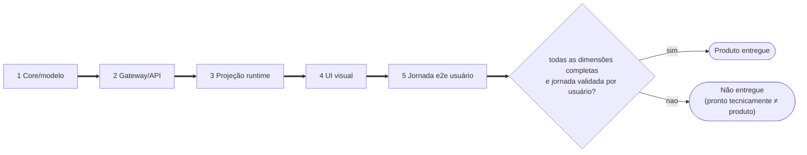
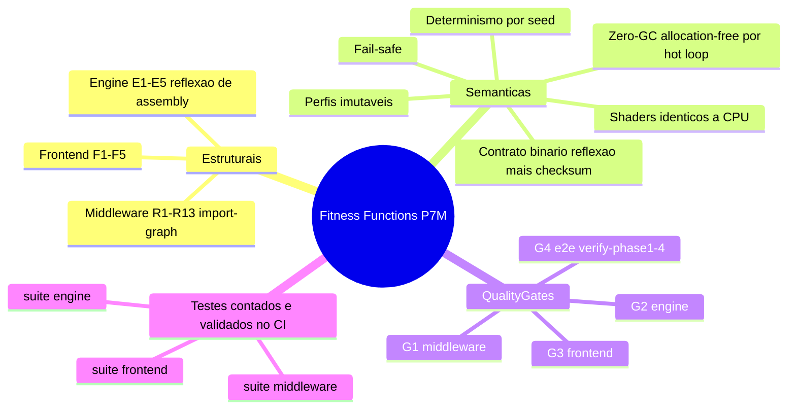

# Requisitos — Funcionais, Não Funcionais e Técnicos

> **Modelo de status (revisado pós-diagnóstico de produto):** "entregue
> tecnicamente" não significa "entregue como produto". Cada funcionalidade é
> avaliada em **cinco dimensões** — uma funcionalidade só recebe o status
> **Produto** quando todas as dimensões necessárias estão completas e a
> jornada foi validada por usuário. O plano para fechar as lacunas é a
> milestone [`ALPHA-0.1.md`](ALPHA-0.1.md).

*Mostra o funil das cinco dimensões sequenciais (Core -> Gateway -> Projeção -> UI -> Jornada): o status Produto só é emitido quando todas passam pelo gate; qualquer dimensão incompleta bloqueia a entrega.*

Legenda: ✅ completo · 🔶 parcial · ❌ ausente · — não se aplica.

## 1. Matriz funcional em 5 dimensões

| Funcionalidade | Core/modelo | Gateway/API | Projeção runtime | UI visual | Jornada e2e usuário | **Produto** |
|---|---|---|---|---|---|---|
| Rigging/FABRIK | ✅ | ✅ | 🔶 (skinning GPU; sem editor) | ❌ | ❌ | **Não entregue** |
| Timeline/curvas | ✅ | — | 🔶 | ❌ | ❌ | **Não entregue** |
| Máquina de estados | ✅ | — | ❌ | ❌ | ❌ | **Não entregue** |
| Níveis IntGrid + auto-tiling | ✅ (`level/patch` incremental) | ✅ | ✅ | ✅ (projeção otimista; salvar/reabrir sem publicação) | 🔶 | **Fluxo canônico entregue** (P0.4) |
| World map | ✅ | ✅ query | ❌ streaming | ❌ | ❌ | **Parcial** |
| Entidades tipadas | ✅ | ✅ | ✅ spawn table (archetypeId → ator vivo; move ao vivo) | 🔶 placement/drag/remoção no canvas (falta inspector) | ❌ | **Em fechamento** (P0.6) |
| Pipeline Aseprite/MGCB | ✅ | ✅ MCP | ✅ compilação | ❌ | ❌ | **Parcial** |
| Câmera cinemática | ✅ | ✅ | ✅ | ❌ | ❌ | **Sem fluxo visual** |
| Iluminação deferred | ✅ | ✅ | ✅ | ❌ | ❌ | **Sem fluxo visual** |
| Save/load + criação de projeto | ✅ (Blueprint v4 com `projectId`, metadata/unidades/paleta; sessão temporária, replay e troca atômica) | ✅ (sessão nas quatro bordas + API tipada de lifecycle no preload) | ✅ reset antes de reidratar; `runtimeState` explícito | ✅ (wizard, recovery, exemplo, Recentes e save do estado visível) | 🔶 (falta aceite do app empacotado) | **Em fechamento** (P0.2 técnico fechado; aceite em P0.9) |
| Supervisão de processos | ✅ (máquina de estados testada) | — | — | 🔶 (wire real + chips de estado + restart; falta caminho empacotado) | ❌ | **Em fechamento** (P0.1↔P0.9) |
| Preview embutido | 🔶 fundação | ❌ | 🔶 fundação | ❌ | ❌ | **Requisito P0.5** |
| Undo/redo | ✅ global, incremental e session-aware | ✅ quatro bordas | ✅ reprojeção/rehydrate | ✅ atalhos globais e histórico legível | 🔶 aceite empacotado | **Entregue tecnicamente** (P0.7) |
| Diagnósticos (problems) | ✅ razões existem | 🔶 | 🔶 | ❌ | ❌ | **P0.8** |
| Empacotamento/instalador | ❌ | — | — | ❌ | ❌ | **P0.9** |
| Operação por agentes (MCP) | ✅ | ✅ | ✅ | — | 🔶 | **Entregue para agentes** |

### Leitura executiva

A coluna Core está quase toda verde; as colunas UI e Jornada estão quase todas
vermelhas. **A prioridade não é adicionar subsistemas: é converter a fundação
em um fluxo vertical utilizável** (ver decisão de congelamento em
[`ALPHA-0.1.md`](ALPHA-0.1.md)).

A definição operacional de "Produto" no Alpha-0.1 é a jornada de aceite
ponta-a-ponta — só a coluna **Jornada e2e usuário** verde a fecha:

```mermaid
graph LR
  s1["1 instalar e abrir"] --> s2["2 novo projeto plataforma 2D"]
  s2 --> s3["3 importar player.aseprite"]
  s3 --> s4["4 criar entidade Player"]
  s4 --> s5["5 pintar chão e paredes"]
  s5 --> s6["6 posicionar Player"]
  s6 --> s7["7 configurar câmera"]
  s7 --> s8["8 adicionar luz"]
  s8 --> s9["9 executar preview"]
  s9 --> s10["10 modificar com jogo pausado"]
  s10 --> s11["11 salvar"]
  s11 --> s12["12 fechar"]
  s12 --> s13(["13 reabrir sem perdas"])
```

*Mostra os 13 passos sequenciais da jornada de aceite Alpha-0.1, do instalar ao reabrir sem perdas — o teste vivo que preenche a quinta dimensão de cada funcionalidade.*

## 2. Requisitos não funcionais (RNF)

| ID | Requisito | Alvo | Status | Verificação |
|---|---|---|---|---|
| RNF-01 | **Zero-GC nos hot loops** da engine | 0 bytes alocados em Update/Draw-path | ✅ | testes `*_is_allocation_free` (8 métodos em 7 arquivos: esqueletos, leitor MMF, skinning, câmera×2, atores, luzes, tilemap) |
| RNF-02 | **Determinismo** | mesma entrada+seed ⇒ mesmo resultado, entre runtimes | ✅ | checksums FNV-1a cruzados; trajetórias idênticas |
| RNF-03 | **Robustez de protocolo** | frame inválido/oversized nunca derruba o peer; erros tipados | ✅ | testes de framing/peer (parse error, teardown, timeout) |
| RNF-04 | **Offline-first** | sessão ativa sobrevive sem engine; reconexão limpa e reidrata somente o projeto ativo | ✅ | testes de troca desconectada + `runtimeState: deferred` e posterior `synchronized` |
| RNF-05 | **Compatibilidade multiplataforma de IPC** | Named Pipes (Win) / UDS (POSIX) com a mesma semântica | ✅ | abstração testada; caveat Windows do MMF documentado no contrato |
| RNF-06 | **Evolutibilidade de contratos** | versão MAJOR negociada; schemas fonte-de-verdade; perfis imutáveis | ✅ | handshake test + R9 + registry test |
| RNF-07 | **Explicabilidade** | nenhum recurso desabilitado sem razão legível | ✅ | governor/gate tests (fail-safe com reason) |
| RNF-08 | **Segurança da borda** | execFile sem shell; renderer sem Node; transports locais autenticados; UDS privados/TCP loopback | ✅ | F2/F3 + testes de auth/endpoints + gateways reais |
| RNF-09 | **Auditabilidade** | artefatos com revisão, hash estável e proveniência obrigatória | ✅ | canonical-core.test.ts |
| RNF-10 | **Limites explícitos** | capacidades fixas com erro claro (nunca crescimento silencioso) | ✅ | testes de capacidade cheia (skeleton/light/tilemap) |
| RNF-11 | Latência do plano de controle | decisão baseada em p50/p95/p99 reproduzíveis | ✅ | harness e baseline oficial versionados; critério de default na ADR-019 |
| RNF-12 | Escala de mapa | > 64k células por streaming/chunks | ⬜ | Fase 5 (shared memory para tiles) |
| RNF-13 | **Integridade da sessão de projeto** | create/open/close aceitam identidade + `expectedCommandSequence` para compare-and-swap; erro preserva sessão, dirty state, journal e runtime anteriores | ✅ | replay falhando no 5º comando, rollback, revisão concorrente em Close/Replace, dois clientes e paridade das bordas |
| RNF-14 | **Durabilidade do arquivo de projeto** | Save nunca trunca a versão válida; Close depende de Save confirmado; recovery nunca é descartado por falha | ✅ | `ProjectFileService` com adapters de falha + gate `npm run test:project-lifecycle-product` (ADR-021) |

A coluna **Verificação** acima é sustentada por fitness functions — divididas em
estruturais (grafos de import/reflexão de assembly) e semânticas (Zero-GC,
determinismo, contrato binário, imutabilidade, fail-safe) — e pelos quality gates:

*Mostra a taxonomia das fitness functions (estruturais e semânticas) que verificam os RNF, os quality gates G1-G4 e a suíte completa (contagem no CI).*

## 3. Requisitos técnicos (RT)

| ID | Requisito | Status |
|---|---|---|
| RT-01 | Node.js ≥ 22, TypeScript strict (`exactOptionalPropertyTypes`) | ✅ |
| RT-02 | .NET 8, `LayoutKind.Sequential` para todo dado de fio binário | ✅ |
| RT-03 | MonoGame 3.8.2 (DesktopGL); shaders HLSL compilados via MGCB fora do CI headless (referências de CPU cobrem as equações) | ✅ (caveat documentado) |
| RT-04 | Plano de controle da engine: JSON-RPC 2.0 com framing `uint32 LE` (16 MiB máx); app ↔ middleware: gRPC prioritário medido + GraphQL fallback; cursor de eventos `(middlewareInstanceId, projectSessionId, seq)` ([`COMPATIBILITY.md`](COMPATIBILITY.md), ADR-016/017/019/020) | ✅ |
| RT-05 | Fronteiras de camada impostas por testes arquiteturais (23 regras, incluindo R13 para sessão única nas bordas) | ✅ |
| RT-06 | CI: 4 gates (middleware, engine, frontend, e2e) | ✅ |
| RT-07 | Electron com contextIsolation; binário dispensável no CI (`ELECTRON_SKIP_BINARY_DOWNLOAD`) | ✅ |
| RT-08 | Persistência desktop por controller testável + filesystem/dialogs injetáveis; publicação por temporário, flush e rename (ADR-021) | ✅ |

## 4. Riscos técnicos ativos

| Risco | Mitigação atual | Fechamento |
|---|---|---|
| Coerência MMF no Windows (WriteFile × view mapeada) | documentado no contrato; e2e roda em Linux | binding nativo de mmap no Electron (OPP-05) |
| Shaders sem compilação no CI | referências de CPU testadas + contrato espelhado | job de CI com Wine/mgcb (OPP-09) |
| Baseline de performance depende do ambiente | harness real versionado + metadados completos | repetir antes de mudar o default ou o PreviewHost (ADR-019) |
