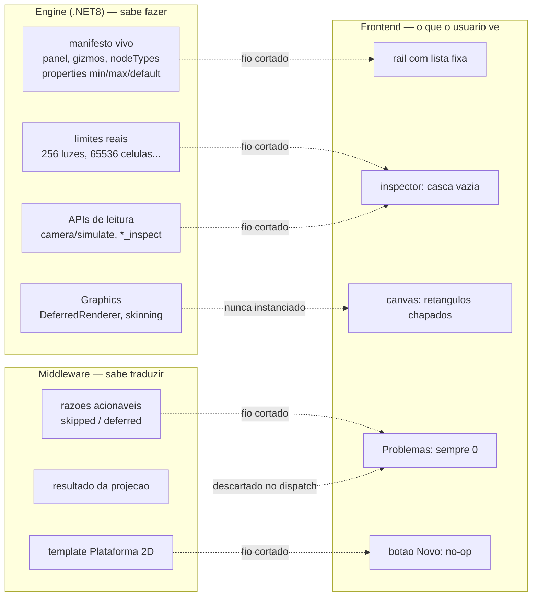
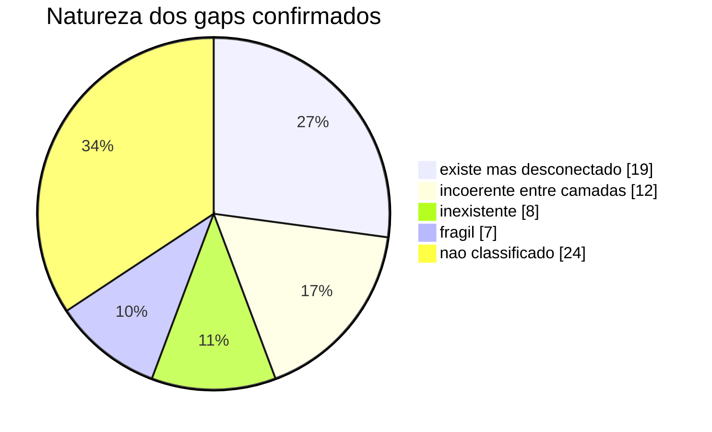
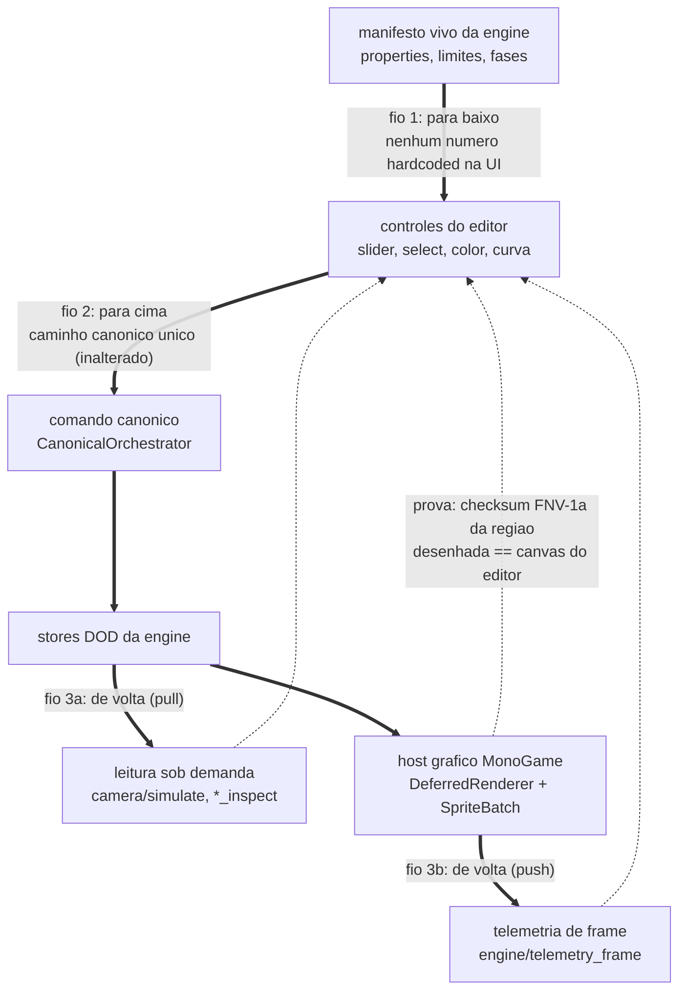
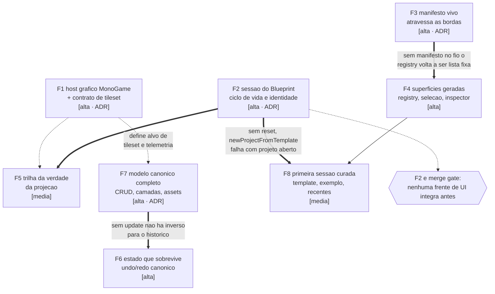
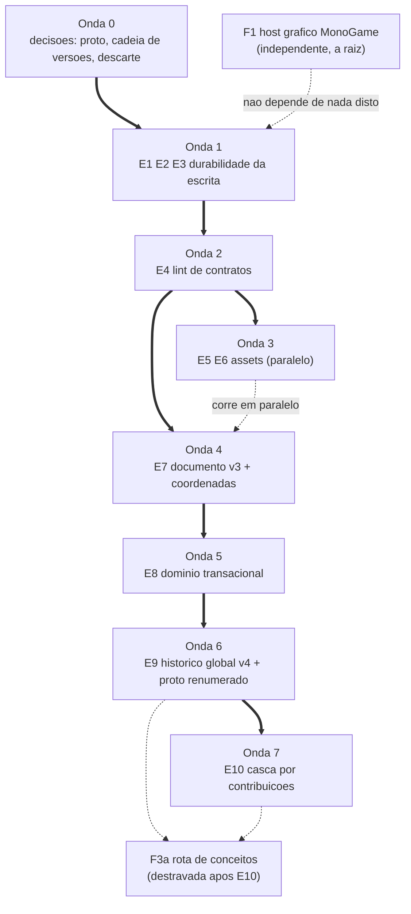

| MGT-9 | 🟡 parcial || MGT-4 | 🟢 resolvido || INT-12 | 🟡 parcial || INT-6 | 🟢 resolvido || INT-5 | 🟢 resolvido || SEM-8 | 🟢 resolvido || SEM-7 | 🟡 parcial || SEM-3 | 🟢 resolvido || CUR-12 | 🟡 parcial || CUR-11 | 🟡 parcial || CUR-4 | 🟢 resolvido || CUR-1 | 🟢 resolvido || EXP-12 | 🟢 resolvido || EXP-10 | 🟢 resolvido || EXP-6 | 🟢 resolvido || EXP-5 | 🟢 resolvido || EXP-3 | 🟡 parcial |# Plano de viabilidade e experiência

> **O que é este documento.** Um diagnóstico verificado do que falta para o P7M
> ser um editor utilizável — nas dimensões experiência, curadoria, padrões,
> semântica e integridade contextual — e o plano para fechar essas lacunas,
> ordenado do problema **mais complexo** para o menos. A relação entre a
> interface e a MonoGame é tratada como prioridade e tem tese própria (§3).
>
> **Método.** Seis análises independentes leram o código real (não a
> documentação), cada uma seguida de um revisor adversarial que reabriu os
> arquivos citados para tentar **refutar** cada achado — um gap alegado que já
> estivesse implementado em outro arquivo era descartado. Só achados
> sobreviventes entraram no plano; os refutados estão registrados no anexo.
> Cada linha do catálogo (§6) carrega `arquivo:linha`. Nada aqui é hipótese de
> arquitetura: é leitura de código.
>
> **Reverificação.** A análise correu contra um commit anterior a uma leva de
> trabalho que introduziu a **sessão de projeto transacional**. Todos os achados
> foram então reabertos contra o código atual e reclassificados em **aberto**,
> **parcial** ou **resolvido**, com evidência de hoje — o resultado está no
> catálogo (§6) e o impacto no plano, em §4.1. Nada é listado como pendente sem
> ter sido reconferido.

## 1. Diagnóstico

O P7M **não sofre de falta de capacidade — sofre de fios cortados entre camadas
que já sabem fazer o trabalho.** O modelo canônico valida, versiona, serializa e
projeta; o `ExperienceGovernor` decide com fail-safe; a engine publica um
manifesto vivo com painéis, gizmos, tipos de nó e propriedades com
`min`/`max`/`@default`; o `MonoGameAdapter` devolve razões acionáveis para tudo
que não projeta; `AutoTiler`, `AsepriteImporter`, FABRIK, curvas Bézier e a
máquina de estados estão escritos e testados.

E quase nada disso chega ao usuário. Das lacunas confirmadas, a categoria mais
frequente não é "não existe" — é **"existe mas está desconectado"**.

O problema central tem duas faces.

**Face de viabilidade — o produto não tem verdade.** O ciclo de vida da sessão
**foi resolvido** desde a análise inicial: o `ProjectSessionManager` dá a cada
projeto um `BlueprintStore`/`CommandHistory`/`CanonicalOrchestrator` próprios,
serializa mutação e reidratação na mesma fila e troca de sessão atomicamente com
compare-and-swap — abrir A e depois B já não contamina o AST. O que resta é a
**verdade**: o store vive só em memória, então reiniciar o middleware ainda
apaga o projeto; nenhuma falha — de salvar, de abrir, de projetar — alcança a
interface, porque a única chamada de IPC do renderer não tem `.catch`; e o
painel "Problemas" é estruturalmente sempre zero, porque o resultado da projeção
que o `dispatch` devolve é descartado em todos os pontos de chamada. O editor
afirma "Tudo aplicado no runtime" mesmo quando a engine recusou tudo — e agora
que o middleware já publica `runtimeState` nos dois contratos, essa mentira é
puramente de fiação.

**Face de experiência — o editor promete um workbench e entrega um editor de
tiles.** O rail lista painéis a partir de uma tabela fixa no frontend que
intersecta em dois os que a engine publica: `rig-editor`, `mesh-inspector`,
`camera-rig`, `state-graph` e `asset-taxonomy` não têm porta de entrada, e
`shader-editor`, `asset-compiler`, `embedded-preview` e `debug-overlay` são
inventados pelo frontend e levam a tela morta. O Inspector é uma casca no HTML:
a busca por `inspector` em todo o TypeScript do frontend retorna **zero**
ocorrências — ninguém escreve nele. Pintar um nível não suja o projeto, então
trocar de aba remonta a vista e destrói grid, zoom, seleção e pilha de desfazer
sem um único aviso.

E, na raiz de tudo, o achado mais grave:

> **O processo rotulado "Runtime MonoGame" nunca carrega MonoGame.**
> `P7m.Engine.Runtime.csproj` referencia apenas `Core` e `Ipc` — **não**
> referencia `P7m.Engine.Graphics`. Não existe nenhuma subclasse de `Game` nem
> `GraphicsDeviceManager` em `engine/src`. O `DeferredRenderer`, o skinning e os
> shaders estão compilados, testados contra referências de CPU… e nunca
> instanciados. **O produto não desenha um único pixel de MonoGame.**

*Mostra o padrão único do diagnóstico: cada capacidade pronta na engine ou no middleware termina em uma aresta pontilhada — um fio cortado — antes de virar superfície para o usuário.*

Uma consequência desse desenho merece destaque, porque inverte a intuição:
`editorConcepts()` — a projeção do manifesto vivo — hoje só tem consumidor na
fachada **MCP** e em dois drivers de teste. No app real o middleware sobe com
`--no-mcp`. Ou seja: **um agente de IA enxerga as capacidades da engine melhor
do que o editor humano**, e no aplicativo empacotado ninguém as enxerga.

## 2. As cinco dimensões, em números

| Dimensão | Confirmados | Aberto / parcial / resolvido | Leitura |
|---|---|---|---|
| Experiência de uso | 12 | 11 / 0 / 1 | jornada quebra no primeiro gesto: pintar não persiste, selecionar não abre nada |
| Curadoria | 12 | 11 / 1 / 0 | o único template curado é inalcançável pela UI; zero conteúdo de exemplo no repo |
| Mapeamento de padrões | 10 | 9 / 0 / 1 | CRUD assimétrico entre domínios; sem camadas; sem conceito de tileset |
| Gaps semânticos | 12 | 12 / 0 / 0 | manifesto da engine e vocabulário do frontend divergem e não se cruzam |
| Integridade contextual | 12 | 7 / 2 / 3 | sessão ganhou ciclo de vida e identidade; falta durabilidade e trilha da projeção |
| Relação interface ↔ MonoGame | 12 | 11 / 1 / 0 | não há host gráfico; o fio de volta (runtime → editor) não existe |

**O padrão da reverificação era nítido: o middleware e os contratos avançaram
muito; o frontend não avançou.** `levelEditorView.ts`, `levelPresets.ts`,
`experienceGate.ts` e `workbenchModel.ts` tinham zero linha de diff no período
— por isso a experiência do usuário estava exatamente onde estava, apesar do
progresso real na camada de baixo.

> **Superado (F5, F8 e Onda 1).** O frontend saiu da inércia: `welcomeView.ts`
> nasceu, `workbenchModel.ts` ganhou o segundo eixo de gating (projeto aberto,
> com precedência da razão de governança), `levelEditorView.ts` passou a
> hidratar de QUALQUER projeto pela projeção (`pickLevel`/`pickEntityDef`) e
> `renderer.ts` ganhou catálogo de erros e status de projeção no log. Os
> números da tabela acima são do diagnóstico original e não foram
> recontados — a fila viva está em
> [`DEVELOPMENT-PLAN.md`](DEVELOPMENT-PLAN.md) §7.

Distribuição por natureza do gap — a forma do problema:

*Mostra que a maior fatia isolada é de capacidade pronta e desconectada — o plano é majoritariamente de ligação, não de construção.*

## 3. Tese: a melhor relação possível entre a interface e a MonoGame

**O editor deve ser um espelho dos stores da engine, não uma reimplementação
deles — e o fio que falta é o de volta.**

Hoje a relação é unidirecional e cega: o editor manda comandos e nunca vê nada.
A engine, porém, já publica tudo que um bom editor precisaria:

- `editor.properties` com tipo, faixa e default por subsistema — câmera
  (`frequency` [0.1, 10], `damping` [0, 2], `response` [-2, 2],
  `anticipationSeconds` [0, 1], `shakeMaxOffset` [0, 128], `shakeFrequencyHz`
  [1, 60]), luz (`intensity` [0, 16], `radius`, cones, `lutStrength`), nível
  (`tileSize` [1, 256], `seed`);
- catorze gizmos e dezessete tipos de nó, com painel declarado por subsistema;
- limites reais (256 luzes, 8 tilemaps, 65536 células por tilemap, 256 atores,
  64 esqueletos);
- **APIs de leitura feitas sob medida para UI**: `camera/simulate` devolve
  amostras de trajetória mais `maxShakeMagnitude` — é literalmente um endpoint
  para desenhar a curva da câmera no canvas — e `entity/inspect`,
  `lighting/inspect`, `tilemap/inspect`, `mesh/inspect` devolvem estado vivo.

Nada disso tem rota até o editor. A tese se concretiza em **três fios e uma
prova**:

*Mostra a tese em três fios: o manifesto desce e gera os controles, o comando sobe pelo caminho canônico inalterado, e o runtime volta por leitura sob demanda e por telemetria de frame — com a paridade visual provada por checksum cruzado.*

**Fio 1 — para baixo (manifesto → controles).** Nenhum slider do editor deve ter
número escrito no código. Toda faixa vem de `editorConcepts()` exposto como
projeção da `EditorSurface` e espelhado nas três bordas; o inspector é um só
componente que traduz um hint de propriedade em controle: `float`/`int` viram
slider com min/max, `enum` vira select, `color` vira picker, `curve` vira o
editor Bézier que **já existe puro** em `frontend/src/core/bezier.ts`.
Consequência imediata e barata: câmera e iluminação ganham superfície **sem
contrato novo nenhum**, porque `camera/configure`, `light/add` e `light/remove`
já são comandos canônicos completos até o fio — falta só a UI.

**Fio 2 — para cima (comando canônico único).** Continua exatamente como está:
toda mutação pelo `CanonicalOrchestrator`, com o `MonoGameAdapter` traduzindo
`level/*` → `tilemap/*` e `entity/place` → `entity/spawn` (tradução deliberada e
documentada, não defeito). O que muda é o **retorno**: o resultado da projeção
viaja no envelope do evento e vira estado de "não aplicado" por objeto, para o
editor nunca mais afirmar que aplicou o que a engine recusou.

**Fio 3 — de volta (o que falta de verdade).** Duas rotas. A *pull* já existe e
só precisa de borda (`camera/simulate` para o preview de trajetória,
`entity/inspect` para a posição viva do ator, `lighting/inspect` para os slots
ocupados). A *push* não existe porque **não existe frame** — uma notificação de
telemetria só faz sentido depois do host gráfico. Com as duas, o
`debug.overlay` que o perfil de runtime já promete deixa de ser impossível de
implementar.

**A prova é uma fitness function de paridade visual.** O repositório já resolve o
problema análogo do layout binário comparando offsets por reflexão e checksum
FNV-1a cruzado entre C# e Node. A mesma técnica fecha a relação interface ↔
MonoGame: uma única tabela `tileId → região de atlas`, consumida pelo
`drawImage` do canvas do editor **e** pelo `SpriteBatch` do host, com o e2e
comparando o checksum de uma região do framebuffer com o da mesma região
desenhada pelo editor. No dia em que esse teste passa, "pinte significado,
derive arte" deixa de ser slogan: o que o usuário vê no editor é, **por
construção verificada**, o que a MonoGame desenha — e o preview embutido pode
virar `enable` no perfil sem mentir. Até lá, a atitude honesta é um terceiro
estado no gate: painel **previsto**, desabilitado, exibindo a fase que o próprio
manifesto já publica.

## 4. As frentes, do mais complexo ao menos

Oito frentes agrupam os achados por **causa-raiz** — não uma tarefa por sintoma.
Quatro exigem ADR por alterarem ou estenderem decisão arquitetural, conforme a
regra da casa.

### 4.1. Ajuste após a reverificação

A leva de trabalho que introduziu a sessão transacional resolveu, por completo,
uma coisa: **a sessão de projeto como unidade transacional com identidade**.
Isso fechou cinco achados e deixou quatro com a metade do middleware pronta.
O efeito por frente:

> **Leia esta tabela como registro histórico.** Ela é o retrato do momento da
> reverificação e NÃO foi reescrita a cada entrega — as frentes F5, F8, F3a e
> a Onda 1 (E1–E3) mudaram o código depois dela. O correções estão no
> blockquote logo abaixo da tabela e, com mais detalhe, nos blockquotes de
> cada frente na §4. **Ordem de confiança: o código > os blockquotes > esta
> tabela.**

| Frente | Situação | Ajuste de escopo |
|---|---|---|
| F1 | **intacta** — nenhum achado mudou | Nenhum dos 5 achados (MGT-1, MGT-5, MGT-12, CUR-2, PAD-7) mudou. Confirmado agora: grep por ': Game' e 'GraphicsDeviceManager' em engine/src (fora de obj/) retorna vazio; engine/src/P7m.Engine.Runtime/P7m.Engine.Runtime.csproj referencia apenas Core e Ipc — o Description do próprio csproj ainda diz 'O host gráfico MonoGame acopla aqui na Fase 3'; grep por tileset\|atlas em middleware/src, frontend/src e contracts/ retorna ZERO. Único ajuste real de escopo: o ciclo de vida da sessão de runtime já existe e o host gráfico nasce dentro dele — contracts/schemas/engine.reset_session.schema.json + a época de sessão validada em MonoGameAdapter.rehydrateFrom definem quando a janela deve zerar e reidratar, o que antes teria de ser inventado junto. A telemetria de volta continua inexistente: EnginePipeServer registra só engine/handshake, engine/ping e engine/log; reset_session é middleware→engine e não abre canal de retorno. |
| F2 | **majoritariamente resolvida** | 5 achados RESOLVIDOS (EXP-4, PAD-1, INT-2, INT-8, INT-9), 4 PARCIAIS com o lado middleware pronto (CUR-4, INT-1, INT-7, MGT-10), 1 ABERTO (INT-12). O núcleo da frente — abrir/criar/fechar projeto sem contaminação de AST, com identidade e sem corrida — está entregue e coberto por middleware/test/project-session-manager.test.ts (450 linhas novas). Reduzir a frente ao residual, que é todo de borda e de durabilidade: (a) persistência — o store vive só em memória (ProjectSessionManager.prepareSession:290), então reinício do middleware ainda apaga o projeto e não há reabertura automática; (b) o arquivo .autosave gravado em main.ts:342 continua sem nenhum leitor em todo frontend/src, e o laço de reescrita persiste porque o autosave não atualiza lastSaveAtMs; (c) main.ts:384 e :410 (ramos new/open) não passam por requestClose(), então trocar de projeto SUJO descarta trabalho sem o diálogo — o requestClose só aparece em :436, :454 e :596; (d) a reconciliação de main.ts:596 fecha o projeto em silêncio. Nada aqui é arquitetura nova: é fio de UI e um store durável. |
| F3 | **intacta** — nenhum achado mudou | Todos os achados (PAD-2, SEM-2, MGT-2, CUR-7, SEM-4, SEM-7, MGT-9) seguem ABERTOS, agora com evidência atual: CapabilityRegistry.ts:116 editorConcepts() tem exatamente dois consumidores fora de teste (McpFacade.ts:201, phase2-driver.ts:88/phase3-driver.ts:99); contracts/graphql/editor.schema.graphql:177-193 (type Query = health, projection, snapshot, experience, templates, projectStatus, eventBatch, eventsSince) e as 10 rpc de contracts/grpc/p7m_editor.proto:21-38 não têm nenhuma rota de conceitos; EditorSurface expõe 12 métodos públicos (dispatchByKind, query, snapshot, projectStatus, projectCreate, projectOpenDocument, projectClose, loadDocument, listTemplates, newProjectFromTemplate, resolveExperience) e nenhum de conceitos. O ajuste é de CUSTO, para cima: as bordas foram reescritas em peso (ProjectOperationResult, EventBatch, StreamEventsV2, snapshot) sem carregar o manifesto, então há mais superfície para manter em paridade quando editorConcepts finalmente atravessar. Em compensação, o padrão a seguir já existe pronto: EditorSurface.ts:33-44 (QUERYABLE_PROJECTIONS como lista fechada, validada com InvalidParams e documentada no SDL:179) é exatamente a forma que a superfície de conceitos deve tomar. Manter F3 como pré-requisito duro de F4. |
| F4 | **intacta** — nenhum achado mudou | Zero movimento. experienceGate.ts e workbenchModel.ts têm 0 linhas de diff nos 7 commits: PANEL_REQUIREMENTS continua com os mesmos 6 painéis hardcoded e o rail continua derivado de Object.keys(). renderer.ts:81-108 ainda monta vista real só para 'level-editor' e joga os outros 5 no placeholder. index.html continua com 
 sem um único escritor em TS, e não existe modelo de seleção em frontend/src/core/. A engine publica 7 painéis no EngineDescriptor.cs contra os 6 do frontend, com interseção de 2. Nenhum ajuste de escopo: a frente permanece exatamente como planejada, e continua bloqueada por F3 (sem manifesto atravessando a borda não há o que gerar). Único fato novo relevante: como a governança resolve com version '999.0.0' e casa MONOGAME_3_8_2, com engine conectada os 6 botões ficam habilitados e 5 levam a tela morta — o falso affordance é hoje o sintoma mais visível da frente. |
| F5 | **reduzida** — parte nasceu no meio do caminho | A metade de baixo da frente NASCEU nos 7 commits e a de cima não. Pronto: runtimeState synchronized\|deferred\|failed por sessão (ProjectSessionManager.ts:49,102,143), marcação de 'deferred' quando a projeção falha (:255), fail-closed no dispatch quando a sessão está 'failed' (:240), rehydrateCurrent com engine/reset_session dentro da fila (:271-288), CanonicalOrchestrator.ts:65-69 convertendo falha de runtime em projection deferred explícita em vez de perdê-la, e o estado publicado nos dois contratos (editor.schema.graphql:152 runtimeState, p7m_editor.proto:131 runtime_state) e já validado em EditorClient. O que resta é estritamente o ÚLTIMO FIO até o usuário, e é curto: (1) o journal publica só o evento canônico, sem projection, então renderer.ts:241 chama log.record(event) sem o 2º argumento e problemCount fica estruturalmente 0 — 'Nenhum problema / Tudo aplicado no runtime' é falso com a engine caída; (2) main.ts:233-244 ProjectStatusPayload NÃO inclui runtimeState, logo applyProjectStatus (renderer.ts:49-57) não tem o que mostrar; (3) as views descartam o DispatchOutcome (levelEditorView.ts:274,284,297,304,444) e escrevem 'Nível publicado' ignorando projection.status; (4) renderer.ts:39-41 despacha projectCommand sem .catch e não há superfície de erro além de #status-connection; (5) as mensagens seguem em inglês cru — houve avanço lateral em EditorSurface.ts:373-384 (toApplicationError tipando ProjectNotOpen/ProjectSessionConflict em códigos JSON-RPC), mas nenhuma borda converte código em causa+ação. Reclassificar de 'trilha inteira' para 'consumo da trilha existente'. |
| F6 | **intacta** — nenhum achado mudou | Nenhum achado mudou e um PIOROU. CommandHistory.ts é novo mas explicitamente NÃO fecha o gap — o cabeçalho (linhas 2-6) diz 'Nesta fase ele não implementa undo/redo: é exclusivamente o relógio lógico', e a classe expõe só lastSequence/length/list/append. Undo/redo segue local ao IntGridDocument (levelEditorView.ts:128-133) e todos os dispatches canônicos ficam fora de qualquer histórico. Pintar continua não sujando o documento (lifecycle.commandApplied só dispara em onBlueprintEvent, main.ts:565-572). AGRAVANTE CONFIRMADO: renderer.ts:250 agora chama renderView() dentro do handler de projection-resync, somando-se a :227 e :231 — ou seja, além de trocar de painel e clicar em aba do rodapé, agora um resync remoto também remonta o editor e destrói grid não publicado, pilha de undo, zoom/pan e seleção, sem nenhuma ação do usuário. Ajuste de escopo: acrescentar à frente a remoção desse gatilho e a reconciliação incremental da view; e registrar que o commandSequence de CommandHistory é o pré-requisito já entregue para o undo canônico (a numeração lógica por sessão existe, falta a operação inversa). |
| F7 | **intacta** — nenhum achado mudou | Nenhum dos achados (PAD-8, PAD-9, PAD-10, CUR-6, CUR-8, CUR-9, INT-10, PAD-6, SEM-6, SEM-9, MGT-8) mudou. Verificado agora: commandShape.ts:9-24 continua com exatamente os mesmos 14 kinds — entitydef/define sem update/remove, entity sem edição de campos, nenhum comando de camada, LUT, FSM, IK ou curva; LevelSpec segue com um único intGrid e um único conjunto de rules, e EntityInstance sem levelId/layerId enquanto o EngineDescriptor declara intgrid-layer/auto-layer/entity-layer; o pipeline de assets continua acessível só por MCP e o app sobe o middleware com '--no-mcp' (main.ts:174). Ajuste de escopo, favorável: o Blueprint v2 provou o trilho de migração de documento — BLUEPRINT_DOCUMENT_VERSION=2, migrateBlueprintDocument() e middleware/test/blueprint-migration.test.ts existem e funcionam. Acrescentar camadas e CRUD simétrico agora é um v3 sobre trilho testado, não uma quebra de formato. Continua a frente mais cara depois de F1 porque cada kind novo arrasta o DoD inteiro de GOVERNANCE.md (validação + COMMAND_KINDS + enum GraphQL + projeção + reidratação + serialização) e agora também o proto. |
| F8 | **reduzida** — parte nasceu no meio do caminho | Nenhum achado RESOLVIDO, mas o escopo encolheu muito de um lado e continua intacto do outro. Encolheu: toda a cadeia de template está pronta até o processo main — ProjectTemplates.ts (platformer-2d), sessions.createFromTemplate, EditorSurface.listTemplates:310 e newProjectFromTemplate:318, SDL templates:185 e projectCreate(templateId):199, EditorClient.listProjectTemplates/newProjectFromTemplate. Falta literalmente o último elo, e confirmei que ele não existe: grep -in template em frontend/src/main/preload.ts e frontend/src/renderer/*.ts retorna VAZIO, e main.ts:386 é 'await client.createProject()' sem argumento. Igual para recentes: são calculados, persistidos e trafegam no payload, mas grep -rn recents em frontend/src/renderer/ retorna VAZIO. Intacto e ainda caro: o vocabulário divergente (levelEditorView.ts LEVEL_ID='nivel-1' e entityDefId='jogador' vs ProjectTemplates 'level-1'/'player', grid 48x27 vs 16x9, paleta de 3 significados vs SOLID=1) — arquivo com 0 linhas de diff, então um projeto do template AINDA abre com canvas vazio; e o conteúdo de exemplo continua inexistente (nenhum .p7m.json rastreado, nenhum .aseprite na árvore). Reclassificar como 'ligar o template já pronto + alinhar vocabulário', dropando a parte de backend. |

> **Correções à tabela acima (o que mudou depois dela).**
>
> - **F2, item (b):** o `.autosave` TEM leitor desde a etapa E2 —
>   `detectRecovery`/`readAutosave`/`discardAutosave` no `ProjectFileService`
>   com diálogo de quatro saídas. Seguem válidos os itens **(a)** store só em
>   memória, **(c)** `new`/`open` sem `requestClose()`, **(d)** reconciliação
>   descartando o retorno, e a METADE do laço de reescrita do autosave (falta
>   `lifecycle.autosaved()`).
> - **F3:** a leitura de "custo subiu" na §5.1 foi refutada pelo próprio
>   documento mais adiante (§4, F3): as superfícies novas são escopadas à
>   sessão de projeto e não precisam carregar conceitos. F3a entregou o merge
>   de limites reais em `constraints` com namespace e a correlação
>   `lightId`↔slot; resta a rota de `editorConcepts` pelas bordas do app e o
>   CONSUMO de `constraints` pela UI.
> - **F5:** os cinco itens do "último fio" foram todos ligados — `log.record`
>   recebe a projeção, `ProjectStatusPayload` carrega `runtimeState`, os
>   despachos têm `.catch(showError)` e o `core/errorCatalog.ts` traduz
>   código em causa+ação pt-BR. Resta o residual descrito no blockquote da
>   frente (status `failed`, sumário de reidratação por item, fila única).
> - **F8:** o template está ligado ao botão "Novo" (diálogo de escolha com
>   decisão pura), os recentes aparecem na tela inicial e o editor hidrata de
>   QUALQUER projeto via `pickLevel`/`pickEntityDef`. A inversão de
>   diagnóstico está registrada: era o TEMPLATE que violava a unidade em
>   pixels, não o editor. Resta o diretório `examples/` versionado.

### F1 — Host gráfico MonoGame acoplável + contrato de conteúdo visual (tileset/atlas) + telemetria de frame

> Complexidade **alta** · **exige ADR**

**Problema.** O processo que a status bar chama de "Runtime MonoGame: Pronto" é um servidor JSON-RPC headless que nunca carrega MonoGame, e não existe conceito de tileset/atlas em nenhuma camada — logo nada do que o usuário pinta pode virar pixel, nem no editor (5 cores chapadas em levelPresets.ts:27-33) nem no jogo. Sem isso, "pinte significado, derive arte" termina em `tileId: 100`, o painel "Pré-visualização do jogo" é uma promessa habilitada por uma capability que é só uma string do perfil (monogame.ts:74/83), e o canal engine→editor só transporta ping e log (EnginePipeServer.ts:106/136/144), tornando qualquer overlay de debug impossível.

**Solução.** Acoplar POR FORA, exatamente como a regra E4 já manda ("o host MonoGame acopla por fora, nunca o contrário"): um projeto novo `P7m.Engine.Host` (Exe) que referencia Core+Ipc+Graphics, instancia `Game`+`GraphicsDeviceManager`, constrói o `DeferredRenderer` com os .fx que o Content.mgcb já compila, e desenha os MESMOS stores DOD que os handlers JSON-RPC mutam — eles já são propriedades públicas (`Skeletons`/`Camera`/`Lights`/`Tilemaps`/`Actors`, EngineService.cs:26-38), então o loop e o plano de controle compartilham estado sem nova cópia e sem violar E3/E4 (Runtime segue sem Graphics; a nova regra E6 fixa que só o Host referencia Graphics+Ipc). Em paralelo, fechar o contrato de conteúdo que falta: `tileset/define` como comando canônico (tileId → região de atlas) e `tilesetId` em `LevelSpec`, com a MESMA tabela consumida pelo `drawImage` do canvas e pelo `SpriteBatch` do host — paridade verificada por checksum FNV-1a cruzado, como já se faz com o layout binário. Fecha também o fio de volta: notificação `engine/telemetry_frame` (frame stats, posição viva da câmera pós spring-damper, contagem de luzes) no EnginePipeServer, entrando no EventJournal como evento de runtime.

**Entregáveis**

- engine/src/P7m.Engine.Host/ (novo csproj Exe: Game + GraphicsDeviceManager + Content pipeline, referenciando P7m.Engine.Core, P7m.Engine.Ipc e P7m.Engine.Graphics)
- engine/src/P7m.Engine.Host/GameHost.cs (loop que desenha TilemapStore/ActorStore/LightStore via DeferredRenderer.cs e SpriteBatch)
- engine/tests/P7m.Engine.Ipc.Tests/ArchitectureTests.cs (nova regra E6: só o Host referencia Graphics+Ipc; E4 permanece intacta)
- engine/src/P7m.Engine.Runtime/EngineService.cs (novos handlers tileset/define e lighting/set_lut; notificação engine/telemetry_frame)
- novo schema `tileset.methods` em `contracts/schemas/` e novo schema `engine.telemetry_frame` em `contracts/schemas/`
- middleware/src/domain/BlueprintStore.ts (TilesetSpec + tilesetId em LevelSpec, validação e projeção)
- middleware/src/canonical/commandShape.ts (kind tileset/define) e contracts/graphql/editor.schema.graphql + contracts/grpc/p7m_editor.proto (enum e paridade)
- middleware/src/runtime/MonoGameAdapter.ts (projeção de tileset e encaminhamento da telemetria ao EventJournal)
- frontend/src/core/tilesetAtlas.ts (tabela pura tileId→região, compartilhada) e frontend/src/renderer/levelEditorView.ts (drawImage do atlas no lugar de fillRect)
- frontend/src/main/main.ts (supervisão do processo host com displayName honesto) e frontend/src/main/appConfig.ts

**Critério de aceite.** e2e novo `scripts/verify-visual-parity.sh`: (1) `dotnet test` continua verde com E3/E4 intactas e E6 nova; (2) o host sobe, recebe `tileset/define` + `level/define` + `entity/place` e produz um framebuffer cujo checksum FNV-1a de uma região amostrada casa, dentro de tolerância declarada, com o mesmo trecho renderizado pelo canvas do editor a partir da MESMA tabela de atlas; (3) `engine/telemetry_frame` chega ao EventJournal e é observável por `eventsSince`/`StreamEvents`; (4) teste de contrato quebra se `tileset/define` existir em COMMAND_KINDS sem entrada no SDL/proto/schema.

**Risco.** É a frente de maior superfície nova (processo, contrato de conteúdo e canal de telemetria ao mesmo tempo) e a única que toca empacotamento/GPU — CI sem GPU exige o host rodar headless-offscreen para o teste de paridade. Mitigação: entregar em duas ondas — onda A (host desenhando tilemap+atores em janela própria, paridade por checksum offscreen), onda B (embutir a janela no painel do editor). O ADR deve fixar o limite: o host é composição, nunca domínio, e o preview embutido só vira `enable` no perfil quando a onda B existir.

**Gaps cobertos:** monogame#1 — não existe host MonoGame; o "Runtime" é headless · monogame#5 — feedback visual é 100% retângulo de cor chapada · monogame#12 — canal engine→editor só transporta ping e log · padroes#7 — nenhum conceito de tileset/textura em nenhuma camada · curadoria#2 — não há nada visual para o produto mostrar · monogame#3 (parte) — preview.embedded habilitado sem vínculo com a realidade · monogame#7 (parte) — LUT cromática publicada sem contrato de fio

### F2 — Sessão do Blueprint com ciclo de vida e identidade — fim da perda silenciosa de trabalho

> Complexidade **alta** · **exige ADR**

**Problema.** O Blueprint é um singleton em memória sem começo nem fim: não há `reset()` (BlueprintStore.ts:174-477, só o getter `isEmpty` em :441), nenhuma borda expõe fechamento (EditorGateway.ts:110-169, SDL e proto verificados), e o middleware não tem identidade de instância. As consequências são as piores do repositório: abrir um segundo projeto rejeita em `beginOpen` (projectLifecycle.ts:113-118) e a rejeição morre sem `.catch` (renderer.ts:38-40); "Novo" mantém o AST antigo e o Save mistura dois projetos; e quando o supervisor reinicia o middleware (ProcessSupervisor.ts:161-169), o editor continua "conectado", o Ctrl+S grava um documento VAZIO por cima do arquivo do usuário (main.ts:232-235) e o dedup por seq (EditorClient.ts:340) cega o cliente até o journal novo ultrapassar o seq antigo.

**Solução.** Dar ao Blueprint o mesmo tratamento que o projeto já dá aos comandos: um ciclo de vida explícito no caminho canônico. `BlueprintStore.reset()` + operação `closeProject()` na EditorSurface (não um comando de mutação de domínio — é ciclo de vida da sessão, exposto como mutation/rpc nas três bordas), chamada por "Novo"/"Abrir"/"Fechar" no main.ts antes de qualquer `loadDocument`/`newProjectFromTemplate`, com limpeza correspondente dos mapas de sessão do MonoGameAdapter (engineLightIds/spawnedEntityIds, :19-33) e despawn no runtime. Em cima disso, identidade: `instanceId`+`epoch` no `health`, no handshake e no `EventEnvelope`; o `EditorClient` detecta epoch novo, invalida `lastEventSeq`, BLOQUEIA o save e oferece reidratar o middleware a partir do documento em memória. Fecha-se também a borda de erro: um único `.catch` no `wireProjectToolbar` mais uma superfície de exibição (banner/toast), porque as mensagens acionáveis JÁ existem (main.ts:353-359, projectLifecycle.ts:113-120) e só estão sendo descartadas.

**Entregáveis**

- middleware/src/domain/BlueprintStore.ts (reset() com emissão de evento de ciclo de vida)
- middleware/src/canonical/EditorSurface.ts (closeProject(); newProjectFromTemplate/loadDocument passam a resetar antes de replayDocument)
- middleware/src/ipc/EditorGateway.ts, middleware/src/graphql/GraphQlGateway.ts, middleware/src/grpc/GrpcGateway.ts + contracts/graphql/editor.schema.graphql + contracts/grpc/p7m_editor.proto (closeProject e instanceId/epoch em Health e EventEnvelope)
- middleware/src/transport/EventJournal.ts (epoch no envelope; gap sinalizado usando canResumeFrom, hoje código morto)
- middleware/src/runtime/MonoGameAdapter.ts (limpeza de estado de sessão no reset)
- frontend/src/main/EditorClient.ts (detecção de epoch, invalidação de lastEventSeq, ressincronização por query de projeção ao detectar gap, bloqueio de save)
- frontend/src/main/main.ts (encadear close→open; autosave marcando ponto na lifecycle; detecção de .autosave mais novo que o .p7m.json no boot)
- frontend/src/core/projectLifecycle.ts (autosaved() e saveBlocked() sem sair do estado sujo)
- frontend/src/renderer/renderer.ts (.catch único + banner de erro) e frontend/src/renderer/index.html/style.css (superfície de notificação)

**Critério de aceite.** e2e `scripts/verify-project-session.sh`: (1) abrir projeto A, editar, abrir projeto B na MESMA sessão → canvas e documento passam a ser exclusivamente de B e o save de B não contém nada de A; (2) matar o middleware no meio da sessão → o editor exibe causa+ação, o Save fica bloqueado até a reidratação, e nenhum byte é escrito no .p7m.json do usuário; (3) forçar >512 eventos com o cliente atrasado → o gap é detectado e o cliente ressincroniza por projeção completa (teste unitário de canResumeFrom com chamador real); (4) teste de regressão: nenhum caminho do main.ts chama writeDocument com epoch divergente.

**Risco.** Introduz um conceito de sessão que hoje não existe no modelo canônico — o ADR precisa deixar explícito que `closeProject` é ciclo de vida da EditorSurface e NÃO um BlueprintCommand, para não abrir precedente de mutação fora do orquestrador (P-1/R12). Risco secundário: bloquear o save por epoch pode travar o usuário se a detecção der falso positivo; mitigar com "salvar como cópia" sempre permitido.

**Gaps cobertos:** integridade#1 — reinício do middleware apaga o projeto e o Save sobrescreve com vazio · integridade#2 e padroes#1 e curadoria#4 — não existe reset do Blueprint em nenhum transporte · experiencia#4 — "Novo"/"Abrir" viram no-op silencioso · experiencia#5 — falha de salvar é invisível para o usuário · integridade#9 — EventJournal com janela finita e canResumeFrom sem chamador · integridade#12 — autosave grava arquivo que ninguém restaura e entra em laço de 5s

### F3 — O manifesto vivo atravessa as bordas: editorConcepts, limites reais e contratos dos 14 comandos

> Complexidade **alta** · **exige ADR**
>
> **Revisão contra o código atual: a frente se fatia em duas, e a ordem muda.**
> Todos os achados seguem abertos — `editorConcepts()` continua com três
> consumidores fora de teste (a fachada MCP e dois drivers de fase), o app sobe
> o middleware com `--no-mcp`, `constraints` ainda devolve apenas
> `maxTextureSize` e `maxVertexShaderRegisters`, `MAX_LEVEL_CELLS` continua
> hardcoded, as projeções consultáveis continuam `String` livre nas duas bordas
> e os comandos canônicos continuam sem schema em `contracts/` (as entradas de
> lá descrevem métodos middleware → engine, nenhuma descreve comando canônico).
>
> **F3a — desbloqueia a F4, custo baixo:** limites reais mesclados em
> `constraints` com namespace (um arquivo, sem tocar contrato — `constraints`
> já é `JSON!` no SDL e não há RPC de experiência no proto); `MAX_LEVEL_CELLS`
> lido do registry com o valor atual como piso sem engine; **uma** rota de
> conceitos por borda, sem inflar `snapshot`/`eventBatch`/`StreamEventsV2`; e a
> correlação pública entre o `lightId` canônico e o slot da engine, que hoje é
> gravada num mapa privado e descartada — o canal (`Projection.detail`) já
> existe.
>
> **F3b — dívida de contrato, não bloqueia ninguém:** os schemas dos comandos
> canônicos, a promoção das projeções a enum e a fitness function de paridade.
>
> **Parcialmente entregue.** Os limites reais do manifesto passaram a ser
> mesclados em `constraints` com namespace por subsistema
> (`lighting.maxLights`, `level.maxCellsPerTilemap`, `actors.maxActors`), com o
> perfil mantendo precedência; e a correlação entre o `lightId` canônico e o
> slot da engine deixou de morrer num mapa privado — viaja em
> `Projection.detail`, o canal que já existia.
>
> **Um item da F3a não pode ser feito como foi escrito.** "`MAX_LEVEL_CELLS`
> lê do registry" exigiria o `BlueprintStore` importar o `CapabilityRegistry`,
> o que **viola a regra R3** (o coração do domínio só importa validadores puros
> e o protocolo de erros) — e a norma da casa é mover a dependência, não
> relaxar a regra. O limite estático continua sendo a guarda do domínio, que
> precisa valer com ou sem engine; o limite **real** agora chega à UI por
> `constraints`, que é onde ele serve para barrar antes de virar erro genérico.
> Fica pendente apenas o consumo desse limite pelo editor.
>
> **Segue aberto da F3a:** a rota de conceitos por borda — hoje bloqueada por
> colisão com o PR de workbench adaptativo, que reescreve as mesmas bordas.
>
> **Correção de custo, em duas mãos.** A reverificação anterior afirmou que o
> custo "subiu porque as bordas foram reescritas sem levar o manifesto junto" —
> o raciocínio não se sustenta, porque as superfícies novas são todas escopadas
> à sessão de projeto e não precisam carregar conceitos. Mas a revisão que
> afirmou o contrário ("caiu, o trilho já foi medido") **também caiu na
> refutação**: o precedente citado mede o custo de um campo novo em mensagem
> existente, não o de uma **rota nova** — e o único precedente de rota nova no
> repositório foi caro. Conclusão honesta: o custo de F3a é baixo por ser quase
> todo fora de contrato; o da rota de conceitos permanece o de sempre.

**Problema.** A arquitetura declara que a UI materializa painéis, gizmos e propriedades a partir de `editorConcepts()` (CapabilityRegistry.ts:6-9 e docs/ARCHITECTURE.md:92), mas essa função tem consumidor apenas no MCP (McpFacade.ts:178-187) e em dois drivers de teste — e no app real o middleware sobe com `--no-mcp` (main.ts:120), então o manifesto não chega a NINGUÉM. Nenhuma borda do app o expõe (verificado no SDL, no proto e no EditorGateway), os limites verdadeiros da engine (maxLights=256, maxTilemaps=8, maxCellsPerTilemap=65536, maxActors=256, maxSkeletons=64) ficam fora de `constraints`, que só carrega maxTextureSize/maxVertexShaderRegisters do perfil, e os 14 comandos canônicos atravessam todas as bordas como JSON opaco sem schema em contracts/ — ao contrário do que o próprio proto afirma (p7m_editor.proto:6-10).

**Solução.** Uma extensão de contrato, não uma mudança de arquitetura: `editorConcepts` vira uma projeção consultável da EditorSurface (a superfície transport-neutra que as três bordas já espelham), `ResolvedExperience.constraints` passa a mesclar `manifest.subsystems[*].limits` com namespace (`lighting.maxLights`), `QUERYABLE_PROJECTIONS` é promovida a enum no SDL/proto como já se fez com `CommandKind`, e os 14 comandos ganham schemas JSON em `contracts/` — que é onde o proto já diz que eles estão. A segunda fonte de verdade some junto: `MAX_LEVEL_CELLS` hardcoded (BlueprintStore.ts:119) passa a ler do CapabilityRegistry. Nada disso exige tocar o núcleo: é a mesma fachada fina que R12 já impõe.

**Entregáveis**

- middleware/src/canonical/EditorSurface.ts (projeção editorConcepts + capabilities; EditorSurfaceOptions recebe CapabilityRegistry)
- middleware/src/runtime/ExperienceGovernor.ts (merge de manifest limits em constraints com namespace)
- contracts/graphql/editor.schema.graphql e contracts/grpc/p7m_editor.proto (tipo EditorConcept, enum Projection, campo de limites)
- novo schema `canonical.commands` em `contracts/schemas/` (os 14 kinds, fonte legível por máquina da validação do BlueprintStore)
- middleware/src/ipc/EditorGateway.ts e frontend/src/main/preload.ts + frontend/src/main/EditorClient.ts (rota até o renderer)
- middleware/src/domain/BlueprintStore.ts (MAX_LEVEL_CELLS lido do registry) e middleware/src/runtime/MonoGameAdapter.ts (correlação pública lightId canônico↔slot)
- middleware/src/mcp/McpFacade.ts (renomear skeleton_initialize→skeleton_define e mesh_bind_shared_memory→mesh_bind)
- middleware/test/architecture.test.ts (paridade: todo kind em COMMAND_KINDS tem schema em contracts/; toda projeção em QUERYABLE_PROJECTIONS existe no enum do SDL/proto)

**Critério de aceite.** Fitness function nova no CI: (a) para cada item de COMMAND_KINDS existe schema JSON correspondente em contracts/ e entrada no enum GraphQL e no proto — o teste nomeia o kind infrator; (b) toda projeção de QUERYABLE_PROJECTIONS aparece no enum das duas bordas; (c) e2e em `scripts/verify-transports.sh`: consultar editorConcepts pelo gRPC e pelo GraphQL devolve o MESMO shape, com properties min/max/default e limits, tanto no caminho quente quanto no fallback; (d) `resolveExperience` com manifesto vivo expõe `lighting.maxLights=256` em constraints.

**Risco.** Ampliar a superfície do contrato aumenta o custo de paridade (todo campo novo precisa existir em SDL, proto, gateway e dist/). Mitigação: expor `editorConcepts` como projeção — reaproveitando o caminho de `query` já existente — em vez de criar um verbo novo por borda. O ADR registra a decisão de que o manifesto vivo é DADO consultável, não capability estática do perfil.

**Gaps cobertos:** semantica#2, padroes#2, monogame#2 — editorConcepts não atravessa nenhuma borda do app · semantica#7 e monogame#9 — limites reais da engine nunca chegam ao gate · semantica#12 — QUERYABLE_PROJECTIONS fechada no código e String livre no contrato; 14 comandos sem schema · semantica#9 — lightId nomeia string canônica e slot numérico da engine sem correlação pública · semantica#10 — duas tools MCP anunciam o verbo da engine em vez do kind canônico

### F4 — Superfícies geradas pelo manifesto: registry de painéis, modelo de seleção e inspector schema-driven

> Complexidade **alta** · sem ADR (execução dentro das decisões vigentes)
>
> **Revisão contra o código atual: a frente não é monolítica atrás da F3, e
> ganhou uma dependência dura que o plano não via.**
>
> O diagnóstico segue de pé, com as contagens reconferidas: o rail tem seis
> painéis fixos, a engine publica sete painéis distintos entre oito
> subsistemas, e a interseção é **dois**. Com a engine ligada, os seis botões
> ficam habilitados e cinco levam a tela morta. Nada da frente existe —
> nenhum `selection.ts`, `panelRegistry.ts`, `propertySchema.ts` ou
> `inspectorView.ts`, e o inspector continua sem um único escritor em
> TypeScript.
>
> **A dependência nova, e é bloqueante para metade da frente: o inspector só
> consegue LER.** Não existem `entity/update`, `entitydef/update` nem
> `light/update` no modelo canônico — logo, um inspector schema-driven pode
> exibir e não pode salvar. Escrita depende de **F7**, não de F3.
>
> **A segunda correção é de desenho: as `properties` do manifesto NÃO são o
> payload do comando canônico.** O manifesto descreve os botões da *engine*;
> o comando tem outra forma. `lutStrength` não existe em `LightSpec`; a câmera
> publica seis propriedades contra nove campos em `CameraSettings`, e a
> validação cobre um subconjunto. Gerar controle a partir do manifesto e
> despachá-lo direto produziria comando inválido — é preciso uma tradução
> explícita entre os dois vocabulários, que o plano tratava como se fosse
> identidade.
>
> **O que NÃO depende de F3 e pode começar já:** o `panelRegistry` como
> "terceira fonte" (o que este build implementa) — painel sem `mount` deixa de
> ser habilitável, o que mata os cinco placeholders sem esperar o manifesto; as
> razões de governança em pt-BR (as dos perfis já estão, o inglês vem das
> geradas e dos fail-safes); dar consumidor ao `featureLabel`, hoje exportado e
> sem uso; o inspector de **leitura**, hidratado pelas projeções que já
> atravessam o fio (`entities`, `entityDefs`, `camera`, `lights`); e o painel de
> câmera, já que `camera/configure` faz merge parcial e a projeção existe.
>
> **O que depende de F3:** derivar a lista de painéis do manifesto, o estado
> "previsto com fase", e os `min`/`max`/`default` dos controles.
>
> **O que a F5 já pagou desta frente:** o catálogo de erros, a projeção viajando
> no envelope do evento e o `runtimeState` na barra de status — qualquer painel
> novo que despache alimenta o painel Problemas de graça e não precisa inventar
> texto de erro.

**Problema.** O rail é uma lista hardcoded de 6 painéis (experienceGate.ts:31-38 + vocabulary.ts:11-18 + if-chain em renderer.ts:89-106) que intersecta em 2 os 7 que a engine publica: rig-editor, mesh-inspector, camera-rig, state-graph e asset-taxonomy não têm porta de entrada, enquanto shader-editor, asset-compiler, embedded-preview e debug-overlay são inventados pelo frontend e levam a placeholders — 5 de 6 botões habilitados entregam tela morta, e três deles continuam clicáveis mesmo SEM engine. Ao mesmo tempo, o inspector existe só como casca no DOM (index.html:39-42, estilos dt/dd prontos em style.css:160-171, zero ocorrências de "inspector" em qualquer .ts) e não há modelo de seleção: `selectedEntityId` é uma variável local que só desenha um anel branco (levelEditorView.ts:67). Câmera (6 propriedades com min/max/default e `camera/configure` completo até o fio) e luz (`light/add`/`light/remove` completos) são inalcançáveis por falta APENAS de UI.

**Solução.** Inverter a direção do conhecimento com o menor movimento possível: um `panelRegistry` no frontend (panelId → mount(ctx)) alimentado por `editorConcepts()` (F3), substituindo a if-chain e derivando PANEL_REQUIREMENTS do manifesto — e uma TERCEIRA fonte na decisão do gate: "o que ESTE build do editor implementa". Painel publicado pela engine mas não implementado aparece desabilitado com a fase prevista (o manifesto já carrega `phase` e o EditorConcept já a propaga, CapabilityRegistry.ts:122); painel implementado sem subsistema declara-se explicitamente como do host/middleware. Sobre isso, um único renderizador de formulário dirigido por propriedade (`EditorPropertyHint` e `EntityFieldDef` unificados) serve entidade, câmera, luz e nível: float/int→slider com min/max, enum→select, color→picker, curve→o editor Bézier que já existe puro em core/bezier.ts. Um `core/selection.ts` puro liga canvas↔inspector↔log. Os painéis camera-rig e lighting-pipeline nascem desse mesmo componente, despachando `camera/configure`, `light/add` e `light/remove` — comandos que já existem inteiros.

**Entregáveis**

- frontend/src/core/panelRegistry.ts e frontend/src/core/selection.ts (núcleos puros, F1 do repo)
- frontend/src/core/propertySchema.ts (tradução única EditorPropertyHint ↔ EntityFieldDef)
- frontend/src/renderer/inspectorView.ts (formulário schema-driven escrevendo em #inspector-content)
- frontend/src/renderer/cameraRigView.ts e frontend/src/renderer/lightingView.ts (sliders vindos do fio, gizmos sobre o canvas do nível)
- frontend/src/core/experienceGate.ts (PANEL_REQUIREMENTS derivada do manifesto + estado "previsto" com fase) e frontend/src/core/workbenchModel.ts (foco no primeiro painel REAL)
- frontend/src/core/vocabulary.ts (FEATURE_LABELS completo, incluindo entities.spawn; razões traduzidas por par código+parâmetros)
- middleware/src/runtime/ExperienceGovernor.ts e middleware/src/runtime/profiles/monogame.ts (razões como código estável; requiresSubsystem nas regras de assets/preview/debug)
- frontend/src/renderer/renderer.ts (renderView passa a consultar o registry)

**Critério de aceite.** (1) Teste de cobertura estendido em frontend/test/workbench-core.test.ts: todo painel oferecido pelo rail tem entrada no registry E rótulo pt-BR E, se depende de subsistema, decisão do gate — falhar nomeia o painel; hoje o teste só varre PANEL_REQUIREMENTS e ignora features. (2) Teste de vocabulário: nenhuma razão exibida na UI contém aspas escapadas, id interno ou texto em inglês (varredura sobre as razões produzidas por todos os perfis). (3) Jornada e2e: selecionar o Player abre o inspector com os campos da definição preenchidos com os defaults; mover um slider de câmera despacha `camera/configure` e a projeção volta `projected`; adicionar uma luz pelo painel aparece no canvas e no runtime. (4) Com a engine desligada nenhum painel habilitado leva a placeholder.

**Risco.** Depende de F3 (sem editorConcepts no fio, o registry volta a ser lista fixa). Risco de escopo: os painéis rig-editor e state-graph têm núcleos prontos mas exigem canvas próprios — devem entrar como "previsto" no registry (desabilitado com fase) até serem construídos, em vez de segurar a frente inteira.

**Gaps cobertos:** experiencia#2, padroes#5, semantica#4, curadoria#7 — Inspector é casca estática e não há modelo de seleção · experiencia#11, padroes#3, monogame#11, semantica#1 — rail hardcoded que diverge do manifesto e entrega placeholders · padroes#4, monogame#3, curadoria#10 — governança habilita painéis que o editor não implementou · monogame#6 — câmera second-order sem nenhuma superfície (camera/configure pronto) · monogame#7 — iluminação deferred sem painel (light/add e light/remove prontos) · monogame#8 — FABRIK, curvas e máquina de estados sem nenhuma vista que os monte · semantica#11 e curadoria#12 — razões de governança em inglês vazando para tooltips

### F5 — Trilha da verdade da projeção: problemas, divergência e reconciliação

> Complexidade média · sem ADR (execução dentro das decisões vigentes)
>
> **Estado: núcleo ENTREGUE.** A projeção passou a viajar no envelope do evento
> pelas três bordas, o `runtimeState` chegou à barra de status, os cinco sites
> que descartavam o `DispatchOutcome` passaram a qualificar a mensagem, o
> `projectCommand` ganhou tratamento de falha com superfície no DOM, e
> `core/errorCatalog.ts` traduz código de erro em causa e ação em pt-BR. O
> painel Problemas deixou de afirmar "tudo aplicado no runtime".
>
> O mapeamento prévio corrigiu três suposições desta seção, e o texto abaixo as
> preserva como estavam para deixar o erro visível: (a) o elo que faltava não
> era o append do journal, era o `publish()` do `ProjectSessionManager`, que
> entregava um único argumento ao listener; (b) `EventLog.record` **já** aceitava
> a projeção como segundo parâmetro — ninguém passava porque o evento não a
> carregava; (c) o `runtimeState` **já chegava** ao processo main e era
> descartado no `descriptorFromStatus`.
>
> **Resta desta frente:** o status `failed` no `ProjectionResult` (a projeção
> ainda lança em vez de alimentar a trilha), a reidratação isolada por evento
> com sumário no journal, e a fila única na fronteira do adapter.

**Problema.** O middleware produz razões excelentes — "entity has no archetypeId — set one to spawn it", "no engine session connected", "world layout is editorial until level streaming lands" (MonoGameAdapter.ts:54/135/190) — e a UI afirma "Nenhum problema — Tudo aplicado no runtime" com o badge em 0 (renderer.ts:142). O envelope do journal só carrega seq/kind/payload (EventJournal.ts:14-18, alimentado cru em index.ts:174), o renderer chama `log.record(event)` sem o segundo argumento (renderer.ts:238-242), e o `projection` que o dispatch JÁ devolve (EditorClient.ts:32-35) é descartado em quatro sites de levelEditorView.ts. Pior: a projeção pode FALHAR depois de o store já ter aplicado (CanonicalOrchestrator.ts:42 antes de :45), deixando Blueprint e engine contando histórias diferentes sem nenhuma trilha; e uma falha no meio da reidratação aborta o resto (MonoGameAdapter.ts:201-227) virando uma linha de stderr que só aparece num tooltip.

**Solução.** Fazer o resultado da projeção viajar junto do evento e virar estado, não log: campo opcional `projection` no `EventEnvelope` (propagado ao SDL e ao proto), `log.record(event, outcome.projection)` no renderer, e um status `failed` no `ProjectionResult` para a projeção deixar de lançar e passar a alimentar a mesma trilha de skipped/deferred. Reidratação isolada por evento (try/catch acumulando razões) emitindo um sumário no journal ("projeto reaplicado: N de M — 3 falhas") com ação de repetir, e serialização da fronteira do adapter (fila única) para eliminar a corrida entre reidratação e dispatch concorrente. Por cima, um catálogo de erros acionáveis (código → texto pt-BR + ação + navegação ao objeto afetado) aplicado nas bordas do renderer, reaproveitando o painel Problemas que já sabe desenhar problem-card.

**Entregáveis**

- middleware/src/transport/EventJournal.ts (campo projection no envelope) e middleware/src/index.ts:174 (append com a projeção)
- middleware/src/runtime/RuntimeAdapter.ts (status "failed" com razão) e middleware/src/runtime/MonoGameAdapter.ts (project sem lançar; rehydrateFrom isolado por evento + sumário; fila de projeção)
- contracts/graphql/editor.schema.graphql e contracts/grpc/p7m_editor.proto (projection no envelope de evento)
- frontend/src/renderer/renderer.ts e frontend/src/renderer/levelEditorView.ts (capturar outcome.projection nos 4 sites de dispatch)
- frontend/src/core/eventLog.ts (indicador persistente de "não aplicado" por objeto, não só linha de log)
- frontend/src/core/errorCatalog.ts (código → pt-BR + ação + alvo de navegação)

**Critério de aceite.** e2e `scripts/verify-diagnostics.sh`: com a engine derrubada DEPOIS do boot, posicionar uma entidade e publicar um nível → o badge de problemas fica > 0, o painel lista cada item com a razão em pt-BR e um botão de ação, e nenhuma mensagem afirma "tudo aplicado no runtime"; entidade sem archetypeId aparece marcada como não aplicada até ganhar um; matar a engine no meio de uma reidratação de 50 eventos produz um sumário "N de M" no journal e a re-projeção manual converge. Teste unitário: `project()` nunca lança para erro de runtime — devolve failed com razão.

**Risco.** Baixo de arquitetura, médio de contrato: mexer no EventEnvelope obriga paridade nas três bordas e nas cópias em dist/. Cuidado para não transformar a projeção em parte do modelo canônico — ela viaja no envelope de transporte, não no evento do domínio.

**Gaps cobertos:** experiencia#6, integridade#6, semantica#3, monogame#4 — painel Problemas estruturalmente sempre zero · monogame#10 — falha de projeção deixa Blueprint e engine divergentes sem trilha · integridade#7 — falha no meio da reidratação aborta o resto e vira stderr · integridade#8 (RISCO) — reidratação não serializada com dispatches concorrentes · curadoria#12 — mensagens técnicas em inglês vazando para o status do editor

### F6 — Estado do editor que sobrevive, undo/redo canônico e convergência com edições externas

> Complexidade **alta** · sem ADR (execução dentro das decisões vigentes)

**Problema.** Todo o estado do editor mora no closure de `mountLevelEditor`: clicar numa aba do painel inferior chama notify() → renderView() → host.replaceChildren() (workbenchModel.ts:80-83, renderer.ts:223-227/79-99) e recria `new IntGridDocument(48, 27)` (levelEditorView.ts:50), destruindo grid não publicado, pilha de desfazer, zoom/pan, ferramenta e seleção. Como pintar não gera evento de Blueprint, o projeto nunca fica sujo e o "Fechar" não pergunta nada (projectLifecycle.ts:143-157). O undo/redo global roteia para `doc.undo()` (levelEditorView.ts:128-133 e main.ts:411-414), então Ctrl+Z depois de mover uma entidade desfaz uma pincelada anterior não relacionada. E o canvas lê o Blueprint uma única vez na montagem: qualquer mutação de outro cliente (agente, segunda janela) não converge — o usuário publica por cima e apaga o trabalho alheio.

**Solução.** Tirar o estado da vista do closure e colocá-lo num store de vista preservado entre montagens (documento, viewport, seleção, ferramenta, histórico), separando os ciclos de render (aba inferior não re-renderiza a vista). Sujeira local passa a ter entrada própria na ProjectLifecycle (`markLocalDirty()`), incluída na decisão de `requestClose()`. O histórico sobe para o nível do gesto: uma pilha única de comandos canônicos com inversos explícitos (o inverso de `entity/place` é `entity/remove`, o de `level/update` é o snapshot anterior — todos já existentes), com a pintura entrando como um comando agrupado por traço; a vista delega undo/redo a ela. Por fim, a vista assina `onBlueprintEvent` e aplica levelDefined/levelUpdated/entityPlaced/entityMoved/entityRemoved ao estado local, com política explícita de conflito. Ergonomia entra junto porque é o mesmo módulo: espaço+drag e botão direito para pan (o comentário de canvasViewport.ts:74 já promete), scroll do trackpad para pan com modificador para zoom, Escape abortando rect/line e atalhos de letra por ferramenta.

**Entregáveis**

- frontend/src/core/editorSession.ts (store de vista puro: documento, viewport, seleção, ferramenta)
- frontend/src/core/commandHistory.ts (pilha canônica com inversos e agrupamento por gesto)
- frontend/src/core/projectLifecycle.ts (markLocalDirty e sua inclusão em requestClose)
- frontend/src/renderer/renderer.ts (ciclos de render separados: rail, vista e painel inferior)
- frontend/src/renderer/levelEditorView.ts (montagem a partir do store; assinatura de onBlueprintEvent; pan/Escape/atalhos)
- frontend/src/core/canvasViewport.ts (espaço+drag e scroll-para-pan, cumprindo o comentário existente)
- frontend/src/main/main.ts (menu Desfazer roteando para o histórico canônico)

**Critério de aceite.** Jornada e2e: pintar 30 células, alternar Problemas→Saída→Histórico e voltar → grid, zoom, ferramenta, seleção e pilha de desfazer intactos; fechar com pintura não publicada → diálogo de alterações não salvas aparece; Ctrl+Z após mover uma entidade desfaz o MOVE (não a pincelada anterior) e Ctrl+Y refaz; um dispatch externo (driver gRPC de frontend/src/tools/transport-driver.ts) que move uma entidade com o editor aberto reflete no canvas em até um ciclo de evento. Teste puro em core/: toda operação exposta pela paleta tem inverso registrado — o teste falha nomeando a operação sem inverso.

**Risco.** O histórico canônico esbarra em F7 (sem `entity/update`/`entitydef/update` alguns gestos não têm inverso) e em edições concorrentes de outro cliente — undo pode desfazer trabalho alheio. Mitigar restringindo o histórico à sessão local do editor e marcando comandos externos como barreira de undo.

**Gaps cobertos:** integridade#4, curadoria/experiencia — trocar de aba remonta o editor e destrói trabalho, undo, zoom e seleção · experiencia#1 e integridade#3 — pintar não suja o projeto e fechar descarta sem avisar · experiencia#8 — undo/redo cobre só células do IntGrid (P0.7) · integridade#12 (parte) e integridade#11 — mutações de outros clientes não convergem no canvas · experiencia#9 — pan só com botão do meio, sem Escape, sem atalhos

### F7 — Completar o modelo canônico editável: CRUD simétrico, camadas, campos no fio e assets no projeto

> Complexidade **alta** · **exige ADR**

**Problema.** O modelo canônico é assimétrico e incompleto justamente onde a UI precisa escrever: `entitydef` é create-only (redefinir lança DuplicateId, BlueprintStore.ts:215-220 — o frontend já contorna com catch vazio), não há `entity/update` de campos nem `light/update` (commandShape.ts:9-24), `LevelSpec` não tem camadas e entidades não pertencem a nenhum nível (BlueprintStore.ts:94-116) embora o manifesto anuncie intgrid-layer/auto-layer/entity-layer (EngineDescriptor.cs:161), paleta/regras/seed/tileSize não são dados do projeto (constantes em levelPresets.ts) e são reescritos a cada publish (levelEditorView.ts:435-442), os `fields` validados com defaults nunca cruzam para o runtime (MonoGameAdapter.ts:138-142 e EngineService.cs:498-514), e o pipeline Aseprite — pronto e testado — não tem porta em NENHUM dos três transportes nem entra no `.p7m.json` (BlueprintSerializer.ts:27-37), então reabrir perde os assets importados.

**Solução.** Um único movimento de completude do domínio, seguindo o DoD existente por comando (validação + COMMAND_KINDS + enum GraphQL + projeção + reidratação + serialização) e acrescentando ao DoD a regra faltante: **todo domínio editável expõe create/update/delete**. Concretamente: `entitydef/update`, `entitydef/remove`, `entity/update`, `light/update`; camadas nomeadas em LevelSpec (tipo + ordem) e vínculo entidade→nível/camada com bump de schemaVersion e migração registrada (o mecanismo já existe em BlueprintSerializer.ts:68-86); paleta e regras dentro do LevelSpec, com levelPresets.ts rebaixado a conteúdo inicial do template; `fields` propagados no `entity/spawn` e no rehydrate (ou, no mínimo, marcados como editoriais na UI); e operações de asset (`asset/import`, projeção `artifacts`) na EditorSurface com o assetsRoot vindo do projeto aberto em vez da flag `--assets`, mais as referências de artefato no BlueprintDocument.

**Entregáveis**

- middleware/src/domain/BlueprintStore.ts (novos kinds, camadas em LevelSpec, paleta/regras no nível, vínculo entidade→nível/camada)
- middleware/src/canonical/commandShape.ts e contracts/graphql/editor.schema.graphql + contracts/grpc/p7m_editor.proto (enum de kinds)
- middleware/src/canonical/BlueprintSerializer.ts (bump de schemaVersion + entrada em MIGRATIONS + artefatos no BlueprintDocument)
- middleware/src/canonical/EditorSurface.ts + middleware/src/canonical/ArtifactStore.ts (asset/import e projeção artifacts; assetsRoot do projeto)
- middleware/src/index.ts (AssetPipelineService instanciado pelo projeto aberto, não por --assets) e frontend/src/main/main.ts (menu Importar asset…)
- middleware/src/runtime/MonoGameAdapter.ts + engine/src/P7m.Engine.Runtime/EngineService.cs (fields no entity/spawn ou entity/configure) e `contracts/schemas/actors.methods.schema.json`
- docs/GOVERNANCE.md (DoD: todo domínio editável expõe create/update/delete)

**Critério de aceite.** (1) Fitness function nova: para cada domínio marcado como editável existe create+update+delete em COMMAND_KINDS, com enum e schema — o teste nomeia o domínio incompleto. (2) Round-trip: documento com camadas, paleta custom, seed próprio, fields e referência de artefato salva, reabre e reprojeta idêntico (checksum do documento), incluindo migração a partir de um .p7m.json da versão anterior. (3) e2e: importar um .aseprite pelo app produz artefato consultável, o projeto salvo o referencia e o reabrir mantém a referência. (4) Um `entity/spawn` com fields chega à engine e é observável por `entity/inspect`.

**Risco.** Maior risco de compatibilidade do plano: camadas e vínculo entidade→nível mudam o formato do documento (COMPATIBILITY.md + migração obrigatória). Mitigação: migração idempotente que cria uma camada única implícita para documentos antigos e infere o nível pelo world map, com teste de round-trip a partir de fixtures da versão anterior.

**Gaps cobertos:** padroes#8 — CRUD assimétrico entre domínios canônicos · padroes#10 — LevelSpec sem camadas e entidades sem nível · curadoria#8 e semantica#12(parte) — campos tipados existem no modelo e a UI cria entidades sem campo · integridade#10 — fields nunca atravessam a fronteira do runtime · curadoria#9 e padroes#6 — paleta, regras, seed e tileSize não são dados do projeto · curadoria#6 e padroes#9 — pipeline Aseprite inacessível e artefatos fora do save · semantica#12 — dois vocabulários de propriedade sem tradução e hints (color/icon) sem consumidor

### F8 — Primeira sessão curada: template no "Novo", conteúdo de exemplo, recentes e vocabulário unificado

> Complexidade média · sem ADR (execução dentro das decisões vigentes)
>
> **Estado: parcialmente entregue.** O botão "Novo projeto" passou a criar a
> partir do template canônico, com escolha de template por diálogo nativo e a
> decisão em núcleo puro (`core/newProjectChoice.ts`). Em seguida fechou-se o
> que faltava para esse projeto **aparecer**: o template gravava posição em
> células violando o contrato (`contracts/schemas/actors.methods.schema.json`
> diz "pixels do mundo", e nenhuma camada converte — o player caía dentro da
> célula (0,0) e a luz tinha `position` em células com `radius` em pixels), e o
> editor assumia os ids `nivel-1`/`jogador` contra os `level-1`/`player` do
> template, abrindo o canvas vazio e criando um segundo nível ao publicar.
> Hoje `levelId`, `tileSize`, seed e regras descrevem o nível **aberto**, vindo
> da projeção, e a escolha de nível e de definição vive em núcleos puros
> testados (`pickLevel`, `pickEntityDef`).
>
> Uma correção de rumo vale registro: o texto abaixo supunha que o editor
> estivesse errado na unidade. A verificação da cadeia — schema, validação,
> adapter, `EngineService`, `ActorStore`, `Lighting2D` e o shader — provou o
> contrário: o **template** é que violava o contrato. Nenhum teste fixava a
> unidade, por isso a suíte passava com o defeito; agora há um que falha se a
> posição couber dentro de uma célula.
>
> **Segunda leva entregue:** a tela inicial existe (ações, cards de template,
> recentes com tempo relativo, dica de estado vazio, desabilitar com razão
> quando os serviços não subiram), os recentes finalmente chegam à tela e são
> saneados na leitura do disco, os painéis passaram a exigir projeto aberto —
> com a governança mantendo precedência na razão exibida — e entrou o segundo
> template ("Aventura top-down"), com os testes de template rodando sobre o
> registro inteiro em vez de só o platformer.
>
> **Resta desta frente:** o diretório `examples/` versionado com um projeto
> completo e a ação "Abrir exemplo" ligada a ele (a ação já existe no modelo,
> condicionada a `exampleAvailable`).

**Problema.** O único template curado do produto é inalcançável — o `case "new"` só faz `lifecycle.opened({ name: "Projeto sem título" })` (main.ts:261-265) e o preload sequer expõe listProjectTemplates/newProjectFromTemplate (preload.ts:26-47), embora ambos existam e sejam testados em EditorClient.ts:192-235. Não há um único arquivo de exemplo no repositório (nem .aseprite, nem .png, nem .p7m.json), os recentes são persistidos e enviados no payload mas nunca renderizados (zero ocorrências de "recents" no renderer), a tela de boas-vindas some assim que a conexão sobe deixando o canvas editável SEM projeto (workbenchModel.ts:35-38 × renderer.ts:84-88) e, quando o template finalmente for ligado, ele ainda não abrirá: o editor procura "nivel-1" e o template grava "level-1", usa "jogador" contra "player", trata 1 como Chão enquanto o template usa 1 para chão E parede, e grava posição em pixels enquanto o template usa células (levelEditorTools.ts:63-65 × ProjectTemplates.ts:75).

**Solução.** Curar a primeira sessão inteira como uma unidade: superfície de IPC para templates + tela inicial real (Novo com seleção de template, Abrir, Recentes, Abrir exemplo) enquanto o estado é `no-project`, com os painéis gated por projeto aberto; unificação do vocabulário entre template e UI (mesmos ids, mesma semântica de paleta, mesma unidade de posição) protegida por um teste de coerência no espírito do `assertPresetsConsistent` já existente; um diretório `examples/` versionado com um projeto completo e seus assets de origem; e um segundo template contrastante (top-down) que prova que o fluxo é genérico em vez de ser um caso especial do platformer. A seleção de nível deixa de ser constante e passa a vir da projeção `levels`.

**Entregáveis**

- frontend/src/main/preload.ts e frontend/src/main/main.ts (IPC de templates; case "new" chamando newProjectFromTemplate; menu Ctrl+N e Abrir exemplo)
- frontend/src/renderer/welcomeView.ts (Novo com templates, Abrir, Recentes vindos do payload de status)
- frontend/src/core/workbenchModel.ts (gating dos painéis por projeto aberto)
- frontend/src/renderer/levelEditorView.ts (LEVEL_ID e ENTITY_DEF vindos da projeção levels/entityDefs; seletor de nível; conversão explícita célula↔pixel)
- middleware/src/canonical/ProjectTemplates.ts (semântica de paleta alinhada, segundo template top-down)
- examples/ (projeto .p7m.json completo + assets de origem) e frontend/package.json (configuração de empacotamento que inclua examples/)
- frontend/test/ (teste de coerência template↔presets, análogo a assertPresetsConsistent)

**Critério de aceite.** Jornada de aceite do ALPHA-0.1 do passo 1 ao 4 executável sem tocar em arquivo à mão: abrir o app sem projeto → tela inicial com Novo/Abrir/Recentes/Exemplo → escolher "Plataforma 2D" → o canvas HIDRATA o nível do template com o player na posição correta em células → publicar não cria nível duplicado. Teste de coerência falha se algum id, significado de paleta ou unidade de posição divergir entre ProjectTemplates.ts e os presets do frontend. Reabrir o app lista o projeto nos recentes.

**Risco.** Depende de F2 (sem reset do Blueprint, `newProjectFromTemplate` falha com "Blueprint must be empty" sempre que houver projeto aberto — o teste blueprint-serializer.test.ts:105 já cobre o lançamento, mas ninguém cobre abrir-A-depois-B). É a frente de menor custo e maior efeito percebido; o risco é ser feita ANTES de F2 e nascer quebrada.

**Gaps cobertos:** experiencia#10 e curadoria#1 — template Plataforma 2D existe ponta a ponta e o "Novo" o ignora · experiencia#12 — primeiro uso abre editável sem projeto e recentes nunca aparecem · experiencia#3, curadoria#5, integridade#5 — IDs fixos "nivel-1"/"jogador" divergem do canônico; posição em pixels × células · curadoria#3 — zero conteúdo de exemplo no repositório e nenhum vetor de empacotamento · curadoria#11 — uma única opinião: um template, três significados, nada editável
## 5. Sequenciamento

### 5.1. Ordem por complexidade (do mais complexo ao menos)

Após a reverificação, a ordem **por complexidade** mudou nas duas pontas:

| Posição | Frente | Movimento |
|---|---|---|
| 1 | **F1** host gráfico + tileset/atlas + telemetria | inalterada no topo — única frente que atravessa os três processos e cria um conceito canônico inexistente em qualquer camada |
| 2 | **F7** modelo canônico editável completo | mantém — cada kind novo arrasta o DoD inteiro; ficou um pouco mais barata porque o Blueprint v2 provou o trilho de migração |
| 3 | **F3** manifesto vivo atravessa as bordas | custo **estável** (a leitura de "custo subiu" foi refutada na §4, F3: as superfícies novas são escopadas à sessão de projeto e não precisam carregar conceitos). F3a saiu: limites reais em `constraints` com namespace + correlação `lightId`↔slot; falta a rota de `editorConcepts` e o consumo pela UI |
| 4 | **F4** superfícies geradas pelo manifesto | sem alteração; segue bloqueada por F3 |
| 5 | **F6** estado que sobrevive + undo/redo canônico | sem alteração, com agravante novo (mais um gatilho de remontagem destrutiva) |
| 6 | **F8** primeira sessão curada | **desceu** — o backend do template ficou pronto até o `EditorClient`; sobra o último elo de UI |
| 7 | **F5** trilha da verdade da projeção | **desceu muito** — era arquitetura, virou fiação |
| 8 | **F2** sessão do Blueprint | **desceu do topo** — 5 de 10 achados resolvidos; sobra durabilidade e diálogos de borda |

### 5.2. Ressalva: complexidade não é ordem de execução

O pedido era ordenar pelo mais complexo, e §5.1 responde isso. Mas a
recomendação de **execução** é outra, e vale registrá-la: comece pelas duas
últimas posições. **F5 e F8 são hoje o melhor retorno por esforço** — F5 porque
o editor está ativamente mentindo para o usuário ("Nenhum problema — tudo
aplicado no runtime" com a engine caída) e a correção é ligar um fio que já
existe nos dois contratos; F8 porque "Novo" abre em branco e um projeto do
template abre com canvas vazio, apesar de todo o backend estar pronto. Fechar
essas duas, mais o residual de F2 (persistência do store e o `requestClose` que
falta nos ramos de troca de projeto), **torna o produto honesto** antes de
investir nas frentes longas F1 e F7. F3 precede F4 sempre.

### 5.3. Ordem original, por dependência estrutural

**F1 → F2 → F3 → F4 → F7 → F5 → F6 → F8**, com paralelismo explícito.

A ordem começa pelo **mais complexo (F1, o host gráfico)** porque ele é
simultaneamente o mais caro e o que **decide a forma de tudo que vem depois**:
enquanto não existir um processo que instancie MonoGame e desenhe os stores DOD,
o contrato de tileset, o formato da telemetria e os limites reais permanecem
hipóteses — e qualquer inspector, painel de luz ou preview construído antes dele
seria projetado contra um alvo imaginário. Se F1 viesse por último, F3 (limites e
propriedades no fio), F4 (painéis de câmera/luz/preview) e F7 (tileset ligado ao
`LevelSpec`) precisariam ser reprojetadas quando o host aparecesse.

*Mostra as dependências duras entre as frentes e o merge gate: F3 habilita F4, F2 habilita F8 e é barreira de integração, F7 fornece os inversos que F6 exige, e F1 fixa o alvo de F7 e F5.*

**Dependências duras.** F4 depende de F3 — sem `editorConcepts` atravessando as
bordas, o registry de painéis volta a ser lista fixa e o inspector volta a
hardcodar min/max, exatamente o defeito que se quer eliminar. F8 depende de F2:
`newProjectFromTemplate` chama `replayDocument`, que exige Blueprint vazio, então
ligar o template ao botão "Novo" antes do `reset()` produz uma funcionalidade que
falha sempre que houver projeto aberto. F6 depende de F7 para os inversos que
faltam (`entity/update`, `entitydef/update`) — sem eles o histórico canônico tem
buracos. F5 depende de F1 apenas para a trilha de telemetria; a parte de
projeção, que é o essencial, é independente e pode começar imediatamente.

**Paralelismo recomendado.** F1, F2 e F3 devem correr em paralelo desde o
primeiro dia, em PRs distintos — F1 toca a engine e o contrato de conteúdo, F2
toca `middleware/canonical` e `frontend/main`, F3 toca `contracts/` e as bordas.
As três só se encontram no teste de paridade de contratos, que o CI já impõe.

**F5 é a melhor entrega intermediária:** menor custo, maior ganho de honestidade
da interface — hoje o editor afirma ativamente "Tudo aplicado no runtime" quando
nada foi aplicado.

**Gate de milestone.** O núcleo de F2 já está entregue (sessão transacional com
identidade). O que ainda deveria bloquear o Alpha é o **residual de
durabilidade**: enquanto o store viver só em memória e o `.autosave` não tiver
leitor, reiniciar o middleware continua apagando o projeto — e toda melhoria de
UI apenas aumenta a quantidade de trabalho que se perde. F8 fecha o ciclo por ser
a que o usuário vê primeiro — deixá-la por último garante que a primeira sessão
curada exercite tudo que as sete frentes anteriores construíram.

**ADRs necessários (quatro).**

| ADR | Decisão | Frente |
|---|---|---|
| ADR-019 | Host gráfico acoplável e contrato de conteúdo visual | F1 |
| ADR-020 | Identidade e ciclo de vida da sessão do Blueprint | F2 |
| ADR-021 | Manifesto vivo como projeção consultável e contratos dos comandos canônicos | F3 |
| ADR-022 | Camadas, CRUD simétrico e migração de `schemaVersion` | F7 |

F4, F5, F6 e F8 são execução dentro das decisões vigentes e não exigem ADR.

## 6. Catálogo de achados verificados

Cada linha foi confirmada por leitura de código, sobreviveu à revisão
adversarial e foi **reverificada contra o código atual** após o avanço da branch
principal. Coluna `Cx` = complexidade de fechamento. Achados marcados
*(desconectado)* são capacidade **pronta e não ligada** — o alvo mais barato do
plano.

Estado: 🔴 aberto · 🟡 parcial (uma camada resolvida, outra não) · 🟢 resolvido.

### Experiência de uso

| # | Estado | Gap | Evidência (reverificada) | Impacto / o que resta | Cx |
|---|---|---|---|---|---|
| EXP-1 | 🔴 aberto | **Pintar o nível nunca suja o projeto: trocar de painel ou fechar descarta o trabalho sem aviso** *(incoerente)* | `frontend/src/renderer/levelEditorView.ts:50` `frontend/src/renderer/renderer.ts:81-90` `frontend/src/main/main.ts:565-572` `levelEditorView.ts:435-450` `main.ts:436-456` | O usuário pinta um nível inteiro, clica em "Iluminação" no rail (ou em "Fechar") e perde tudo — o documento nunca ficou sujo, então não há prompt de "alterações não salvas", e a pintura só existia no closure da vista. | media |
| EXP-2 | 🔴 aberto | **O Inspector é uma casca estática: selecionar uma entidade não abre nada** *(desconectado)* | `frontend/src/renderer/index.html:39-42` `frontend/src/renderer/style.css:160-171` `frontend/src/renderer/renderer.ts` `frontend/src/renderer/levelEditorView.ts` `levelEditorView.ts:67` | "Selecionei o Player — e agora?" Nada. Não há como ver nem editar posição, campos, archetype ou qualquer propriedade. O modelo canônico suporta campos tipados (ProjectTemplates.ts:62-71 define speed/jumpVelocity), mas a UI só sabe criar ent… | alta |
| EXP-3 | 🔴 aberto | **IDs fixos no código do editor ("nivel-1", "jogador") divergem do modelo canônico — reabrir um projeto mostra canvas vazio e duplica objetos** *(incoerente)* | `frontend/src/renderer/levelEditorView.ts:49` `middleware/src/canonical/ProjectTemplates.ts:51` `levelEditorView.ts:463` `levelEditorView.ts:271-279` | Qualquer projeto que não tenha sido criado por esta vista (template canônico, MCP, agente, outro nível) abre com o canvas em branco mesmo tendo nível gravado; | media |
| EXP-4 | 🟢 resolvido | **"Novo" e "Abrir" viram no-op silencioso quando já existe um projeto aberto** *(frágil)* | `frontend/src/core/projectLifecycle.ts:132-149` `frontend/src/main/main.ts:378-425` `renderer.ts:41` `middleware/src/canonical/EditorSurface.ts:254-282` `middleware/src/canonical/ProjectSessionManager.ts:185-210` | **Resolvido por:** Sessões de projeto transacionais e atômicas (commit f571daa) — `ProjectLifecycle.beginOpen/openFailed` com transação e rollback local + `ProjectSessionManager.replaceAtomically` com compare-and-swap por `expectedProjectSessionId`. | baixa |
| EXP-5 | 🔴 aberto | **Falha de salvar (e de qualquer comando de projeto) é invisível para o usuário** *(frágil)* | `frontend/src/renderer/renderer.ts:40-42` `main.ts:372-375` `main.ts:460` `main.ts:304-306` `index.html` | Disco cheio, permissão negada, engine fora do ar durante o `document` query — o usuário vê "Salvando…" virar "Alterações não salvas" e conclui que o clique não pegou. Nunca sabe a causa nem o que fazer. | baixa |
| EXP-6 | 🔴 aberto | **O painel "Problemas" é estruturalmente sempre zero — o status de projeção nunca chega ao renderer** *(desconectado)* | `frontend/src/renderer/renderer.ts:241` `frontend/src/core/eventLog.ts:59-79` `eventLog.ts:107-111` `renderer.ts:140-146` `frontend/src/main/EditorClient.ts:30-36` | Com a engine caída, TODOS os comandos são deferred/skipped — e a UI afirma "Nenhum problema — Tudo aplicado no runtime" (renderer.ts:142) com o badge em 0. O usuário é ativamente desinformado justamente no momento em que algo quebrou; | media |
| EXP-7 | 🔴 aberto | **O gate de governança é resolvido uma única vez no boot — o rail mente depois que a engine sobe ou cai** *(frágil)* | `frontend/src/renderer/renderer.ts:255-273` `renderer.ts:206-216` `renderer.ts:245-251` `frontend/src/core/workbenchModel.ts:28` `main.ts:186` | Se a engine demora (o waitReady tolera 20 s, main.ts:143-158) ou falha e é reiniciada pelo botão "Reiniciar Runtime MonoGame", o rail permanece congelado no estado do boot: painéis eternamente desabilitados com "Aguardando conexão", ou — pi… | baixa |
| EXP-8 | 🔴 aberto | **Undo/redo cobre só células do IntGrid; toda mutação canônica está fora do histórico** *(incoerente)* | `frontend/src/renderer/levelEditorView.ts:128-133` `renderer.ts:235-238` `main.ts:525-527` `levelEditorView.ts:284` `middleware/src/canonical/CommandHistory.ts` | Ctrl+Z depois de posicionar/mover/apagar o Player desfaz silenciosamente uma pincelada anterior não relacionada — o usuário perde trabalho achando que está revertendo a última ação. | alta |
| EXP-9 | 🔴 aberto | **Ergonomia do canvas: pan só com o botão do meio, sem Escape, sem atalhos de ferramenta** *(frágil)* | `frontend/src/renderer/levelEditorView.ts:345-346` `levelEditorView.ts:429-433` `levelEditorView.ts:318-334` `frontend/src/core/levelPresets.ts:21-23` `frontend/src/core/canvasViewport.ts` | Em notebook com trackpad (o cenário mais comum do público-alvo) o usuário simplesmente não consegue navegar o nível: sem botão do meio não há pan e a roda só dá zoom; a única saída é o botão "Enquadrar". | baixa |
| EXP-10 | 🔴 aberto | **O template "Plataforma 2D" existe ponta a ponta e o botão "Novo" o ignora** *(desconectado)* | `frontend/src/main/EditorClient.ts:388` `middleware/src/canonical/EditorSurface.ts:243-257` `middleware/src/canonical/ProjectTemplates.ts:108` `frontend/src/main/main.ts:386` `main.ts:387` | O passo 2 da jornada de aceite ("escolher Novo projeto de plataforma 2D") é inalcançável pela UI. O usuário novo cai num projeto totalmente vazio, sem cena de partida, sem player, sem luz — exatamente o estado em que o editor menos ensina o… | baixa |
| EXP-11 | 🔴 aberto | **O rail anuncia 6 painéis e entrega 1; câmera, luz e assets não têm nenhuma superfície** *(inexistente)* | `frontend/src/core/experienceGate.ts:31-38` `frontend/src/core/workbenchModel.ts:55-69` `frontend/src/renderer/renderer.ts:91-107` `index.html` `levelEditorView.ts` | O usuário clica em "Iluminação", "Compilador de assets", "Pré-visualização do jogo" — todos habilitados pela governança — e recebe uma tela de texto. | alta |
| EXP-12 | 🔴 aberto | **Primeiro uso: o editor abre editável sem projeto, com "Salvar" desabilitado, e os recentes rastreados nunca aparecem** *(desconectado)* | `frontend/src/core/workbenchModel.ts:36-38` `frontend/src/renderer/renderer.ts:263` `renderer.ts:88` `renderer.ts:53-56` `frontend/src/core/projectLifecycle.ts:266-272` | Assim que a conexão sobe, a tela de boas-vindas some e o canvas aparece sem projeto: o usuário pinta, clica "Publicar nível" (o dispatch funciona, o Blueprint recebe) e descobre que "Salvar" está cinza — trabalho preso no middleware, insalv… | baixa |

### Curadoria

| # | Estado | Gap | Evidência (reverificada) | Impacto / o que resta | Cx |
|---|---|---|---|---|---|
| CUR-1 | 🔴 aberto | **O único template curado do produto é inalcançável: o botão "Novo" cria projeto em branco** *(—)* | `frontend/src/main/main.ts:386` `frontend/src/renderer/renderer.ts:41` `frontend/src/main/preload.ts:48-52` | O passo 2 da jornada de aceite ("Novo projeto de plataforma 2D") não existe na UI: o usuário abre o editor e recebe um documento vazio, sem nível, sem player, sem câmera e sem luz — tem que construir tudo do zero antes de ver qualquer coisa… | baixa |
| CUR-2 | 🔴 aberto | **Não há nada visual para o produto mostrar: engine headless e nenhum conceito de tileset/sprite** *(—)* | `engine/src/P7m.Engine.Runtime/Program.cs:1-40` `middleware/src/domain/BlueprintStore.ts:106-115` `frontend/src/core/levelPresets.ts:27-33` `runtime.profile.schema.json:44` | O melhor resultado possível hoje é um grid de retângulos coloridos no canvas do Electron. Não existe preview do jogo nem arte real — o usuário não consegue "ver algo funcionando" em nenhum tempo, muito menos em 60 segundos. | alta |
| CUR-3 | 🔴 aberto | **Zero conteúdo de exemplo no repositório/instalação (sprite, tileset ou projeto demo)** *(—)* | `engine/src/P7m.Engine.Graphics/Content/Content.mgcb` `.p7m.json` | Não há como abrir o editor e explorar: sem `player.aseprite`, sem tileset e sem `.p7m.json` de demonstração, o passo 3 da jornada não tem sequer o arquivo de entrada. A primeira sessão é obrigatoriamente "tela vazia". | media |
| CUR-4 | 🟡 parcial | **A sessão de projeto é irreversível: abrir/criar um segundo projeto falha e o erro é engolido pela UI** *(—)* | `middleware/src/canonical/ProjectSessionManager.ts` `middleware/src/canonical/EditorSurface.ts:266-286` `BlueprintSerializer.ts` `frontend/src/renderer/renderer.ts:39-41` | **Resta:** Trocar de projeto agora funciona de fato, mas o erro continua engolido: renderer.ts:39-41 não trata rejeição da promise (nem toast, nem status), então uma falha de troca (ProjectSessionConflictError, JSON inválido, engine caída) segue invis… *(middleware pronto: middleware/src/canonical/ProjectSessionManager.ts (sessões de projeto transacionais com compare-and-swap por expectedPro…)* | media |
| CUR-5 | 🔴 aberto | **O template e a UI falam vocabulários diferentes: nível, paleta e entidade não batem** *(—)* | `frontend/src/renderer/levelEditorView.ts:49` `middleware/src/canonical/ProjectTemplates.ts:51` `levelEditorView.ts:64` `ProjectTemplates.ts:60` `levelEditorView.ts:463-466` | Mesmo depois de ligar o template ao botão "Novo", o usuário veria um canvas vazio (o nível do template não hidrata), paredes pintadas como "Chão", arte cinza no "Ver arte" e uma segunda definição de entidade duplicada ao usar a ferramenta J… | baixa |
| CUR-6 | 🔴 aberto | **Importação de asset (passo 3 da jornada) não tem porta: pipeline existe, mas nunca é ligado** *(—)* | `frontend/src/main/main.ts:174` `middleware/src/index.ts:143` `index.ts:254` `middleware/src/canonical/EditorSurface.ts` `middleware/src/ipc/EditorGateway.ts` | Não há como trazer arte para dentro do projeto pelo aplicativo — nem por menu, nem por drag-and-drop, nem por agente. O importador Aseprite curado (frameTags→clipes, slices→pivô) é código morto do ponto de vista do usuário. | media |
| CUR-7 | 🔴 aberto | **Os defaults/min/max publicados pela engine não chegam à UI — só a agentes MCP** *(—)* | `engine/src/P7m.Engine.Runtime/EngineDescriptor.cs:106-114` `middleware/src/domain/CapabilityRegistry.ts:116-126` `middleware/src/mcp/McpFacade.ts:201` `phase2-driver.ts:88` `phase3-driver.ts:99` | Não existe inspector: o usuário não vê nem edita frequência/amortecimento da câmera, intensidade/raio da luz ou tileSize/seed do nível — apesar de a engine publicar faixa e valor default de cada um. | alta |
| CUR-8 | 🔴 aberto | **Campos tipados com default existem no modelo e a UI cria entidades sem nenhum campo** *(—)* | `frontend/src/renderer/levelEditorView.ts:273` `middleware/src/canonical/ProjectTemplates.ts:64-67` `frontend/src/renderer/index.html:39-41` | O "Player" criado pelo editor é uma bolinha azul sem propriedade alguma; a promessa de mercado absorvida do LDtk/Ogmo ("definições geram a UI, com defaults e limites") não chega ao usuário — não há como dar velocidade, vida ou qualquer parâ… | media |
| CUR-9 | 🔴 aberto | **Paleta, regras, seed e tileSize não são dados do projeto — publicar sobrescreve o que estava salvo** *(—)* | `frontend/src/renderer/levelEditorView.ts:435-442` `levelEditorView.ts:463-468` `middleware/src/domain/BlueprintStore.ts:106-115` | Um projeto criado pelo template (seed 1, regra própria) ou por um agente MCP com outras regras é silenciosamente reescrito com as regras default assim que o usuário clica "Publicar nível"; | media |
| CUR-10 | 🔴 aberto | **Sem engine conectada o editor abre num painel-placeholder e o único editor real fica desabilitado** *(—)* | `middleware/src/runtime/profiles/monogame.ts:43-46` `middleware/src/runtime/ExperienceGovernor.ts:94-103` `frontend/src/core/experienceGate.ts:60-65` `frontend/src/core/workbenchModel.ts:34-36` `frontend/src/renderer/renderer.ts:70` | Se a engine não subir (dotnet ausente, build faltando), o usuário cai num painel que não faz nada e vê o editor de níveis cinza com um tooltip em inglês contendo IDs internos — contradizendo o princípio "offline-first" do PRODUCT.md e o voc… | media |
| CUR-11 | 🔴 aberto | **Uma única opinião, sem vias de escape: um template, um conjunto de regras, três significados — e nada editável** *(—)* | `middleware/src/canonical/ProjectTemplates.ts:103-113` `frontend/src/core/levelPresets.ts:21-24` `frontend/src/renderer/levelEditorView.ts:106-121` `frontend/src/core/experienceGate.ts:31-38` | Quem quer um top-down, um puzzle ou apenas outro conjunto de terrenos não tem nada: nem segundo template, nem edição de regras/paleta, nem grupos de regras. A ferramenta é opinionada demais em um ponto e vazia em todos os outros. | media |
| CUR-12 | 🔴 aberto | **Curadoria de erro ausente: mensagens técnicas em inglês vazam para o status do editor** *(—)* | `frontend/src/renderer/levelEditorView.ts:447-449` `levelEditorView.ts:275` `frontend/src/renderer/renderer.ts:39-41` `middleware/src/canonical/BlueprintSerializer.ts:128,136,160,172,177` `middleware/src/canonical/EditorSurface.ts:271-274,293-296,386-392` | Quando algo falha, o usuário lê jargão de protocolo em inglês (ou nada, no caso do catch vazio) sem causa nem ação corretiva — exatamente a meta "Falha externa sem causa+ação corretiva na UI = 0" do ALPHA-0.1 que não é cumprida fora do supe… | media |

### Mapeamento de padrões

| # | Estado | Gap | Evidência (reverificada) | Impacto / o que resta | Cx |
|---|---|---|---|---|---|
| PAD-1 | 🟢 resolvido | **Não existe caminho para esvaziar o Blueprint — abrir um segundo projeto quebra e "Novo" não zera nada** *(inexistente)* | `middleware/src/canonical/ProjectSessionManager.ts:147` `middleware/src/canonical/EditorSurface.ts:241` `middleware/src/ipc/EditorGateway.ts:185-236` `frontend/src/main/main.ts:383-393` | **Resolvido por:** ProjectSessionManager (commit f571daa, "torna sessoes de projeto transacionais e atomicas"): cada sessao instancia um BlueprintStore/CommandHistory/CanonicalOrchestrator novos e privados (prepareSession, ProjectSessionManager.ts:288-303); | media |
| PAD-2 | 🔴 aberto | **O manifesto vivo (editorConcepts) não atravessa nenhuma borda do app — e no app real o MCP está desligado** *(desconectado)* | `middleware/src/domain/CapabilityRegistry.ts:116` `middleware/src/mcp/McpFacade.ts:194-201` `middleware/src/tools/phase2-driver.ts:88` `phase3-driver.ts:99` `contracts/graphql/editor.schema.graphql:177-208` | A lei declarada em docs/RESEARCH-EDITOR-LANDSCAPE.md:113-116 e :194-197 ("o editor é uma projeção de definições… nada de painéis hardcoded", absorvida do Ogmo3) é hoje inexequível: nenhum cliente humano consegue ler os panels/gizmos/nodeTyp… | media |
| PAD-3 | 🔴 aberto | **O rail de painéis é uma lista hardcoded no frontend e diverge dos painéis que o manifesto declara — não há padrão de composição para um subsistema nov…** *(incoerente)* | `frontend/src/core/experienceGate.ts:31-38` `frontend/src/core/workbenchModel.ts:56` `frontend/src/renderer/renderer.ts:59-72` `engine/src/P7m.Engine.Runtime/EngineDescriptor.cs:52` | Interseção de 2 painéis em 7: rig-editor, mesh-inspector, camera-rig, state-graph e asset-taxonomy simplesmente não existem no rail (rigging, sharedMemory e camera estão `available` na engine e o usuário não tem porta de entrada); | alta |
| PAD-4 | 🔴 aberto | **A governança habilita 5 painéis que o editor não implementou — o fail-safe só protege contra ausência no runtime, nunca contra ausência no editor** *(incoerente)* | `middleware/src/runtime/profiles/monogame.ts:20-60` `assets.mgcb` `middleware/src/runtime/ExperienceGovernor.ts:56` `frontend/src/renderer/renderer.ts:91-107` | Com a engine 3.8.2 conectada (EngineDescriptor.cs:26 declara RuntimeVersion 3.8.2), os 6 botões do rail ficam habilitados e 5 levam a uma tela morta. | media |
| PAD-5 | 🔴 aberto | **O Inspector existe no DOM, nunca é preenchido, e não há modelo de seleção — os dois schemas que o gerariam não têm consumidor** *(desconectado)* | `frontend/src/renderer/index.html:39-41` `middleware/src/domain/BlueprintStore.ts:69-77` `middleware/src/domain/CapabilityRegistry.ts:24-31` `engine/src/P7m.Engine.Runtime/EngineDescriptor.cs:105-114` | O padrão mais consolidado de todos os editores citados (selecionar → editar propriedades tipadas: Unity, Godot, Blender, LDtk, Tiled) não existe. | alta |
| PAD-6 | 🔴 aberto | **Auto-tiling implementado pela metade: as regras e a paleta de significados são constantes do frontend, inacessíveis ao usuário** *(desconectado)* | `frontend/src/core/levelPresets.ts:20-24` `frontend/src/renderer/levelEditorView.ts:111` `middleware/src/leveldesign/AutoTiler.ts:28-38` `BlueprintStore.ts:106-114` | O usuário não pode criar um significado novo, um bioma, nem uma única regra — 100% da expressividade do subsistema que o projeto elegeu como "a espinha" (RESEARCH-EDITOR-LANDSCAPE.md:62-69) está fora de alcance. | media |
| PAD-7 | 🔴 aberto | **Não existe conceito de tileset/textura em nenhuma camada — "derive arte" termina em números inteiros** *(inexistente)* | `middleware/src/domain/BlueprintStore.ts:106-114` `middleware/src/assets/AsepriteImporter.ts:18-54` `frontend/src/core/levelPresets.ts:27-33` `levelEditorView.ts:210` `engine/src/P7m.Engine.Runtime/Program.cs:12` | A lei nº 2 do modelo unificado ("pinte significado, derive arte", RESEARCH-EDITOR-LANDSCAPE.md:197-200) para em `tileId: 100`. | alta |
| PAD-8 | 🔴 aberto | **CRUD assimétrico entre domínios canônicos: definição de entidade é create-only e não há edição de campos de instância** *(incoerente)* | `middleware/src/canonical/commandShape.ts:9-24` `middleware/src/domain/BlueprintStore.ts:210-222` `BlueprintStore.ts:128` | O passo 4 da jornada ("criar a entidade Player") é irreversível: não dá para acrescentar um campo, mudar um default, atribuir `archetypeId` depois (justamente o que a projeção pede na razão de skip do MonoGameAdapter.ts:135), renomear ou ap… | media |
| PAD-9 | 🔴 aberto | **LevelSpec não tem camadas e entidades não pertencem a nenhum nível — o manifesto declara 3 nodeTypes de camada que o modelo não possui** *(inexistente)* | `middleware/src/domain/BlueprintStore.ts:106-114` `engine/src/P7m.Engine.Runtime/EngineDescriptor.cs:161` `middleware/src/canonical/BlueprintSerializer.ts:29-40` | Não dá para separar colisão de decoração, foreground de background, nem ter uma camada de decals — o mínimo funcional de LDtk/Tiled/Ogmo. | alta |
| PAD-10 | 🔴 aberto | **Pipeline de assets Aseprite inacessível a partir do app, e artefatos publicados não são salvos com o projeto** *(desconectado)* | `middleware/src/mcp/McpFacade.ts:515` `frontend/src/main/main.ts:174` `middleware/src/index.ts:254` `middleware/src/canonical/EditorSurface.ts` `middleware/src/ipc/EditorGateway.ts` | O passo 3 da jornada de aceite ("importar player.aseprite") não tem NENHUM caminho a partir do aplicativo — nem botão, nem watcher, nem MCP (desligado). | media |

> Refutados na verificação inicial, fora do plano: *O editor de níveis é mono-nível hardcoded — o world map (modelo completo e testado) não tem consumidor e o template de p…*; *Undo/redo assimétrico dentro da MESMA ferramenta: pintar desfaz, posicionar entidade não — e o HookBus, ponto de extensã…*.

### Gaps semânticos

| # | Estado | Gap | Evidência (reverificada) | Impacto / o que resta | Cx |
|---|---|---|---|---|---|
| SEM-1 | 🔴 aberto | **Painéis declarados pela engine e painéis conhecidos pelo frontend quase não se intersectam (2 de 7)** *(incoerente)* | `frontend/src/core/experienceGate.ts:31-38` `engine/src/P7m.Engine.Runtime/EngineDescriptor.cs:52,87,103,128,159,181,202,219` `frontend/src/core/workbenchModel.ts:56` | Rig, malha/shared-memory e câmera estão implementados na engine E no modelo canônico (skeleton/define, mesh/bind, camera/configure), mas o usuário do editor não tem NENHUM lugar para usá-los: não existe item de rail. | alta |
| SEM-2 | 🔴 aberto | **editorConcepts() (painéis, gizmos, nodeTypes, propriedades) só existe para agentes MCP — nenhum transporte do app o expõe** *(desconectado)* | `middleware/src/domain/CapabilityRegistry.ts:116` `middleware/src/mcp/McpFacade.ts:201` `middleware/src/tools/phase2-driver.ts:88` `phase3-driver.ts:99` `middleware/src/canonical/EditorSurface.ts` | Todo o "cardápio de edição visual" que a engine publica (14 gizmos, 17 nodeTypes) é invisível para o editor humano e visível só para IA. O usuário não tem gizmo nenhum na tela; o agente MCP conhece o editor melhor que o editor. | media |
| SEM-3 | 🔴 aberto | **O status/razão da projeção nunca chega ao log — o painel "Problemas" é estruturalmente sempre vazio** *(desconectado)* | `middleware/src/canonical/ProjectSessionManager.ts:255-265` `middleware/src/index.ts:103-111` `frontend/src/renderer/renderer.ts:241` `frontend/src/core/eventLog.ts:60-79` `frontend/src/renderer/renderer.ts:141-144` | O usuário posiciona uma entidade sem archetypeId, o middleware devolve "skipped" com a razão exata do que fazer, e a UI mostra "Tudo aplicado no runtime" com badge zero. | media |
| SEM-4 | 🔴 aberto | **Propriedades com tipo/faixa/default publicadas pela engine não geram nenhum controle — a UI hardcoda os mesmos valores** *(desconectado)* | `engine/src/P7m.Engine.Runtime/EngineDescriptor.cs:106-114` `middleware/src/domain/CapabilityRegistry.ts:24-31` `frontend/src/renderer/levelEditorView.ts:54` `frontend/src/renderer/renderer.ts:100-106` | Não existe inspetor de propriedades. Câmera cinemática e iluminação — os dois subsistemas mais "vendáveis" da engine, com faixas e defaults já publicados — não têm um único slider. | alta |
| SEM-5 | 🔴 aberto | **O pipeline de assets é real no middleware, "planned" no manifesto da engine e habilitado pela governança sem checar nada — o painel abre num placehold…** *(incoerente)* | `engine/src/P7m.Engine.Runtime/EngineDescriptor.cs:208-224` `middleware/src/runtime/profiles/monogame.ts:22-27` `assets.mgcb` `content-pipeline.mgcb` `middleware/src/runtime/ExperienceGovernor.ts:82-116` | O rail promete "Compilador de assets" e "Editor de shaders" habilitados (afinal, o perfil diz que sim) e entrega uma tela vazia — exatamente o "falso affordance" que o gate fail-safe existe para evitar. | media |
| SEM-6 | 🔴 aberto | **Máquinas de estado e IK: três representações do mesmo conceito, nenhuma conectada — não há comando canônico** *(inexistente)* | `middleware/src/canonical/commandShape.ts:9-24` `engine/src/P7m.Engine.Runtime/EngineDescriptor.cs:200-206` `frontend/src/core/stateMachine.ts` `frontend/src/core/fabrik.ts` `frontend/src/core/timelineCurve.ts` | Solver FABRIK, curvas Bézier e máquina de estados estão escritos e testados, e ainda assim nada disso pode ser criado, salvo, versionado ou projetado no runtime: não existe comando canônico para carregar o resultado. | alta |
| SEM-7 | 🔴 aberto | **Limites reais publicados pela engine (maxLights, maxActors, maxCellsPerTilemap) não chegam ao gate — constraints só carrega dados do perfil e ninguém…** *(desconectado)* | `engine/src/P7m.Engine.Runtime/EngineDescriptor.cs` `middleware/src/domain/CapabilityRegistry.ts:43,63,127` `middleware/src/runtime/ExperienceGovernor.ts:64` `middleware/src/runtime/profiles/monogame.ts:64-67` `frontend/src/core/experienceGate.ts:50` | O editor nunca avisa que o projeto está encostando num teto do runtime (número de luzes, de atores, células por tilemap). O usuário descobre pelo erro cru do JSON-RPC quando a engine recusa (LightStore lotado), sem nenhuma antecipação na UI… | baixa |
| SEM-8 | 🔴 aberto | **"lightId" nomeia duas coisas incompatíveis (string canônica × slot numérico da engine) e a tradução é privada do adapter** *(incoerente)* | `middleware/src/domain/BlueprintStore.ts:52` `engine/src/P7m.Engine.Runtime/EngineService.cs:351` `middleware/src/runtime/MonoGameAdapter.ts:27` `middleware/src/mcp/McpFacade.ts:151-166` | Um agente (ou um futuro painel de iluminação) que inspeciona as luzes vivas recebe ids que não servem para remover/editar nada, e não há como correlacionar. | media |
| SEM-9 | 🔴 aberto | **Duas ferramentas MCP usam o verbo da ENGINE, não o kind canônico — nome divergente para a mesma operação em 4 superfícies** *(incoerente)* | `middleware/src/mcp/McpFacade.ts:327-336` `engine/src/P7m.Engine.Runtime/EngineService.cs:94` `middleware/src/canonical/commandShape.ts:10-11` `contracts/graphql/editor.schema.graphql` | Um agente que lista as ferramentas MCP aprende "skeleton_initialize" e depois erra ao chamar blueprint_command, que só aceita "skeleton/define" (McpFacade.ts:232-236). | baixa |
| SEM-10 | 🔴 aberto | **"entities.spawn" é a única feature consultada por uma view, e é justamente a que não tem rótulo — FEATURE_LABELS é código morto e as razões aparecem c…** *(frágil)* | `middleware/src/runtime/profiles/monogame.ts:47-52` `middleware/src/runtime/ExperienceGovernor.ts:91-101` `frontend/src/renderer/levelEditorView.ts:101-106` `frontend/src/core/vocabulary.ts:21-28` `vocabulary.ts:86` | O usuário passa o mouse no botão "Jogador" desabilitado e lê uma frase técnica em inglês com aspas escapadas. A regra do repositório ("IDs internos NUNCA aparecem na UI") é violada no único ponto onde a governança encosta na ferramenta, e o… | baixa |
| SEM-11 | 🔴 aberto | **Dois vocabulários de "propriedade" sem tradução, e os hints editoriais da definição de entidade (color/icon, min/max) se perdem** *(desconectado)* | `middleware/src/domain/BlueprintStore.ts:64-90` `middleware/src/domain/CapabilityRegistry.ts:24-31` `frontend/src/renderer/levelEditorView.ts:64` | O modelo canônico já tem o schema tipado que deveria GERAR o inspetor de entidades (o padrão LDtk/Ogmo citado no próprio código) e a UI cria uma definição sem campos, com cor e ícone fixos. | media |
| SEM-12 | 🔴 aberto | **Os 14 comandos canônicos atravessam todas as bordas como JSON opaco e não têm schema em contracts/ — ao contrário do que o proto afirma** *(inexistente)* | `contracts/grpc/p7m_editor.proto:5-10` `engine.reset_session.schema.json` `contracts/graphql/editor.schema.graphql` | Quem escreve UI ou agente não tem contrato legível por máquina do que mandar: precisa ler tipos TypeScript do middleware. Erro de payload só aparece como falha de validação em runtime, e uma projeção com nome errado ("level" em vez de "leve… | media |

### Integridade contextual

| # | Estado | Gap | Evidência (reverificada) | Impacto / o que resta | Cx |
|---|---|---|---|---|---|
| INT-1 | 🟡 parcial | **Reinício do middleware apaga o projeto inteiro e o Save seguinte sobrescreve o arquivo com um documento vazio** *(—)* | `frontend/src/main/EditorClient.ts:366-384` `frontend/src/main/main.ts:315-326` `frontend/src/main/main.ts:342` `.p7m.json` `frontend/src/main/main.ts:579-600` | **Resta:** A parte destrutiva foi eliminada (Ctrl+S agora falha com erro em vez de gravar documento vazio por cima). Continua aberto: o reinício do middleware ainda apaga o projeto inteiro (o store vive só em memória em ProjectSessionManager.prepareSe… *(middleware pronto: ProjectSessionManager + EditorSurface.query('document') passando a lançar ProjectNotOpen, e o par saveDocument/writeDocu…)* | alta |
| INT-2 | 🟢 resolvido | **Fechar/criar projeto não limpa o BlueprintStore — não existe operação de reset em nenhum transporte** *(—)* | `middleware/src/canonical/ProjectSessionManager.ts:195-235` `middleware/src/canonical/EditorSurface.ts:241-303` `contracts/graphql/editor.schema.graphql:199-206` `contracts/grpc/p7m_editor.proto:29-32` `middleware/src/ipc/EditorGateway.ts:205-232` | **Resolvido por:** ProjectSessionManager (sessão transacional: cada abertura prepara um BlueprintStore novo e substitui atomicamente o anterior) exposto como projectCreate/projectOpenDocument/projectClose nas quatro bordas (JSON-RPC, GraphQL, gRPC, MCP), com reset do runtime via adapter.resetSession() | media |
| INT-3 | 🔴 aberto | **Pintar o nível não suja o documento — fechar o projeto descarta o trabalho sem perguntar** *(—)* | `frontend/src/renderer/levelEditorView.ts:161-166` `frontend/src/core/projectLifecycle.ts:180-194` | O usuário pinta um nível inteiro, o título continua sem o marcador "●", e ao fechar o projeto (Ctrl+W) a máquina de estados responde "close" direto — sem o diálogo "alterações não salvas". Todo o desenho vai embora silenciosamente. | media |
| INT-4 | 🔴 aberto | **Clicar numa aba do painel inferior remonta o editor e destrói grid não publicado, undo, zoom/pan e seleção** *(—)* | `frontend/src/core/workbenchModel.ts:81-84` `frontend/src/renderer/renderer.ts:224-228` `frontend/src/renderer/levelEditorView.ts:47-52` | Clicar em "Problemas"/"Saída"/"Histórico" — ou no item do rail que já está ativo — apaga tudo que não foi publicado: o desenho do IntGrid, a pilha de desfazer, o enquadramento (zoom/pan) do canvas, a ferramenta e a cor selecionadas, a entid… | baixa |
| INT-5 | 🔴 aberto | **Abrir um projeto salvo não reconstrói o nível no canvas se o levelId não for exatamente "nivel-1"** *(—)* | `frontend/src/renderer/levelEditorView.ts:49` `middleware/src/canonical/ProjectTemplates.ts:51` | O round-trip do documento é íntegro no middleware, mas a UI só sabe olhar para um nível de nome fixo. Abrindo um projeto criado pelo template ("level-1"), por um agente MCP ou por outra build, o canvas aparece VAZIO embora o projeto tenha c… | media |
| INT-6 | 🔴 aberto | **Projeções deferred/skipped nunca chegam ao usuário: o painel "Problemas" é estruturalmente sempre vazio** *(—)* | `frontend/src/renderer/renderer.ts:240-243` `frontend/src/core/eventLog.ts:59-79` `middleware/src/canonical/ProjectSessionManager.ts:258-265` `middleware/src/graphql/GraphQlGateway.ts:267` `middleware/src/grpc/GrpcGateway.ts:250` | Com a engine caída, TODA mutação volta como `deferred` e o editor não diz nada: o contador de problemas fica em 0 e a aba mostra "Nenhum problema — tudo aplicado no runtime", que é uma afirmação falsa. | baixa |
| INT-7 | 🟡 parcial | **Falha no meio da reidratação aborta o resto e só vira uma linha em stderr** *(—)* | `middleware/src/runtime/MonoGameAdapter.ts:301-332` `middleware/src/canonical/ProjectSessionManager.ts:271-288` `middleware/src/index.ts:218-220` | **Resta:** A reidratação continua abortando no primeiro erro, sem aplicar o resto e sem trilha por item: nada registra QUAIS projeções ficaram de fora nem oferece retentativa/reconciliação. *(middleware pronto: ProjectSessionManager.rehydrateCurrent + runtimeState "failed" + fail-closed no dispatch, e adapter.resetSession() antes…)* | baixa |
| INT-8 | 🟢 resolvido | **Reidratação não é serializada com os dispatches concorrentes — engine pode ficar com estado que o Blueprint não tem** *(—)* | `middleware/src/canonical/ProjectSessionManager.ts:419-426` `middleware/src/runtime/MonoGameAdapter.ts:301-332` | **Resolvido por:** ProjectSessionManager: toda mutação e toda reidratação passam pela mesma fila serializada, e a reidratação é sempre precedida de engine/reset_session com verificação de época — não existe mais janela para um lightRemoved/entityRemoved cair entre reset e replay. | media |
| INT-9 | 🟢 resolvido | **EventJournal tem janela finita e ninguém detecta o gap — `canResumeFrom` é código morto** *(—)* | `middleware/src/transport/EventJournal.ts:184-214` `frontend/src/main/EditorClient.ts:655-682` | **Resolvido por:** Cursor composto (middlewareInstanceId, projectSessionId, seq) no EventJournal particionado por sessão, com resyncRequired/resyncReason atravessando gRPC e GraphQL, e resynchronize() no EditorClient reconstruindo a projeção completa. | media |
| INT-10 | 🔴 aberto | **Valores de campo das entidades nunca atravessam a fronteira do runtime (nem no place, nem na reidratação)** *(—)* | `middleware/src/domain/BlueprintStore.ts:92-98` `middleware/src/runtime/MonoGameAdapter.ts:218-227` | O modelo canônico oferece campos tipados por definição de entidade (int/float/enum/color, com min/max e defaults) — a promessa de "inspector" do editor — mas nada disso chega ao jogo: `speed`, `jumpVelocity` etc. | media |
| INT-11 | 🔴 aberto | **Mutações vindas de outros clientes (MCP/agentes) não convergem no canvas do editor** *(—)* | `frontend/src/renderer/renderer.ts:240-243` `frontend/src/renderer/levelEditorView.ts` `frontend/src/main/main.ts:566-572` | O P7M vende a fachada MCP como caminho de primeira classe, mas se um agente cria um nível, move uma entidade ou adiciona uma luz enquanto o editor está aberto, o canvas não muda — só aparece uma linha no log. | media |
| INT-12 | 🔴 aberto | **Autosave grava um arquivo que ninguém restaura e entra em laço de escrita a cada 5 s** *(—)* | `frontend/src/main/main.ts:329-348` `frontend/src/core/projectLifecycle.ts:196-202` | Depois de 30 s com o documento sujo, o app passa a serializar o projeto inteiro e escrever em disco a cada 5 segundos, indefinidamente; e depois de 20 comandos, a cada comando. Em projetos grandes isso trava a interação. | baixa |

### Relação interface ↔ MonoGame

| # | Estado | Gap | Evidência (reverificada) | Impacto / o que resta | Cx |
|---|---|---|---|---|---|
| MGT-1 | 🔴 aberto | **Não existe host MonoGame: o processo rotulado "Runtime MonoGame" é um serviço headless que nunca carrega MonoGame** *(inexistente)* | `engine/src/P7m.Engine.Runtime/P7m.Engine.Runtime.csproj:8-11` `engine/src/P7m.Engine.Runtime/Program.cs:12` `Program.cs:46-92` `engine/src/P7m.Engine.Graphics/P7m.Engine.Graphics.csproj:7` `frontend/src/main/main.ts:184-197` | Nenhum pixel jamais sai da MonoGame. A status bar diz "Runtime MonoGame: Pronto" enquanto o processo é só um servidor JSON-RPC guardando arrays em memória. O usuário nunca vê o jogo — nem em janela separada, nem embutido. | alta |
| MGT-2 | 🔴 aberto | **editor.gizmos / editor.nodeTypes / editor.properties não têm NENHUMA rota do middleware até o frontend — só agentes MCP os enxergam** *(desconectado)* | `middleware/src/domain/CapabilityRegistry.ts:116-130` `middleware/src/mcp/McpFacade.ts:201` `middleware/src/tools/phase2-driver.ts:88` `phase3-driver.ts:99` `middleware/src/canonical/EditorSurface.ts:35-45` | O ecossistema inteiro foi desenhado para a engine "se apresentar" (painéis, gizmos, nós, propriedades com type/min/max/default por subsistema) e essa apresentação chega ao agente de IA mas nunca ao humano. | media |
| MGT-3 | 🔴 aberto | **Os 6 painéis do rail voltam TODOS habilitados pela governança, mas 5 renderizam um placeholder "chega nas próximas iterações"** *(incoerente)* | `frontend/src/renderer/renderer.ts:80-108` `renderer.ts:102-106` `renderer.ts:61-74` `frontend/src/core/workbenchModel.ts:56-68` `middleware/src/canonical/EditorSurface.ts:333-338` | O usuário clica em "Pré-visualização do jogo" (rótulo em vocabulary.ts:16), o botão está ativo porque a governança jurou que o host gráfico existe, e recebe uma tela vazia. | baixa |
| MGT-4 | 🔴 aberto | **Painel "Problemas" e badge de problemas são estruturalmente sempre zero — toda razão acionável da projeção é descartada** *(desconectado)* | `frontend/src/renderer/renderer.ts:240-243` `frontend/src/core/eventLog.ts:62-84` `renderer.ts:139-146` `renderer.ts:181-183` `eventLog.ts:106-110` | O MonoGameAdapter produz razões excelentes e específicas — "entity \"x\" has no archetypeId in its definition — set one to spawn it in the runtime" (MonoGameAdapter.ts:135), "no engine session connected" (:54), "world layout is editorial un… | baixa |
| MGT-5 | 🔴 aberto | **O feedback visual é 100% canvas HTML pintando retângulos de cor chapada — não há sprite, atlas nem nada que a MonoGame desenharia** *(frágil)* | `frontend/src/renderer/levelEditorView.ts:196-217` `frontend/src/core/levelPresets.ts:20-24` `levelPresets.ts:27-33` `levelEditorView.ts:140-144` `engine/src/P7m.Engine.Graphics/Content/Content.mgcb` | O botão "Ver arte" alterna entre um mosaico de cores (significado) e outro mosaico de cores (arte derivada). O auto-tiling é honesto — usa o MESMO resolvedor da projeção, vendorizado — mas o resultado nunca se parece com o jogo. | media |
| MGT-6 | 🔴 aberto | **Câmera second-order: 6 propriedades com min/max/default publicadas e camera/simulate pronto — zero superfície no editor** *(desconectado)* | `engine/src/P7m.Engine.Runtime/EngineDescriptor.cs:103-115` `engine/src/P7m.Engine.Runtime/EngineService.cs:247-302` `middleware/src/domain/EngineBridge.ts:106,112` `middleware/src/mcp/McpFacade.ts:119` `frontend/src/core/vocabulary.ts:34` | A câmera cinemática (spring-damper de segunda ordem, lookahead preditivo, shake harmônico determinístico) é uma das capacidades mais diferenciadoras da engine e é literalmente inalcançável pelo usuário do editor. | media |
| MGT-7 | 🔴 aberto | **Iluminação deferred: gate habilitado, painel vazio, e a LUT cromática publicada é inalcançável por qualquer contrato** *(desconectado)* | `middleware/src/runtime/profiles/monogame.ts:33-39` `frontend/src/core/experienceGate.ts:33` `frontend/src/renderer/renderer.ts:102-106` `frontend/src/tools/transport-driver.ts:65,105` `engine/src/P7m.Engine.Runtime/EngineDescriptor.cs:138` | O perfil habilita "Pipeline de iluminação" no rail (lighting.deferred-pipeline, requiresCapability render.mrt + requiresSubsystem lighting, ambos satisfeitos) e o painel é um placeholder. Nenhuma luz pode ser criada pela interface. | media |
| MGT-8 | 🔴 aberto | **Rigging, IK, curvas de easing e máquina de estados: núcleos puros implementados e testados no frontend, importados por nenhuma vista** *(desconectado)* | `frontend/src/core/fabrik.ts` `stateMachine.ts` `timelineCurve.ts` `bezier.ts` `frontend/test/fabrik.test.ts` | O trabalho mais difícil (solver de IK, easing cúbico, timeline, máquina de estados semântica Gum) já está feito, puro e testável — e não há uma linha de DOM que o monte. | media |
| MGT-9 | 🔴 aberto | **Limites reais da engine (maxLights, maxCells, maxActors, maxBones) nunca chegam à UI — e o erro de estouro chega depois de o Blueprint já ter mudado** *(desconectado)* | `engine/src/P7m.Engine.Runtime/EngineDescriptor.cs:43-48` `middleware/src/runtime/profiles/monogame.ts:64-67` `middleware/src/runtime/ExperienceGovernor.ts:64` `frontend/src/core/experienceGate.ts:50` `frontend/src/renderer/levelEditorView.ts:50` | A UI não tem como avisar antes de estourar: não sabe que existem 256 slots de luz, 8 tilemaps ou 65536 células. Pior, o nível é hardcoded em 48x27 (levelEditorView.ts:50) sem qualquer campo de dimensão, então o usuário nem pode chegar perto… | baixa |
| MGT-10 | 🟡 parcial | **Falha de projeção deixa Blueprint e engine divergentes sem trilha de reconciliação** *(frágil)* | `middleware/src/canonical/ProjectSessionManager.ts:41,102,143` `middleware/src/runtime/EngineProjectSessionLifecycle.ts:30-47` `middleware/src/index.ts:206-222` `middleware/src/canonical/CanonicalOrchestrator.ts:60-72` `contracts/graphql/editor.schema.graphql:152` | **Resta:** A divergência continua invisível ao usuário: frontend/src/main/main.ts:233-253 (ProjectStatusPayload/statusOf) NÃO inclui runtimeState, então frontend/src/renderer/renderer.ts:49-57 (applyProjectStatus) não tem o que mostrar; *(middleware pronto: ProjectSessionManager (runtimeState + fail-closed + rehydrateCurrent), EngineProjectSessionLifecycle e engine/reset_sess…)* | media |
| MGT-11 | 🔴 aberto | **PANEL_REQUIREMENTS é uma lista hardcoded no frontend que diverge dos painéis que a engine publica** *(incoerente)* | `frontend/src/core/experienceGate.ts:31-38` `frontend/src/core/workbenchModel.ts:56-68` `experienceGate.ts:84-88` `engine/src/P7m.Engine.Runtime/EngineDescriptor.cs:52` | A promessa arquitetural do repositório — "a UI materializa painéis a partir do manifesto em vez de hardcodar o que a engine sabe fazer" (comentário em CapabilityRegistry.ts:6-9) — está invertida na prática: a UI hardcoda uma lista que nem i… | baixa |
| MGT-12 | 🔴 aberto | **O canal engine→editor só transporta ping e log; não há telemetria de runtime para nenhum overlay ou inspetor** *(inexistente)* | `middleware/src/ipc/EnginePipeServer.ts` `middleware/src/index.ts:199-201` `middleware/src/runtime/profiles/monogame.ts:59,87` | Nada do que acontece dentro da engine é observável no editor: posição viva dos atores, posição da câmera após o spring-damper, frame pacing, custo de luzes. | alta |

### 6.1. Reconciliação do catálogo com o código entregue

As linhas abaixo mudaram de estado depois do diagnóstico. A descrição do gap
em cada linha continua sendo o texto ORIGINAL (é o registro do que se
observou); esta tabela é a evidência de por que o estado mudou. As descrições
não foram reescritas de propósito: reescrevê-las apagaria o histórico do
diagnóstico e tornaria impossível auditar o que foi de fato fechado.

| Achado | Novo estado | Evidência do fechamento | O que ainda resta |
|---|---|---|---|
| EXP-3 | 🟡 parcial | `pickLevel(result.levels)` escolhe o nível existente da projeção e o canvas adota `levelId`/dimensões/`intGrid` dele; `pickEntityDef` idem | `nivel-1`/`jogador` sobrevivem só como default de projeto VAZIO |
| EXP-5 | 🟢 resolvido | os despachos de projeto tratam rejeição com `.catch(showError)`; `showError` passa por `presentError` do `core/errorCatalog.ts` | — |
| EXP-6, SEM-3, INT-6, MGT-4 | 🟢 resolvido | `onBlueprintEvent` entrega `(event, projection)` e `log.record` recebe `narrowProjection(projection)`; a aba filtra `skipped`/`deferred` e o badge usa `problemCount` real (frente F5) | navegação ao objeto e fix automático seguem em F4/P0.8 |
| EXP-10, CUR-1 | 🟢 resolvido | `projectCommand("new")` busca `availableTemplates()`, monta o prompt, resolve com `resolveNewProjectChoice` (núcleo puro) e chama `createProject(templateId)` | — |
| EXP-12 | 🟢 resolvido | tela inicial real (`describeWelcome` + `welcomeView.ts`) com recentes renderizados; `workbenchModel` desabilita painéis quando não há projeto, com precedência da razão de governança | — |
| CUR-4 | 🟢 resolvido | a metade que restava (erro engolido) foi fechada junto com EXP-5 | — |
| CUR-11 | 🟡 parcial | dois templates canônicos registrados (`platformer-2d`, `top-down-2d`) | regras/paleta seguem não editáveis (F7/E9) |
| CUR-12 | 🟡 parcial | `core/errorCatalog.ts` traduz código JSON-RPC em causa+ação pt-BR nas bordas do renderer | razões GERADAS pelo governor ainda saem em inglês (F4) |
| SEM-7, MGT-9 (metade "limites") | 🟡 parcial | `ExperienceGovernor` mescla `spec.limits` em `constraints` com namespace por subsistema (`lighting.maxLights`…), com precedência do perfil (F3a) | nenhuma view do editor CONSOME `constraints` — a UI ainda não antecipa teto |
| SEM-8 | 🟢 resolvido | o slot deixou de morrer no mapa privado do adapter: a projeção publica `detail: { lightId, engineLightId }` para correlação (F3a) | — |
| INT-5 | 🟢 resolvido | mesmo `pickLevel` de EXP-3: abrir projeto com qualquer `levelId` hidrata o canvas | — |
| INT-12 | 🟡 parcial | a metade da restauração caducou com a etapa E2 (`detectRecovery`/`readAutosave`/`discardAutosave` + diálogo de 4 saídas) | o LAÇO segue vivo: não existe `lifecycle.autosaved()`, então o `autosaveTick` fica devido para sempre após o intervalo |
| MGT-10 | 🟡 parcial | `ProjectStatusPayload` passou a incluir `runtimeState` e o renderer o exibe na barra de status | o "resta" verdadeiro virou o residual de F5: status `failed` e sumário de reidratação por item |

## 8. Integração do PR de lifecycle/workbench/assets: fatiamento em etapas

O PR aberto que consolida lifecycle, histórico, workbench e pipeline de assets
(154 arquivos, +31.972/−2.002, seis commits) **deixou de ser um PR**: virou um
roteiro de quatro frentes empilhado num branch, enquanto a `main` andou por
baixo dele. Esta seção o converte em etapas integráveis.

Hoje ele é três coisas com destinos diferentes:

1. **Um núcleo de infraestrutura que a `main` não tem e não encostou** — save
   atômico, recovery de autosave, publicação de artefato em duas fases,
   endurecimento do pipeline de assets, store transacional e histórico
   canônico. É a maior parte do valor e o menor risco de merge.
2. **Uma camada de UX que a `main` já refez por outro desenho, às vezes
   melhor** — tela inicial, escolha de template, catálogo de erros, gating por
   projeto aberto. Aqui o PR não é ganho: é conflito. A extração **descarta**,
   não mescla.
3. **Duas colisões duras que exigem decisão antes de qualquer linha de código**
   (§8.1).

### 8.1. Onda 0 — decisões antes do código

Nenhuma etapa começa antes destas quatro decisões:

- **O `EventEnvelope` do proto pertence à `main`.** A `main` publicou os campos
  7, 8 e 9 como `has_projection`/`projection_status`/`projection_reason`; o PR
  ocupou **os mesmos números** com `transaction_id`/`document_state_id`/
  `history_entry_id`. Isso **não é conflito de texto, é incompatibilidade
  binária** — um build intermediário decodificaria um campo como o outro. Os
  campos de histórico são renumerados a partir de 10.
- **A cadeia de versões do documento é v3 → v4 → v5, um bump por etapa**, nessa
  ordem. Ninguém sobe versão fora dela.
- **A lista de descarte (§8.3) é decisão de produto**, não preferência de quem
  faz o merge. Reintroduzir a tela inicial ou o wizard do PR depois de aprovado
  o descarte é retrabalho puro.
- **O branch é fechado sem merge** e permanece como referência de leitura.

### 8.2. As dez etapas

| Etapa | Conteúdo | Tam. | Depende |
|---|---|---|---|
| **E1 — Durabilidade da escrita e integridade do documento** | Traz `frontend/src/main/project/ProjectFileService.ts` (224 linhas) e `NodeProjectFileSystem.ts` (145) e liga nos dois pontos onde a main ainda escreve direto: `origin/main:frontend/src/main/main.ts:351` (`fs.writeFileSync(file… | medio | nada |
| **E2 — Recovery de autosave após crash** | `detectRecovery()` comparando o mtime do sidecar `.autosave` com o do original, `readAutosave`/`discardAutosave`, e `ElectronProjectDialogs.chooseRecovery` com as quatro saídas (Restaurar / Abrir cópia / Ignorar / Cancelar). Po… | medio | E1 |
| **E3 — Segunda instância e abrir .p7m.json por argumento** | `frontend/src/main/project/ProjectLaunchRouting.ts` (`projectPathFromArgs` resolvendo caminho relativo contra o cwd recebido do SO, `focusExistingProjectWindow`), segundo parâmetro `onSecondInstance` em `ensureSingleInstance` (… | pequeno | nada (mas fazer depois de E2, para que abrir por argv já… |
| **E4 — Lint de contratos no docs:verify (schemas JSON + paridade COMMAND_KINDS ≡ enum GraphQL)** | Bloco novo de `scripts/verify-docs.mjs` (+141 no PR) que valida sintaxe, refs locais e `required` dos JSON Schemas, e exige cobertura IDÊNTICA entre `COMMAND_KINDS`, o enum `CommandKind` do SDL e `contracts/schemas/blueprint.co… | medio | nada |
| **E5 — Publicação de artefato em duas fases + pipeline de assets endurecido** | `ArtifactStore.preparePublish()` devolvendo `{candidate, commit()}` com checagem de baseline antes do commit, tombstones `retire()`/`isRetired()`, `restore()` e `activate(id, revision)` para rollback (`publish()` passa a ser `p… | medio | nada |
| **E6 — Camada de aplicação de assets + superfície fria GraphQL (sem UI)** | `middleware/src/application/AssetApplicationService.ts` (2056 linhas, novo): catálogo particionado por sessão de projeto, `importAsset/reimportAsset/removeAsset/configureAssetTools/revealSource/revealOutput/cancelAssetOperation… | grande | E5 (e E4 para o lint dos schemas) |
| **E7 — Blueprint v3: metadata de produto, unidade espacial e migração reconciliada** | `middleware/src/leveldesign/GridCoordinates.ts` canônico (`cellToWorldCenter`, `worldToCell`, `WORLD_POSITION_UNIT`/`CELL_ORIGIN`/`WORLD_Y_AXIS`/`ENTITY_ANCHOR`), substituindo o `cellCenterPx()` inline da main (origin/main:midd… | medio | E4 |
| **E8 — Domínio transacional, comandos in-place e proveniência do comando** | `BlueprintStore`: `planBatch`/`commitBatch`/`fork` com `mutationVersion` como CAS interno (lote validado num draft privado, commit síncrono — falha no 3º comando NUNCA deixa os dois primeiros aplicados), `applyWithInverse`, `re… | grande | E4 |
| **E9 — Histórico global transacional: undo/redo canônico, level/patch e paleta (v4)** | `CommandHistory` de 45 para 396 linhas: entradas imutáveis com forward/inverse/actor/transactionId/barrier, pilhas past/future, `documentStateId`/`historyCursor` como identidade lógica distinta do relógio `commandSequence`, `ap… | grande | E7 (v3 antes de v4), E8 (inversos precisam do store trans… |
| **E10 — Casca do workbench por contribuições, preservando o que a main entregou** | Os 13 módulos de framework de ef7b044 — `capabilityRegistry`, `contributionContext`, `panelRegistry`, `commandRegistry`, `toolRegistry`, `inspectorRegistry`, `selectionService`, `workbenchLayout`, `workbenchMetrics`, `editorMod… | grande | E9 (aba Histórico e o feedback de comando do inspector);… |

Cada etapa é mergeável sozinha, com CI verde e critério de aceite verificável.
Depois delas vem a cauda: o Asset Browser com inspector Aseprite (inseparável
de E6 e E10), o `spriteRenderer` com o bump v5 (inseparável de E8, porque
depende de `entitydef/update` — hoje só existe `entitydef/define`, que rejeita
duplicata) e os campos do wizard reexpressos sobre o núcleo puro da `main`.
> **Ondas 2 e 4 entregues (E4, E7).** A E4 fechou a rede de contratos: o
> conjunto de comandos canônicos passou a ser idêntico por lint entre
> `COMMAND_KINDS`, o enum do SDL e um schema JSON novo — acrescentar um comando
> pela metade quebra o CI. A E7 subiu o documento para v3: a convenção espacial
> deixou de ser acordo tácito entre camadas e passou a ser declarada no próprio
> arquivo, com `metadata` de produto, `GridCoordinates` canônico e a migração
> 2 → 3 nos quatro ramos do §8.4 — cada ramo com teste nomeado sobre um corpus
> de documentos v2 REAIS, congelados antes do bump. O critério que decidiu a
> conversão da luz em meia-célula: migrar um projeto antigo e criar um projeto
> novo têm de produzir o mesmo documento.
>
> **Onda 1 entregue (E1, E2, E3).** A escrita do projeto passou a ser durável
> (temporário, `flush`, `rename` atômico, `.bak`, publicação no-clobber no
> "Novo"); o autosave ganhou leitor e ciclo de vida — antes era gravado e nunca
> lido —, com as quatro saídas do diálogo de recuperação e a regra de que o
> sidecar só some por **save confirmado ou descarte explícito**; e abrir um
> `.p7m.json` por argumento ou por segunda instância passou a rotear o caminho
> em vez de só piscar a janela, com fila para o pedido que chega antes de o
> ciclo de projeto existir.
>
> **A extração expôs três premissas de etapas futuras**, todas realinhadas ao
> código de hoje: a validação de documento exigia o campo `metadata` (v3) e
> teria recusado salvar todo documento válido atual; o helper de teste chamava
> o factory de template com opções que ainda não existem; e o arquivo de fakes
> arrastava portas das etapas seguintes. É exatamente o acoplamento que o
> fatiamento existe para revelar antes de virar dívida.

### 8.3. O que descartar do PR

A `main` já resolveu estes pontos por outro desenho. Reintroduzi-los duplicaria
superfície — e manter dois catálogos ou duas telas iniciais é pior do que
perder o trabalho:

| Do PR | Porque a versão da `main` fica | O que ainda vale aproveitar |
|---|---|---|
| Tela inicial inline no renderer | `core/welcomeModel.ts` é puro, testado, e trata offline | as ações "Abrir exemplo" e "Abrir recente", como entradas no modelo existente |
| Wizard de novo projeto no renderer | `core/newProjectChoice.ts` puro + diálogo nativo | os campos coletados (nome, pasta, resolução, tileSize), reexpressos no modelo da `main`, e o lado middleware (materialização pura do template) |
| Catálogo de feedback por prefixo de mensagem | `core/errorCatalog.ts` traduz por **código** JSON-RPC, com causa e ação | a distinção domínio × disponibilidade, como campo dentro da entrada existente |
| Troca do banner de erro por outra superfície | o banner atual já tem `presentError` ligado | — |
| Sanitização de recentes no construtor | `parseRecents` já faz isso, exportado e testado | `removeRecent()` e a poda de recentes cujo arquivo sumiu |
| Reescrita do `workbenchModel` sem o eixo de projeto | o segundo eixo é deliberado, com precedência governança → projeto | — |

Há **um descarte do lado da `main`**, e ele acontece na E7: quando o módulo
canônico de coordenadas entrar, os dois templates passam a usar a conversão
única e o helper inline sai. Não deixar as duas conversões coexistindo.

### 8.4. A cadeia de migração é o item mais perigoso

A `main` já distribui um "Novo projeto" funcional com dois templates, então
**documentos v2 gravados por ela existem no disco de usuários** e precisam abrir
depois de tudo.

E há uma sutileza que só apareceu ao comparar os dois lados: a `main` corrigiu
as coordenadas do template **sem bump e sem migração**. Existem, portanto,
**dois documentos v2 diferentes no mundo** — um com posições em célula (gerado
antes da correção) e um em pixels (gerado hoje). A impressão digital que o PR
usa para reconhecer o template histórico só descreve o primeiro; com o segundo
ela não casa, o que por acaso produz o comportamento certo (não converter duas
vezes) — mas por acidente, não por desenho.

A migração v2 → v3 precisa de **quatro ramos explícitos, cada um com teste
nomeado**: template pré-correção (converte), template pós-correção (não
converte), o segundo template que o PR desconhece (não converte) e documento
editado à mão (**nunca** converte — converter às cegas destrói projeto de
usuário).

Três mecanismos garantem que documento antigo continue abrindo, todos
verificáveis por CI: um corpus de fixtures versionado que cresce a cada bump,
com pelo menos um documento por origem conhecida; round-trip estrutural em cada
fixture; e a regra de um bump por etapa, jamais renumerado isoladamente.

## 9. Plano de desenvolvimento unificado

As oito frentes do diagnóstico (§4) e as dez etapas de integração (§8) são a
mesma fila de trabalho. Ordenadas por **desbloqueio e risco**, não por
complexidade:

*Mostra a fila unificada: a Onda 0 é decisão, as ondas 1 e 2 são ganho puro sem disputa de desenho, os assets correm em paralelo com o documento, e a casca do workbench fica por último porque é a que mais colide com a UX recém-entregue. O host gráfico da MonoGame (F1) é ortogonal e pode começar a qualquer momento.*

**Por que esta ordem.** As ondas 1 e 2 vêm primeiro porque são o único bloco que
é **puro ganho**: a `main` ainda escreve o projeto com escrita direta, e um
crash durante o save pode destruir o trabalho do usuário — é o maior risco de
dano real em produção e o menor risco de merge. A onda 2 é a rede que torna as
frentes de domínio revisáveis: com ela, esquecer o enum ou o schema quebra o CI
em vez de virar bug de contrato meses depois. Os assets vêm cedo, e não no fim,
porque não tocam proto, renderer nem versão de documento — e porque hoje são
código semi-morto no app e ao mesmo tempo a superfície com maior risco de
segurança. A casca do workbench fica por último porque é a que mais colide com
o que a `main` acabou de entregar e a que menos desbloqueia as demais.

**O que fica caro, sem maquiagem.** A camada de aplicação de assets, o domínio
transacional e o histórico global são grandes. O histórico é **indivisível** —
undo/redo, identidade lógica do documento e renumeração do proto formam uma
unidade que não fecha pela metade. Os demais admitem corte, com custo.

**As frentes do diagnóstico entram assim:** F5 e F8 já entregaram seus núcleos;
F3a entregou os limites reais e a correlação de luz, e sua rota de conceitos
fica destravada quando a casca do workbench aterrissar; F4 é absorvida pela
onda 7, com a ressalva de que o inspector só escreve depois que o domínio
transacional der os comandos de atualização; F6 é absorvida pelas ondas 5 e 6;
F7 se dilui entre as ondas 4, 5 e 6; e **F1, o host gráfico da MonoGame,
permanece ortogonal** — não depende de nada disto e continua sendo a raiz não
atacada.

## 7. Como este plano se relaciona com o resto da documentação

- [`DEVELOPMENT-PLAN.md`](DEVELOPMENT-PLAN.md) é o **guia de continuação**: este
  documento é o diagnóstico com evidência (por que cada gap existe); aquele é o
  estado atual, a fila viva de pendências por gravidade e as receitas
  executáveis. Quem vai codar começa por lá e volta aqui para entender o
  porquê.
- [`ALPHA-0.1.md`](ALPHA-0.1.md) descreve a milestone e a jornada de aceite; este
  plano explica **por que** a jornada ainda não fecha e em que ordem atacar.
- [`REQUIREMENTS.md`](REQUIREMENTS.md) mede cada funcionalidade em cinco
  dimensões; as colunas **UI visual** e **Jornada e2e** vermelhas são o sintoma
  agregado do que o §1 diagnostica como fios cortados.
- [`GOVERNANCE.md`](GOVERNANCE.md) hospeda o DoD e as regras executáveis: F3, F4
  e F7 propõem regras novas (paridade comando ⇄ schema ⇄ enum, cobertura de
  painel, CRUD simétrico) no mesmo estilo das existentes.
- [`ARCHITECTURE-SPEC.md`](ARCHITECTURE-SPEC.md) é a constituição; nenhuma frente
  a contradiz — as quatro que estendem decisão passam por ADR em
  [`adr/`](adr/README.md).
- [`COMPATIBILITY.md`](COMPATIBILITY.md) ganha entrada nova em F7 (o formato do
  documento muda com camadas e vínculo entidade → nível, exigindo migração).
