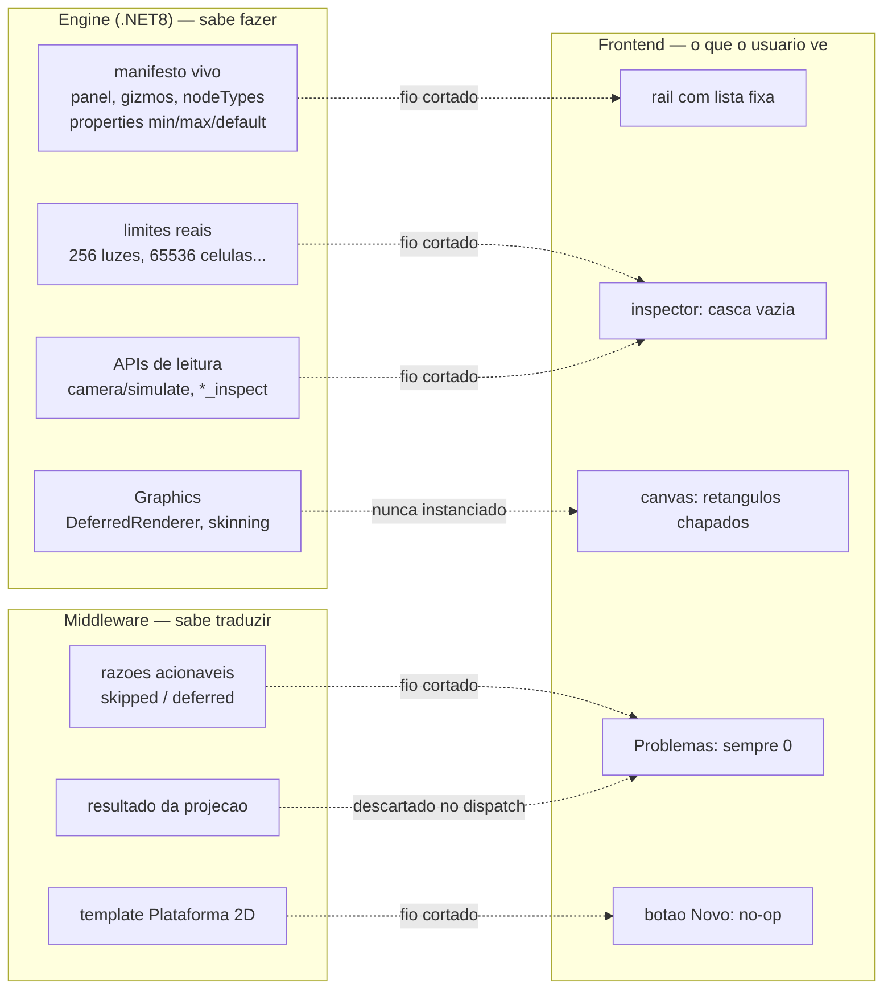
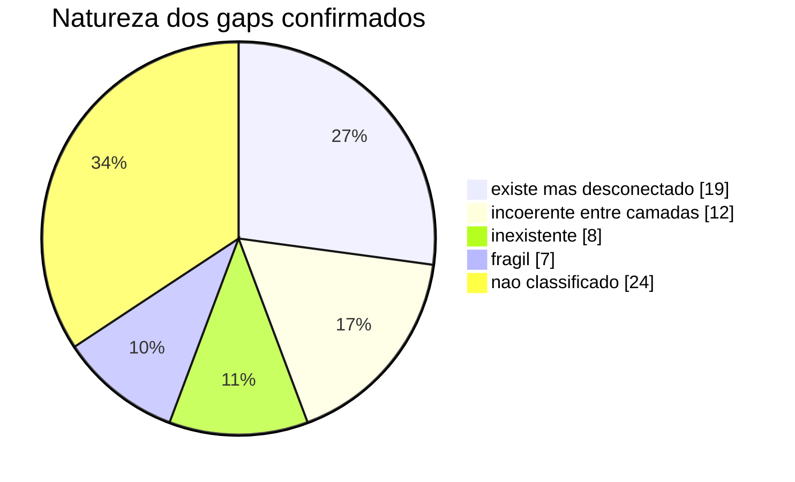
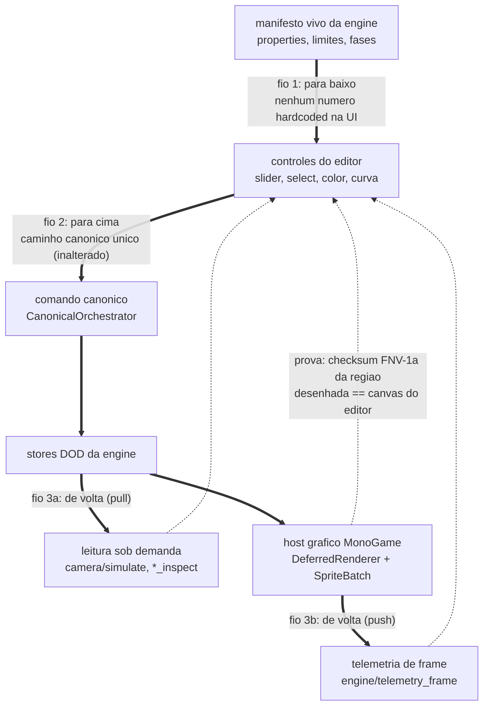
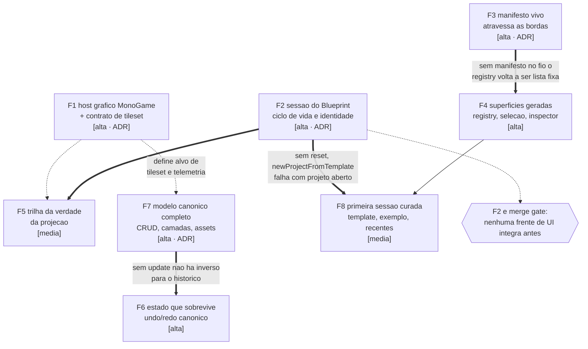

# Plano de viabilidade e experiência

> **O que é este documento.** Um diagnóstico verificado do que falta para o P7M
> ser um editor utilizável — nas dimensões experiência, curadoria, padrões,
> semântica e integridade contextual — e o plano para fechar essas lacunas,
> ordenado do problema **mais complexo** para o menos. A relação entre a
> interface e a MonoGame é tratada como prioridade e tem tese própria (§3).
>
> **Método.** Seis análises independentes leram o código real (não a
> documentação), cada uma seguida de um revisor adversarial que reabriu os
> arquivos citados para tentar **refutar** cada achado — um gap alegado que já
> estivesse implementado em outro arquivo era descartado. Só achados
> sobreviventes entraram no plano; os refutados estão registrados no anexo.
> Cada linha do catálogo (§6) carrega `arquivo:linha`. Nada aqui é hipótese de
> arquitetura: é leitura de código.

## 1. Diagnóstico

O P7M **não sofre de falta de capacidade — sofre de fios cortados entre camadas
que já sabem fazer o trabalho.** O modelo canônico valida, versiona, serializa e
projeta; o `ExperienceGovernor` decide com fail-safe; a engine publica um
manifesto vivo com painéis, gizmos, tipos de nó e propriedades com
`min`/`max`/`@default`; o `MonoGameAdapter` devolve razões acionáveis para tudo
que não projeta; `AutoTiler`, `AsepriteImporter`, FABRIK, curvas Bézier e a
máquina de estados estão escritos e testados.

E quase nada disso chega ao usuário. Das lacunas confirmadas, a categoria mais
frequente não é "não existe" — é **"existe mas está desconectado"**.

O problema central tem duas faces.

**Face de viabilidade — o produto não tem ciclo de vida nem verdade.** O
`BlueprintStore` não tem `reset()`, então abrir um segundo projeto na mesma
sessão falha e o "Novo" mistura projetos. O middleware pode ser reiniciado pelo
supervisor sem que o editor perceba, e o `Ctrl+S` seguinte grava um `.p7m.json`
**vazio** por cima do trabalho do usuário. Nenhuma falha — de salvar, de abrir,
de projetar — alcança a interface, porque a única chamada de IPC do renderer
não tem `.catch`. O painel "Problemas" é estruturalmente sempre zero: o
resultado da projeção que o `dispatch` devolve é descartado em todos os pontos
de chamada, então o editor afirma "Tudo aplicado no runtime" mesmo quando a
engine recusou tudo.

**Face de experiência — o editor promete um workbench e entrega um editor de
tiles.** O rail lista painéis a partir de uma tabela fixa no frontend que
intersecta em dois os que a engine publica: `rig-editor`, `mesh-inspector`,
`camera-rig`, `state-graph` e `asset-taxonomy` não têm porta de entrada, e
`shader-editor`, `asset-compiler`, `embedded-preview` e `debug-overlay` são
inventados pelo frontend e levam a tela morta. O Inspector é uma casca no HTML:
a busca por `inspector` em todo o TypeScript do frontend retorna **zero**
ocorrências — ninguém escreve nele. Pintar um nível não suja o projeto, então
trocar de aba remonta a vista e destrói grid, zoom, seleção e pilha de desfazer
sem um único aviso.

E, na raiz de tudo, o achado mais grave:

> **O processo rotulado "Runtime MonoGame" nunca carrega MonoGame.**
> `P7m.Engine.Runtime.csproj` referencia apenas `Core` e `Ipc` — **não**
> referencia `P7m.Engine.Graphics`. Não existe nenhuma subclasse de `Game` nem
> `GraphicsDeviceManager` em `engine/src`. O `DeferredRenderer`, o skinning e os
> shaders estão compilados, testados contra referências de CPU… e nunca
> instanciados. **O produto não desenha um único pixel de MonoGame.**

*Mostra o padrão único do diagnóstico: cada capacidade pronta na engine ou no middleware termina em uma aresta pontilhada — um fio cortado — antes de virar superfície para o usuário.*

Uma consequência desse desenho merece destaque, porque inverte a intuição:
`editorConcepts()` — a projeção do manifesto vivo — hoje só tem consumidor na
fachada **MCP** e em dois drivers de teste. No app real o middleware sobe com
`--no-mcp`. Ou seja: **um agente de IA enxerga as capacidades da engine melhor
do que o editor humano**, e no aplicativo empacotado ninguém as enxerga.

## 2. As cinco dimensões, em números

| Dimensão | Confirmados | Leitura |
|---|---|---|
| Experiência de uso | 12 | jornada quebra no primeiro gesto: pintar não persiste, selecionar não abre nada |
| Curadoria | 12 | o único template curado é inalcançável pela UI; zero conteúdo de exemplo no repo |
| Mapeamento de padrões | 10 | CRUD assimétrico entre domínios; sem camadas; sem conceito de tileset |
| Gaps semânticos | 12 | manifesto da engine e vocabulário do frontend divergem e não se cruzam |
| Integridade contextual | 12 | sessão sem ciclo de vida; save pode gravar vazio; projeção sem trilha |
| Relação interface ↔ MonoGame | 12 | não há host gráfico; o fio de volta (runtime → editor) não existe |

Distribuição por natureza do gap — a forma do problema:

*Mostra que a maior fatia isolada é de capacidade pronta e desconectada — o plano é majoritariamente de ligação, não de construção.*

## 3. Tese: a melhor relação possível entre a interface e a MonoGame

**O editor deve ser um espelho dos stores da engine, não uma reimplementação
deles — e o fio que falta é o de volta.**

Hoje a relação é unidirecional e cega: o editor manda comandos e nunca vê nada.
A engine, porém, já publica tudo que um bom editor precisaria:

- `editor.properties` com tipo, faixa e default por subsistema — câmera
  (`frequency` [0.1, 10], `damping` [0, 2], `response` [-2, 2],
  `anticipationSeconds` [0, 1], `shakeMaxOffset` [0, 128], `shakeFrequencyHz`
  [1, 60]), luz (`intensity` [0, 16], `radius`, cones, `lutStrength`), nível
  (`tileSize` [1, 256], `seed`);
- catorze gizmos e dezessete tipos de nó, com painel declarado por subsistema;
- limites reais (256 luzes, 8 tilemaps, 65536 células por tilemap, 256 atores,
  64 esqueletos);
- **APIs de leitura feitas sob medida para UI**: `camera/simulate` devolve
  amostras de trajetória mais `maxShakeMagnitude` — é literalmente um endpoint
  para desenhar a curva da câmera no canvas — e `entity/inspect`,
  `lighting/inspect`, `tilemap/inspect`, `mesh/inspect` devolvem estado vivo.

Nada disso tem rota até o editor. A tese se concretiza em **três fios e uma
prova**:

*Mostra a tese em três fios: o manifesto desce e gera os controles, o comando sobe pelo caminho canônico inalterado, e o runtime volta por leitura sob demanda e por telemetria de frame — com a paridade visual provada por checksum cruzado.*

**Fio 1 — para baixo (manifesto → controles).** Nenhum slider do editor deve ter
número escrito no código. Toda faixa vem de `editorConcepts()` exposto como
projeção da `EditorSurface` e espelhado nas três bordas; o inspector é um só
componente que traduz um hint de propriedade em controle: `float`/`int` viram
slider com min/max, `enum` vira select, `color` vira picker, `curve` vira o
editor Bézier que **já existe puro** em `frontend/src/core/bezier.ts`.
Consequência imediata e barata: câmera e iluminação ganham superfície **sem
contrato novo nenhum**, porque `camera/configure`, `light/add` e `light/remove`
já são comandos canônicos completos até o fio — falta só a UI.

**Fio 2 — para cima (comando canônico único).** Continua exatamente como está:
toda mutação pelo `CanonicalOrchestrator`, com o `MonoGameAdapter` traduzindo
`level/*` → `tilemap/*` e `entity/place` → `entity/spawn` (tradução deliberada e
documentada, não defeito). O que muda é o **retorno**: o resultado da projeção
viaja no envelope do evento e vira estado de "não aplicado" por objeto, para o
editor nunca mais afirmar que aplicou o que a engine recusou.

**Fio 3 — de volta (o que falta de verdade).** Duas rotas. A *pull* já existe e
só precisa de borda (`camera/simulate` para o preview de trajetória,
`entity/inspect` para a posição viva do ator, `lighting/inspect` para os slots
ocupados). A *push* não existe porque **não existe frame** — uma notificação de
telemetria só faz sentido depois do host gráfico. Com as duas, o
`debug.overlay` que o perfil de runtime já promete deixa de ser impossível de
implementar.

**A prova é uma fitness function de paridade visual.** O repositório já resolve o
problema análogo do layout binário comparando offsets por reflexão e checksum
FNV-1a cruzado entre C# e Node. A mesma técnica fecha a relação interface ↔
MonoGame: uma única tabela `tileId → região de atlas`, consumida pelo
`drawImage` do canvas do editor **e** pelo `SpriteBatch` do host, com o e2e
comparando o checksum de uma região do framebuffer com o da mesma região
desenhada pelo editor. No dia em que esse teste passa, "pinte significado,
derive arte" deixa de ser slogan: o que o usuário vê no editor é, **por
construção verificada**, o que a MonoGame desenha — e o preview embutido pode
virar `enable` no perfil sem mentir. Até lá, a atitude honesta é um terceiro
estado no gate: painel **previsto**, desabilitado, exibindo a fase que o próprio
manifesto já publica.

## 4. As frentes, do mais complexo ao menos

Oito frentes agrupam os achados por **causa-raiz** — não uma tarefa por sintoma.
Quatro exigem ADR por alterarem ou estenderem decisão arquitetural, conforme a
regra da casa.

### F1 — Host gráfico MonoGame acoplável + contrato de conteúdo visual (tileset/atlas) + telemetria de frame

> Complexidade **alta** · **exige ADR**

**Problema.** O processo que a status bar chama de "Runtime MonoGame: Pronto" é um servidor JSON-RPC headless que nunca carrega MonoGame, e não existe conceito de tileset/atlas em nenhuma camada — logo nada do que o usuário pinta pode virar pixel, nem no editor (5 cores chapadas em levelPresets.ts:27-33) nem no jogo. Sem isso, "pinte significado, derive arte" termina em `tileId: 100`, o painel "Pré-visualização do jogo" é uma promessa habilitada por uma capability que é só uma string do perfil (monogame.ts:74/83), e o canal engine→editor só transporta ping e log (EnginePipeServer.ts:106/136/144), tornando qualquer overlay de debug impossível.

**Solução.** Acoplar POR FORA, exatamente como a regra E4 já manda ("o host MonoGame acopla por fora, nunca o contrário"): um projeto novo `P7m.Engine.Host` (Exe) que referencia Core+Ipc+Graphics, instancia `Game`+`GraphicsDeviceManager`, constrói o `DeferredRenderer` com os .fx que o Content.mgcb já compila, e desenha os MESMOS stores DOD que os handlers JSON-RPC mutam — eles já são propriedades públicas (`Skeletons`/`Camera`/`Lights`/`Tilemaps`/`Actors`, EngineService.cs:26-38), então o loop e o plano de controle compartilham estado sem nova cópia e sem violar E3/E4 (Runtime segue sem Graphics; a nova regra E6 fixa que só o Host referencia Graphics+Ipc). Em paralelo, fechar o contrato de conteúdo que falta: `tileset/define` como comando canônico (tileId → região de atlas) e `tilesetId` em `LevelSpec`, com a MESMA tabela consumida pelo `drawImage` do canvas e pelo `SpriteBatch` do host — paridade verificada por checksum FNV-1a cruzado, como já se faz com o layout binário. Fecha também o fio de volta: notificação `engine/telemetry_frame` (frame stats, posição viva da câmera pós spring-damper, contagem de luzes) no EnginePipeServer, entrando no EventJournal como evento de runtime.

**Entregáveis**

- engine/src/P7m.Engine.Host/ (novo csproj Exe: Game + GraphicsDeviceManager + Content pipeline, referenciando P7m.Engine.Core, P7m.Engine.Ipc e P7m.Engine.Graphics)
- engine/src/P7m.Engine.Host/GameHost.cs (loop que desenha TilemapStore/ActorStore/LightStore via DeferredRenderer.cs e SpriteBatch)
- engine/tests/P7m.Engine.Ipc.Tests/ArchitectureTests.cs (nova regra E6: só o Host referencia Graphics+Ipc; E4 permanece intacta)
- engine/src/P7m.Engine.Runtime/EngineService.cs (novos handlers tileset/define e lighting/set_lut; notificação engine/telemetry_frame)
- novo schema `tileset.methods` em `contracts/schemas/` e novo schema `engine.telemetry_frame` em `contracts/schemas/`
- middleware/src/domain/BlueprintStore.ts (TilesetSpec + tilesetId em LevelSpec, validação e projeção)
- middleware/src/canonical/commandShape.ts (kind tileset/define) e contracts/graphql/editor.schema.graphql + contracts/grpc/p7m_editor.proto (enum e paridade)
- middleware/src/runtime/MonoGameAdapter.ts (projeção de tileset e encaminhamento da telemetria ao EventJournal)
- frontend/src/core/tilesetAtlas.ts (tabela pura tileId→região, compartilhada) e frontend/src/renderer/levelEditorView.ts (drawImage do atlas no lugar de fillRect)
- frontend/src/main/main.ts (supervisão do processo host com displayName honesto) e frontend/src/main/appConfig.ts

**Critério de aceite.** e2e novo `scripts/verify-visual-parity.sh`: (1) `dotnet test` continua verde com E3/E4 intactas e E6 nova; (2) o host sobe, recebe `tileset/define` + `level/define` + `entity/place` e produz um framebuffer cujo checksum FNV-1a de uma região amostrada casa, dentro de tolerância declarada, com o mesmo trecho renderizado pelo canvas do editor a partir da MESMA tabela de atlas; (3) `engine/telemetry_frame` chega ao EventJournal e é observável por `eventsSince`/`StreamEvents`; (4) teste de contrato quebra se `tileset/define` existir em COMMAND_KINDS sem entrada no SDL/proto/schema.

**Risco.** É a frente de maior superfície nova (processo, contrato de conteúdo e canal de telemetria ao mesmo tempo) e a única que toca empacotamento/GPU — CI sem GPU exige o host rodar headless-offscreen para o teste de paridade. Mitigação: entregar em duas ondas — onda A (host desenhando tilemap+atores em janela própria, paridade por checksum offscreen), onda B (embutir a janela no painel do editor). O ADR deve fixar o limite: o host é composição, nunca domínio, e o preview embutido só vira `enable` no perfil quando a onda B existir.

**Gaps cobertos:** monogame#1 — não existe host MonoGame; o "Runtime" é headless · monogame#5 — feedback visual é 100% retângulo de cor chapada · monogame#12 — canal engine→editor só transporta ping e log · padroes#7 — nenhum conceito de tileset/textura em nenhuma camada · curadoria#2 — não há nada visual para o produto mostrar · monogame#3 (parte) — preview.embedded habilitado sem vínculo com a realidade · monogame#7 (parte) — LUT cromática publicada sem contrato de fio

### F2 — Sessão do Blueprint com ciclo de vida e identidade — fim da perda silenciosa de trabalho

> Complexidade **alta** · **exige ADR**

**Problema.** O Blueprint é um singleton em memória sem começo nem fim: não há `reset()` (BlueprintStore.ts:174-477, só o getter `isEmpty` em :441), nenhuma borda expõe fechamento (EditorGateway.ts:110-169, SDL e proto verificados), e o middleware não tem identidade de instância. As consequências são as piores do repositório: abrir um segundo projeto rejeita em `beginOpen` (projectLifecycle.ts:113-118) e a rejeição morre sem `.catch` (renderer.ts:38-40); "Novo" mantém o AST antigo e o Save mistura dois projetos; e quando o supervisor reinicia o middleware (ProcessSupervisor.ts:161-169), o editor continua "conectado", o Ctrl+S grava um documento VAZIO por cima do arquivo do usuário (main.ts:232-235) e o dedup por seq (EditorClient.ts:340) cega o cliente até o journal novo ultrapassar o seq antigo.

**Solução.** Dar ao Blueprint o mesmo tratamento que o projeto já dá aos comandos: um ciclo de vida explícito no caminho canônico. `BlueprintStore.reset()` + operação `closeProject()` na EditorSurface (não um comando de mutação de domínio — é ciclo de vida da sessão, exposto como mutation/rpc nas três bordas), chamada por "Novo"/"Abrir"/"Fechar" no main.ts antes de qualquer `loadDocument`/`newProjectFromTemplate`, com limpeza correspondente dos mapas de sessão do MonoGameAdapter (engineLightIds/spawnedEntityIds, :19-33) e despawn no runtime. Em cima disso, identidade: `instanceId`+`epoch` no `health`, no handshake e no `EventEnvelope`; o `EditorClient` detecta epoch novo, invalida `lastEventSeq`, BLOQUEIA o save e oferece reidratar o middleware a partir do documento em memória. Fecha-se também a borda de erro: um único `.catch` no `wireProjectToolbar` mais uma superfície de exibição (banner/toast), porque as mensagens acionáveis JÁ existem (main.ts:353-359, projectLifecycle.ts:113-120) e só estão sendo descartadas.

**Entregáveis**

- middleware/src/domain/BlueprintStore.ts (reset() com emissão de evento de ciclo de vida)
- middleware/src/canonical/EditorSurface.ts (closeProject(); newProjectFromTemplate/loadDocument passam a resetar antes de replayDocument)
- middleware/src/ipc/EditorGateway.ts, middleware/src/graphql/GraphQlGateway.ts, middleware/src/grpc/GrpcGateway.ts + contracts/graphql/editor.schema.graphql + contracts/grpc/p7m_editor.proto (closeProject e instanceId/epoch em Health e EventEnvelope)
- middleware/src/transport/EventJournal.ts (epoch no envelope; gap sinalizado usando canResumeFrom, hoje código morto)
- middleware/src/runtime/MonoGameAdapter.ts (limpeza de estado de sessão no reset)
- frontend/src/main/EditorClient.ts (detecção de epoch, invalidação de lastEventSeq, ressincronização por query de projeção ao detectar gap, bloqueio de save)
- frontend/src/main/main.ts (encadear close→open; autosave marcando ponto na lifecycle; detecção de .autosave mais novo que o .p7m.json no boot)
- frontend/src/core/projectLifecycle.ts (autosaved() e saveBlocked() sem sair do estado sujo)
- frontend/src/renderer/renderer.ts (.catch único + banner de erro) e frontend/src/renderer/index.html/style.css (superfície de notificação)

**Critério de aceite.** e2e `scripts/verify-project-session.sh`: (1) abrir projeto A, editar, abrir projeto B na MESMA sessão → canvas e documento passam a ser exclusivamente de B e o save de B não contém nada de A; (2) matar o middleware no meio da sessão → o editor exibe causa+ação, o Save fica bloqueado até a reidratação, e nenhum byte é escrito no .p7m.json do usuário; (3) forçar >512 eventos com o cliente atrasado → o gap é detectado e o cliente ressincroniza por projeção completa (teste unitário de canResumeFrom com chamador real); (4) teste de regressão: nenhum caminho do main.ts chama writeDocument com epoch divergente.

**Risco.** Introduz um conceito de sessão que hoje não existe no modelo canônico — o ADR precisa deixar explícito que `closeProject` é ciclo de vida da EditorSurface e NÃO um BlueprintCommand, para não abrir precedente de mutação fora do orquestrador (P-1/R12). Risco secundário: bloquear o save por epoch pode travar o usuário se a detecção der falso positivo; mitigar com "salvar como cópia" sempre permitido.

**Gaps cobertos:** integridade#1 — reinício do middleware apaga o projeto e o Save sobrescreve com vazio · integridade#2 e padroes#1 e curadoria#4 — não existe reset do Blueprint em nenhum transporte · experiencia#4 — "Novo"/"Abrir" viram no-op silencioso · experiencia#5 — falha de salvar é invisível para o usuário · integridade#9 — EventJournal com janela finita e canResumeFrom sem chamador · integridade#12 — autosave grava arquivo que ninguém restaura e entra em laço de 5s

### F3 — O manifesto vivo atravessa as bordas: editorConcepts, limites reais e contratos dos 14 comandos

> Complexidade **alta** · **exige ADR**

**Problema.** A arquitetura declara que a UI materializa painéis, gizmos e propriedades a partir de `editorConcepts()` (CapabilityRegistry.ts:6-9 e docs/ARCHITECTURE.md:92), mas essa função tem consumidor apenas no MCP (McpFacade.ts:178-187) e em dois drivers de teste — e no app real o middleware sobe com `--no-mcp` (main.ts:120), então o manifesto não chega a NINGUÉM. Nenhuma borda do app o expõe (verificado no SDL, no proto e no EditorGateway), os limites verdadeiros da engine (maxLights=256, maxTilemaps=8, maxCellsPerTilemap=65536, maxActors=256, maxSkeletons=64) ficam fora de `constraints`, que só carrega maxTextureSize/maxVertexShaderRegisters do perfil, e os 14 comandos canônicos atravessam todas as bordas como JSON opaco sem schema em contracts/ — ao contrário do que o próprio proto afirma (p7m_editor.proto:6-10).

**Solução.** Uma extensão de contrato, não uma mudança de arquitetura: `editorConcepts` vira uma projeção consultável da EditorSurface (a superfície transport-neutra que as três bordas já espelham), `ResolvedExperience.constraints` passa a mesclar `manifest.subsystems[*].limits` com namespace (`lighting.maxLights`), `QUERYABLE_PROJECTIONS` é promovida a enum no SDL/proto como já se fez com `CommandKind`, e os 14 comandos ganham schemas JSON em `contracts/` — que é onde o proto já diz que eles estão. A segunda fonte de verdade some junto: `MAX_LEVEL_CELLS` hardcoded (BlueprintStore.ts:119) passa a ler do CapabilityRegistry. Nada disso exige tocar o núcleo: é a mesma fachada fina que R12 já impõe.

**Entregáveis**

- middleware/src/canonical/EditorSurface.ts (projeção editorConcepts + capabilities; EditorSurfaceOptions recebe CapabilityRegistry)
- middleware/src/runtime/ExperienceGovernor.ts (merge de manifest limits em constraints com namespace)
- contracts/graphql/editor.schema.graphql e contracts/grpc/p7m_editor.proto (tipo EditorConcept, enum Projection, campo de limites)
- novo schema `canonical.commands` em `contracts/schemas/` (os 14 kinds, fonte legível por máquina da validação do BlueprintStore)
- middleware/src/ipc/EditorGateway.ts e frontend/src/main/preload.ts + frontend/src/main/EditorClient.ts (rota até o renderer)
- middleware/src/domain/BlueprintStore.ts (MAX_LEVEL_CELLS lido do registry) e middleware/src/runtime/MonoGameAdapter.ts (correlação pública lightId canônico↔slot)
- middleware/src/mcp/McpFacade.ts (renomear skeleton_initialize→skeleton_define e mesh_bind_shared_memory→mesh_bind)
- middleware/test/architecture.test.ts (paridade: todo kind em COMMAND_KINDS tem schema em contracts/; toda projeção em QUERYABLE_PROJECTIONS existe no enum do SDL/proto)

**Critério de aceite.** Fitness function nova no CI: (a) para cada item de COMMAND_KINDS existe schema JSON correspondente em contracts/ e entrada no enum GraphQL e no proto — o teste nomeia o kind infrator; (b) toda projeção de QUERYABLE_PROJECTIONS aparece no enum das duas bordas; (c) e2e em `scripts/verify-transports.sh`: consultar editorConcepts pelo gRPC e pelo GraphQL devolve o MESMO shape, com properties min/max/default e limits, tanto no caminho quente quanto no fallback; (d) `resolveExperience` com manifesto vivo expõe `lighting.maxLights=256` em constraints.

**Risco.** Ampliar a superfície do contrato aumenta o custo de paridade (todo campo novo precisa existir em SDL, proto, gateway e dist/). Mitigação: expor `editorConcepts` como projeção — reaproveitando o caminho de `query` já existente — em vez de criar um verbo novo por borda. O ADR registra a decisão de que o manifesto vivo é DADO consultável, não capability estática do perfil.

**Gaps cobertos:** semantica#2, padroes#2, monogame#2 — editorConcepts não atravessa nenhuma borda do app · semantica#7 e monogame#9 — limites reais da engine nunca chegam ao gate · semantica#12 — QUERYABLE_PROJECTIONS fechada no código e String livre no contrato; 14 comandos sem schema · semantica#9 — lightId nomeia string canônica e slot numérico da engine sem correlação pública · semantica#10 — duas tools MCP anunciam o verbo da engine em vez do kind canônico

### F4 — Superfícies geradas pelo manifesto: registry de painéis, modelo de seleção e inspector schema-driven

> Complexidade **alta** · sem ADR (execução dentro das decisões vigentes)

**Problema.** O rail é uma lista hardcoded de 6 painéis (experienceGate.ts:31-38 + vocabulary.ts:11-18 + if-chain em renderer.ts:89-106) que intersecta em 2 os 7 que a engine publica: rig-editor, mesh-inspector, camera-rig, state-graph e asset-taxonomy não têm porta de entrada, enquanto shader-editor, asset-compiler, embedded-preview e debug-overlay são inventados pelo frontend e levam a placeholders — 5 de 6 botões habilitados entregam tela morta, e três deles continuam clicáveis mesmo SEM engine. Ao mesmo tempo, o inspector existe só como casca no DOM (index.html:39-42, estilos dt/dd prontos em style.css:160-171, zero ocorrências de "inspector" em qualquer .ts) e não há modelo de seleção: `selectedEntityId` é uma variável local que só desenha um anel branco (levelEditorView.ts:67). Câmera (6 propriedades com min/max/default e `camera/configure` completo até o fio) e luz (`light/add`/`light/remove` completos) são inalcançáveis por falta APENAS de UI.

**Solução.** Inverter a direção do conhecimento com o menor movimento possível: um `panelRegistry` no frontend (panelId → mount(ctx)) alimentado por `editorConcepts()` (F3), substituindo a if-chain e derivando PANEL_REQUIREMENTS do manifesto — e uma TERCEIRA fonte na decisão do gate: "o que ESTE build do editor implementa". Painel publicado pela engine mas não implementado aparece desabilitado com a fase prevista (o manifesto já carrega `phase` e o EditorConcept já a propaga, CapabilityRegistry.ts:122); painel implementado sem subsistema declara-se explicitamente como do host/middleware. Sobre isso, um único renderizador de formulário dirigido por propriedade (`EditorPropertyHint` e `EntityFieldDef` unificados) serve entidade, câmera, luz e nível: float/int→slider com min/max, enum→select, color→picker, curve→o editor Bézier que já existe puro em core/bezier.ts. Um `core/selection.ts` puro liga canvas↔inspector↔log. Os painéis camera-rig e lighting-pipeline nascem desse mesmo componente, despachando `camera/configure`, `light/add` e `light/remove` — comandos que já existem inteiros.

**Entregáveis**

- frontend/src/core/panelRegistry.ts e frontend/src/core/selection.ts (núcleos puros, F1 do repo)
- frontend/src/core/propertySchema.ts (tradução única EditorPropertyHint ↔ EntityFieldDef)
- frontend/src/renderer/inspectorView.ts (formulário schema-driven escrevendo em #inspector-content)
- frontend/src/renderer/cameraRigView.ts e frontend/src/renderer/lightingView.ts (sliders vindos do fio, gizmos sobre o canvas do nível)
- frontend/src/core/experienceGate.ts (PANEL_REQUIREMENTS derivada do manifesto + estado "previsto" com fase) e frontend/src/core/workbenchModel.ts (foco no primeiro painel REAL)
- frontend/src/core/vocabulary.ts (FEATURE_LABELS completo, incluindo entities.spawn; razões traduzidas por par código+parâmetros)
- middleware/src/runtime/ExperienceGovernor.ts e middleware/src/runtime/profiles/monogame.ts (razões como código estável; requiresSubsystem nas regras de assets/preview/debug)
- frontend/src/renderer/renderer.ts (renderView passa a consultar o registry)

**Critério de aceite.** (1) Teste de cobertura estendido em frontend/test/workbench-core.test.ts: todo painel oferecido pelo rail tem entrada no registry E rótulo pt-BR E, se depende de subsistema, decisão do gate — falhar nomeia o painel; hoje o teste só varre PANEL_REQUIREMENTS e ignora features. (2) Teste de vocabulário: nenhuma razão exibida na UI contém aspas escapadas, id interno ou texto em inglês (varredura sobre as razões produzidas por todos os perfis). (3) Jornada e2e: selecionar o Player abre o inspector com os campos da definição preenchidos com os defaults; mover um slider de câmera despacha `camera/configure` e a projeção volta `projected`; adicionar uma luz pelo painel aparece no canvas e no runtime. (4) Com a engine desligada nenhum painel habilitado leva a placeholder.

**Risco.** Depende de F3 (sem editorConcepts no fio, o registry volta a ser lista fixa). Risco de escopo: os painéis rig-editor e state-graph têm núcleos prontos mas exigem canvas próprios — devem entrar como "previsto" no registry (desabilitado com fase) até serem construídos, em vez de segurar a frente inteira.

**Gaps cobertos:** experiencia#2, padroes#5, semantica#4, curadoria#7 — Inspector é casca estática e não há modelo de seleção · experiencia#11, padroes#3, monogame#11, semantica#1 — rail hardcoded que diverge do manifesto e entrega placeholders · padroes#4, monogame#3, curadoria#10 — governança habilita painéis que o editor não implementou · monogame#6 — câmera second-order sem nenhuma superfície (camera/configure pronto) · monogame#7 — iluminação deferred sem painel (light/add e light/remove prontos) · monogame#8 — FABRIK, curvas e máquina de estados sem nenhuma vista que os monte · semantica#11 e curadoria#12 — razões de governança em inglês vazando para tooltips

### F5 — Trilha da verdade da projeção: problemas, divergência e reconciliação

> Complexidade média · sem ADR (execução dentro das decisões vigentes)

**Problema.** O middleware produz razões excelentes — "entity has no archetypeId — set one to spawn it", "no engine session connected", "world layout is editorial until level streaming lands" (MonoGameAdapter.ts:54/135/190) — e a UI afirma "Nenhum problema — Tudo aplicado no runtime" com o badge em 0 (renderer.ts:142). O envelope do journal só carrega seq/kind/payload (EventJournal.ts:14-18, alimentado cru em index.ts:174), o renderer chama `log.record(event)` sem o segundo argumento (renderer.ts:238-242), e o `projection` que o dispatch JÁ devolve (EditorClient.ts:32-35) é descartado em quatro sites de levelEditorView.ts. Pior: a projeção pode FALHAR depois de o store já ter aplicado (CanonicalOrchestrator.ts:42 antes de :45), deixando Blueprint e engine contando histórias diferentes sem nenhuma trilha; e uma falha no meio da reidratação aborta o resto (MonoGameAdapter.ts:201-227) virando uma linha de stderr que só aparece num tooltip.

**Solução.** Fazer o resultado da projeção viajar junto do evento e virar estado, não log: campo opcional `projection` no `EventEnvelope` (propagado ao SDL e ao proto), `log.record(event, outcome.projection)` no renderer, e um status `failed` no `ProjectionResult` para a projeção deixar de lançar e passar a alimentar a mesma trilha de skipped/deferred. Reidratação isolada por evento (try/catch acumulando razões) emitindo um sumário no journal ("projeto reaplicado: N de M — 3 falhas") com ação de repetir, e serialização da fronteira do adapter (fila única) para eliminar a corrida entre reidratação e dispatch concorrente. Por cima, um catálogo de erros acionáveis (código → texto pt-BR + ação + navegação ao objeto afetado) aplicado nas bordas do renderer, reaproveitando o painel Problemas que já sabe desenhar problem-card.

**Entregáveis**

- middleware/src/transport/EventJournal.ts (campo projection no envelope) e middleware/src/index.ts:174 (append com a projeção)
- middleware/src/runtime/RuntimeAdapter.ts (status "failed" com razão) e middleware/src/runtime/MonoGameAdapter.ts (project sem lançar; rehydrateFrom isolado por evento + sumário; fila de projeção)
- contracts/graphql/editor.schema.graphql e contracts/grpc/p7m_editor.proto (projection no envelope de evento)
- frontend/src/renderer/renderer.ts e frontend/src/renderer/levelEditorView.ts (capturar outcome.projection nos 4 sites de dispatch)
- frontend/src/core/eventLog.ts (indicador persistente de "não aplicado" por objeto, não só linha de log)
- frontend/src/core/errorCatalog.ts (código → pt-BR + ação + alvo de navegação)

**Critério de aceite.** e2e `scripts/verify-diagnostics.sh`: com a engine derrubada DEPOIS do boot, posicionar uma entidade e publicar um nível → o badge de problemas fica > 0, o painel lista cada item com a razão em pt-BR e um botão de ação, e nenhuma mensagem afirma "tudo aplicado no runtime"; entidade sem archetypeId aparece marcada como não aplicada até ganhar um; matar a engine no meio de uma reidratação de 50 eventos produz um sumário "N de M" no journal e a re-projeção manual converge. Teste unitário: `project()` nunca lança para erro de runtime — devolve failed com razão.

**Risco.** Baixo de arquitetura, médio de contrato: mexer no EventEnvelope obriga paridade nas três bordas e nas cópias em dist/. Cuidado para não transformar a projeção em parte do modelo canônico — ela viaja no envelope de transporte, não no evento do domínio.

**Gaps cobertos:** experiencia#6, integridade#6, semantica#3, monogame#4 — painel Problemas estruturalmente sempre zero · monogame#10 — falha de projeção deixa Blueprint e engine divergentes sem trilha · integridade#7 — falha no meio da reidratação aborta o resto e vira stderr · integridade#8 (RISCO) — reidratação não serializada com dispatches concorrentes · curadoria#12 — mensagens técnicas em inglês vazando para o status do editor

### F6 — Estado do editor que sobrevive, undo/redo canônico e convergência com edições externas

> Complexidade **alta** · sem ADR (execução dentro das decisões vigentes)

**Problema.** Todo o estado do editor mora no closure de `mountLevelEditor`: clicar numa aba do painel inferior chama notify() → renderView() → host.replaceChildren() (workbenchModel.ts:80-83, renderer.ts:223-227/79-99) e recria `new IntGridDocument(48, 27)` (levelEditorView.ts:50), destruindo grid não publicado, pilha de desfazer, zoom/pan, ferramenta e seleção. Como pintar não gera evento de Blueprint, o projeto nunca fica sujo e o "Fechar" não pergunta nada (projectLifecycle.ts:143-157). O undo/redo global roteia para `doc.undo()` (levelEditorView.ts:128-133 e main.ts:411-414), então Ctrl+Z depois de mover uma entidade desfaz uma pincelada anterior não relacionada. E o canvas lê o Blueprint uma única vez na montagem: qualquer mutação de outro cliente (agente, segunda janela) não converge — o usuário publica por cima e apaga o trabalho alheio.

**Solução.** Tirar o estado da vista do closure e colocá-lo num store de vista preservado entre montagens (documento, viewport, seleção, ferramenta, histórico), separando os ciclos de render (aba inferior não re-renderiza a vista). Sujeira local passa a ter entrada própria na ProjectLifecycle (`markLocalDirty()`), incluída na decisão de `requestClose()`. O histórico sobe para o nível do gesto: uma pilha única de comandos canônicos com inversos explícitos (o inverso de `entity/place` é `entity/remove`, o de `level/update` é o snapshot anterior — todos já existentes), com a pintura entrando como um comando agrupado por traço; a vista delega undo/redo a ela. Por fim, a vista assina `onBlueprintEvent` e aplica levelDefined/levelUpdated/entityPlaced/entityMoved/entityRemoved ao estado local, com política explícita de conflito. Ergonomia entra junto porque é o mesmo módulo: espaço+drag e botão direito para pan (o comentário de canvasViewport.ts:74 já promete), scroll do trackpad para pan com modificador para zoom, Escape abortando rect/line e atalhos de letra por ferramenta.

**Entregáveis**

- frontend/src/core/editorSession.ts (store de vista puro: documento, viewport, seleção, ferramenta)
- frontend/src/core/commandHistory.ts (pilha canônica com inversos e agrupamento por gesto)
- frontend/src/core/projectLifecycle.ts (markLocalDirty e sua inclusão em requestClose)
- frontend/src/renderer/renderer.ts (ciclos de render separados: rail, vista e painel inferior)
- frontend/src/renderer/levelEditorView.ts (montagem a partir do store; assinatura de onBlueprintEvent; pan/Escape/atalhos)
- frontend/src/core/canvasViewport.ts (espaço+drag e scroll-para-pan, cumprindo o comentário existente)
- frontend/src/main/main.ts (menu Desfazer roteando para o histórico canônico)

**Critério de aceite.** Jornada e2e: pintar 30 células, alternar Problemas→Saída→Histórico e voltar → grid, zoom, ferramenta, seleção e pilha de desfazer intactos; fechar com pintura não publicada → diálogo de alterações não salvas aparece; Ctrl+Z após mover uma entidade desfaz o MOVE (não a pincelada anterior) e Ctrl+Y refaz; um dispatch externo (driver gRPC de frontend/src/tools/transport-driver.ts) que move uma entidade com o editor aberto reflete no canvas em até um ciclo de evento. Teste puro em core/: toda operação exposta pela paleta tem inverso registrado — o teste falha nomeando a operação sem inverso.

**Risco.** O histórico canônico esbarra em F7 (sem `entity/update`/`entitydef/update` alguns gestos não têm inverso) e em edições concorrentes de outro cliente — undo pode desfazer trabalho alheio. Mitigar restringindo o histórico à sessão local do editor e marcando comandos externos como barreira de undo.

**Gaps cobertos:** integridade#4, curadoria/experiencia — trocar de aba remonta o editor e destrói trabalho, undo, zoom e seleção · experiencia#1 e integridade#3 — pintar não suja o projeto e fechar descarta sem avisar · experiencia#8 — undo/redo cobre só células do IntGrid (P0.7) · integridade#12 (parte) e integridade#11 — mutações de outros clientes não convergem no canvas · experiencia#9 — pan só com botão do meio, sem Escape, sem atalhos

### F7 — Completar o modelo canônico editável: CRUD simétrico, camadas, campos no fio e assets no projeto

> Complexidade **alta** · **exige ADR**

**Problema.** O modelo canônico é assimétrico e incompleto justamente onde a UI precisa escrever: `entitydef` é create-only (redefinir lança DuplicateId, BlueprintStore.ts:215-220 — o frontend já contorna com catch vazio), não há `entity/update` de campos nem `light/update` (commandShape.ts:9-24), `LevelSpec` não tem camadas e entidades não pertencem a nenhum nível (BlueprintStore.ts:94-116) embora o manifesto anuncie intgrid-layer/auto-layer/entity-layer (EngineDescriptor.cs:161), paleta/regras/seed/tileSize não são dados do projeto (constantes em levelPresets.ts) e são reescritos a cada publish (levelEditorView.ts:435-442), os `fields` validados com defaults nunca cruzam para o runtime (MonoGameAdapter.ts:138-142 e EngineService.cs:498-514), e o pipeline Aseprite — pronto e testado — não tem porta em NENHUM dos três transportes nem entra no `.p7m.json` (BlueprintSerializer.ts:27-37), então reabrir perde os assets importados.

**Solução.** Um único movimento de completude do domínio, seguindo o DoD existente por comando (validação + COMMAND_KINDS + enum GraphQL + projeção + reidratação + serialização) e acrescentando ao DoD a regra faltante: **todo domínio editável expõe create/update/delete**. Concretamente: `entitydef/update`, `entitydef/remove`, `entity/update`, `light/update`; camadas nomeadas em LevelSpec (tipo + ordem) e vínculo entidade→nível/camada com bump de schemaVersion e migração registrada (o mecanismo já existe em BlueprintSerializer.ts:68-86); paleta e regras dentro do LevelSpec, com levelPresets.ts rebaixado a conteúdo inicial do template; `fields` propagados no `entity/spawn` e no rehydrate (ou, no mínimo, marcados como editoriais na UI); e operações de asset (`asset/import`, projeção `artifacts`) na EditorSurface com o assetsRoot vindo do projeto aberto em vez da flag `--assets`, mais as referências de artefato no BlueprintDocument.

**Entregáveis**

- middleware/src/domain/BlueprintStore.ts (novos kinds, camadas em LevelSpec, paleta/regras no nível, vínculo entidade→nível/camada)
- middleware/src/canonical/commandShape.ts e contracts/graphql/editor.schema.graphql + contracts/grpc/p7m_editor.proto (enum de kinds)
- middleware/src/canonical/BlueprintSerializer.ts (bump de schemaVersion + entrada em MIGRATIONS + artefatos no BlueprintDocument)
- middleware/src/canonical/EditorSurface.ts + middleware/src/canonical/ArtifactStore.ts (asset/import e projeção artifacts; assetsRoot do projeto)
- middleware/src/index.ts (AssetPipelineService instanciado pelo projeto aberto, não por --assets) e frontend/src/main/main.ts (menu Importar asset…)
- middleware/src/runtime/MonoGameAdapter.ts + engine/src/P7m.Engine.Runtime/EngineService.cs (fields no entity/spawn ou entity/configure) e `contracts/schemas/actors.methods.schema.json`
- docs/GOVERNANCE.md (DoD: todo domínio editável expõe create/update/delete)

**Critério de aceite.** (1) Fitness function nova: para cada domínio marcado como editável existe create+update+delete em COMMAND_KINDS, com enum e schema — o teste nomeia o domínio incompleto. (2) Round-trip: documento com camadas, paleta custom, seed próprio, fields e referência de artefato salva, reabre e reprojeta idêntico (checksum do documento), incluindo migração a partir de um .p7m.json da versão anterior. (3) e2e: importar um .aseprite pelo app produz artefato consultável, o projeto salvo o referencia e o reabrir mantém a referência. (4) Um `entity/spawn` com fields chega à engine e é observável por `entity/inspect`.

**Risco.** Maior risco de compatibilidade do plano: camadas e vínculo entidade→nível mudam o formato do documento (COMPATIBILITY.md + migração obrigatória). Mitigação: migração idempotente que cria uma camada única implícita para documentos antigos e infere o nível pelo world map, com teste de round-trip a partir de fixtures da versão anterior.

**Gaps cobertos:** padroes#8 — CRUD assimétrico entre domínios canônicos · padroes#10 — LevelSpec sem camadas e entidades sem nível · curadoria#8 e semantica#12(parte) — campos tipados existem no modelo e a UI cria entidades sem campo · integridade#10 — fields nunca atravessam a fronteira do runtime · curadoria#9 e padroes#6 — paleta, regras, seed e tileSize não são dados do projeto · curadoria#6 e padroes#9 — pipeline Aseprite inacessível e artefatos fora do save · semantica#12 — dois vocabulários de propriedade sem tradução e hints (color/icon) sem consumidor

### F8 — Primeira sessão curada: template no "Novo", conteúdo de exemplo, recentes e vocabulário unificado

> Complexidade média · sem ADR (execução dentro das decisões vigentes)

**Problema.** O único template curado do produto é inalcançável — o `case "new"` só faz `lifecycle.opened({ name: "Projeto sem título" })` (main.ts:261-265) e o preload sequer expõe listProjectTemplates/newProjectFromTemplate (preload.ts:26-47), embora ambos existam e sejam testados em EditorClient.ts:192-235. Não há um único arquivo de exemplo no repositório (nem .aseprite, nem .png, nem .p7m.json), os recentes são persistidos e enviados no payload mas nunca renderizados (zero ocorrências de "recents" no renderer), a tela de boas-vindas some assim que a conexão sobe deixando o canvas editável SEM projeto (workbenchModel.ts:35-38 × renderer.ts:84-88) e, quando o template finalmente for ligado, ele ainda não abrirá: o editor procura "nivel-1" e o template grava "level-1", usa "jogador" contra "player", trata 1 como Chão enquanto o template usa 1 para chão E parede, e grava posição em pixels enquanto o template usa células (levelEditorTools.ts:63-65 × ProjectTemplates.ts:75).

**Solução.** Curar a primeira sessão inteira como uma unidade: superfície de IPC para templates + tela inicial real (Novo com seleção de template, Abrir, Recentes, Abrir exemplo) enquanto o estado é `no-project`, com os painéis gated por projeto aberto; unificação do vocabulário entre template e UI (mesmos ids, mesma semântica de paleta, mesma unidade de posição) protegida por um teste de coerência no espírito do `assertPresetsConsistent` já existente; um diretório `examples/` versionado com um projeto completo e seus assets de origem; e um segundo template contrastante (top-down) que prova que o fluxo é genérico em vez de ser um caso especial do platformer. A seleção de nível deixa de ser constante e passa a vir da projeção `levels`.

**Entregáveis**

- frontend/src/main/preload.ts e frontend/src/main/main.ts (IPC de templates; case "new" chamando newProjectFromTemplate; menu Ctrl+N e Abrir exemplo)
- frontend/src/renderer/welcomeView.ts (Novo com templates, Abrir, Recentes vindos do payload de status)
- frontend/src/core/workbenchModel.ts (gating dos painéis por projeto aberto)
- frontend/src/renderer/levelEditorView.ts (LEVEL_ID e ENTITY_DEF vindos da projeção levels/entityDefs; seletor de nível; conversão explícita célula↔pixel)
- middleware/src/canonical/ProjectTemplates.ts (semântica de paleta alinhada, segundo template top-down)
- examples/ (projeto .p7m.json completo + assets de origem) e frontend/package.json (configuração de empacotamento que inclua examples/)
- frontend/test/ (teste de coerência template↔presets, análogo a assertPresetsConsistent)

**Critério de aceite.** Jornada de aceite do ALPHA-0.1 do passo 1 ao 4 executável sem tocar em arquivo à mão: abrir o app sem projeto → tela inicial com Novo/Abrir/Recentes/Exemplo → escolher "Plataforma 2D" → o canvas HIDRATA o nível do template com o player na posição correta em células → publicar não cria nível duplicado. Teste de coerência falha se algum id, significado de paleta ou unidade de posição divergir entre ProjectTemplates.ts e os presets do frontend. Reabrir o app lista o projeto nos recentes.

**Risco.** Depende de F2 (sem reset do Blueprint, `newProjectFromTemplate` falha com "Blueprint must be empty" sempre que houver projeto aberto — o teste blueprint-serializer.test.ts:105 já cobre o lançamento, mas ninguém cobre abrir-A-depois-B). É a frente de menor custo e maior efeito percebido; o risco é ser feita ANTES de F2 e nascer quebrada.

**Gaps cobertos:** experiencia#10 e curadoria#1 — template Plataforma 2D existe ponta a ponta e o "Novo" o ignora · experiencia#12 — primeiro uso abre editável sem projeto e recentes nunca aparecem · experiencia#3, curadoria#5, integridade#5 — IDs fixos "nivel-1"/"jogador" divergem do canônico; posição em pixels × células · curadoria#3 — zero conteúdo de exemplo no repositório e nenhum vetor de empacotamento · curadoria#11 — uma única opinião: um template, três significados, nada editável
## 5. Sequenciamento

**Ordem executiva: F1 → F2 → F3 → F4 → F7 → F5 → F6 → F8**, com paralelismo
explícito.

A ordem começa pelo **mais complexo (F1, o host gráfico)** porque ele é
simultaneamente o mais caro e o que **decide a forma de tudo que vem depois**:
enquanto não existir um processo que instancie MonoGame e desenhe os stores DOD,
o contrato de tileset, o formato da telemetria e os limites reais permanecem
hipóteses — e qualquer inspector, painel de luz ou preview construído antes dele
seria projetado contra um alvo imaginário. Se F1 viesse por último, F3 (limites e
propriedades no fio), F4 (painéis de câmera/luz/preview) e F7 (tileset ligado ao
`LevelSpec`) precisariam ser reprojetadas quando o host aparecesse.

*Mostra as dependências duras entre as frentes e o merge gate: F3 habilita F4, F2 habilita F8 e é barreira de integração, F7 fornece os inversos que F6 exige, e F1 fixa o alvo de F7 e F5.*

**Dependências duras.** F4 depende de F3 — sem `editorConcepts` atravessando as
bordas, o registry de painéis volta a ser lista fixa e o inspector volta a
hardcodar min/max, exatamente o defeito que se quer eliminar. F8 depende de F2:
`newProjectFromTemplate` chama `replayDocument`, que exige Blueprint vazio, então
ligar o template ao botão "Novo" antes do `reset()` produz uma funcionalidade que
falha sempre que houver projeto aberto. F6 depende de F7 para os inversos que
faltam (`entity/update`, `entitydef/update`) — sem eles o histórico canônico tem
buracos. F5 depende de F1 apenas para a trilha de telemetria; a parte de
projeção, que é o essencial, é independente e pode começar imediatamente.

**Paralelismo recomendado.** F1, F2 e F3 devem correr em paralelo desde o
primeiro dia, em PRs distintos — F1 toca a engine e o contrato de conteúdo, F2
toca `middleware/canonical` e `frontend/main`, F3 toca `contracts/` e as bordas.
As três só se encontram no teste de paridade de contratos, que o CI já impõe.

**F5 é a melhor entrega intermediária:** menor custo, maior ganho de honestidade
da interface — hoje o editor afirma ativamente "Tudo aplicado no runtime" quando
nada foi aplicado.

**Gate de milestone.** Nada do Alpha deveria ser declarado pronto antes de F2
concluída: enquanto o `Ctrl+S` puder gravar um documento vazio por cima do
projeto do usuário após um restart do supervisor, todas as outras melhorias
apenas aumentam a quantidade de trabalho que se perde. F8 fecha o ciclo por ser
a que o usuário vê primeiro — deixá-la por último garante que a primeira sessão
curada exercite tudo que as sete frentes anteriores construíram.

**ADRs necessários (quatro).**

| ADR | Decisão | Frente |
|---|---|---|
| ADR-019 | Host gráfico acoplável e contrato de conteúdo visual | F1 |
| ADR-020 | Identidade e ciclo de vida da sessão do Blueprint | F2 |
| ADR-021 | Manifesto vivo como projeção consultável e contratos dos comandos canônicos | F3 |
| ADR-022 | Camadas, CRUD simétrico e migração de `schemaVersion` | F7 |

F4, F5, F6 e F8 são execução dentro das decisões vigentes e não exigem ADR.

## 6. Catálogo de achados verificados

Cada linha foi confirmada por leitura de código e sobreviveu à revisão
adversarial. Coluna `Cx` = complexidade de fechamento. Achados marcados
*(desconectado)* são capacidade **pronta e não ligada** — o alvo mais barato do
plano.

### Experiência de uso

| # | Gap | Evidência | Impacto no usuário | Cx |
|---|---|---|---|---|
| EXP-1 | **Pintar o nível nunca suja o projeto: trocar de painel ou fechar descarta o trabalho sem aviso** *(incoerente)* | `frontend/src/renderer/levelEditorView.ts:311-315` `frontend/src/main/main.ts:430-436` `frontend/src/core/projectLifecycle.ts:198-206` `frontend/src/renderer/renderer.ts:79-99` `levelEditorView.ts:50` | O usuário pinta um nível inteiro, clica em "Iluminação" no rail (ou em "Fechar") e perde tudo — o documento nunca ficou sujo, então não há prompt de "alterações não salvas", e a pintura só existia no closure da vista. | media |
| EXP-2 | **O Inspector é uma casca estática: selecionar uma entidade não abre nada** *(desconectado)* | `frontend/src/renderer/index.html:39-42` `frontend/src/renderer/style.css:160-171` `frontend/src/renderer/levelEditorView.ts:67,240-244` `levelEditorView.ts:274` | "Selecionei o Player — e agora?" Nada. Não há como ver nem editar posição, campos, archetype ou qualquer propriedade. O modelo canônico suporta campos tipados (ProjectTemplates.ts:62-71 define speed/jumpVelocity), mas a UI só sabe criar entidades sem campo nen… | alta |
| EXP-3 | **IDs fixos no código do editor ("nivel-1", "jogador") divergem do modelo canônico — reabrir um projeto mostra canvas vazio e duplica objetos** *(incoerente)* | `frontend/src/renderer/levelEditorView.ts:49` `middleware/src/canonical/ProjectTemplates.ts:51` | Qualquer projeto que não tenha sido criado por esta vista (template canônico, MCP, agente, outro nível) abre com o canvas em branco mesmo tendo nível gravado; | media |
| EXP-4 | **"Novo" e "Abrir" viram no-op silencioso quando já existe um projeto aberto** *(frágil)* | `frontend/src/core/projectLifecycle.ts:113-118` `frontend/src/main/main.ts:261-265` `frontend/src/renderer/renderer.ts:38-40` | Com um projeto aberto, clicar "Novo" não faz absolutamente nada — nenhuma mensagem, nenhum estado muda. Clicar "Abrir…" é pior: o seletor de arquivos abre, o usuário escolhe o .p7m.json, o diálogo fecha e nada acontece. | baixa |
| EXP-5 | **Falha de salvar (e de qualquer comando de projeto) é invisível para o usuário** *(frágil)* | `frontend/src/main/main.ts:302-309` `frontend/src/renderer/renderer.ts:38-40` `frontend/src/core/vocabulary.ts:56-63` | Disco cheio, permissão negada, engine fora do ar durante o `document` query — o usuário vê "Salvando…" virar "Alterações não salvas" e conclui que o clique não pegou. Nunca sabe a causa nem o que fazer. | baixa |
| EXP-6 | **O painel "Problemas" é estruturalmente sempre zero — o status de projeção nunca chega ao renderer** *(desconectado)* | `frontend/src/renderer/renderer.ts:238-242` `frontend/src/core/eventLog.ts:59-63` `middleware/src/index.ts:174` `frontend/src/main/EditorClient.ts:339-345` `EditorClient.ts:32-35` `levelEditorView.ts:284,297,444` | Com a engine caída, TODOS os comandos são deferred/skipped — e a UI afirma "Nenhum problema — Tudo aplicado no runtime" (renderer.ts:142) com o badge em 0. O usuário é ativamente desinformado justamente no momento em que algo quebrou; | media |
| EXP-7 | **O gate de governança é resolvido uma única vez no boot — o rail mente depois que a engine sobe ou cai** *(frágil)* | `frontend/src/renderer/renderer.ts:246-255` `frontend/src/core/workbenchModel.ts:28-40` `renderer.ts:237` `frontend/src/main/main.ts:364-369` `frontend/src/core/experienceGate.ts:69-81` | Se a engine demora (o waitReady tolera 20 s, main.ts:143-158) ou falha e é reiniciada pelo botão "Reiniciar Runtime MonoGame", o rail permanece congelado no estado do boot: painéis eternamente desabilitados com "Aguardando conexão", ou — pior — habilitados dep… | baixa |
| EXP-8 | **Undo/redo cobre só células do IntGrid; toda mutação canônica está fora do histórico** *(incoerente)* | `frontend/src/renderer/levelEditorView.ts:128-133` `frontend/src/core/intGridDocument.ts:157-175` `levelEditorView.ts:284,297,304` `frontend/src/main/main.ts:411-414` | Ctrl+Z depois de posicionar/mover/apagar o Player desfaz silenciosamente uma pincelada anterior não relacionada — o usuário perde trabalho achando que está revertendo a última ação. Não há como desfazer um placement, um move, uma remoção ou uma publicação. | alta |
| EXP-9 | **Ergonomia do canvas: pan só com o botão do meio, sem Escape, sem atalhos de ferramenta** *(frágil)* | `frontend/src/renderer/levelEditorView.ts:346` `frontend/src/core/canvasViewport.ts:74` `levelEditorView.ts:318-334` `levelEditorView.ts:429-433` | Em notebook com trackpad (o cenário mais comum do público-alvo) o usuário simplesmente não consegue navegar o nível: sem botão do meio não há pan e a roda só dá zoom; a única saída é o botão "Enquadrar". | baixa |
| EXP-10 | **O template "Plataforma 2D" existe ponta a ponta e o botão "Novo" o ignora** *(desconectado)* | `middleware/src/canonical/ProjectTemplates.ts:44-90` `frontend/src/main/EditorClient.ts:192-235` `frontend/src/main/main.ts:261-265` `main.ts:342-380` `frontend/src/main/preload.ts:26-47` | O passo 2 da jornada de aceite ("escolher Novo projeto de plataforma 2D") é inalcançável pela UI. O usuário novo cai num projeto totalmente vazio, sem cena de partida, sem player, sem luz — exatamente o estado em que o editor menos ensina o que fazer. | baixa |
| EXP-11 | **O rail anuncia 6 painéis e entrega 1; câmera, luz e assets não têm nenhuma superfície** *(inexistente)* | `frontend/src/core/experienceGate.ts:31-38` `frontend/src/core/vocabulary.ts:11-18` `frontend/src/renderer/renderer.ts:89-106` `middleware/src/runtime/profiles/monogame.ts:70-98` `middleware/src/canonical/commandShape.ts:9-24` | O usuário clica em "Iluminação", "Compilador de assets", "Pré-visualização do jogo" — todos habilitados pela governança — e recebe uma tela de texto. | alta |
| EXP-12 | **Primeiro uso: o editor abre editável sem projeto, com "Salvar" desabilitado, e os recentes rastreados nunca aparecem** *(desconectado)* | `frontend/src/core/workbenchModel.ts:35-38` `frontend/src/renderer/renderer.ts:84-88` `frontend/src/core/projectLifecycle.ts:143-146` `frontend/src/main/main.ts:164-174` `preload.ts:13` | Assim que a conexão sobe, a tela de boas-vindas some e o canvas aparece sem projeto: o usuário pinta, clica "Publicar nível" (o dispatch funciona, o Blueprint recebe) e descobre que "Salvar" está cinza — trabalho preso no middleware, insalvável. | baixa |

### Curadoria

| # | Gap | Evidência | Impacto no usuário | Cx |
|---|---|---|---|---|
| CUR-1 | **O único template curado do produto é inalcançável: o botão "Novo" cria projeto em branco** *(—)* | `frontend/src/renderer/renderer.ts:41` `frontend/src/main/main.ts:256-261` `frontend/src/main/EditorClient.ts:209-235` `middleware/src/canonical/ProjectTemplates.ts:49-113` `middleware/src/canonical/EditorSurface.ts:138-167` `contracts/graphql/editor.schema.graphql:127` | O passo 2 da jornada de aceite ("Novo projeto de plataforma 2D") não existe na UI: o usuário abre o editor e recebe um documento vazio, sem nível, sem player, sem câmera e sem luz — tem que construir tudo do zero antes de ver qualquer coisa. | baixa |
| CUR-2 | **Não há nada visual para o produto mostrar: engine headless e nenhum conceito de tileset/sprite** *(—)* | `engine/src/P7m.Engine.Runtime/Program.cs:12` `engine/src/P7m.Engine.Graphics/DeferredRenderer.cs:101` `middleware/src/domain/BlueprintStore.ts:107-116` `frontend/src/core/levelPresets.ts:27-33` | O melhor resultado possível hoje é um grid de retângulos coloridos no canvas do Electron. Não existe preview do jogo nem arte real — o usuário não consegue "ver algo funcionando" em nenhum tempo, muito menos em 60 segundos. | alta |
| CUR-3 | **Zero conteúdo de exemplo no repositório/instalação (sprite, tileset ou projeto demo)** *(—)* | `.p7m.json` `docs/ALPHA-0.1.md:59` `frontend/package.json` | Não há como abrir o editor e explorar: sem `player.aseprite`, sem tileset e sem `.p7m.json` de demonstração, o passo 3 da jornada não tem sequer o arquivo de entrada. A primeira sessão é obrigatoriamente "tela vazia". | media |
| CUR-4 | **A sessão de projeto é irreversível: abrir/criar um segundo projeto falha e o erro é engolido pela UI** *(—)* | `middleware/src/canonical/BlueprintSerializer.ts:162` `middleware/src/canonical/EditorSurface.ts:147-167` `middleware/src/ipc/EditorGateway.ts:110-165` `frontend/src/main/main.ts:312-334` `frontend/src/renderer/renderer.ts:38-39` | Depois de abrir ou criar um projeto, clicar em "Abrir…" e escolher outro arquivo NÃO faz nada visível: a promise rejeita em silêncio e a tela continua com o projeto antigo. Trocar de projeto exige fechar o aplicativo inteiro. | media |
| CUR-5 | **O template e a UI falam vocabulários diferentes: nível, paleta e entidade não batem** *(—)* | `middleware/src/canonical/ProjectTemplates.ts:51` `frontend/src/renderer/levelEditorView.ts:49` `ProjectTemplates.ts:33-41` `frontend/src/core/levelPresets.ts:20-24` `ProjectTemplates.ts:58` `levelPresets.ts:27-33` | Mesmo depois de ligar o template ao botão "Novo", o usuário veria um canvas vazio (o nível do template não hidrata), paredes pintadas como "Chão", arte cinza no "Ver arte" e uma segunda definição de entidade duplicada ao usar a ferramenta Jogador. | baixa |
| CUR-6 | **Importação de asset (passo 3 da jornada) não tem porta: pipeline existe, mas nunca é ligado** *(—)* | `middleware/src/ipc/EditorGateway.ts:110-165` `middleware/src/index.ts:96-111` `frontend/src/main/main.ts:120` `middleware/src/mcp/McpFacade.ts:430,443` `middleware/src/assets/AsepriteImporter.ts` | Não há como trazer arte para dentro do projeto pelo aplicativo — nem por menu, nem por drag-and-drop, nem por agente. O importador Aseprite curado (frameTags→clipes, slices→pivô) é código morto do ponto de vista do usuário. | media |
| CUR-7 | **Os defaults/min/max publicados pela engine não chegam à UI — só a agentes MCP** *(—)* | `engine/src/P7m.Engine.Runtime/EngineDescriptor.cs:107-114` `middleware/src/domain/CapabilityRegistry.ts:116-126` `middleware/src/mcp/McpFacade.ts:177-189` `contracts/graphql/editor.schema.graphql:110-128` `contracts/grpc/p7m_editor.proto:21-27` | Não existe inspector: o usuário não vê nem edita frequência/amortecimento da câmera, intensidade/raio da luz ou tileSize/seed do nível — apesar de a engine publicar faixa e valor default de cada um. | alta |
| CUR-8 | **Campos tipados com default existem no modelo e a UI cria entidades sem nenhum campo** *(—)* | `middleware/src/domain/BlueprintStore.ts:556-592` `middleware/src/canonical/ProjectTemplates.ts:64-70` `frontend/src/renderer/levelEditorView.ts:271-279` | O "Player" criado pelo editor é uma bolinha azul sem propriedade alguma; a promessa de mercado absorvida do LDtk/Ogmo ("definições geram a UI, com defaults e limites") não chega ao usuário — não há como dar velocidade, vida ou qualquer parâmetro à entidade. | media |
| CUR-9 | **Paleta, regras, seed e tileSize não são dados do projeto — publicar sobrescreve o que estava salvo** *(—)* | `frontend/src/core/levelPresets.ts:20-62` `middleware/src/domain/BlueprintStore.ts:107-116` `frontend/src/renderer/levelEditorView.ts:435-442` | Um projeto criado pelo template (seed 1, regra própria) ou por um agente MCP com outras regras é silenciosamente reescrito com as regras default assim que o usuário clica "Publicar nível"; | media |
| CUR-10 | **Sem engine conectada o editor abre num painel-placeholder e o único editor real fica desabilitado** *(—)* | `middleware/src/runtime/profiles/monogame.ts:42-52` `middleware/src/runtime/ExperienceGovernor.ts:93-104` `frontend/src/core/experienceGate.ts:31-38` `frontend/src/core/workbenchModel.ts:36-38` `frontend/src/renderer/renderer.ts:100-105` `frontend/src/renderer/renderer.ts:68` | Se a engine não subir (dotnet ausente, build faltando), o usuário cai num painel que não faz nada e vê o editor de níveis cinza com um tooltip em inglês contendo IDs internos — contradizendo o princípio "offline-first" do PRODUCT.md e o vocabulário pt-BR prome… | media |
| CUR-11 | **Uma única opinião, sem vias de escape: um template, um conjunto de regras, três significados — e nada editável** *(—)* | `middleware/src/canonical/ProjectTemplates.ts:105-113` `frontend/src/core/levelPresets.ts:20-24` `docs/ALPHA-0.1.md:240` `docs/RESEARCH-EDITOR-LANDSCAPE.md:28-40` `frontend/src/core/experienceGate.ts:31-38` `frontend/src/renderer/levelEditorView.ts:90-120` | Quem quer um top-down, um puzzle ou apenas outro conjunto de terrenos não tem nada: nem segundo template, nem edição de regras/paleta, nem grupos de regras. A ferramenta é opinionada demais em um ponto e vazia em todos os outros. | media |
| CUR-12 | **Curadoria de erro ausente: mensagens técnicas em inglês vazam para o status do editor** *(—)* | `frontend/src/renderer/levelEditorView.ts:448` `middleware/src/canonical/BlueprintSerializer.ts:162` `middleware/src/canonical/EditorSurface.ts:150-154` `middleware/src/runtime/RuntimeProfile.ts:85-100` `frontend/src/renderer/levelEditorView.ts:483-485` | Quando algo falha, o usuário lê jargão de protocolo em inglês (ou nada, no caso do catch vazio) sem causa nem ação corretiva — exatamente a meta "Falha externa sem causa+ação corretiva na UI = 0" do ALPHA-0.1 que não é cumprida fora do supervisor de processos. | media |

### Mapeamento de padrões

| # | Gap | Evidência | Impacto no usuário | Cx |
|---|---|---|---|---|
| PAD-1 | **Não existe caminho para esvaziar o Blueprint — abrir um segundo projeto quebra e "Novo" não zera nada** *(inexistente)* | `middleware/src/domain/BlueprintStore.ts:174-477` `middleware/src/canonical/BlueprintSerializer.ts:161-163` `frontend/src/main/main.ts:257-261` `middleware/src/ipc/EditorGateway.ts:110-169` | Abrir o projeto B depois do A falha com "Blueprint must be empty". "Novo projeto" em cima de um projeto editado mantém todo o AST antigo em memória e o Save grava o conteúdo misturado dos dois. | media |
| PAD-2 | **O manifesto vivo (editorConcepts) não atravessa nenhuma borda do app — e no app real o MCP está desligado** *(desconectado)* | `middleware/src/domain/CapabilityRegistry.ts:116-130` `middleware/src/mcp/McpFacade.ts:177-187` `middleware/src/canonical/EditorSurface.ts:29-39` `contracts/graphql/editor.schema.graphql` `contracts/grpc/p7m_editor.proto` `frontend/src/main/preload.ts:26-47` | A lei declarada em docs/RESEARCH-EDITOR-LANDSCAPE.md:113-116 e :194-197 ("o editor é uma projeção de definições… nada de painéis hardcoded", absorvida do Ogmo3) é hoje inexequível: nenhum cliente humano consegue ler os panels/gizmos/nodeTypes/properties que a… | media |
| PAD-3 | **O rail de painéis é uma lista hardcoded no frontend e diverge dos painéis que o manifesto declara — não há padrão de composição para um subsistema nov…** *(incoerente)* | `frontend/src/core/experienceGate.ts:31-38` `engine/src/P7m.Engine.Runtime/EngineDescriptor.cs` `frontend/src/core/workbenchModel.ts:56` `frontend/src/renderer/renderer.ts:89-106` | Interseção de 2 painéis em 7: rig-editor, mesh-inspector, camera-rig, state-graph e asset-taxonomy simplesmente não existem no rail (rigging, sharedMemory e camera estão `available` na engine e o usuário não tem porta de entrada); | alta |
| PAD-4 | **A governança habilita 5 painéis que o editor não implementou — o fail-safe só protege contra ausência no runtime, nunca contra ausência no editor** *(incoerente)* | `middleware/src/runtime/profiles/monogame.ts:22-27` `assets.mgcb` `content-pipeline.mgcb` `engine/src/P7m.Engine.Runtime/EngineDescriptor.cs:208-210` `monogame.ts:28-33` `middleware/src/runtime/ExperienceGovernor.ts:84-118` | Com a engine 3.8.2 conectada (EngineDescriptor.cs:26 declara RuntimeVersion 3.8.2), os 6 botões do rail ficam habilitados e 5 levam a uma tela morta. | media |
| PAD-5 | **O Inspector existe no DOM, nunca é preenchido, e não há modelo de seleção — os dois schemas que o gerariam não têm consumidor** *(desconectado)* | `frontend/src/renderer/index.html:39-42` `renderer.ts:1-267` `middleware/src/domain/BlueprintStore.ts:70-78` `middleware/src/domain/CapabilityRegistry.ts:24-31` `EngineDescriptor.cs:105-114` `frontend/src/renderer/levelEditorView.ts:67` | O padrão mais consolidado de todos os editores citados (selecionar → editar propriedades tipadas: Unity, Godot, Blender, LDtk, Tiled) não existe. | alta |
| PAD-6 | **Auto-tiling implementado pela metade: as regras e a paleta de significados são constantes do frontend, inacessíveis ao usuário** *(desconectado)* | `frontend/src/core/levelPresets.ts:20-24` `frontend/src/renderer/levelEditorView.ts:111-120` `middleware/src/domain/BlueprintStore.ts:115` `middleware/src/leveldesign/AutoTiler.ts:24-39` | O usuário não pode criar um significado novo, um bioma, nem uma única regra — 100% da expressividade do subsistema que o projeto elegeu como "a espinha" (RESEARCH-EDITOR-LANDSCAPE.md:62-69) está fora de alcance. | media |
| PAD-7 | **Não existe conceito de tileset/textura em nenhuma camada — "derive arte" termina em números inteiros** *(inexistente)* | `frontend/src/core/levelPresets.ts:27-33` `middleware/src/runtime/MonoGameAdapter.ts:230-244` `engine/src/P7m.Engine.Runtime/Program.cs:12` `DeferredRenderer.cs:24-39` | A lei nº 2 do modelo unificado ("pinte significado, derive arte", RESEARCH-EDITOR-LANDSCAPE.md:197-200) para em `tileId: 100`. Nada do que o usuário pinta vira pixel em lugar algum: nem no canvas (cores falsas hardcoded) nem na engine (headless, sem renderer a… | alta |
| PAD-8 | **CRUD assimétrico entre domínios canônicos: definição de entidade é create-only e não há edição de campos de instância** *(incoerente)* | `middleware/src/canonical/commandShape.ts:9-24` `middleware/src/domain/BlueprintStore.ts:215-220` `frontend/src/renderer/levelEditorView.ts:271-279` | O passo 4 da jornada ("criar a entidade Player") é irreversível: não dá para acrescentar um campo, mudar um default, atribuir `archetypeId` depois (justamente o que a projeção pede na razão de skip do MonoGameAdapter.ts:135), renomear ou apagar uma definição e… | media |
| PAD-9 | **LevelSpec não tem camadas e entidades não pertencem a nenhum nível — o manifesto declara 3 nodeTypes de camada que o modelo não possui** *(inexistente)* | `middleware/src/domain/BlueprintStore.ts:107-116` `engine/src/P7m.Engine.Runtime/EngineDescriptor.cs:161` `docs/RESEARCH-EDITOR-LANDSCAPE.md:110` | Não dá para separar colisão de decoração, foreground de background, nem ter uma camada de decals — o mínimo funcional de LDtk/Tiled/Ogmo. | alta |
| PAD-10 | **Pipeline de assets Aseprite inacessível a partir do app, e artefatos publicados não são salvos com o projeto** *(desconectado)* | `middleware/src/index.ts:96-111` `frontend/src/main/main.ts:120` `EditorSurface.ts` `EditorGateway.ts` `middleware/src/canonical/BlueprintSerializer.ts:27-37` | O passo 3 da jornada de aceite ("importar player.aseprite") não tem NENHUM caminho a partir do aplicativo — nem botão, nem watcher, nem MCP (desligado). | media |

> Refutados na verificação, fora do plano: *O editor de níveis é mono-nível hardcoded — o world map (modelo completo e testado) não tem consumidor e o template de p…*; *Undo/redo assimétrico dentro da MESMA ferramenta: pintar desfaz, posicionar entidade não — e o HookBus, ponto de extensã…*.

### Gaps semânticos

| # | Gap | Evidência | Impacto no usuário | Cx |
|---|---|---|---|---|
| SEM-1 | **Painéis declarados pela engine e painéis conhecidos pelo frontend quase não se intersectam (2 de 7)** *(incoerente)* | `engine/src/P7m.Engine.Runtime/EngineDescriptor.cs:52` `frontend/src/core/experienceGate.ts:31-38` `frontend/src/core/workbenchModel.ts:56` `middleware/src/tools/phase3-driver.ts:104` `contracts/schemas/engine.describe.schema.json` | Rig, malha/shared-memory e câmera estão implementados na engine E no modelo canônico (skeleton/define, mesh/bind, camera/configure), mas o usuário do editor não tem NENHUM lugar para usá-los: não existe item de rail. | alta |
| SEM-2 | **editorConcepts() (painéis, gizmos, nodeTypes, propriedades) só existe para agentes MCP — nenhum transporte do app o expõe** *(desconectado)* | `middleware/src/domain/CapabilityRegistry.ts:116-130` `middleware/src/mcp/McpFacade.ts:178-187` `tools/phase2-driver.ts:88` `phase3-driver.ts:99` `middleware/src/canonical/EditorSurface.ts:29-39` `contracts/graphql/editor.schema.graphql:110-119` | Todo o "cardápio de edição visual" que a engine publica (14 gizmos, 17 nodeTypes) é invisível para o editor humano e visível só para IA. O usuário não tem gizmo nenhum na tela; o agente MCP conhece o editor melhor que o editor. | media |
| SEM-3 | **O status/razão da projeção nunca chega ao log — o painel "Problemas" é estruturalmente sempre vazio** *(desconectado)* | `middleware/src/transport/EventJournal.ts:14-18` `middleware/src/ipc/EditorGateway.ts:67-71` `frontend/src/renderer/renderer.ts:238-242` `frontend/src/core/eventLog.ts:60-79` `frontend/src/renderer/renderer.ts:142` `middleware/src/runtime/MonoGameAdapter.ts:131-136` | O usuário posiciona uma entidade sem archetypeId, o middleware devolve "skipped" com a razão exata do que fazer, e a UI mostra "Tudo aplicado no runtime" com badge zero. | media |
| SEM-4 | **Propriedades com tipo/faixa/default publicadas pela engine não geram nenhum controle — a UI hardcoda os mesmos valores** *(desconectado)* | `engine/src/P7m.Engine.Runtime/EngineDescriptor.cs:107-114` `middleware/src/domain/CapabilityRegistry.ts:24-31` `frontend/src/renderer/levelEditorView.ts:52` | Não existe inspetor de propriedades. Câmera cinemática e iluminação — os dois subsistemas mais "vendáveis" da engine, com faixas e defaults já publicados — não têm um único slider. O usuário só consegue mexer neles via agente MCP ou editando código. | alta |
| SEM-5 | **O pipeline de assets é real no middleware, "planned" no manifesto da engine e habilitado pela governança sem checar nada — o painel abre num placehold…** *(incoerente)* | `engine/src/P7m.Engine.Runtime/EngineDescriptor.cs:208-224` `middleware/src/runtime/profiles/monogame.ts:23-34` `assets.mgcb` `middleware/src/runtime/ExperienceGovernor.ts:84-118` `frontend/src/renderer/renderer.ts:100-106` `middleware/src/assets/AssetPipelineService.ts:1-12` | O rail promete "Compilador de assets" e "Editor de shaders" habilitados (afinal, o perfil diz que sim) e entrega uma tela vazia — exatamente o "falso affordance" que o gate fail-safe existe para evitar. | media |
| SEM-6 | **Máquinas de estado e IK: três representações do mesmo conceito, nenhuma conectada — não há comando canônico** *(inexistente)* | `engine/src/P7m.Engine.Runtime/EngineDescriptor.cs:193-207` `frontend/src/core/stateMachine.ts:1-14` `frontend/src/core/fabrik.ts:1-15` `frontend/src/core/timelineCurve.ts:1-9` `middleware/src/canonical/commandShape.ts:9-24` `middleware/src/domain/BlueprintStore.ts:121-135` | Solver FABRIK, curvas Bézier e máquina de estados estão escritos e testados, e ainda assim nada disso pode ser criado, salvo, versionado ou projetado no runtime: não existe comando canônico para carregar o resultado. | alta |
| SEM-7 | **Limites reais publicados pela engine (maxLights, maxActors, maxCellsPerTilemap) não chegam ao gate — constraints só carrega dados do perfil e ninguém…** *(desconectado)* | `engine/src/P7m.Engine.Runtime/EngineDescriptor.cs:43-47` `middleware/src/runtime/ExperienceGovernor.ts:64` `middleware/src/runtime/profiles/monogame.ts:64-67` `frontend/src/core/experienceGate.ts:43-50` `EditorClient.ts:39` `experienceGate.ts:22` | O editor nunca avisa que o projeto está encostando num teto do runtime (número de luzes, de atores, células por tilemap). O usuário descobre pelo erro cru do JSON-RPC quando a engine recusa (LightStore lotado), sem nenhuma antecipação na UI. | baixa |
| SEM-8 | **"lightId" nomeia duas coisas incompatíveis (string canônica × slot numérico da engine) e a tradução é privada do adapter** *(incoerente)* | `middleware/src/domain/BlueprintStore.ts:52-53` `engine/src/P7m.Engine.Runtime/EngineService.cs:305` `middleware/src/runtime/MonoGameAdapter.ts:19-20` `middleware/src/mcp/McpFacade.ts:134-152` | Um agente (ou um futuro painel de iluminação) que inspeciona as luzes vivas recebe ids que não servem para remover/editar nada, e não há como correlacionar. | media |
| SEM-9 | **Duas ferramentas MCP usam o verbo da ENGINE, não o kind canônico — nome divergente para a mesma operação em 4 superfícies** *(incoerente)* | `middleware/src/canonical/commandShape.ts:10-11` `contracts/graphql/editor.schema.graphql:19-20` `middleware/src/mcp/McpFacade.ts:246` `engine/src/P7m.Engine.Runtime/EngineService.cs:77` `middleware/src/runtime/MonoGameAdapter.ts:60` `MonoGameAdapter.ts:104,111,117` | Um agente que lista as ferramentas MCP aprende "skeleton_initialize" e depois erra ao chamar blueprint_command, que só aceita "skeleton/define" (McpFacade.ts:232-236). | baixa |
| SEM-10 | **"entities.spawn" é a única feature consultada por uma view, e é justamente a que não tem rótulo — FEATURE_LABELS é código morto e as razões aparecem c…** *(frágil)* | `middleware/src/runtime/profiles/monogame.ts:47-52` `frontend/src/renderer/levelEditorView.ts:101-106` `frontend/src/core/vocabulary.ts:21-28` `vocabulary.ts` `frontend/test/workbench-core.test.ts:18-23` `middleware/src/runtime/ExperienceGovernor.ts:88-103` | O usuário passa o mouse no botão "Jogador" desabilitado e lê uma frase técnica em inglês com aspas escapadas. A regra do repositório ("IDs internos NUNCA aparecem na UI") é violada no único ponto onde a governança encosta na ferramenta, e o teste que deveria p… | baixa |
| SEM-11 | **Dois vocabulários de "propriedade" sem tradução, e os hints editoriais da definição de entidade (color/icon, min/max) se perdem** *(desconectado)* | `middleware/src/domain/CapabilityRegistry.ts:24-31` `middleware/src/domain/BlueprintStore.ts:70-78` `middleware/src/domain/BlueprintStore.ts:88-91` `middleware/src/mcp/McpFacade.ts:366-378` `frontend/src/renderer/levelEditorView.ts:236-249` | O modelo canônico já tem o schema tipado que deveria GERAR o inspetor de entidades (o padrão LDtk/Ogmo citado no próprio código) e a UI cria uma definição sem campos, com cor e ícone fixos. | media |
| SEM-12 | **Os 14 comandos canônicos atravessam todas as bordas como JSON opaco e não têm schema em contracts/ — ao contrário do que o proto afirma** *(inexistente)* | `contracts/grpc/p7m_editor.proto:6-10` `contracts/schemas/level.methods.schema.json` `actors.methods.schema.json` `lighting.methods.schema.json` `camera.methods.schema.json` `skeleton.initialize.schema.json` | Quem escreve UI ou agente não tem contrato legível por máquina do que mandar: precisa ler tipos TypeScript do middleware. Erro de payload só aparece como falha de validação em runtime, e uma projeção com nome errado ("level" em vez de "levels") só quebra em ex… | media |

### Integridade contextual

| # | Gap | Evidência | Impacto no usuário | Cx |
|---|---|---|---|---|
| INT-1 | **Reinício do middleware apaga o projeto inteiro e o Save seguinte sobrescreve o arquivo com um documento vazio** *(—)* | `middleware/src/index.ts:74` `frontend/src/main/ProcessSupervisor.ts:161-169` `frontend/src/main/EditorClient.ts:340-341` `frontend/src/main/main.ts:232-235` `middleware/src/graphql/GraphQlGateway.ts:151-155` `middleware/src/grpc/GrpcGateway.ts:124-130` | O middleware cai e reinicia sozinho (o supervisor faz isso de propósito). O editor continua aparentemente conectado, o título ainda mostra o projeto, mas o Blueprint do middleware está vazio. Ctrl+S grava um .p7m.json vazio POR CIMA do projeto do usuário. | alta |
| INT-2 | **Fechar/criar projeto não limpa o BlueprintStore — não existe operação de reset em nenhum transporte** *(—)* | `frontend/src/main/main.ts:256-261` `main.ts:312-334` `middleware/src/domain/BlueprintStore.ts:441-452` `middleware/src/canonical/BlueprintSerializer.ts:161-163` `contracts/graphql/editor.schema.graphql:121-128` `contracts/grpc/p7m_editor.proto:19-27` | Depois de abrir um projeto, o usuário NÃO consegue abrir outro na mesma sessão: "Abrir projeto…" falha com "Blueprint must be empty". | media |
| INT-3 | **Pintar o nível não suja o documento — fechar o projeto descarta o trabalho sem perguntar** *(—)* | `frontend/src/main/main.ts:430-436` `frontend/src/core/projectLifecycle.ts:143-157` `frontend/src/renderer/levelEditorView.ts:311-315` `levelEditorView.ts:435-450` | O usuário pinta um nível inteiro, o título continua sem o marcador "●", e ao fechar o projeto (Ctrl+W) a máquina de estados responde "close" direto — sem o diálogo "alterações não salvas". Todo o desenho vai embora silenciosamente. | media |
| INT-4 | **Clicar numa aba do painel inferior remonta o editor e destrói grid não publicado, undo, zoom/pan e seleção** *(—)* | `frontend/src/core/workbenchModel.ts:80-83` `frontend/src/renderer/renderer.ts:223-227` `renderer.ts:79-99` `frontend/src/renderer/levelEditorView.ts:50` `levelEditorView.ts:456-486` | Clicar em "Problemas"/"Saída"/"Histórico" — ou no item do rail que já está ativo — apaga tudo que não foi publicado: o desenho do IntGrid, a pilha de desfazer, o enquadramento (zoom/pan) do canvas, a ferramenta e a cor selecionadas, a entidade selecionada. | baixa |
| INT-5 | **Abrir um projeto salvo não reconstrói o nível no canvas se o levelId não for exatamente "nivel-1"** *(—)* | `frontend/src/renderer/levelEditorView.ts:49` `levelEditorView.ts:460-469` `levelEditorView.ts:444` `middleware/src/canonical/ProjectTemplates.ts:51` | O round-trip do documento é íntegro no middleware, mas a UI só sabe olhar para um nível de nome fixo. Abrindo um projeto criado pelo template ("level-1"), por um agente MCP ou por outra build, o canvas aparece VAZIO embora o projeto tenha conteúdo — e "Publica… | media |
| INT-6 | **Projeções deferred/skipped nunca chegam ao usuário: o painel "Problemas" é estruturalmente sempre vazio** *(—)* | `middleware/src/index.ts:174` `frontend/src/renderer/renderer.ts:238-242` `frontend/src/core/eventLog.ts:60-79` `frontend/src/renderer/renderer.ts:137-156` `MonoGameAdapter.ts:52-55` | Com a engine caída, TODA mutação volta como `deferred` e o editor não diz nada: o contador de problemas fica em 0 e a aba mostra "Nenhum problema — tudo aplicado no runtime", que é uma afirmação falsa. | baixa |
| INT-7 | **Falha no meio da reidratação aborta o resto e só vira uma linha em stderr** *(—)* | `middleware/src/runtime/MonoGameAdapter.ts:201-227` `middleware/src/index.ts:150-159` | A engine reconecta (restart automático do supervisor) e um único método que falhe — por exemplo um tilemap acima do limite ou um archetype inexistente — deixa a engine com o projeto PELA METADE: alguns níveis e luzes aplicados, o resto não. | baixa |
| INT-8 | **Reidratação não é serializada com os dispatches concorrentes — engine pode ficar com estado que o Blueprint não tem** *(—)* | `middleware/src/index.ts:150-159` `middleware/src/runtime/MonoGameAdapter.ts:201-227` `MonoGameAdapter.ts:51-56` `middleware/src/canonical/CanonicalOrchestrator.ts:31-52` `middleware/src/mcp/McpFacade.ts:223,240` | Se o usuário (ou um agente) remover uma luz/entidade enquanto a reidratação está no meio do caminho, o `lightRemoved`/`entityRemoved` é marcado como "skipped" (o slot ainda não tinha sido remapeado) e logo depois a reidratação recria o objeto: a engine passa a… | media |
| INT-9 | **EventJournal tem janela finita e ninguém detecta o gap — `canResumeFrom` é código morto** *(—)* | `middleware/src/transport/EventJournal.ts:25` `EventJournal.ts:55` `middleware/src/grpc/GrpcGateway.ts:176-186` `frontend/src/main/EditorClient.ts:321-345` | Um consumidor atrasado (fallback GraphQL a 500 ms, ou um replay de projeto grande que gera mais de 512 eventos) perde eventos SEM nenhum sinal: o cliente simplesmente pula para o seq mais novo. Hoje o prejuízo é o log/dirty tracking; | media |
| INT-10 | **Valores de campo das entidades nunca atravessam a fronteira do runtime (nem no place, nem na reidratação)** *(—)* | `middleware/src/domain/BlueprintStore.ts:94-100` `middleware/src/runtime/MonoGameAdapter.ts:138-142` `engine/src/P7m.Engine.Runtime/EngineService.cs:498-514` | O modelo canônico oferece campos tipados por definição de entidade (int/float/enum/color, com min/max e defaults) — a promessa de "inspector" do editor — mas nada disso chega ao jogo: `speed`, `jumpVelocity` etc. existem só no arquivo do projeto. | media |
| INT-11 | **Mutações vindas de outros clientes (MCP/agentes) não convergem no canvas do editor** *(—)* | `middleware/src/mcp/McpFacade.ts:223,240` `middleware/src/ipc/EditorGateway.ts:67-69` `middleware/src/index.ts:174` `frontend/src/renderer/renderer.ts:238-242` `frontend/src/renderer/levelEditorView.ts:456-486` | O P7M vende a fachada MCP como caminho de primeira classe, mas se um agente cria um nível, move uma entidade ou adiciona uma luz enquanto o editor está aberto, o canvas não muda — só aparece uma linha no log. | media |
| INT-12 | **Autosave grava um arquivo que ninguém restaura e entra em laço de escrita a cada 5 s** *(—)* | `frontend/src/main/main.ts:238-250` `main.ts:432` `frontend/src/core/projectLifecycle.ts:152-165` | Depois de 30 s com o documento sujo, o app passa a serializar o projeto inteiro e escrever em disco a cada 5 segundos, indefinidamente; e depois de 20 comandos, a cada comando. Em projetos grandes isso trava a interação. | baixa |

### Relação interface ↔ MonoGame

| # | Gap | Evidência | Impacto no usuário | Cx |
|---|---|---|---|---|
| MGT-1 | **Não existe host MonoGame: o processo rotulado "Runtime MonoGame" é um serviço headless que nunca carrega MonoGame** *(inexistente)* | `engine/src/P7m.Engine.Runtime/P7m.Engine.Runtime.csproj` `engine/src/P7m.Engine.Runtime/Program.cs:46-92` `DeferredRenderer.cs` `frontend/src/main/main.ts:105-140` | Nenhum pixel jamais sai da MonoGame. A status bar diz "Runtime MonoGame: Pronto" enquanto o processo é só um servidor JSON-RPC guardando arrays em memória. O usuário nunca vê o jogo — nem em janela separada, nem embutido. | alta |
| MGT-2 | **editor.gizmos / editor.nodeTypes / editor.properties não têm NENHUMA rota do middleware até o frontend — só agentes MCP os enxergam** *(desconectado)* | `middleware/src/domain/CapabilityRegistry.ts:116-130` `middleware/src/mcp/McpFacade.ts:185` `middleware/src/tools/phase2-driver.ts:88` `phase3-driver.ts:99` `contracts/graphql/editor.schema.graphql` `contracts/grpc/p7m_editor.proto` | O ecossistema inteiro foi desenhado para a engine "se apresentar" (painéis, gizmos, nós, propriedades com type/min/max/default por subsistema) e essa apresentação chega ao agente de IA mas nunca ao humano. | media |
| MGT-3 | **Os 6 painéis do rail voltam TODOS habilitados pela governança, mas 5 renderizam um placeholder "chega nas próximas iterações"** *(incoerente)* | `middleware/src/canonical/EditorSurface.ts:171-177` `EngineDescriptor.cs:26` `middleware/src/runtime/profiles/monogame.ts:70-98` `assets.mgcb` `frontend/src/renderer/renderer.ts:89-106` | O usuário clica em "Pré-visualização do jogo" (rótulo em vocabulary.ts:16), o botão está ativo porque a governança jurou que o host gráfico existe, e recebe uma tela vazia. | baixa |
| MGT-4 | **Painel "Problemas" e badge de problemas são estruturalmente sempre zero — toda razão acionável da projeção é descartada** *(desconectado)* | `frontend/src/renderer/renderer.ts:238-242` `frontend/src/core/eventLog.ts:60-79` `contracts/grpc/p7m_editor.proto` `frontend/src/renderer/levelEditorView.ts:284,297,304,444` `EditorClient.ts:32-35` | O MonoGameAdapter produz razões excelentes e específicas — "entity \"x\" has no archetypeId in its definition — set one to spawn it in the runtime" (MonoGameAdapter.ts:135), "no engine session connected" (:54), "world layout is editorial until level streaming… | baixa |
| MGT-5 | **O feedback visual é 100% canvas HTML pintando retângulos de cor chapada — não há sprite, atlas nem nada que a MonoGame desenharia** *(frágil)* | `frontend/src/core/levelPresets.ts:27-33` `frontend/src/renderer/levelEditorView.ts:208-218` `engine/src/P7m.Engine.Graphics/Content/Content.mgcb` `Runtime.csproj` | O botão "Ver arte" alterna entre um mosaico de cores (significado) e outro mosaico de cores (arte derivada). O auto-tiling é honesto — usa o MESMO resolvedor da projeção, vendorizado — mas o resultado nunca se parece com o jogo. | media |
| MGT-6 | **Câmera second-order: 6 propriedades com min/max/default publicadas e camera/simulate pronto — zero superfície no editor** *(desconectado)* | `engine/src/P7m.Engine.Runtime/EngineDescriptor.cs:103-115` `engine/src/P7m.Engine.Runtime/EngineService.cs:231-284` `experienceGate.ts` | A câmera cinemática (spring-damper de segunda ordem, lookahead preditivo, shake harmônico determinístico) é uma das capacidades mais diferenciadoras da engine e é literalmente inalcançável pelo usuário do editor. | media |
| MGT-7 | **Iluminação deferred: gate habilitado, painel vazio, e a LUT cromática publicada é inalcançável por qualquer contrato** *(desconectado)* | `EngineDescriptor.cs:117-141` `engine/src/P7m.Engine.Core/Lighting/ColorLut.cs` `engine/tests/.../LightingTests.cs` `DeferredRenderer.cs:37` `frontend/src/tools/transport-driver.ts:61` | O perfil habilita "Pipeline de iluminação" no rail (lighting.deferred-pipeline, requiresCapability render.mrt + requiresSubsystem lighting, ambos satisfeitos) e o painel é um placeholder. Nenhuma luz pode ser criada pela interface. | media |
| MGT-8 | **Rigging, IK, curvas de easing e máquina de estados: núcleos puros implementados e testados no frontend, importados por nenhuma vista** *(desconectado)* | `core/fabrik.ts` `core/stateMachine.ts` `core/timelineCurve.ts` `core/bezier.ts` `timelineCurve.ts:12` `renderer.ts` | O trabalho mais difícil (solver de IK, easing cúbico, timeline, máquina de estados semântica Gum) já está feito, puro e testável — e não há uma linha de DOM que o monte. | media |
| MGT-9 | **Limites reais da engine (maxLights, maxCells, maxActors, maxBones) nunca chegam à UI — e o erro de estouro chega depois de o Blueprint já ter mudado** *(desconectado)* | `middleware/src/runtime/ExperienceGovernor.ts:64` `profiles/monogame.ts:64,94` `frontend/src/core/experienceGate.ts:50` `EngineDescriptor.cs:43-48` `middleware/src/domain/BlueprintStore.ts:119` `BlueprintStore.ts:653-678` | A UI não tem como avisar antes de estourar: não sabe que existem 256 slots de luz, 8 tilemaps ou 65536 células. Pior, o nível é hardcoded em 48x27 (levelEditorView.ts:50) sem qualquer campo de dimensão, então o usuário nem pode chegar perto do limite conscient… | baixa |
| MGT-10 | **Falha de projeção deixa Blueprint e engine divergentes sem trilha de reconciliação** *(frágil)* | `middleware/src/canonical/CanonicalOrchestrator.ts:44-47` `middleware/src/runtime/MonoGameAdapter.ts:77-84` `frontend/src/renderer/levelEditorView.ts:444-449` | O usuário lê "Falha ao publicar", salva o projeto e o nível está lá — mas a engine nunca o recebeu. O modelo canônico e o runtime passam a contar histórias diferentes sem que nada na interface indique a divergência, e a única forma de reconciliar é reiniciar a… | media |
| MGT-11 | **PANEL_REQUIREMENTS é uma lista hardcoded no frontend que diverge dos painéis que a engine publica** *(incoerente)* | `frontend/src/core/experienceGate.ts:31-38` `EngineDescriptor.cs` | A promessa arquitetural do repositório — "a UI materializa painéis a partir do manifesto em vez de hardcodar o que a engine sabe fazer" (comentário em CapabilityRegistry.ts:6-9) — está invertida na prática: a UI hardcoda uma lista que nem intersecta bem com o… | baixa |
| MGT-12 | **O canal engine→editor só transporta ping e log; não há telemetria de runtime para nenhum overlay ou inspetor** *(inexistente)* | `middleware/src/ipc/EnginePipeServer.ts:106` `middleware/src/index.ts:164-166` `EngineService.cs` | Nada do que acontece dentro da engine é observável no editor: posição viva dos atores, posição da câmera após o spring-damper, frame pacing, custo de luzes. | alta |

## 7. Como este plano se relaciona com o resto da documentação

- [`ALPHA-0.1.md`](ALPHA-0.1.md) descreve a milestone e a jornada de aceite; este
  plano explica **por que** a jornada ainda não fecha e em que ordem atacar.
- [`REQUIREMENTS.md`](REQUIREMENTS.md) mede cada funcionalidade em cinco
  dimensões; as colunas **UI visual** e **Jornada e2e** vermelhas são o sintoma
  agregado do que o §1 diagnostica como fios cortados.
- [`GOVERNANCE.md`](GOVERNANCE.md) hospeda o DoD e as regras executáveis: F3, F4
  e F7 propõem regras novas (paridade comando ⇄ schema ⇄ enum, cobertura de
  painel, CRUD simétrico) no mesmo estilo das existentes.
- [`ARCHITECTURE-SPEC.md`](ARCHITECTURE-SPEC.md) é a constituição; nenhuma frente
  a contradiz — as quatro que estendem decisão passam por ADR em
  [`adr/`](adr/README.md).
- [`COMPATIBILITY.md`](COMPATIBILITY.md) ganha entrada nova em F7 (o formato do
  documento muda com camadas e vínculo entidade → nível, exigindo migração).
