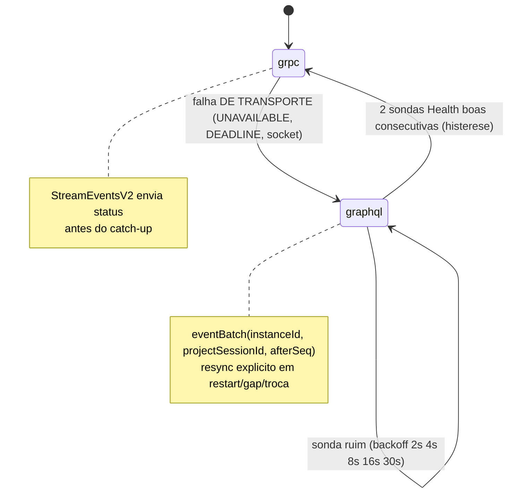

# ADR-017 — gRPC no caminho quente, prioritário, com fallback para GraphQL

- **Status:** Accepted · **Data:** 2026-07-16
- **Código:** `middleware/src/grpc/GrpcGateway.ts`, `frontend/src/main/transport/GrpcTransport.ts`, `frontend/src/core/transportRouter.ts`, `frontend/src/main/EditorClient.ts`
- **Contrato:** [`contracts/grpc/p7m_editor.proto`](../../contracts/grpc/p7m_editor.proto) (`p7m.editor.v1.EditorHotPath`)
- **Testes:** política em `frontend/test/transport-router.test.ts`; integração com fallback AO VIVO em `frontend/test/editor-client.integration.test.ts`; e2e `scripts/verify-transports.sh`

## Contexto

As chamadas mais frequentes do editor (dispatch durante drag, queries de
projeção, eventos) são candidatas a canal persistente HTTP/2 e **server
streaming**. O benefício não é generalizado: a ADR-019 mediu ganho de p95 em
dispatch/eventos, regressão em queries e condiciona a manutenção do default a
limiares reproduzíveis.

## Decisão

Caminho quente (`Dispatch`, `Query`, `StreamEventsV2`, `Health`) por **gRPC**
com **prioridade**; em falha **de transporte**, fallback **imediato** para
GraphQL e recovery por sondas com **histerese**:

*Mostra a política do TransportRouter: fallback imediato em falha de transporte, recovery com backoff e repromoção só após histerese — falha de DOMÍNIO nunca muda o transporte.*

- **Política pura e testada** (`core/transportRouter.ts`): limiar de falha
  (default 1 — "caso dê problema"), escada de backoff, `promoteAfterProbes`
  (default 2), classificação de erro (transporte ≠ domínio).
- **Modelagem do proto:** envelope TIPADO + `payload_json`. Os 14 comandos já
  têm validação única no `BlueprintStore` e schemas em `contracts/schemas/`;
  re-tipá-los em protobuf criaria uma segunda fonte de verdade de validação.
  A hipótese medida é canal/stream, não re-tipagem.
- **Eventos sem perda silenciosa:** o cursor é a tripla
  `(middlewareInstanceId, projectSessionId, lastEventSeq)`. O journal é
  particionado por sessão; `StreamEventsV2` e `eventBatch`
  expõem `firstAvailableSeq`, `lastEventSeq` e `resyncRequired`; restart,
  troca de projeto, cursor futuro e gap fora da janela nunca entregam cauda parcial. O
  `EditorClient` substitui seu estado por um snapshot de todas as projeções
  antes de reabrir stream/polling.
- **Retry idempotente:** `Dispatch` carrega `requestId`; o mesmo identificador
  é reutilizado se uma resposta gRPC se perde e a chamada precisa seguir no
  GraphQL. A `EditorSurface` deduplica o request sem reaplicar o comando e
  registra sua sessão de origem; reutilizá-lo após uma troca de projeto retorna
  conflito em vez de aplicar o comando na sessão seguinte.
- **Operações de sessão:** `ProjectCreate`, `ProjectOpenDocument`,
  `ProjectClose` e `ProjectStatus` mantêm paridade com as demais bordas;
  create/open/close validam `expected_project_session_id` e
  `expected_command_sequence` no commit, e status explicita runtime
  `synchronized`, `deferred` ou `failed` (ADR-020).
- **Falha de autenticação não é indisponibilidade:** `UNAUTHENTICATED`/HTTP
  401 interrompe a operação e nunca aciona fallback.
- **Endpoints:** UDS `unix:<runtime>/<pipe>-grpc.sock` (POSIX); TCP
  `127.0.0.1:<porta derivada>` no Windows (grpc-js não suporta named pipes).

## Alternativas

1. **gRPC único (sem fallback)** — contraria a direção; indisponibilidade do
   canal quente pararia o editor.
2. **Retry no próprio gRPC** — não cobre processo caído/porta ocupada; o
   fallback dá continuidade imediata com a MESMA superfície.
3. **Protobuf tipado por comando** — duplicaria validação/contratos (rejeitado
   acima).

## Consequências

- O plano de controle **middleware ↔ engine permanece JSON-RPC** (ADR-004) e
  o plano de dados permanece MMF (ADR-006) — esta decisão é do contrato
  app ↔ middleware.
- Falha de DOMÍNIO nunca cai de transporte (o erro pertence ao chamador).
- Novo eixo de compatibilidade (package `p7m.editor.v1`) em
  [`../COMPATIBILITY.md`](../COMPATIBILITY.md).
- As quatro bordas consultam a mesma sessão ativa da `EditorSurface`; nenhuma
  mantém `BlueprintStore` ou orquestrador próprios (ADR-020).

## Critérios de revisão

A decisão de default/freeze e o benchmark reproduzível estão registrados na
ADR-019. A janela do `EventJournal` continua deliberadamente limitada; excedê-la
é condição normal de ressincronização, coberta por teste explícito.
