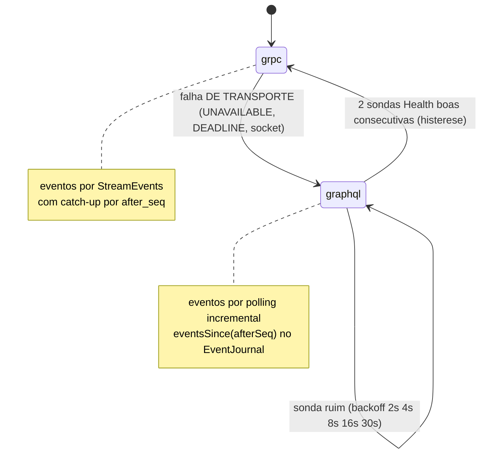

# ADR-017 — gRPC no caminho quente, prioritário, com fallback para GraphQL

- **Status:** Accepted · **Data:** 2026-07-16
- **Código:** `middleware/src/grpc/GrpcGateway.ts`, `frontend/src/main/transport/GrpcTransport.ts`, `frontend/src/core/transportRouter.ts`, `frontend/src/main/EditorClient.ts`
- **Contrato:** [`contracts/grpc/p7m_editor.proto`](../../contracts/grpc/p7m_editor.proto) (`p7m.editor.v1.EditorHotPath`)
- **Testes:** política em `frontend/test/transport-router.test.ts`; integração com fallback AO VIVO em `frontend/test/editor-client.integration.test.ts`; e2e `scripts/verify-transports.sh`

## Contexto

As chamadas mais quentes do editor (dispatch durante drag, queries de
projeção, eventos) se beneficiam de canal persistente HTTP/2, framing
binário e **server streaming**. A direção de produto: priorizar gRPC; se der
problema, usar GraphQL.

## Decisão

Caminho quente (`Dispatch`, `Query`, `StreamEvents`, `Health`) por **gRPC**
com **prioridade**; em falha **de transporte**, fallback **imediato** para
GraphQL e recovery por sondas com **histerese**:

*Mostra a política do TransportRouter: fallback imediato em falha de transporte, recovery com backoff e repromoção só após histerese — falha de DOMÍNIO nunca muda o transporte.*

- **Política pura e testada** (`core/transportRouter.ts`): limiar de falha
  (default 1 — "caso dê problema"), escada de backoff, `promoteAfterProbes`
  (default 2), classificação de erro (transporte ≠ domínio).
- **Modelagem do proto:** envelope TIPADO + `payload_json`. Os 14 comandos já
  têm validação única no `BlueprintStore` e schemas em `contracts/schemas/`;
  re-tipá-los em protobuf criaria uma segunda fonte de verdade de validação.
  O ganho do caminho quente vem do canal/stream, não de re-tipagem.
- **Eventos sem perda:** `EventJournal` com seq monotônico; stream faz
  catch-up por `after_seq`; o polling do fallback continua do mesmo seq.
- **Endpoints:** UDS `unix:<runtime>/<pipe>-grpc.sock` (POSIX); TCP
  `127.0.0.1:<porta derivada>` no Windows (grpc-js não suporta named pipes).

## Alternativas

1. **gRPC único (sem fallback)** — contraria a direção; indisponibilidade do
   canal quente pararia o editor.
2. **Retry no próprio gRPC** — não cobre processo caído/porta ocupada; o
   fallback dá continuidade imediata com a MESMA superfície.
3. **Protobuf tipado por comando** — duplicaria validação/contratos (rejeitado
   acima).

## Consequências

- O plano de controle **middleware ↔ engine permanece JSON-RPC** (ADR-004) e
  o plano de dados permanece MMF (ADR-006) — esta decisão é do contrato
  app ↔ middleware.
- Falha de DOMÍNIO nunca cai de transporte (o erro pertence ao chamador).
- Novo eixo de compatibilidade (package `p7m.editor.v1`) em
  [`../COMPATIBILITY.md`](../COMPATIBILITY.md).

## Critérios de revisão

Benchmark real de latência dispatch/stream quando o preview embutido (P0.5)
gerar tráfego contínuo; janela do `EventJournal` (512) se sessões longas em
fallback perderem eventos (gap detectável por `canResumeFrom`).
