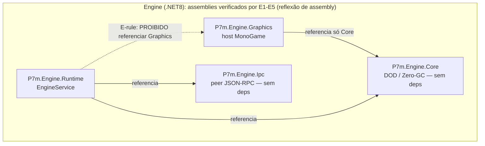
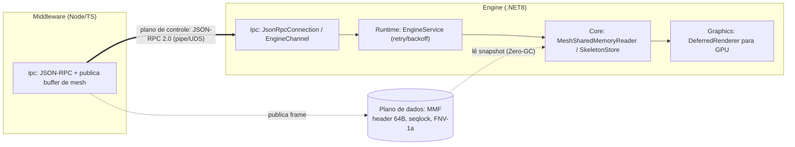
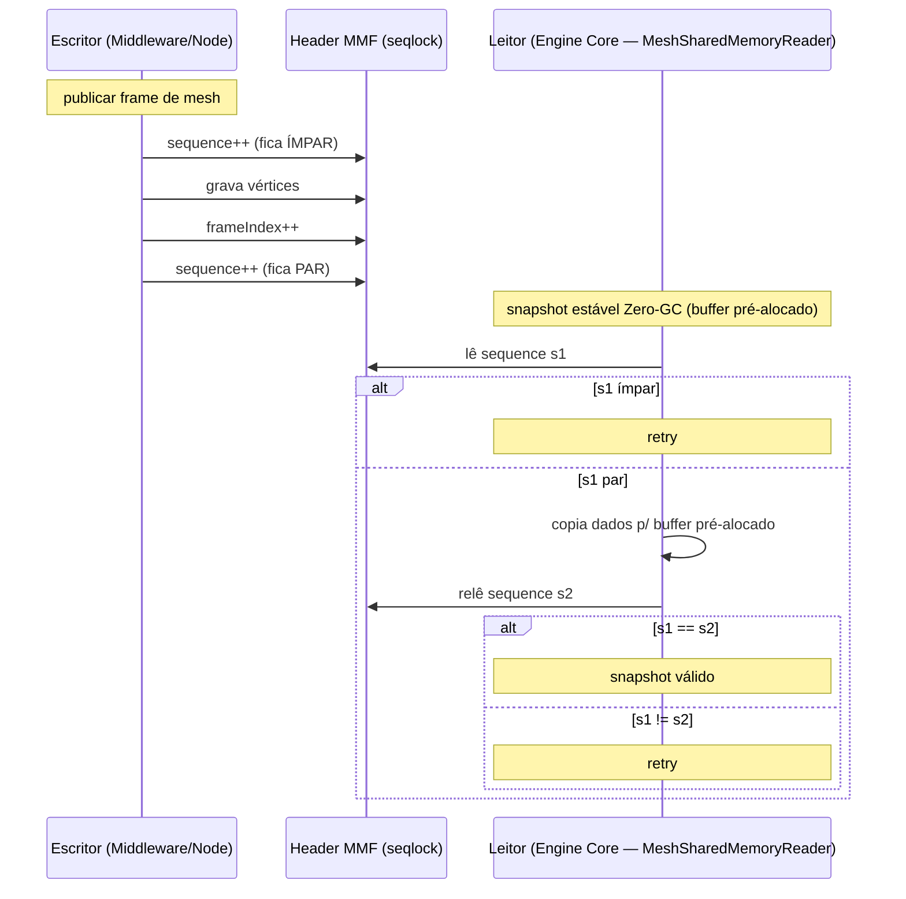

# P7m.Engine

Serviço de engine 2D (.NET 8) do ecossistema P7M EaaS.

## Projetos

| Projeto | Papel |
|---|---|
| `src/P7m.Engine.Core` | Núcleo Data-Oriented: SoA pré-alocada, Zero-GC nos hot loops. `SkeletonStore` resolve poses hierárquicas em passada linear única e produz as matrizes de skinning consumidas pela GPU. `MeshSharedMemoryReader` mapeia o buffer publicado pelo Node.js (seqlock, memória pré-alocada). Fase 3: `SecondOrderDynamics`/`CinematicCamera`/`ShakeGenerator` (câmera massa-mola-amortecedor com antecipação e shake harmônico determinístico), `LightStore`/`Lighting2D`/`ColorLut` (referências de CPU das equações dos shaders) e `LinearBlendSkinning`. |
| `src/P7m.Engine.Graphics` | Host MonoGame: `DeferredRenderer` (MRT: G-Buffer albedo+normal → Light Pass aditivo → composição com LUT), shaders HLSL em `Shaders/` (compilados via MGCB — ver `Content/README.md`), `SkinnedVertexDeclaration` (o buffer do plano de dados sobe para a GPU sem repack) e `BonePacker` (matrizes 3x2 → registradores float4). |
| `src/P7m.Engine.Ipc` | Plano de controle: framing `uint32 LE + JSON-RPC 2.0`, transporte Named Pipe / Unix Socket e peer full-duplex (`JsonRpcConnection`), mais o canal tipado com handshake (`EngineChannel`). |
| `src/P7m.Engine.Runtime` | Host do serviço: conecta ao middleware com retry/backoff, materializa `skeleton/initialize` e `mesh/bind_shared_memory` no núcleo DOD. O host gráfico MonoGame (game loop, `GraphicsDevice`, shaders HLSL) acopla-se aqui na **Fase 3**. |
| `tests/P7m.Engine.Ipc.Tests` | xUnit: codec, peer em loopback, handlers do serviço e invariantes DOD (incluindo teste de **zero alocação** em `ComputeWorldPoses`). |

### Layering dos assemblies (regras E1-E5)

O grafo de referências entre assemblies é fechado e verificado por reflexão de
assembly pelas fitness functions **E1-E5**: `Core` e `Ipc` não têm dependências;
`Graphics` referencia **só** `Core`; `Runtime` referencia `Core` + `Ipc` mas
**nunca** `Graphics` (o host gráfico acopla-se por fora, na Fase 3).



*Mostra o grafo de dependência dos quatro assemblies e a regra E1-E5 que proíbe `Runtime` de referenciar `Graphics`.*

### Consumo dos dois planos

A engine consome o middleware por dois planos independentes: o **plano de
controle** (JSON-RPC 2.0 sobre Named Pipe/Unix Socket) entra pelo assembly `Ipc`
e materializa comandos no `Runtime`; o **plano de dados** é o buffer de mesh que
o Node.js publica em Memory-Mapped File e que o `Core`
(`MeshSharedMemoryReader`) lê via seqlock, sem alocar.



*Mostra a engine consumindo o plano de controle (JSON-RPC pela `Ipc`) e o plano de dados (MMF/seqlock lido pela `Core`), com o `Runtime` isolado de `Graphics`.*

## Comandos

```bash
dotnet build
dotnet test
dotnet run --project src/P7m.Engine.Runtime -- --pipe p7m-engine            # modo serviço
dotnet run --project src/P7m.Engine.Runtime -- --pipe p7m-engine --self-test # prova de vida Fase 1
```

## Política Zero-GC

Dentro de `Update`/`Draw` (e de qualquer método marcado como hot-loop-safe, como
`SkeletonStore.ComputeWorldPoses`) é proibido:

- instanciar classes (`new` de tipo referência) ou closures;
- boxing/unboxing e `params object[]`;
- LINQ, `foreach` sobre interfaces e dispatch virtual em cadeia.

Toda a memória de entidades é pré-alocada na construção dos stores; capacidade
esgotada é um erro explícito, nunca um `List.Grow` silencioso. O teste
`ComputeWorldPoses_is_allocation_free` guarda essa invariante com
`GC.GetAllocatedBytesForCurrentThread()`.

A mesma disciplina Zero-GC governa a leitura do plano de dados: o
`MeshSharedMemoryReader` valida o seqlock e copia o frame para um buffer
pré-alocado, sem `new` no caminho quente. O escritor (Node.js) deixa `sequence`
ímpar durante a escrita e par ao concluir; o leitor só aceita o snapshot se
`s1 == s2 && s1` par, senão faz retry.



*Mostra o protocolo seqlock do lado da engine: o Node.js publica (sequence ímpar para par) e a `Core` lê o snapshot em buffer pré-alocado, validando `s1 == s2` par com retry.*
