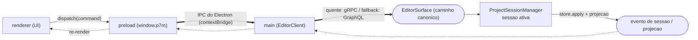
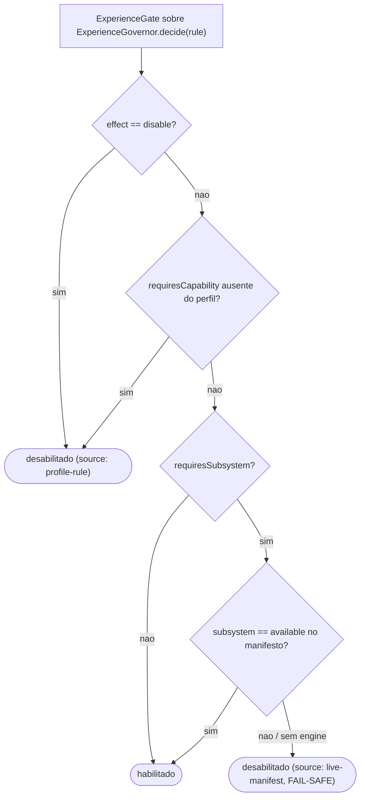
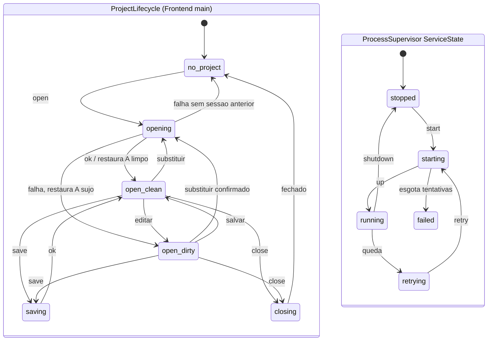

# @p7m/frontend — Editor visual (Electron)

Editor visual do ecossistema P7M EaaS. **Shell fina + núcleos de domínio
testáveis**: nenhuma lógica de jogo vive no Electron — comandos são
despachados pelo caminho canônico do middleware e o gating de UI vem da
governança de runtime.

## Estrutura

| Módulo | Papel |
|---|---|
| `src/core/bezier.ts` | Easing Bézier cúbica (convenção CSS, Newton + bisseção) — motor do editor de curvas e das transições de estado |
| `src/core/fabrik.ts` | Solver FABRIK 2D para edição interativa de rigs (comprimentos preservados, alvo inalcançável estica a cadeia, determinístico) |
| `src/core/stateMachine.ts` | Máquina de estados visuais com semântica Gum: estado = conjunto nomeado de atribuições; numéricos interpolam com easing (interrupt-safe), discretos aplicam no início |
| `src/core/experienceGate.ts` | Gate da UI sobre a matriz de decisões da governança — painéis desabilitados carregam a RAZÃO do perfil/manifesto |
| `src/core/transportRouter.ts` | Política **pura** de transporte: gRPC prioritário, fallback imediato para GraphQL em falha DE TRANSPORTE, sondas com backoff e histerese — falha de domínio nunca troca transporte (ADR-017) |
| `src/core/projectLifecycle.ts` | Máquina de estados do documento vinculada a `projectSessionId`; dirty tracking e autosave só avançam para a sessão confirmada |
| `src/core/projectApi.ts` | Contratos tipados compartilhados por main/preload/renderer para New/Open/Save/Save As/Close/Recovery/Recentes |
| `src/core/projectWizardModel.ts` | Estado e validação puros do wizard de projeto, alimentado pelos templates reais do middleware |
| `src/core/{panelRegistry,commandRegistry,toolRegistry,inspectorRegistry}.ts` | Registries internos tipados; resolvem seleção, modo e capabilities sem transformar a shell em API pública de plugins |
| `src/core/selectionService.ts` | Seleção discriminada e session-aware compartilhada por canvas, árvore, Inspector e ações corretivas |
| `src/core/workbenchLayout.ts` | Estado puro do layout adaptativo: tamanhos limitados, visibilidade, breakpoint estreito, drawers efêmeros e porta de persistência injetável |
| `src/core/levelEditorTools.ts` | Ferramentas puras do editor de níveis (brush/rect/line/picker, drag de células, hit-test de marcadores) |
| `src/core/intGridDocument.ts` | Projeção otimista do IntGrid: agrega um patch por gesto, confirma ack/evento e recompõe/reverte rejeições sem histórico paralelo |
| `src/core/logging.ts` | Logger puro com escopo hierárquico e sink injetável (`P7M_VERBOSITY`) |
| `src/main/transport/` | Clientes dos transports (`GrpcTransport`, `GraphQlTransport`) — os **únicos** módulos com SDKs de transporte (regra F5) |
| `src/main/EditorClient.ts` | Cliente do middleware: gRPC quente/fallback GraphQL, cursor `(middlewareInstanceId, projectSessionId, seq)`, snapshot integral em resync e operações transacionais de projeto |
| `src/main/appConfig.ts` | Configuração refinada do Electron: instância única, estado de janela persistido, `sandbox` + navegação/popups bloqueados |
| `src/main/project/` | `ProjectController` e adapters injetáveis de dialogs/filesystem: escrita durável (rename POSIX; swap recuperável no Windows), backup, recovery, lease e composição segura com a sessão transacional |
| `src/main/main.ts` + `preload.ts` | Shell Electron: contextIsolation; mutações de lifecycle permanecem APIs nomeadas e o menu nativo encaminha uma `ProjectCommandInvocation` tipada ao registry do renderer |
| `src/renderer/workbenchApplication.ts` | Composition runtime dos registries, portas do preload, seleção, modo, métricas e lifecycle de hosts; não contém regra de domínio |
| `src/renderer/` | Start screen + wizard “Novo projeto”, shell estrutural adaptativo, contribuições built-in e editor de níveis hidratado pelos IDs/dimensões do documento real |

### Modelo de processos


*Mostra o modelo de processos do frontend — main -> preload -> renderer -> core/ — com os transports do app no main (gRPC prioritario, GraphQL fallback) e as fitness functions F1-F5 que fixam essas fronteiras de importação.*

## Comandos

```bash
# o middleware precisa estar compilado (dependência file:../middleware)
cd ../middleware && npm run build && cd ../frontend

npm install        # ELECTRON_SKIP_BINARY_DOWNLOAD=1 para pular o binário (CI)
npm run build
npm test           # núcleos + integração real com o EditorGateway
npm run test:project-lifecycle-product  # gate explícito de New/Open/Save/Recovery/Recentes
npm run test:adaptive-workbench         # registries, layout, acessibilidade estrutural e command bridge

# execução (requer o binário do Electron e um middleware rodando):
node ../middleware/dist/index.js --pipe p7m-engine --no-mcp &
npm run app -- --pipe p7m-engine

# e2e dos transports (gRPC quente + fallback GraphQL), da raiz do repo:
../scripts/verify-transports.sh
```

O app fala com o middleware por gRPC no caminho quente e cai para GraphQL em
falha de transporte (ADR-016/017/018/019/020 em
[`../docs/adr/`](../docs/adr/README.md)).
Verbosidade dos dois lados: `P7M_VERBOSITY=silent|error|warn|info|debug|trace`
(default `info`).

Create/open/close consultam `project/status` e usam
`expectedProjectSessionId` + `expectedCommandSequence` como compare-and-swap.
O lifecycle local só troca o
descritor depois da confirmação do middleware; documento inválido ou falha de
replay deixa projeto e dirty state anteriores intactos. `runtimeState` distingue
`synchronized`, `deferred` (engine ausente) e `failed` (fail-closed). Ao detectar
restart, gap ou `project_session_changed`, o `EditorClient` busca um snapshot
completo, substitui todas as projeções e só então retoma stream/polling da nova
tripla de cursor.

## Ciclo de vida do projeto

New, Open, Save, Save As, Close, Recovery, exemplo e Recentes passam por um
único `ProjectController`. Menu, toolbar e argumentos da segunda instância não
possuem caminhos alternativos. O preload publica apenas
`listProjectTemplates`, `createProjectFromTemplate`, `openProject`,
`saveProject`, `saveProjectAs`, `closeProject`, `restoreAutosave`,
`discardAutosave` e `openRecent` para essas operações.

O wizard materializa o template canônico `platformer-2d` com nome, resolução e
tile size escolhidos, grava o `.p7m.json` com temporário + flush + publicação
exclusiva no-clobber e só
então ativa a sessão transacional. O editor abre o primeiro nível do documento
e preserva IDs, dimensões e posições; células são convertidas para
`world-pixel` pela função canônica do middleware.

Close dirty nunca prossegue depois de Save cancelado ou com erro. Um projeto
sem caminho usa Save As. `.autosave` posterior ao arquivo confirmado oferece
Restaurar, Abrir cópia, Ignorar ou Cancelar e só é removido por Save confirmado
ou descarte explícito. O exemplo distribuído sempre abre como cópia sem caminho.
Recentes usam menu nativo, canonicalização e lease; segunda instância encaminha
o arquivo à janela ativa. Rebind após restart exige documento e watermark
iguais ao cache; `projectId` sozinho nunca associa conteúdo remoto ao caminho
local. Decisão completa:
[ADR-021](../docs/adr/ADR-021-ciclo-de-vida-duravel-do-projeto.md).

## Edição canônica e histórico

Pincel contínuo, borracha, linha, retângulo e balde aplicam feedback local e
enviam um único `level/patch` no fim do gesto. O patch carrega
`transactionId`, label e mudanças `{index,before,after}`; ack confirma a camada
otimista e rejeição a recompõe com mensagem acionável. Não existe “Publicar
nível”: “Recalcular arte” recalcula somente a projeção derivada.

Undo/redo é global e pertence à `ProjectSession`. Menu, toolbar e atalhos
chamam a operação canônica mesmo quando outro painel está ativo. Eventos de
outros clientes atualizam a mesma projeção; resync substitui a base inteira.
Save/autosave/Close não capturam gesto pendente. Decisão:
[ADR-022](../docs/adr/ADR-022-historico-global-transacional.md).

## Shell adaptativo

`renderer.ts` apenas cria `EditorWorkbenchApplication`, registra o catálogo
built-in e roteia eventos globais. Painéis, comandos, ferramentas e schemas do
Inspector entram por `PanelRegistry`, `CommandRegistry`, `ToolRegistry` e
`InspectorRegistry`; `SelectionService` mantém uma única seleção por sessão.
Capabilities desconhecidas falham fechadas e carregam razão legível. Esses
contratos são internos ao MVP, não uma API de plugin para terceiros.

Menu nativo, toolbar, menu de contexto, atalhos, paleta de comandos e ações
corretivas resolvem a mesma contribuição do `CommandRegistry`. O renderer
publica descritores serializáveis de menu; o main valida limites/shape e mantém
somente roles Electron, Recentes e a devolução de uma invocação tipada. Ele não
executa handlers paralelos de New/Open/Save/Close/undo/redo; os IDs estáveis de
Recentes e do fallback anterior ao boot são as exceções explícitas no main.

O `PendingEditCoordinator` observa commits do Inspector. Operações de projeto e
histórico esperam a projeção canônica alcançar o valor visível; fechar a janela
executa um preflight com timeout e cancela em falha, em vez de salvar um draft
ainda não confirmado. Falhas de validação são isoladas por sessão/seleção, e uma
troca de projeto cancela o tool ativo antes de bloquear as áreas editáveis.

`workbenchShell.ts` recebe `WorkbenchShellElements` e um
`WorkbenchLayoutController`; ele não conhece painel, ferramenta ou comando
concreto. A composição resolve os slots pelos atributos estruturais abaixo e os
registries montam contribuições nos hosts correspondentes:

| Atributo estrutural | Papel |
|---|---|
| `data-workbench-root` | grid raiz e CSS variables dos tamanhos persistidos |
| `data-workbench-region="left|center|right|bottom"` | regiões Projeto, editor ativo, Inspector e painéis inferiores |
| `data-panel-host="left|center|right|bottom"` | ponto de montagem de contribuições do `PanelRegistry` |
| `data-workbench-splitter="left|right|bottom"` | separadores acessíveis por pointer, setas, Home/End e reset por duplo clique |
| `data-workbench-narrow-tabs` | tablist exibida abaixo do breakpoint |
| `data-workbench-narrow-tab="left|right"` | abre árvore/Inspector como drawer; Escape fecha e devolve o foco |
| `data-workbench-bottom-tabs` | tablist genérica com setas, Home/End e ativação por teclado |
| `data-workbench-toolbar` / `data-workbench-status` | limites da navegação regional F6/Shift+F6 |
| `data-command-surface="toolbar"` | host da toolbar contextual produzida pelo `CommandRegistry` |

O adapter `BrowserWorkbenchLayoutPersistence` grava somente tamanhos e
visibilidade. Breakpoint e drawer aberto são estado derivado/efêmero, portanto
não contaminam o layout restaurado em outro tamanho de janela. O core não acessa
`localStorage`; testes usam a mesma porta com memória. Projeto e Inspector não
dependem de IDs de feature, e novos painéis não exigem editar o shell.
Trocar de região pode preservar a instância ativa, mas trocar de sessão sempre
descarta o painel para não reutilizar seleção/estado do projeto anterior.

Os modos `playing` e `paused` governam somente contribuições de UI. Nesta fase
eles não iniciam PreviewHost, engine ou gameplay. Decisão:
[ADR-023](../docs/adr/ADR-023-workbench-adaptativo-por-contribuicoes.md).

## Regras da casa

- **CQRS**: o renderer nunca muta estado — despacha comandos canônicos e
  re-renderiza projeções/eventos.



*Mostra o laço CQRS do editor: o comando flui em mão única do renderer ao caminho canônico do middleware, e só eventos/projeções voltam para re-renderizar — o renderer nunca muta estado localmente.*

- **Governança visível**: painel desabilitado sempre mostra a razão vinda do
  perfil de runtime ou do manifesto vivo — nunca um genérico "indisponível".



*Mostra como o ExperienceGate materializa cada FeatureDecision: a razão do painel desabilitado vem do perfil (profile-rule) ou do manifesto vivo (live-manifest, fail-safe quando não há engine).*
- Editores de canvas pesados (curvas, rigs, grafos) rodam fora da main thread
  (Worker Threads/OffscreenCanvas) — os solvers em `src/core/` são puros
  exatamente para isso.

## Máquinas de estado

O processo `main` hospeda duas máquinas de estado: o **ProjectLifecycle** (ciclo
de vida do projeto aberto) e o **ServiceState** do **ProcessSupervisor** (supervisão
dos serviços locais, ex. middleware/engine).



*Mostra as duas máquinas de estado do `main`: o ProjectLifecycle com o par open-clean<->open-dirty e retorno por openFailed, e o ServiceState do ProcessSupervisor com o laço de retry e o ramo failed ao esgotar tentativas.*
