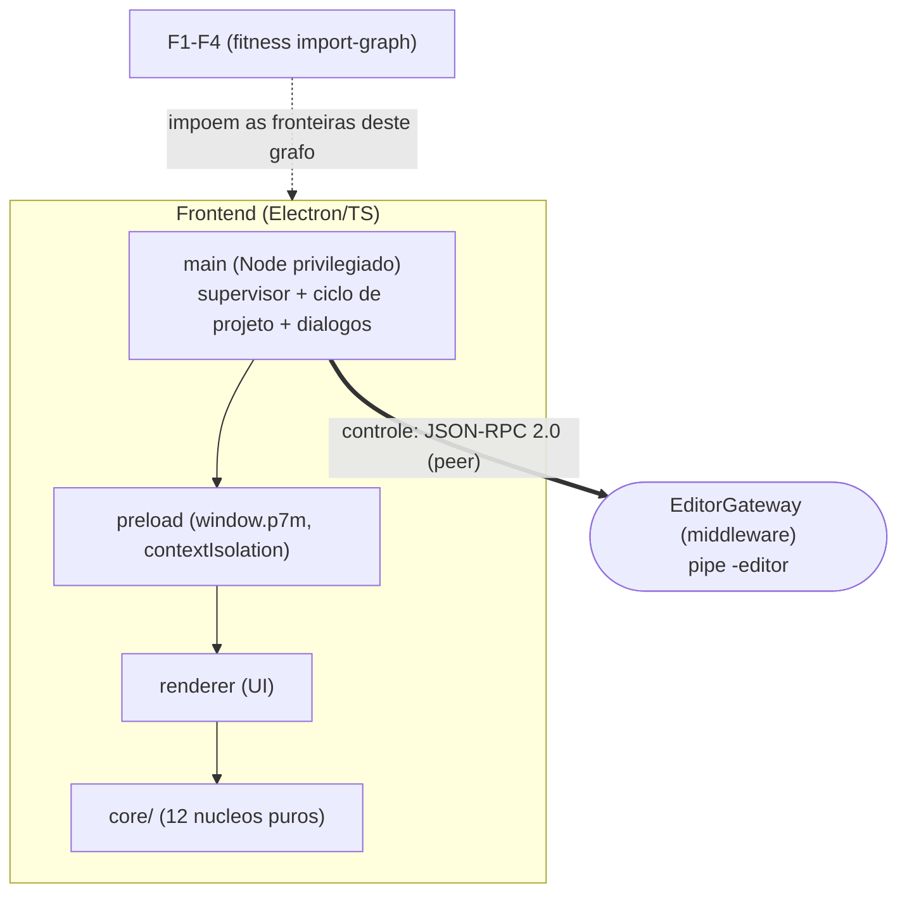
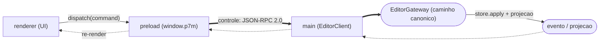
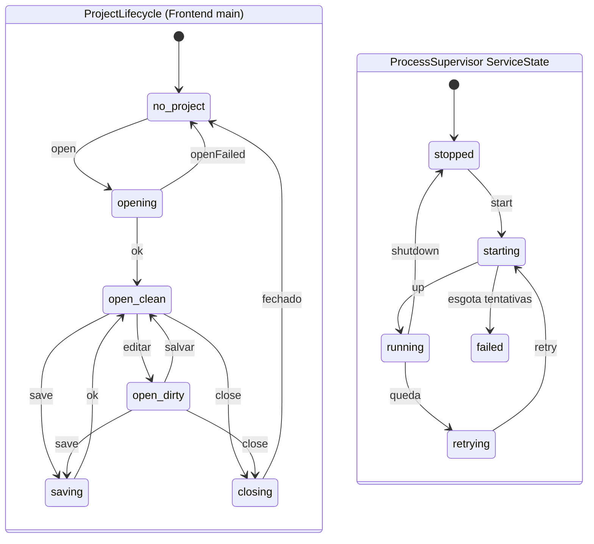

# @p7m/frontend — Editor visual (Electron)

Editor visual do ecossistema P7M EaaS. **Shell fina + núcleos de domínio
testáveis**: nenhuma lógica de jogo vive no Electron — comandos são
despachados pelo caminho canônico do middleware e o gating de UI vem da
governança de runtime.

## Estrutura

| Módulo | Papel |
|---|---|
| `src/core/bezier.ts` | Easing Bézier cúbica (convenção CSS, Newton + bisseção) — motor do editor de curvas e das transições de estado |
| `src/core/fabrik.ts` | Solver FABRIK 2D para edição interativa de rigs (comprimentos preservados, alvo inalcançável estica a cadeia, determinístico) |
| `src/core/stateMachine.ts` | Máquina de estados visuais com semântica Gum: estado = conjunto nomeado de atribuições; numéricos interpolam com easing (interrupt-safe), discretos aplicam no início |
| `src/core/experienceGate.ts` | Gate da UI sobre a matriz de decisões da governança — painéis desabilitados carregam a RAZÃO do perfil/manifesto |
| `src/main/EditorClient.ts` | Cliente do gateway do editor (`<pipe>-editor`), reutilizando o peer JSON-RPC do middleware |
| `src/main/main.ts` + `preload.ts` | Shell Electron: contextIsolation, API `window.p7m` (connect/dispatch/query/experience/eventos) |
| `src/renderer/` | Shell da UI: régua de painéis materializada do ExperienceGate + log de eventos do Blueprint |

### Modelo de processos



*Mostra o modelo de processos do frontend — main -> preload -> renderer -> core/ — com a única ponte de controle (JSON-RPC ao EditorGateway) e as fitness functions F1-F4 que fixam essas fronteiras de importação.*

## Comandos

```bash
# o middleware precisa estar compilado (dependência file:../middleware)
cd ../middleware && npm run build && cd ../frontend

npm install        # ELECTRON_SKIP_BINARY_DOWNLOAD=1 para pular o binário (CI)
npm run build
npm test           # núcleos + integração real com o EditorGateway

# execução (requer o binário do Electron e um middleware rodando):
node ../middleware/dist/index.js --pipe p7m-engine --no-mcp &
npm run app -- --pipe p7m-engine
```

## Regras da casa

- **CQRS**: o renderer nunca muta estado — despacha comandos canônicos e
  re-renderiza projeções/eventos.



*Mostra o laço CQRS do editor: o comando flui em mão única do renderer ao caminho canônico do middleware, e só eventos/projeções voltam para re-renderizar — o renderer nunca muta estado localmente.*

- **Governança visível**: painel desabilitado sempre mostra a razão vinda do
  perfil de runtime ou do manifesto vivo — nunca um genérico "indisponível".


*Mostra como o ExperienceGate materializa cada FeatureDecision: a razão do painel desabilitado vem do perfil (profile-rule) ou do manifesto vivo (live-manifest, fail-safe quando não há engine).*
- Editores de canvas pesados (curvas, rigs, grafos) rodam fora da main thread
  (Worker Threads/OffscreenCanvas) — os solvers em `src/core/` são puros
  exatamente para isso.

## Máquinas de estado

O processo `main` hospeda duas máquinas de estado: o **ProjectLifecycle** (ciclo
de vida do projeto aberto) e o **ServiceState** do **ProcessSupervisor** (supervisão
dos serviços locais, ex. middleware/engine).



*Mostra as duas máquinas de estado do `main`: o ProjectLifecycle com o par open-clean<->open-dirty e retorno por openFailed, e o ServiceState do ProcessSupervisor com o laço de retry e o ramo failed ao esgotar tentativas.*
